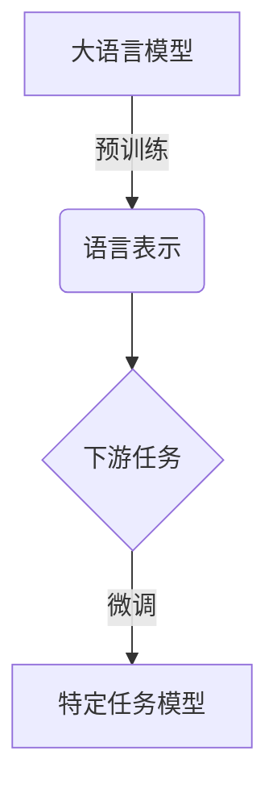
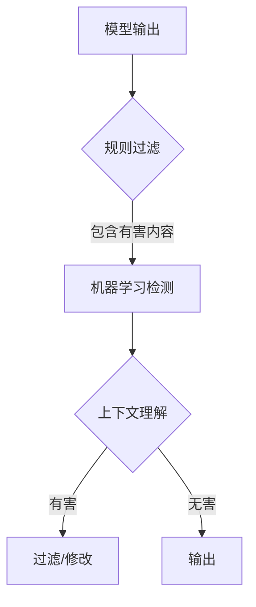

# 大语言模型应用指南：大语言模型的安全技术

## 1. 背景介绍

### 1.1 大语言模型的兴起

近年来,大型语言模型(Large Language Models, LLMs)在自然语言处理(Natural Language Processing, NLP)领域取得了突破性进展,引领了人工智能(Artificial Intelligence, AI)技术的新浪潮。这些模型通过在海量文本数据上进行预训练,学习了丰富的语言知识和上下文关联,从而在各种NLP任务中展现出惊人的性能。

### 1.2 安全隐患与挑战

然而,大语言模型的强大能力也带来了一些潜在的安全隐患和挑战。由于这些模型是在开放的互联网数据上训练的,它们可能会学习并复制一些有害、不当或不安全的内容。此外,大语言模型的黑箱特性也使得它们容易受到对抗性攻击,产生不可预测的输出。因此,确保大语言模型的安全性和可靠性对于其在实际应用中的广泛部署至关重要。

## 2. 核心概念与联系

### 2.1 大语言模型的工作原理

大语言模型通常采用自注意力(Self-Attention)机制和Transformer架构,能够捕捉长距离的上下文依赖关系。它们在海量文本数据上进行无监督预训练,学习语言的统计规律和语义知识,形成通用的语言表示。在下游任务中,只需对预训练模型进行少量的微调(Fine-tuning),即可获得出色的性能。



### 2.2 安全性挑战

大语言模型面临的主要安全性挑战包括:

1. **有害输出**: 模型可能会生成包含仇恨言论、暴力内容或不当信息的输出。
2. **隐私泄露**: 模型可能会泄露在训练数据中存在的敏感信息。
3. **对抗性攻击**: 模型可能会受到对抗性样本的攻击,产生不可预测的错误输出。
4. **偏见和公平性**: 模型可能会继承训练数据中存在的偏见,导致不公平的决策或输出。

## 3. 核心算法原理具体操作步骤

### 3.1 有害输出检测与过滤

为了检测和过滤大语言模型生成的有害输出,可以采取以下步骤:

1. **构建有害词库**: 收集包含仇恨言论、暴力内容、不当信息等的词汇列表。
2. **基于规则的过滤**: 使用正则表达式或关键词匹配等规则,检测和过滤包含有害词汇的输出。
3. **基于机器学习的检测**: 训练分类模型(如逻辑回归、支持向量机等)来识别有害输出。
4. **上下文理解**: 除了关键词匹配,还需要考虑输出的语义和上下文,以避免误判。



### 3.2 隐私保护

为了防止大语言模型泄露敏感信息,可以采取以下措施:

1. **数据脱敏**: 在训练数据中,对敏感信息(如个人身份信息、金融数据等)进行匿名化或加密处理。
2. **差分隐私**: 在模型训练过程中,引入噪声以保护个体隐私,同时保留数据的统计特性。
3. **输出过滤**: 在模型输出中,检测并过滤包含敏感信息的内容。
4. **访问控制**: 对模型的访问和使用进行身份验证和授权,防止未经授权的访问。

### 3.3 对抗性攻击防御

为了提高大语言模型对对抗性攻击的鲁棒性,可以采取以下策略:

1. **对抗性训练**: 在训练过程中,向输入数据注入对抗性扰动,使模型学习到对抗性样本的鲁棒表示。
2. **预处理防御**: 对输入数据进行预处理(如词嵌入修正、小扰动去噪等),消除对抗性扰动的影响。
3. **后处理防御**: 对模型输出进行后处理(如投票、校准等),提高鲁棒性和可靠性。
4. **模型压缩**: 通过模型压缩技术(如量化、剪枝等),减小模型的攻击面并提高效率。

### 3.4 偏见缓解

为了缓解大语言模型中存在的偏见,可以采取以下措施:

1. **数据扩充**: 通过数据扩充技术(如翻译、上采样等),增加训练数据的多样性,减少偏见。
2. **偏见发现**: 开发算法和指标,发现和量化模型输出中存在的偏见。
3. **偏见缓解**: 在模型训练过程中,引入偏置损失函数或正则化项,减轻偏见的影响。
4. **人工审计**: 由人工专家对模型输出进行审计,发现和纠正偏见问题。

## 4. 数学模型和公式详细讲解举例说明

### 4.1 Transformer模型

Transformer是大语言模型中广泛采用的核心架构,它基于自注意力(Self-Attention)机制,能够捕捉长距离的上下文依赖关系。自注意力的计算公式如下:

$$\text{Attention}(Q, K, V) = \text{softmax}\left(\frac{QK^T}{\sqrt{d_k}}\right)V$$

其中,$$Q$$、$$K$$和$$V$$分别表示查询(Query)、键(Key)和值(Value)矩阵,$$d_k$$是缩放因子。

在Transformer的编码器(Encoder)中,自注意力用于捕捉输入序列内部的依赖关系;而在解码器(Decoder)中,除了自注意力外,还引入了编码器-解码器注意力(Encoder-Decoder Attention),用于关注输入序列的不同部分。

### 4.2 对抗性训练

对抗性训练(Adversarial Training)是提高模型鲁棒性的有效方法之一。它的基本思想是在训练过程中,向输入数据注入对抗性扰动,使模型学习到对抗性样本的鲁棒表示。

对抗性扰动可以通过以下公式计算:

$$r^* = \arg\max_{r, \|r\|_p \leq \epsilon} \mathcal{L}(x+r, y)$$

其中,$$x$$是原始输入,$$y$$是标签,$$\mathcal{L}$$是损失函数,$$\|r\|_p$$是$$p$$范数约束,$$\epsilon$$是扰动的最大幅度。

通过对抗性训练,模型可以学习到对抗性样本的鲁棒表示,从而提高对对抗性攻击的防御能力。

### 4.3 差分隐私

差分隐私(Differential Privacy)是一种用于保护个人隐私的数学框架,它通过在模型训练过程中引入噪声,来保护个体隐私,同时保留数据的统计特性。

差分隐私的核心思想是,对于任何相邻的数据集(只相差一个记录),机制的输出分布应该是近似相同的。形式化地,差分隐私可以定义为:

$$\Pr[M(D) \in S] \leq e^\epsilon \Pr[M(D') \in S]$$

其中,$$M$$是隐私机制,$$D$$和$$D'$$是相邻数据集,$$S$$是输出集合,$$\epsilon$$是隐私损失参数,值越小隐私保护程度越高。

通过引入差分隐私噪声,可以有效防止大语言模型泄露个人隐私信息。

## 5. 项目实践:代码实例和详细解释说明

在本节中,我们将提供一些实际的代码示例,展示如何应用上述安全技术来保护大语言模型的安全性和可靠性。

### 5.1 有害输出检测与过滤

以下是一个基于Python和Hugging Face Transformers库的示例代码,用于检测和过滤有害输出:

```python
from transformers import AutoModelForCausalLM, AutoTokenizer
import re

# 加载预训练模型和分词器
model = AutoModelForCausalLM.from_pretrained("gpt2")
tokenizer = AutoTokenizer.from_pretrained("gpt2")

# 定义有害词库
harmful_words = ["hate", "violence", "offensive"]

# 定义过滤函数
def filter_harmful_output(text):
    # 基于规则的过滤
    for word in harmful_words:
        if re.search(r'\b{}\b'.format(word), text, re.IGNORECASE):
            return True
    return False

# 生成文本
input_text = "Write a story about"
input_ids = tokenizer.encode(input_text, return_tensors="pt")

# 生成输出
output_ids = model.generate(input_ids, max_length=100, do_sample=True, top_k=50, top_p=0.95, num_return_sequences=1)
output_text = tokenizer.decode(output_ids[0], skip_special_tokens=True)

# 过滤有害输出
if filter_harmful_output(output_text):
    print("Harmful output detected. Output filtered.")
else:
    print(output_text)
```

在这个示例中,我们首先加载预训练的GPT-2模型和分词器。然后,我们定义了一个简单的有害词库和过滤函数。在生成输出后,我们使用`filter_harmful_output`函数检测并过滤包含有害内容的输出。

### 5.2 隐私保护

以下是一个使用PyTorch和OpenDP库实现差分隐私的示例代码:

```python
import torch
from opendp.pytorch import DPModule

# 定义模型和损失函数
model = MyModel()
loss_fn = nn.CrossEntropyLoss()

# 包装模型以实现差分隐私
dp_model = DPModule(
    model,
    noise_multiplier=1.0,
    max_grad_norm=1.0,
    clipping_value=1.0,
    clipping_method="flat",
)

# 训练循环
for batch in train_loader:
    inputs, targets = batch
    outputs = dp_model(inputs)
    loss = loss_fn(outputs, targets)
    
    # 计算梯度并应用差分隐私噪声
    dp_model.zero_grad()
    loss.backward()
    dp_model.clip_and_accumulate_grad()
    
    # 更新模型参数
    optimizer.step()
```

在这个示例中,我们使用OpenDP库将模型包装为`DPModule`,以实现差分隐私。在训练循环中,我们使用`dp_model.clip_and_accumulate_grad()`方法计算梯度并应用差分隐私噪声。通过调整`noise_multiplier`和`clipping_value`等参数,可以控制隐私保护程度和模型性能之间的权衡。

### 5.3 对抗性攻击防御

以下是一个使用PyTorch和Adversarial-Robustness-Toolbox (ART)库实现对抗性训练的示例代码:

```python
import torch
from art.attacks import ProjectedGradientDescent
from art.estimators import PyTorchEstimator

# 定义模型和损失函数
model = MyModel()
loss_fn = nn.CrossEntropyLoss()

# 包装模型以实现对抗性训练
art_model = PyTorchEstimator(model, loss_fn, input_shape=(1, 28, 28))

# 定义对抗性攻击
attack = ProjectedGradientDescent(
    estimator=art_model,
    eps=0.3,
    eps_step=0.1,
    max_iter=40,
    targeted=False,
    num_random_init=5,
)

# 训练循环
for batch in train_loader:
    inputs, targets = batch
    
    # 生成对抗性样本
    adv_inputs = attack.generate(x=inputs)
    
    # 计算损失并更新模型
    outputs = model(adv_inputs)
    loss = loss_fn(outputs, targets)
    optimizer.zero_grad()
    loss.backward()
    optimizer.step()
```

在这个示例中,我们使用ART库实现对抗性训练。首先,我们将模型和损失函数包装为`PyTorchEstimator`对象。然后,我们定义了一个`ProjectedGradientDescent`对抗性攻击对象。在训练循环中,我们使用`attack.generate()`方法生成对抗性样本,并使用这些样本计算损失并更新模型参数。通过对抗性训练,模型可以学习到对抗性样本的鲁棒表示,从而提高对对