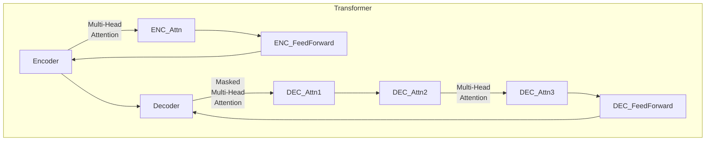

# 大语言模型应用指南：工具

## 1.背景介绍

### 1.1 大语言模型的兴起

近年来,自然语言处理(NLP)领域取得了长足的进步,很大程度上归功于大规模预训练语言模型(Large Pre-trained Language Models)的出现和应用。传统的NLP系统通常依赖于手工设计的特征和规则,难以捕捉语言的复杂性和多样性。而大语言模型则通过在海量文本数据上进行无监督预训练,自动学习语言的统计规律和语义知识,从而获得强大的语言理解和生成能力。

### 1.2 大语言模型的优势

相较于传统NLP模型,大语言模型具有以下优势:

1. **泛化能力强** - 通过在大规模无标注语料上预训练,模型可以学习通用的语言知识,并将其迁移到下游任务中,显著提高了模型的泛化性能。

2. **无需手工特征工程** - 传统模型需要人工设计和提取特征,而大语言模型可以自动从数据中学习有效的特征表示。

3. **一个模型多种任务** - 同一个预训练模型可以通过简单的微调(fine-tuning)应用于多种不同的NLP任务,大大降低了开发成本。

4. **持续学习能力** - 大语言模型具有持续学习的能力,可以在新的数据上持续训练,不断扩展知识面和应用范围。

### 1.3 大语言模型的应用

大语言模型已广泛应用于自然语言处理的各个领域,包括但不限于:

- 文本生成: 新闻自动写作、对话系统、创作辅助等
- 机器翻译: 提高翻译质量、支持低资源语言翻译等
- 文本分类: 情感分析、主题分类、垃圾邮件检测等
- 信息抽取: 命名实体识别、关系抽取、事件抽取等
- 问答系统: 开放域问答、闭卷阅读理解等
- 其他领域: 代码生成、蛋白质结构预测等

## 2.核心概念与联系

### 2.1 自注意力机制(Self-Attention)

自注意力机制是大语言模型的核心,它允许模型捕捉输入序列中任意两个位置之间的关系,解决了传统序列模型(如RNN)只能捕捉局部关系的缺陷。自注意力通过计算查询(Query)、键(Key)和值(Value)之间的相似性来确定不同位置的关联程度,从而构建全局的语义表示。

$$\mathrm{Attention}(Q, K, V) = \mathrm{softmax}(\frac{QK^T}{\sqrt{d_k}})V$$

其中 $Q$、$K$、$V$ 分别是查询、键和值的矩阵表示, $d_k$ 是缩放因子。

### 2.2 Transformer架构

Transformer是第一个完全基于自注意力机制的序列模型,它摒弃了RNN的递归结构,使用多头自注意力(Multi-Head Attention)和前馈神经网络(Feed-Forward Network)构建了高效的编码器-解码器(Encoder-Decoder)架构。相比RNN,Transformer具有更好的并行计算能力和更长的依赖捕捉范围。

### 2.3 预训练与微调(Pre-training & Fine-tuning)

大语言模型通常采用两阶段策略:

1. **预训练(Pre-training)**: 在大规模无标注语料上进行自监督训练,学习通用的语言知识。常用的预训练目标包括掩码语言模型(Masked Language Modeling)和下一句预测(Next Sentence Prediction)等。

2. **微调(Fine-tuning)**: 将预训练模型的参数作为初始化,在特定任务的标注数据上进行进一步训练,使模型适应该任务。由于已获得通用语言知识,微调往往只需少量标注数据即可取得良好效果。

### 2.4 提示学习(Prompt Learning)

提示学习是一种新兴的大语言模型范式,它通过设计合适的提示(Prompt),将下游任务转化为模型在预训练时遇到过的形式,从而无需微调即可直接利用预训练模型进行推理。提示学习可进一步减少标注数据的需求,扩展大语言模型的应用范围。

## 3.核心算法原理具体操作步骤

### 3.1 Transformer编码器(Encoder)

Transformer编码器的核心是多头自注意力和前馈神经网络,它们交替堆叠构成编码器的层结构。每一层的操作步骤如下:

1. **Multi-Head Attention**:
   - 将输入分别映射到查询(Query)、键(Key)和值(Value)的表示
   - 对每对查询和键计算相似度得分(Scaled Dot-Product Attention)
   - 根据相似度分配注意力权重,加权求和值向量,得到注意力输出
   - 对多个注意力头(Head)的输出进行拼接

2. **Add & Norm**: 将注意力输出与输入相加,并进行层归一化(Layer Normalization)

3. **Feed Forward**:
   - 两层全连接前馈神经网络,中间加入ReLU激活函数
   - 对每个位置的表示进行独立的变换

4. **Add & Norm**: 将前馈网络输出与输入相加,并进行层归一化

通过堆叠多个这样的层,编码器可以捕捉输入序列中长程的依赖关系,形成深层次的语义表示。

### 3.2 Transformer解码器(Decoder)

解码器的结构与编码器类似,但有两点不同:

1. **Masked Self-Attention**: 在自注意力计算中,对于序列中每个位置,只允许关注之前的位置,以保持自回归(Auto-Regressive)特性。

2. **Encoder-Decoder Attention**: 在完成自注意力计算后,解码器还需关注编码器的输出,以融合源语义信息。

解码器的操作步骤如下:

1. **Masked Multi-Head Attention**:
   - 计算序列中每个位置与之前位置的注意力
   - Add & Norm

2. **Multi-Head Attention(encoder output)**:
   - 计算解码器输出与编码器输出的注意力
   - Add & Norm  

3. **Feed Forward**:
   - 两层全连接前馈神经网络
   - Add & Norm

通过层层传递,解码器可以生成出与源语义相关的目标序列。

### 3.3 预训练目标

常见的预训练目标包括:

1. **Masked Language Modeling(MLM)**: 随机掩蔽输入序列中的一些token,模型需要基于上下文预测被掩蔽的token。

2. **Next Sentence Prediction(NSP)**: 判断两个句子是否为连续的句子对。

3. **Permuted Language Modeling**: 打乱输入序列的token顺序,模型需要恢复原始顺序。

4. **Replaced Token Detection**: 在输入序列中随机替换一些token,模型需要检测出被替换的位置。

不同的预训练目标可以驱使模型学习不同的语言知识,组合使用可以进一步提升模型性能。

## 4.数学模型和公式详细讲解举例说明

### 4.1 Scaled Dot-Product Attention

Scaled Dot-Product Attention是Transformer中自注意力机制的核心计算单元,其数学表达式为:

$$\mathrm{Attention}(Q, K, V) = \mathrm{softmax}(\frac{QK^T}{\sqrt{d_k}})V$$

其中:

- $Q \in \mathbb{R}^{n \times d_k}$ 为查询(Query)矩阵
- $K \in \mathbb{R}^{n \times d_k}$ 为键(Key)矩阵  
- $V \in \mathbb{R}^{n \times d_v}$ 为值(Value)矩阵
- $n$ 为序列长度
- $d_k$ 和 $d_v$ 分别为查询/键和值的维度

计算步骤:

1. 计算查询和键的点积得分: $QK^T \in \mathbb{R}^{n \times n}$
2. 缩放点积分数: $\frac{QK^T}{\sqrt{d_k}}$, 防止过大的值导致softmax饱和
3. 对每一行计算softmax,得到注意力权重矩阵: $\mathrm{softmax}(\frac{QK^T}{\sqrt{d_k}}) \in \mathbb{R}^{n \times n}$
4. 将注意力权重矩阵与值矩阵相乘,得到注意力输出: $\mathrm{Attention}(Q, K, V) \in \mathbb{R}^{n \times d_v}$

注意力输出矩阵的第i行,就是根据查询$q_i$对值矩阵$V$的编码,它捕捉了$q_i$与整个输入序列的关联程度。通过多头注意力(Multi-Head Attention),模型可以从不同的子空间关注不同的位置关系。

### 4.2 层归一化(Layer Normalization)

层归一化是一种常用的归一化技术,它对每个样本的每个特征通道进行归一化,而不是像批归一化(Batch Normalization)那样对整个小批量数据进行归一化。对于输入 $\boldsymbol{x} = (x_1, x_2, \dots, x_n)$, 层归一化的计算公式为:

$$\mathrm{LayerNorm}(\boldsymbol{x}) = \gamma \odot \frac{\boldsymbol{x} - \mu}{\sqrt{\sigma^2 + \epsilon}} + \beta$$

其中:

- $\mu = \frac{1}{n}\sum_{i=1}^n x_i$ 为输入的均值
- $\sigma^2 = \frac{1}{n}\sum_{i=1}^n (x_i - \mu)^2$ 为输入的方差
- $\gamma$ 和 $\beta$ 为可学习的缩放和偏移参数
- $\epsilon$ 为一个很小的常数,防止分母为零
- $\odot$ 表示元素级别的乘积运算

层归一化可以加速模型收敛,并提高模型的泛化能力。它不仅可以应用于网络的输入层,也可以应用于任何中间层,从而更好地控制网络中间层的数值稳定性。

### 4.3 多头注意力(Multi-Head Attention)

多头注意力是将多个注意力头的输出拼接在一起,从不同的子空间捕捉不同的位置关系。其数学表达式为:

$$\mathrm{MultiHead}(Q, K, V) = \mathrm{Concat}(\mathrm{head}_1, \dots, \mathrm{head}_h)W^O$$
$$\text{where } \mathrm{head}_i = \mathrm{Attention}(QW_i^Q, KW_i^K, VW_i^V)$$

其中:

- $Q$、$K$、$V$ 分别为查询、键和值矩阵
- $W_i^Q \in \mathbb{R}^{d_{\text{model}} \times d_k}$、$W_i^K \in \mathbb{R}^{d_{\text{model}} \times d_k}$、$W_i^V \in \mathbb{R}^{d_{\text{model}} \times d_v}$ 为第 $i$ 个头的线性投影矩阵
- $h$ 为头的数量
- $W^O \in \mathbb{R}^{hd_v \times d_{\text{model}}}$ 为最终的线性投影矩阵

计算步骤:

1. 将查询、键和值分别通过线性投影,投影到 $h$ 个子空间
2. 对每个子空间,分别计算 Scaled Dot-Product Attention
3. 将 $h$ 个头的注意力输出拼接
4. 将拼接后的结果通过线性投影 $W^O$,得到最终的多头注意力输出

多头注意力允许模型同时关注不同的位置关系,从而提高了模型的表示能力。

## 5.项目实践:代码实例和详细解释说明

为了更好地理解Transformer模型的实现细节,我们将基于PyTorch框架,构建一个简单的机器翻译系统。完整代码可在[这里](https://github.com/zhangzhao156/transformer-tutorial)获