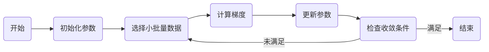

# 小批量梯度下降法(Mini-batch GD)原理与代码实战案例讲解

## 1. 背景介绍
在机器学习和深度学习领域，梯度下降法是一种常用的优化算法，用于最小化损失函数，从而找到模型参数的最优解。传统的梯度下降法分为三种：批量梯度下降（Batch GD）、随机梯度下降（Stochastic GD）和小批量梯度下降（Mini-batch GD）。小批量梯度下降法结合了批量梯度下降和随机梯度下降的优点，通过在每次迭代中使用部分数据集来更新参数，既能加快训练速度，又能保持一定程度的收敛稳定性。

## 2. 核心概念与联系
### 2.1 梯度下降法概述
梯度下降法是通过计算损失函数关于参数的梯度，并沿着梯度的反方向更新参数，逐步减小损失函数的值。

### 2.2 批量梯度下降与随机梯度下降
批量梯度下降（Batch GD）在每次迭代中使用全部数据计算梯度，而随机梯度下降（Stochastic GD）则在每次迭代中随机选择一个样本来计算梯度。

### 2.3 小批量梯度下降的优势
小批量梯度下降（Mini-batch GD）结合了上述两者的优点，通过在每次迭代中使用小批量数据来计算梯度，既能保证训练的稳定性，又能提高计算效率。

## 3. 核心算法原理具体操作步骤


1. 初始化模型参数。
2. 从训练集中随机选择一小批量数据。
3. 计算这小批量数据的损失函数关于模型参数的梯度。
4. 更新模型参数。
5. 检查收敛条件，如果未满足则返回步骤2，否则结束。

## 4. 数学模型和公式详细讲解举例说明
假设损失函数为 $L(\theta)$，其中 $\theta$ 是模型参数。小批量梯度下降法的更新规则为：

$$
\theta := \theta - \eta \cdot \nabla_\theta L(\theta; X^{(i:i+n)}, y^{(i:i+n)})
$$

其中，$\eta$ 是学习率，$X^{(i:i+n)}$ 和 $y^{(i:i+n)}$ 分别表示选取的小批量输入数据和对应的标签，$n$ 是小批量的大小。

## 5. 项目实践：代码实例和详细解释说明
```python
import numpy as np

# 假设损失函数为平方损失
def compute_gradient(parameters, X_batch, y_batch):
    predictions = np.dot(X_batch, parameters)
    errors = predictions - y_batch
    gradient = 2 * np.dot(X_batch.T, errors) / len(X_batch)
    return gradient

def mini_batch_gradient_descent(X, y, batch_size, learning_rate, epochs):
    parameters = np.zeros(X.shape[1])
    for epoch in range(epochs):
        permutation = np.random.permutation(X.shape[0])
        X_shuffled = X[permutation]
        y_shuffled = y[permutation]
        for i in range(0, X.shape[0], batch_size):
            X_batch = X_shuffled[i:i+batch_size]
            y_batch = y_shuffled[i:i+batch_size]
            gradient = compute_gradient(parameters, X_batch, y_batch)
            parameters -= learning_rate * gradient
    return parameters
```

在这段代码中，我们首先定义了一个计算梯度的函数 `compute_gradient`，然后定义了小批量梯度下降函数 `mini_batch_gradient_descent`。在每个epoch中，我们首先随机打乱数据，然后按照指定的批量大小进行迭代，计算梯度并更新参数。

## 6. 实际应用场景
小批量梯度下降法广泛应用于深度学习训练中，特别是在处理大规模数据集时，能够有效地平衡计算资源和模型性能。

## 7. 工具和资源推荐
- TensorFlow
- PyTorch
- Keras
- Scikit-learn

这些工具和库提供了小批量梯度下降法的实现，并且支持自动梯度计算，极大地简化了机器学习模型的开发过程。

## 8. 总结：未来发展趋势与挑战
小批量梯度下降法在未来可能会与其他优化算法（如Adam、RMSprop等）结合，以进一步提高训练效率和模型性能。同时，随着硬件技术的发展，如何更好地利用GPU和TPU等加速器也是未来的一个重要研究方向。

## 9. 附录：常见问题与解答
Q1: 小批量的大小如何选择？
A1: 小批量的大小通常取决于数据集的大小和计算资源。常见的大小包括32、64、128等。

Q2: 学习率如何设置？
A2: 学习率的设置通常需要通过实验来确定，可以使用学习率衰减或者自适应学习率算法来辅助选择。

Q3: 如何判断是否收敛？
A3: 可以通过设置阈值，当连续几个epoch的损失函数变化小于该阈值时，认为模型已经收敛。

作者：禅与计算机程序设计艺术 / Zen and the Art of Computer Programming