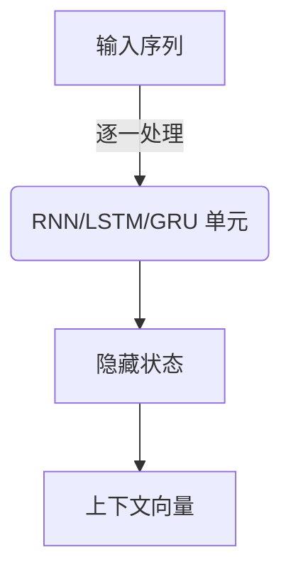
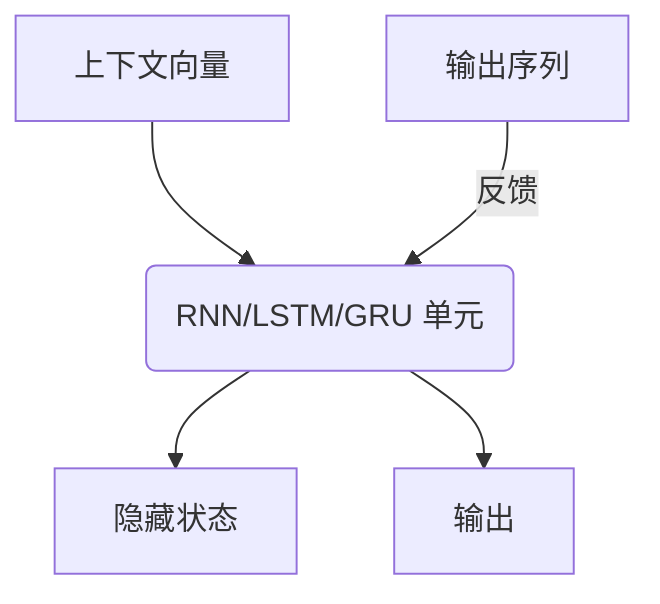
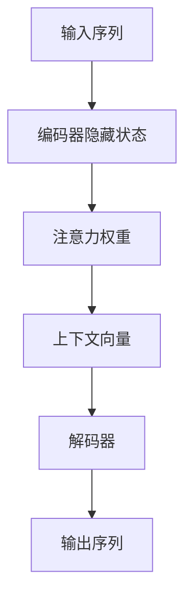

# 序列到序列模型 (Seq2Seq) 原理与代码实例讲解

## 1.背景介绍

### 1.1 序列建模的重要性

在自然语言处理、语音识别、机器翻译等众多领域中,我们常常需要处理序列数据。序列数据是指一系列按时间或空间顺序排列的数据,如文本、语音、视频等。传统的机器学习模型通常假设输入和输出之间是独立同分布的,并且输入和输出的长度是固定的,这使得它们无法很好地处理序列数据。

为了解决这个问题,序列建模技术应运而生。序列建模旨在学习序列数据中的模式和规律,从而能够生成新的序列或对现有序列进行预测和转换。序列建模广泛应用于自然语言处理、语音识别、机器翻译、时间序列预测等领域。

### 1.2 序列到序列模型的作用

序列到序列(Sequence-to-Sequence,简称Seq2Seq)模型是一种强大的序列建模架构,它能够将一个序列作为输入,生成另一个序列作为输出。这种模型可以处理输入和输出长度不同的情况,非常适合于机器翻译、文本摘要、对话系统等任务。

Seq2Seq模型的核心思想是使用两个递归神经网络:一个编码器(Encoder)将输入序列编码为一个向量表示,另一个解码器(Decoder)则根据该向量表示生成目标输出序列。这种编码器-解码器架构使得模型能够捕捉输入和输出序列之间的复杂依赖关系,从而实现高质量的序列转换。

## 2.核心概念与联系

### 2.1 编码器(Encoder)

编码器的作用是将可变长度的输入序列编码为一个固定长度的向量表示,通常称为上下文向量(Context Vector)。常用的编码器有递归神经网络(RNN)、长短期记忆网络(LSTM)和门控循环单元(GRU)。

编码器按照序列的时间步骤逐一处理输入序列中的每个元素,并在每个时间步骤根据当前输入和前一个隐藏状态计算当前隐藏状态。最后一个隐藏状态被视为整个输入序列的编码表示,即上下文向量。

### 2.2 解码器(Decoder)

解码器的任务是根据编码器提供的上下文向量生成目标输出序列。解码器也是一个RNN/LSTM/GRU网络,它在每个时间步骤接收上一时间步的输出和当前的隐藏状态,生成当前时间步的输出。

在解码过程中,解码器还会关注一个上下文向量,即编码器最后一个隐藏状态的输出。这个上下文向量被用作解码器的初始隐藏状态,并在每个时间步骤作为解码器的额外输入,以捕获输入序列的全局语义信息。

### 2.3 注意力机制(Attention Mechanism)

虽然上下文向量能够捕获输入序列的全局信息,但对于较长的序列来说,单个固定长度的向量可能无法完全编码所有相关信息。为了解决这个问题,注意力机制(Attention Mechanism)被引入到Seq2Seq模型中。

注意力机制允许解码器在生成每个输出时,不仅关注上下文向量,还可以选择性地关注输入序列的不同部分。这使得解码器能够自适应地为每个输出分配不同的注意力权重,从而更好地捕捉输入和输出之间的对应关系。

## 3.核心算法原理具体操作步骤

Seq2Seq模型的核心算法原理可以分为以下几个步骤:

### 3.1 编码器前向传播

1) 将输入序列 $X = (x_1, x_2, \dots, x_T)$ 通过嵌入层转换为词向量序列 $\boldsymbol{x} = (\boldsymbol{x}_1, \boldsymbol{x}_2, \dots, \boldsymbol{x}_T)$。
2) 初始化编码器的初始隐藏状态 $\boldsymbol{h}_0$。
3) 对于每个时间步 $t = 1, 2, \dots, T$,计算编码器的隐藏状态:

$$\boldsymbol{h}_t = f(\boldsymbol{x}_t, \boldsymbol{h}_{t-1})$$

其中 $f$ 是RNN/LSTM/GRU等递归单元的计算函数。

4) 将最后一个隐藏状态 $\boldsymbol{h}_T$ 作为上下文向量 $\boldsymbol{c}$,表示整个输入序列的编码。

### 3.2 解码器前向传播(无注意力机制)

1) 初始化解码器的初始隐藏状态 $\boldsymbol{s}_0 = \boldsymbol{c}$,即使用上下文向量作为初始状态。
2) 将开始符号 `<sos>` 通过嵌入层转换为词向量 $\boldsymbol{y}_0$。
3) 对于每个时间步 $t = 1, 2, \dots, T'$,计算解码器的隐藏状态和输出:

$$\boldsymbol{s}_t = g(\boldsymbol{y}_{t-1}, \boldsymbol{s}_{t-1}, \boldsymbol{c})$$
$$\boldsymbol{o}_t = \boldsymbol{W}_o\boldsymbol{s}_t + \boldsymbol{b}_o$$
$$\boldsymbol{y}_t = \mathrm{softmax}(\boldsymbol{o}_t)$$

其中 $g$ 是RNN/LSTM/GRU等递归单元的计算函数, $\boldsymbol{W}_o$ 和 $\boldsymbol{b}_o$ 是输出层的权重和偏置, $\boldsymbol{y}_t$ 是时间步 $t$ 的输出概率分布。

4) 根据 $\boldsymbol{y}_t$ 采样或选取概率最大的词作为时间步 $t$ 的输出。
5) 重复步骤3和4,直到生成结束符号 `<eos>` 或达到最大长度。

### 3.3 解码器前向传播(带注意力机制)

1) 初始化解码器的初始隐藏状态 $\boldsymbol{s}_0 = \boldsymbol{c}$,即使用上下文向量作为初始状态。
2) 将开始符号 `<sos>` 通过嵌入层转换为词向量 $\boldsymbol{y}_0$。
3) 对于每个时间步 $t = 1, 2, \dots, T'$:
    a) 计算注意力权重:
    
    $$\boldsymbol{e}_t = \mathrm{score}(\boldsymbol{s}_{t-1}, \boldsymbol{H})$$
    $$\boldsymbol{\alpha}_t = \mathrm{softmax}(\boldsymbol{e}_t)$$
    
    其中 $\boldsymbol{H} = (\boldsymbol{h}_1, \boldsymbol{h}_2, \dots, \boldsymbol{h}_T)$ 是编码器所有隐藏状态的集合, $\mathrm{score}$ 是注意力打分函数,可以是加性、点积或其他函数。
    
    b) 计算上下文向量:
    
    $$\boldsymbol{c}_t = \sum_{j=1}^T \alpha_{tj} \boldsymbol{h}_j$$
    
    c) 计算解码器的隐藏状态和输出:
    
    $$\boldsymbol{s}_t = g(\boldsymbol{y}_{t-1}, \boldsymbol{s}_{t-1}, \boldsymbol{c}_t)$$
    $$\boldsymbol{o}_t = \boldsymbol{W}_o\boldsymbol{s}_t + \boldsymbol{b}_o$$
    $$\boldsymbol{y}_t = \mathrm{softmax}(\boldsymbol{o}_t)$$
    
4) 根据 $\boldsymbol{y}_t$ 采样或选取概率最大的词作为时间步 $t$ 的输出。
5) 重复步骤3和4,直到生成结束符号 `<eos>` 或达到最大长度。

### 3.4 模型训练

Seq2Seq模型通常使用最大似然估计的方法进行训练,目标是最小化模型在训练数据上的交叉熵损失。具体步骤如下:

1) 初始化模型参数,包括编码器、解码器和注意力机制的权重。
2) 对于每个训练样本 $(X, Y)$:
    a) 通过编码器前向传播,获得上下文向量 $\boldsymbol{c}$。
    b) 通过解码器前向传播,获得每个时间步的输出概率分布 $\boldsymbol{y}_t$。
    c) 计算模型在该样本上的损失:
    
    $$L = -\sum_{t=1}^{T'} \log P(y_t | y_{<t}, X)$$
    
    其中 $y_{<t}$ 表示时间步 $t$ 之前的输出序列。
    
3) 计算总损失为所有训练样本损失的均值。
4) 通过反向传播算法计算损失对模型参数的梯度。
5) 使用优化算法(如Adam、SGD等)更新模型参数。
6) 重复步骤2-5,直到模型收敛或达到最大训练轮数。

## 4.数学模型和公式详细讲解举例说明

在Seq2Seq模型中,有几个关键的数学模型和公式需要详细讲解和举例说明。

### 4.1 RNN/LSTM/GRU单元

RNN、LSTM和GRU是三种常用的递归神经网络单元,它们用于捕捉序列数据中的长期依赖关系。这些单元的计算公式如下:

**RNN单元:**

$$\boldsymbol{h}_t = \tanh(\boldsymbol{W}_{hx}\boldsymbol{x}_t + \boldsymbol{W}_{hh}\boldsymbol{h}_{t-1} + \boldsymbol{b}_h)$$

其中 $\boldsymbol{W}_{hx}$ 和 $\boldsymbol{W}_{hh}$ 分别是输入和隐藏状态的权重矩阵, $\boldsymbol{b}_h$ 是偏置向量。

**LSTM单元:**

$$\begin{align*}
\boldsymbol{f}_t &= \sigma(\boldsymbol{W}_{fx}\boldsymbol{x}_t + \boldsymbol{W}_{fh}\boldsymbol{h}_{t-1} + \boldsymbol{b}_f) \\
\boldsymbol{i}_t &= \sigma(\boldsymbol{W}_{ix}\boldsymbol{x}_t + \boldsymbol{W}_{ih}\boldsymbol{h}_{t-1} + \boldsymbol{b}_i) \\
\boldsymbol{o}_t &= \sigma(\boldsymbol{W}_{ox}\boldsymbol{x}_t + \boldsymbol{W}_{oh}\boldsymbol{h}_{t-1} + \boldsymbol{b}_o) \\
\boldsymbol{c}_t &= \boldsymbol{f}_t \odot \boldsymbol{c}_{t-1} + \boldsymbol{i}_t \odot \tanh(\boldsymbol{W}_{cx}\boldsymbol{x}_t + \boldsymbol{W}_{ch}\boldsymbol{h}_{t-1} + \boldsymbol{b}_c) \\
\boldsymbol{h}_t &= \boldsymbol{o}_t \odot \tanh(\boldsymbol{c}_t)
\end{align*}$$

其中 $\sigma$ 是sigmoid函数, $\odot$ 表示元素wise乘积, $\boldsymbol{f}_t$、$\boldsymbol{i}_t$、$\boldsymbol{o}_t$ 分别是遗忘门、输入门和输出门, $\boldsymbol{c}_t$ 是细胞状态。

**GRU单元:**

$$\begin{align*}
\boldsymbol{r}_t &= \sigma(\boldsymbol{W}_{rx}\boldsymbol{x}_t + \boldsymbol{W}_{rh}\boldsymbol{h}_{t-1} + \boldsymbol{b}_r) \\
\boldsymbol{z}_t &=