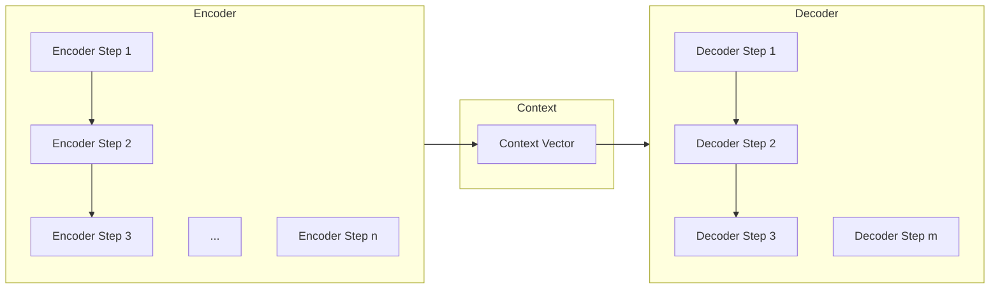
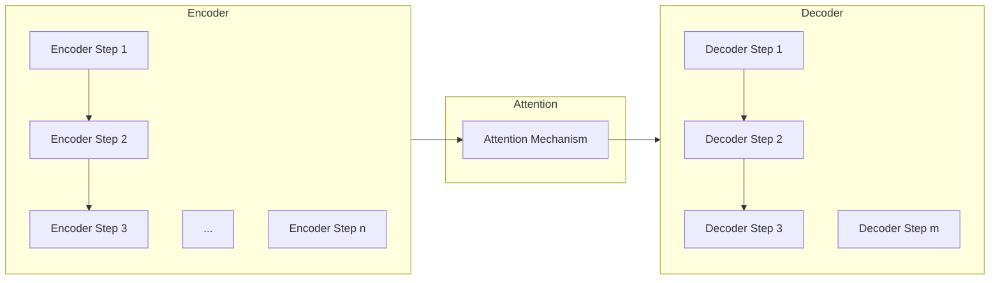

# 序列到序列模型 (Seq2Seq) 原理与代码实例讲解

## 1.背景介绍

### 1.1 序列到序列问题的定义

序列到序列(Sequence-to-Sequence, Seq2Seq)模型是一种广泛应用于自然语言处理(NLP)和其他领域的神经网络架构。它旨在解决将一个序列映射为另一个序列的问题,例如机器翻译、文本摘要、对话系统等。

在传统的机器学习方法中,我们通常将输入数据转换为固定长度的向量表示,然后使用模型(如逻辑回归或支持向量机)进行处理。但是,这种方法无法很好地处理可变长度的序列数据,例如自然语言文本。

Seq2Seq模型的出现为解决这一问题提供了一种新的范式。它能够处理可变长度的输入和输出序列,同时保留了序列中元素之间的顺序信息。

### 1.2 Seq2Seq模型的应用场景

Seq2Seq模型在以下领域有广泛的应用:

- **机器翻译**: 将一种语言的文本翻译成另一种语言。
- **文本摘要**: 根据原始文本生成简洁的摘要。
- **对话系统**: 根据用户的输入生成相应的回复。
- **图像字幕生成**: 根据图像生成相应的文本描述。
- **语音识别**: 将语音信号转换为文本。
- **语音合成**: 将文本转换为语音。

## 2.核心概念与联系

### 2.1 Seq2Seq模型的基本架构

Seq2Seq模型由两个主要组件组成:编码器(Encoder)和解码器(Decoder)。

1. **编码器(Encoder)**: 编码器的作用是将可变长度的输入序列转换为固定长度的上下文向量表示。常用的编码器包括递归神经网络(RNN)、长短期记忆网络(LSTM)和门控循环单元(GRU)。

2. **解码器(Decoder)**: 解码器的作用是根据编码器输出的上下文向量和先前生成的输出序列,预测下一个元素。与编码器类似,解码器也常使用RNN、LSTM或GRU。

编码器和解码器之间通过上下文向量进行信息传递,这使得模型能够捕获输入序列和输出序列之间的映射关系。



### 2.2 注意力机制(Attention Mechanism)

虽然基本的Seq2Seq模型能够捕获输入序列和输出序列之间的映射关系,但它存在一个主要缺陷:上下文向量是固定长度的,因此很难捕获长序列中的所有相关信息。

为了解决这个问题,研究人员提出了注意力机制(Attention Mechanism)。注意力机制允许模型在生成每个输出元素时,动态地关注输入序列的不同部分,从而提高了模型的性能。

注意力机制的工作原理如下:

1. 计算查询向量(Query Vector)和键向量(Key Vector)之间的相似性分数。
2. 根据相似性分数,对值向量(Value Vector)进行加权求和,得到注意力向量(Attention Vector)。
3. 将注意力向量与解码器的隐藏状态向量(Hidden State Vector)进行拼接,作为解码器的新输入。

通过注意力机制,模型可以动态地关注输入序列中与当前输出元素相关的部分,从而提高了模型的性能。



## 3.核心算法原理具体操作步骤

### 3.1 编码器(Encoder)

编码器的主要作用是将可变长度的输入序列转换为固定长度的上下文向量表示。常用的编码器包括RNN、LSTM和GRU。

以LSTM编码器为例,其工作原理如下:

1. 初始化LSTM的隐藏状态和细胞状态。
2. 对于输入序列中的每个时间步:
    a. 将当前输入元素和上一时间步的隐藏状态作为LSTM单元的输入。
    b. 更新LSTM单元的隐藏状态和细胞状态。
3. 将最后一个时间步的隐藏状态作为上下文向量。

### 3.2 解码器(Decoder)

解码器的主要作用是根据编码器输出的上下文向量和先前生成的输出序列,预测下一个元素。常用的解码器也包括RNN、LSTM和GRU。

以LSTM解码器为例,其工作原理如下:

1. 初始化LSTM的隐藏状态和细胞状态,使用编码器输出的上下文向量作为初始状态。
2. 对于需要生成的每个时间步:
    a. 将上一时间步的输出元素和当前隐藏状态作为LSTM单元的输入。
    b. 更新LSTM单元的隐藏状态和细胞状态。
    c. 根据当前隐藏状态,预测当前时间步的输出元素。
3. 重复步骤2,直到生成完整的输出序列或达到最大长度。

### 3.3 注意力机制(Attention Mechanism)

注意力机制的工作原理可以分为以下几个步骤:

1. **计算查询向量和键向量之间的相似性分数**:
   - 查询向量(Query Vector)通常是解码器的当前隐藏状态向量。
   - 键向量(Key Vector)是编码器在每个时间步输出的隐藏状态向量。
   - 常用的相似性度量方法包括点积、缩放点积等。

2. **对值向量进行加权求和**:
   - 值向量(Value Vector)通常是编码器在每个时间步输出的隐藏状态向量。
   - 使用上一步计算的相似性分数作为权重,对值向量进行加权求和,得到注意力向量(Attention Vector)。

3. **将注意力向量与解码器的隐藏状态向量进行拼接**:
   - 将注意力向量与解码器的当前隐藏状态向量进行拼接,作为解码器的新输入。
   - 这样可以让解码器在生成每个输出元素时,动态地关注输入序列的不同部分。

## 4.数学模型和公式详细讲解举例说明

### 4.1 编码器(Encoder)

假设输入序列为 $X = (x_1, x_2, \dots, x_T)$,其中 $T$ 是序列长度。编码器的目标是将输入序列映射为上下文向量 $c$。

对于基于RNN的编码器,我们可以使用以下公式计算隐藏状态向量:

$$h_t = f(x_t, h_{t-1})$$

其中 $f$ 是RNN的递归函数,例如LSTM或GRU。最终的上下文向量 $c$ 通常是最后一个时间步的隐藏状态向量 $h_T$。

$$c = h_T$$

### 4.2 解码器(Decoder)

假设目标输出序列为 $Y = (y_1, y_2, \dots, y_{T'})$,其中 $T'$ 是序列长度。解码器的目标是根据上下文向量 $c$ 和先前生成的输出序列,预测下一个元素的概率分布。

对于基于RNN的解码器,我们可以使用以下公式计算隐藏状态向量和输出概率分布:

$$h_t' = f(y_{t-1}, h_{t-1}', c)$$
$$P(y_t | y_{<t}, c) = g(h_t', y_{t-1}, c)$$

其中 $f$ 是RNN的递归函数,例如LSTM或GRU,初始隐藏状态 $h_0'$ 通常是上下文向量 $c$。$g$ 是将隐藏状态向量和先前输出映射为输出概率分布的函数,通常是一个全连接层加上softmax激活函数。

### 4.3 注意力机制(Attention Mechanism)

注意力机制的数学模型可以分为以下几个步骤:

1. **计算查询向量和键向量之间的相似性分数**:

   $$e_{t,i} = \text{score}(q_t, k_i)$$

   其中 $q_t$ 是查询向量(通常是解码器的当前隐藏状态向量),而 $k_i$ 是键向量(通常是编码器在第 $i$ 个时间步输出的隐藏状态向量)。常用的相似性度量方法包括点积、缩放点积等。

2. **对值向量进行加权求和**:

   $$a_t = \sum_{i=1}^{T} \alpha_{t,i} v_i$$

   其中 $\alpha_{t,i}$ 是注意力权重,通常是通过对相似性分数进行softmax归一化得到的。$v_i$ 是值向量(通常是编码器在第 $i$ 个时间步输出的隐藏状态向量)。

3. **将注意力向量与解码器的隐藏状态向量进行拼接**:

   $$h_t' = \text{concat}(h_t, a_t)$$

   其中 $h_t'$ 是解码器的新隐藏状态向量,将注意力向量 $a_t$ 与原始隐藏状态向量 $h_t$ 进行拼接。

通过注意力机制,解码器可以动态地关注输入序列的不同部分,从而提高了模型的性能。

## 5.项目实践:代码实例和详细解释说明

在本节中,我们将使用PyTorch框架实现一个基于注意力机制的Seq2Seq模型,并在机器翻译任务上进行训练和测试。

### 5.1 数据准备

我们将使用一个简单的英语到法语的机器翻译数据集进行演示。该数据集包含一系列英语句子及其对应的法语翻译。

```python
from torchtext.datasets import Multi30k
from torchtext.data import Field, BucketIterator

# 定义字段
SRC = Field(tokenize="spacy",
            tokenizer_language="en_core_web_sm",
            init_token="<sos>",
            eos_token="<eos>",
            lower=True)

TRG = Field(tokenize="spacy",
            tokenizer_language="fr_core_news_sm",
            init_token="<sos>",
            eos_token="<eos>",
            lower=True)

# 加载数据集
train_data, valid_data, test_data = Multi30k.splits(exts=(".en", ".fr"),
                                                    fields=(SRC, TRG))
```

### 5.2 模型定义

我们将定义一个基于LSTM和注意力机制的Seq2Seq模型。

```python
import torch
import torch.nn as nn

class Encoder(nn.Module):
    def __init__(self, input_dim, emb_dim, enc_hid_dim, dec_hid_dim, dropout):
        super().__init__()
        self.embedding = nn.Embedding(input_dim, emb_dim)
        self.rnn = nn.LSTM(emb_dim, enc_hid_dim, bidirectional=True)
        self.fc = nn.Linear(enc_hid_dim * 2, dec_hid_dim)
        self.dropout = nn.Dropout(dropout)

    def forward(self, src):
        embedded = self.dropout(self.embedding(src))
        outputs, (hidden, cell) = self.rnn(embedded)
        hidden = torch.tanh(self.fc(torch.cat((hidden[-2, :, :], hidden[-1, :, :]), dim=1)))
        return hidden, cell

class Attention(nn.Module):
    def __init__(self, enc_hid_dim, dec_hid_dim):
        super().__init__()
        self.attn = nn.Linear((enc_hid_dim * 2) + dec_hid_dim, dec_hid_dim)
        self.v = nn.Linear(dec_hid_dim, 1, bias=False)

    def forward(self, hidden, encoder_outputs):
        batch_size = encoder_outputs.shape[1]
        src_len = encoder_outputs.shape[0]
        hidden = hidden.unsqueeze(1).