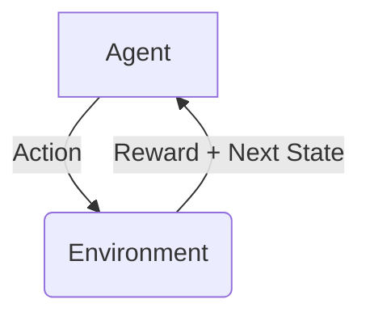
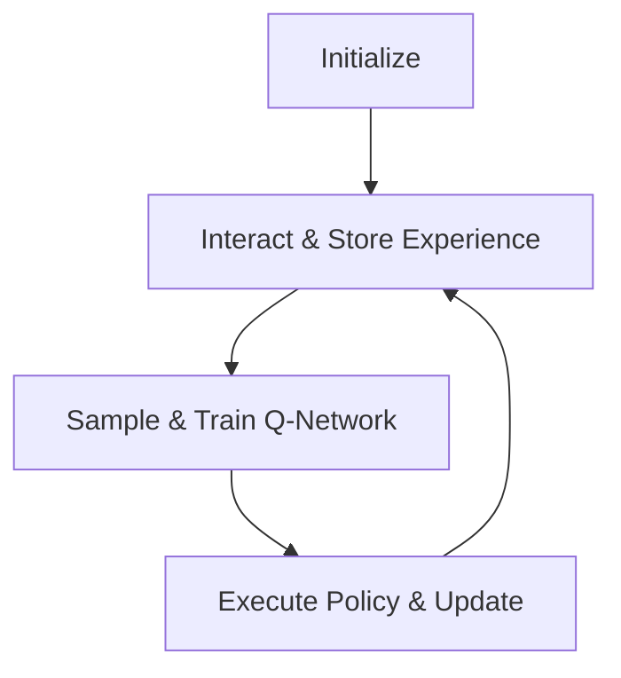

# 强化学习Reinforcement Learning在智能制造中的角色与价值

## 1. 背景介绍

### 1.1 智能制造的兴起

随着人工智能、大数据、物联网等新兴技术的快速发展,制造业正经历着前所未有的变革。传统的制造模式越来越难以满足现代制造业对效率、质量和灵活性的需求。因此,智能制造(Intelligent Manufacturing)作为制造业转型升级的重要途径,受到了广泛关注。

智能制造旨在通过融合先进的信息技术,实现制造过程的智能化、自动化和优化,从而提高生产效率、降低成本、提升产品质量。其中,人工智能技术在智能制造中扮演着关键角色,为制造过程注入智能,实现自主决策和自适应控制。

### 1.2 强化学习在智能制造中的作用

作为人工智能的一个重要分支,强化学习(Reinforcement Learning)在智能制造领域展现出巨大的应用潜力。强化学习是一种基于试错学习的机器学习方法,它通过与环境交互,不断尝试不同的行为,获取奖励信号,从而学习到最优策略。

在智能制造场景中,强化学习可以应用于各种复杂的决策和控制问题,如机器人控制、工艺优化、调度优化等。与传统的规则based方法相比,强化学习具有以下优势:

1. 无需事先建模,可以直接从数据中学习最优策略。
2. 具有很强的泛化能力,可以应对复杂动态环境。
3. 通过试错学习,可以发现人类难以预料的最优解。

因此,强化学习在智能制造中扮演着越来越重要的角色,成为推动制造业智能化转型的关键技术之一。

## 2. 核心概念与联系

### 2.1 强化学习的核心概念

强化学习是一种基于马尔可夫决策过程(Markov Decision Process, MDP)的学习范式。其核心概念包括:

- **Agent(智能体)**: 执行动作的主体,通过与环境交互来学习。
- **Environment(环境)**: 智能体所处的外部世界,包括状态和奖励信号。
- **State(状态)**: 描述环境的instantaneous情况。
- **Action(动作)**: 智能体在特定状态下可以执行的操作。
- **Reward(奖励)**: 环境给予智能体的反馈信号,用于指导学习方向。
- **Policy(策略)**: 智能体在每个状态下选择动作的策略,是强化学习的最终目标。

强化学习算法的目标是找到一个最优策略,使得在环境中执行该策略可以获得最大的累积奖励。



### 2.2 强化学习与智能制造的联系

制造过程可以被建模为一个马尔可夫决策过程:

- **Agent**: 控制系统或决策模块
- **State**: 描述当前制造状态的特征,如库存水平、设备状态等
- **Action**: 可执行的操作,如调度、控制指令等
- **Reward**: 根据制造目标设计的奖励函数,如利润、效率等指标

通过与环境交互并获取奖励反馈,强化学习算法可以学习到最优的制造决策策略,从而优化整个制造流程。

强化学习在智能制造中的应用场景包括但不限于:

- 机器人控制与装配
- 工艺参数优化
- 生产计划与调度
- 预测性维护
- 供应链优化

## 3. 核心算法原理具体操作步骤 

强化学习算法通常可分为三类:基于价值函数(Value-based)、基于策略(Policy-based)和Actor-Critic算法。下面将介绍其中一种经典且广泛使用的算法:Deep Q-Network(DQN)。

DQN算法属于基于价值函数的强化学习算法,其核心思想是使用深度神经网络来近似状态-动作值函数Q(s,a),从而找到最优策略。算法步骤如下:

### 3.1 初始化

1. 初始化深度Q网络,输入为状态s,输出为各个动作的Q值Q(s,a)
2. 初始化经验回放池(Experience Replay Buffer)
3. 初始化探索率(Exploration Rate)ε,用于控制利用与探索的权衡

### 3.2 与环境交互并存储经验

1. 从当前状态s出发,根据ε-greedy策略选择动作a
2. 执行动作a,获得奖励r和新状态s'
3. 将(s,a,r,s')作为一个经验存入回放池

### 3.3 从回放池采样并训练Q网络

1. 从回放池中随机采样一个批次的经验(s,a,r,s')
2. 计算目标Q值:
   $$y = r + \gamma \max_{a'} Q(s', a'; \theta^-)$$
   其中$\gamma$为折现因子,$\theta^-$为目标Q网络的参数(固定的)
3. 计算当前Q网络输出的Q值:
   $$Q(s, a; \theta)$$
   其中$\theta$为当前Q网络的参数
4. 计算损失:
   $$\mathcal{L} = \mathbb{E}_{(s,a,r,s')\sim D}[(y - Q(s, a; \theta))^2]$$
5. 使用优化算法(如RMSProp)更新当前Q网络的参数$\theta$
6. 每隔一定步数同步目标Q网络的参数$\theta^-$

### 3.4 执行策略并更新

1. 使用当前Q网络的输出Q值,根据贪婪策略选择动作
2. 逐步降低探索率ε,增加利用的比例
3. 重复步骤3.2和3.3,直到算法收敛



通过上述步骤,DQN算法可以逐步学习到最优的Q函数,从而得到最优策略。DQN算法的优点是相对稳定,并且通过经验回放池和目标Q网络的引入,能够提高训练的效率和稳定性。

## 4. 数学模型和公式详细讲解举例说明

### 4.1 马尔可夫决策过程(MDP)

强化学习问题可以形式化为一个马尔可夫决策过程(MDP),定义为一个五元组$\langle \mathcal{S}, \mathcal{A}, \mathcal{P}, \mathcal{R}, \gamma \rangle$,其中:

- $\mathcal{S}$是状态空间的集合
- $\mathcal{A}$是动作空间的集合
- $\mathcal{P}$是状态转移概率,表示在状态s执行动作a后,转移到状态s'的概率:$\mathcal{P}_{ss'}^a = \Pr(s_{t+1}=s'|s_t=s, a_t=a)$
- $\mathcal{R}$是奖励函数,表示在状态s执行动作a后,获得的即时奖励:$\mathcal{R}_s^a = \mathbb{E}[r_{t+1}|s_t=s, a_t=a]$
- $\gamma \in [0, 1)$是折现因子,用于权衡即时奖励和长期奖励

强化学习的目标是找到一个策略$\pi: \mathcal{S} \rightarrow \mathcal{A}$,使得在该策略下的期望累积折现奖励最大化:

$$\max_\pi \mathbb{E}_\pi \left[ \sum_{t=0}^\infty \gamma^t r_{t+1} \right]$$

### 4.2 价值函数和Bellman方程

为了评估一个策略$\pi$的好坏,我们引入状态价值函数$V^\pi(s)$和状态-动作价值函数$Q^\pi(s,a)$:

$$V^\pi(s) = \mathbb{E}_\pi \left[ \sum_{t=0}^\infty \gamma^t r_{t+1} | s_0 = s \right]$$
$$Q^\pi(s, a) = \mathbb{E}_\pi \left[ \sum_{t=0}^\infty \gamma^t r_{t+1} | s_0 = s, a_0 = a \right]$$

它们分别表示在策略$\pi$下,从状态s出发和从状态s执行动作a出发,之后能获得的期望累积折现奖励。

价值函数满足著名的Bellman方程:

$$V^\pi(s) = \sum_a \pi(a|s) \left( \mathcal{R}_s^a + \gamma \sum_{s'} \mathcal{P}_{ss'}^a V^\pi(s') \right)$$
$$Q^\pi(s, a) = \mathcal{R}_s^a + \gamma \sum_{s'} \mathcal{P}_{ss'}^a \sum_{a'} \pi(a'|s') Q^\pi(s', a')$$

Bellman方程揭示了价值函数与即时奖励和下一状态价值函数之间的递推关系,为求解价值函数提供了理论基础。

### 4.3 最优价值函数和Bellman最优性方程

我们定义最优状态价值函数$V^*(s)$和最优状态-动作价值函数$Q^*(s,a)$为所有策略中的最大值:

$$V^*(s) = \max_\pi V^\pi(s)$$
$$Q^*(s, a) = \max_\pi Q^\pi(s, a)$$

最优价值函数满足Bellman最优性方程:

$$V^*(s) = \max_a \left( \mathcal{R}_s^a + \gamma \sum_{s'} \mathcal{P}_{ss'}^a V^*(s') \right)$$
$$Q^*(s, a) = \mathcal{R}_s^a + \gamma \sum_{s'} \mathcal{P}_{ss'}^a \max_{a'} Q^*(s', a')$$

通过求解Bellman最优性方程,我们可以得到最优价值函数,进而推导出最优策略$\pi^*(s) = \arg\max_a Q^*(s, a)$。

### 4.4 Q-Learning算法

Q-Learning是一种基于价值迭代的强化学习算法,用于近似求解最优Q函数$Q^*(s,a)$。算法步骤如下:

1. 初始化Q函数,如$Q(s,a) = 0, \forall s, a$
2. 重复:
   1. 从当前状态s出发,选择动作a(如ε-greedy策略)
   2. 执行动作a,获得奖励r和新状态s'
   3. 更新Q函数:
      $$Q(s, a) \leftarrow Q(s, a) + \alpha \left[ r + \gamma \max_{a'} Q(s', a') - Q(s, a) \right]$$
      其中$\alpha$为学习率
3. 直到Q函数收敛

Q-Learning算法的优点是无需知道环境的转移概率,只需与环境交互即可逐步学习到最优Q函数。但在实际应用中,由于状态空间和动作空间的维数较高,使用表格形式存储Q函数变得不现实,因此需要使用函数逼近的方法,如深度神经网络,这就是DQN算法的基础。

## 5. 项目实践: 代码实例和详细解释说明

为了更好地理解DQN算法的实现细节,我们将使用PyTorch框架,在经典的CartPole环境中训练一个DQN智能体。CartPole环境是一个控制理论中的经典问题,目标是通过左右推动小车,使杆子保持直立状态。

### 5.1 导入必要的库

```python
import gym
import math
import random
import numpy as np
import matplotlib.pyplot as plt

import torch
import torch.nn as nn
import torch.optim as optim
import torch.nn.functional as F
```

### 5.2 定义DQN网络

我们使用一个简单的全连接神经网络作为Q网络的近似函数:

```python
class DQN(nn.Module):
    def __init__(self, state_dim, action_dim):
        super(DQN, self).__init__()
        self.fc1 = nn.Linear(state_dim, 64)
        self.fc2 = nn.Linear(64, action_dim)

    def forward(self, x):
        x = F.relu(self.fc1(x))
        return self.fc2(x)
```

### 5.3 定义经验回放池

```python
class ReplayBuffer:
    def __init__(self, capacity):
        self.buffer = []
        self.capacity = capacity
        self.position = 0

    def push(self, state, action, reward, next_state, done):
        transition = (state, action, reward, next_state, done)
        if len(self.buffer) < self.capacity:
            self.buffer.append(transition)
        else:
            self.buffer[self.position] = transition
        self.position = (self.position + 1) %