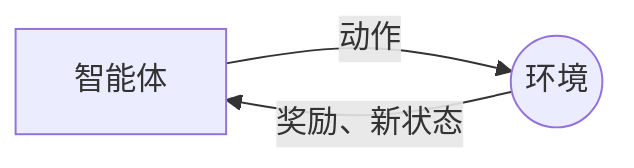

## 1.背景介绍

强化学习作为机器学习的一个重要分支，近年来在无人驾驶、游戏AI、机器人控制等领域取得了显著的成果。本文将深入探讨强化学习的原理，通过实例代码，帮助读者理解和掌握强化学习的应用。

## 2.核心概念与联系

强化学习的核心概念包括：环境（Environment）、智能体（Agent）、状态（State）、动作（Action）、奖励（Reward）以及策略（Policy）。智能体在环境中通过执行动作，转换状态，接收奖励，通过学习最优策略以最大化累积奖励。



## 3.核心算法原理具体操作步骤

强化学习的核心算法包括值迭代（Value Iteration）、策略迭代（Policy Iteration）和Q学习（Q-Learning）。下面以Q学习为例，具体操作步骤如下：

1. 初始化Q值表；
2. 智能体根据当前状态和Q值表选择动作；
3. 智能体执行动作，环境返回新的状态和奖励；
4. 智能体更新Q值表；
5. 重复步骤2-4，直到满足停止条件。

## 4.数学模型和公式详细讲解举例说明

Q学习的更新公式为：

$$ Q(s, a) = Q(s, a) + \alpha [r + \gamma \max_{a'} Q(s', a') - Q(s, a)] $$

其中，$s$和$a$分别表示当前的状态和动作，$s'$表示新的状态，$r$表示奖励，$\alpha$是学习率，$\gamma$是折扣因子。

## 5.项目实践：代码实例和详细解释说明

下面通过Python代码实例，实现Q学习算法：

```python
import numpy as np

class QLearning:
    def __init__(self, states, actions, alpha=0.5, gamma=0.9, epsilon=0.1):
        self.states = states
        self.actions = actions
        self.alpha = alpha
        self.gamma = gamma
        self.epsilon = epsilon
        self.Q = np.zeros((states, actions))

    def choose_action(self, state):
        if np.random.uniform() < self.epsilon:
            action = np.random.choice(self.actions)
        else:
            action = np.argmax(self.Q[state, :])
        return action

    def learn(self, s, a, r, s_):
        self.Q[s, a] = self.Q[s, a] + self.alpha * (r + self.gamma * np.max(self.Q[s_, :]) - self.Q[s, a])
```

## 6.实际应用场景

强化学习已经在很多领域得到了应用，例如：

- 游戏AI：AlphaGo就是使用了强化学习算法，打败了世界冠军；
- 无人驾驶：通过强化学习，车辆可以学习到最优的驾驶策略；
- 机器人控制：机器人可以通过强化学习，学习到如何完成复杂的任务。

## 7.工具和资源推荐

- OpenAI Gym：一个提供了许多强化学习环境的开源库；
- TensorFlow：Google开源的深度学习库，可以用于实现深度强化学习；
- RLCard：一个为强化学习在博弈游戏中的研究提供平台的工具包。

## 8.总结：未来发展趋势与挑战

强化学习的未来发展趋势主要有两个方向：深度强化学习和多智能体强化学习。深度强化学习结合了深度学习和强化学习，可以处理更复杂的问题；多智能体强化学习则是研究多个智能体如何通过协作或竞争来学习最优策略。

强化学习面临的主要挑战包括样本效率低、稳定性差、需要大量超参数调整等问题。

## 9.附录：常见问题与解答

- 问：强化学习和监督学习有什么区别？
- 答：强化学习是在没有标签的情况下，通过与环境的交互进行学习；而监督学习则是在有标签的情况下进行学习。

- 问：为什么强化学习需要使用折扣因子？
- 答：折扣因子可以使得智能体更关注近期的奖励，而不是长期的奖励。

作者：禅与计算机程序设计艺术 / Zen and the Art of Computer Programming