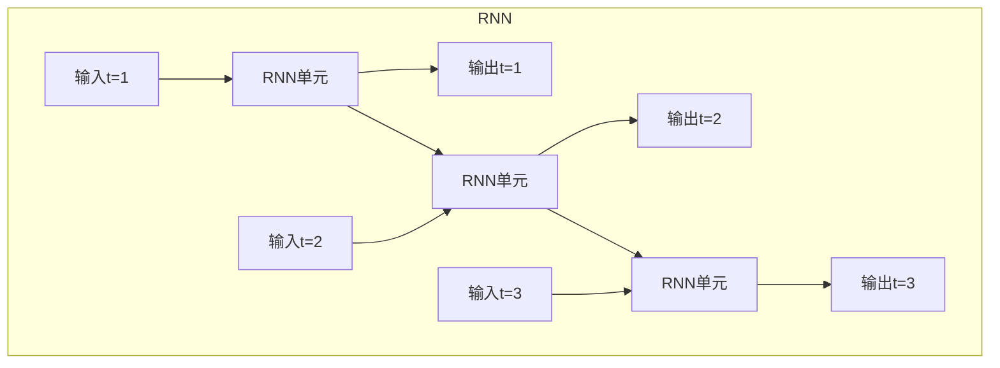

# 循环神经网络RNN原理与代码实例讲解

## 1.背景介绍

循环神经网络(Recurrent Neural Networks, RNNs)是一种特殊类型的人工神经网络,专门设计用于处理序列数据,如文本、语音、视频等。与传统的前馈神经网络不同,RNN能够记住之前的信息,并将其应用于当前的输入,从而捕捉序列数据中的动态行为和时间模式。

在过去几年中,RNN在自然语言处理、语音识别、机器翻译等领域取得了巨大的成功,成为序列建模的主导模型。传统的机器学习算法很难有效地处理序列数据,因为它们通常假设输入和输出之间是独立同分布的。而RNN则能够直接对序列数据建模,在处理有序列依赖关系的问题时表现出色。

### 1.1 序列数据的挑战

序列数据具有以下几个主要挑战:

1. **变长输入输出**: 与固定长度的数据不同,序列数据的长度是可变的,需要能够处理任意长度的输入和输出。
2. **时间依赖性**: 序列数据中的每个元素都与其他元素存在潜在的时间依赖关系,需要捕捉这些长期和短期的依赖关系。
3. **非平凡的数据结构**: 序列数据通常具有复杂的嵌套和层次结构,如自然语言句子中的短语和从句。

传统的机器学习模型很难有效地应对这些挑战,因为它们通常假设输入和输出是独立同分布的,并且无法捕捉序列数据中的动态行为和时间模式。

### 1.2 RNN的发展历程

为了解决序列数据建模的问题,研究人员提出了循环神经网络(RNN)。早期的RNN可以追溯到20世纪80年代,但由于训练困难和梯度消失/爆炸问题,它们在很长一段时间内并未得到广泛应用。直到近年来,通过一些新的训练技术(如长短期记忆网络LSTM和门控循环单元GRU)和更强大的硬件资源,RNN才在各种序列建模任务中取得了突破性的进展。

现代RNN已经成为自然语言处理、语音识别、机器翻译等领域的主导模型,并在这些领域取得了令人印象深刻的成绩。随着深度学习的不断发展,RNN也在不断演进,以更好地捕捉序列数据中的复杂模式。

## 2.核心概念与联系

### 2.1 RNN的基本结构

循环神经网络的核心思想是使用相同的权重参数在序列的每个时间步上重复应用,从而捕捉序列数据中的动态时间行为。RNN的基本结构如下所示:

在上图中,每个RNN单元都接收当前时间步的输入,以及上一个时间步的隐藏状态。然后,RNN单元根据当前输入和先前的隐藏状态计算新的隐藏状态和输出。这个过程在序列的每个时间步上重复进行,从而捕捉了序列数据中的动态时间模式。

RNN的这种循环结构使其能够记住之前的信息,并将其应用于当前的输入,从而捕捉序列数据中的长期依赖关系。这种能力使RNN在处理诸如自然语言、语音和时间序列数据等序列建模任务时表现出色。

### 2.2 RNN的数学表示

我们可以用以下公式来表示RNN在时间步t的计算过程:

$$
h_t = f_W(x_t, h_{t-1})\\
y_t = g_V(h_t)
$$

其中:

- $x_t$是时间步t的输入
- $h_t$是时间步t的隐藏状态(也称为记忆或细胞状态)
- $h_{t-1}$是前一时间步的隐藏状态
- $y_t$是时间步t的输出
- $f_W$是计算隐藏状态的函数,通常是一个非线性函数(如tanh或ReLU),并且包含了可训练的权重参数W
- $g_V$是计算输出的函数,通常是一个线性变换或非线性函数(如softmax),并且包含了可训练的权重参数V

在训练过程中,RNN通过反向传播算法来学习权重参数W和V,从而最小化训练数据上的损失函数。由于RNN在每个时间步上共享相同的权重参数,因此它们能够有效地捕捉序列数据中的动态时间模式。

### 2.3 RNN的变体

虽然标准的RNN已经展现出了强大的序列建模能力,但它们仍然存在一些局限性,如梯度消失/爆炸问题和捕捉长期依赖关系的困难。为了解决这些问题,研究人员提出了一些RNN的变体,如:

1. **长短期记忆网络(LSTM)**: LSTM通过引入门控机制来控制信息的流动,从而缓解了梯度消失/爆炸问题,并且能够更好地捕捉长期依赖关系。
2. **门控循环单元(GRU)**: GRU是LSTM的一种变体,它采用了更简单的门控机制,参数更少,计算更高效。
3. **双向RNN(Bidirectional RNN)**: 双向RNN可以同时捕捉序列数据中的前向和后向依赖关系,通常在需要全局上下文信息的任务中表现更好。
4. **深层RNN**: 深层RNN通过堆叠多个RNN层,能够学习更复杂的表示,从而提高模型的表达能力。

这些RNN变体在不同的应用场景下都展现出了优异的性能,并且推动了RNN在序列建模领域的广泛应用。

## 3.核心算法原理具体操作步骤  

### 3.1 RNN的前向传播过程

RNN的前向传播过程是一个递归计算过程,它在序列的每个时间步上重复执行以下步骤:

1. 获取当前时间步的输入$x_t$。
2. 从上一时间步获取隐藏状态$h_{t-1}$。对于第一个时间步,初始隐藏状态$h_0$通常被初始化为全0向量。
3. 将当前输入$x_t$和上一隐藏状态$h_{t-1}$传入RNN单元,计算当前时间步的隐藏状态$h_t$:

$$h_t = f_W(x_t, h_{t-1})$$

其中$f_W$是一个非线性函数,如tanh或ReLU,并且包含了可训练的权重参数W。

4. 使用当前隐藏状态$h_t$计算当前时间步的输出$y_t$:

$$y_t = g_V(h_t)$$

其中$g_V$是一个线性变换或非线性函数(如softmax),并且包含了可训练的权重参数V。

5. 将当前隐藏状态$h_t$传递到下一时间步,重复步骤1-4,直到序列结束。

这个递归计算过程使RNN能够捕捉序列数据中的动态时间模式,并且在每个时间步上共享相同的权重参数,从而实现了参数高效利用。

### 3.2 RNN的反向传播过程

RNN的训练过程采用反向传播算法来学习权重参数W和V,从而最小化训练数据上的损失函数。反向传播过程涉及计算损失函数相对于权重参数的梯度,并使用优化算法(如随机梯度下降)来更新权重参数。

具体来说,RNN的反向传播过程包括以下步骤:

1. 在前向传播过程中计算每个时间步的隐藏状态$h_t$和输出$y_t$。
2. 计算最后一个时间步的损失函数$L_T$,其中T是序列的长度。
3. 计算$L_T$相对于最后一个时间步的权重参数的梯度:

$$\frac{\partial L_T}{\partial W}, \frac{\partial L_T}{\partial V}$$

4. 对于每个时间步t(从T-1到1):
   a. 计算$L_t$相对于当前时间步的权重参数的梯度:
   
   $$\frac{\partial L_t}{\partial W}, \frac{\partial L_t}{\partial V}$$
   
   b. 计算$L_t$相对于上一时间步的隐藏状态$h_{t-1}$的梯度:
   
   $$\frac{\partial L_t}{\partial h_{t-1}}$$
   
   c. 将$\frac{\partial L_t}{\partial h_{t-1}}$传递到上一时间步,用于计算$\frac{\partial L_{t-1}}{\partial W}$和$\frac{\partial L_{t-1}}{\partial V}$。
   
5. 使用计算得到的梯度,并应用优化算法(如随机梯度下降)来更新权重参数W和V。
6. 重复步骤1-5,直到模型收敛或达到最大训练轮数。

由于RNN在每个时间步上共享相同的权重参数,因此反向传播过程中的梯度计算需要通过时间步进行传递,这就是所谓的"通过时间的反向传播"(Backpropagation Through Time, BPTT)。BPTT允许RNN捕捉序列数据中的长期依赖关系,但也可能导致梯度消失/爆炸问题,这是RNN的一个主要挑战。

### 3.3 RNN的梯度消失/爆炸问题

在RNN的训练过程中,由于反向传播过程中的梯度需要通过多个时间步进行传递,因此可能会出现梯度消失或梯度爆炸的问题。

**梯度消失**是指,当序列长度增加时,梯度会指数级衰减,导致无法有效地更新权重参数,从而难以捕捉长期依赖关系。这主要是因为反向传播过程中涉及到多次矩阵乘法,如果矩阵的特征值小于1,那么梯度就会随着时间步的增加而快速衰减。

**梯度爆炸**则是指,当序列长度增加时,梯度会指数级增长,导致权重参数的值变得非常大或非常小,从而使模型不稳定并且难以收敛。这主要是因为反向传播过程中涉及到多次矩阵乘法,如果矩阵的特征值大于1,那么梯度就会随着时间步的增加而快速增长。

为了缓解梯度消失/爆炸问题,研究人员提出了一些技术,如梯度裁剪(Gradient Clipping)、初始化策略和LSTM/GRU等门控单元。其中,LSTM和GRU通过引入门控机制来控制信息的流动,从而有效地缓解了梯度消失/爆炸问题,并且能够更好地捕捉长期依赖关系。

## 4.数学模型和公式详细讲解举例说明

### 4.1 RNN的基本数学模型

RNN的基本数学模型可以用以下公式来表示:

$$
h_t = f_W(x_t, h_{t-1}) = \tanh(W_{hx}x_t + W_{hh}h_{t-1} + b_h)\\
y_t = g_V(h_t) = W_{yh}h_t + b_y
$$

其中:

- $x_t$是时间步t的输入向量
- $h_t$是时间步t的隐藏状态向量
- $h_{t-1}$是前一时间步的隐藏状态向量
- $y_t$是时间步t的输出向量
- $W_{hx}$是输入到隐藏层的权重矩阵
- $W_{hh}$是隐藏层到隐藏层的权重矩阵
- $W_{yh}$是隐藏层到输出层的权重矩阵
- $b_h$和$b_y$分别是隐藏层和输出层的偏置向量
- $f_W$是计算隐藏状态的非线性函数,通常使用tanh或ReLU
- $g_V$是计算输出的函数,通常是一个线性变换或非线性函数(如softmax)

在