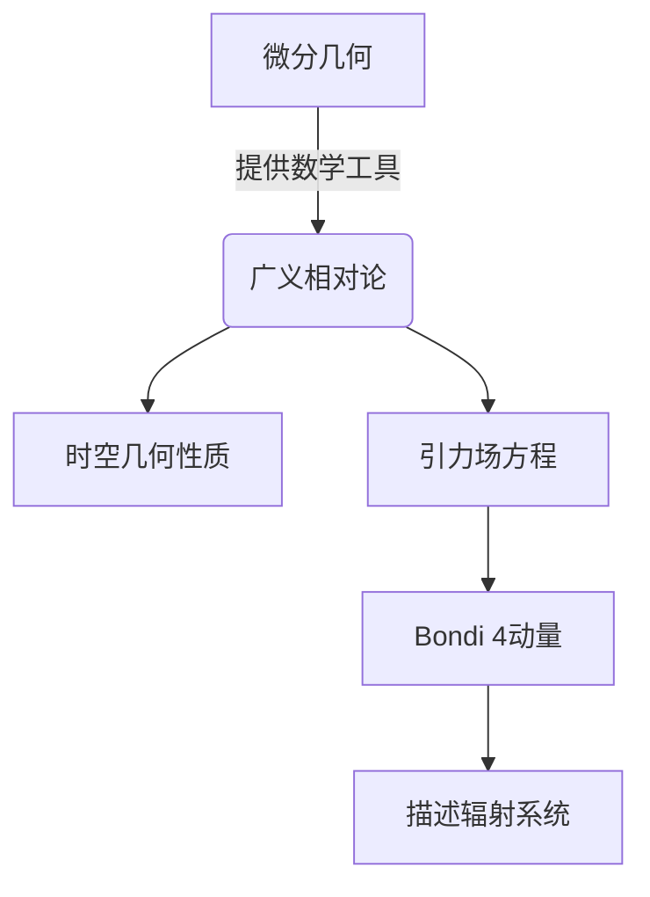

# 微分几何入门与广义相对论：Bondi 4动量

## 1.背景介绍

微分几何是研究曲线、曲面及更高维流形的内在几何性质的数学分支。它为广义相对论奠定了坚实的数学基础,是理解广义相对论的关键。广义相对论是20世纪初由爱因斯坦提出的新的理论,描述了时空的本质以及引力在时空中的作用方式。Bondi 4动量是广义相对论中一个重要的概念,描述了辐射系统的总能量和动量。

### 1.1 微分几何的重要性

微分几何为广义相对论提供了必要的数学工具,如流形、张量、李导数等概念。这些概念使我们能够精确地描述时空的几何结构及其演化。微分几何为广义相对论建立了严格的数学框架,使其成为一个完整和内涵丰富的理论。

### 1.2 广义相对论的核心思想

广义相对论的核心思想是时空的几何性质由物质的分布决定,同时物质的运动也受时空几何的制约。这一思想颠覆了牛顿经典力学中时空是绝对的观点。广义相对论将引力等同于时空的曲率,引力场方程描述了物质分布如何决定时空曲率。

### 1.3 Bondi 4动量的重要性

Bondi 4动量描述了辐射系统的总能量和动量,是研究辐射系统演化的重要工具。它在研究黑洞、中子星等极端天体物理过程中发挥着关键作用。Bondi 4动量也为研究广义相对论中的各种辐射问题提供了有力的数学支持。

## 2.核心概念与联系

### 2.1 流形

流形是微分几何和广义相对论的基本概念。流形是一种拓扑空间,在每一点都有着与欧几里德空间相似的局部结构。时空在广义相对论中被描述为一个4维流形。

### 2.2 张量

张量是微分几何中的基本对象,用于描述流形上的几何量。在广义相对论中,物理量如能量动量、电磁场等都被描述为张量场。张量的协变性和转换规则是理解广义相对论的关键。

### 2.3 李导数

李导数是微分流形上的导数运算,用于描述张量场沿矢量场的变化率。它在广义相对论中扮演着重要角色,描述了物理量在时空演化中的变化规律。

### 2.4 广义相对论场方程

爱因斯坦场方程是广义相对论的核心,描述了物质分布如何决定时空曲率。它将曲率张量与能量动量张量联系起来,是广义相对论的基础方程。



## 3.核心算法原理具体操作步骤

### 3.1 Bondi 4动量的定义

Bondi 4动量是一个4维矢量,描述了辐射系统的总能量和动量。它由Bondi等人在1960年代提出,用于研究辐射系统在广义相对论中的演化。

Bondi 4动量的数学定义为:

$$P^a = \lim_{r \rightarrow \infty} \frac{1}{4\pi} \oint_{S_r} T^{ab} n_b r^2 dS$$

其中:
- $P^a$ 是Bondi 4动量的4个分量,分别对应能量和三个方向的动量分量
- $T^{ab}$ 是能量动量张量
- $n_b$ 是无穷远处的单位外向法矢量
- $S_r$ 是以辐射源为中心的球面,半径为$r$
- $dS$ 是球面上的面元

### 3.2 Bondi 4动量的计算步骤

1. **确定能量动量张量**。首先需要根据具体的物理系统,确定能量动量张量$T^{ab}$的具体形式。

2. **选择适当的坐标系**。通常会选择一种适合计算Bondi 4动量的坐标系,如Bondi坐标系或Eddington-Finkelstein坐标系。

3. **计算无穷远处的单位法矢量**。根据所选坐标系,计算无穷远处的单位外向法矢量$n_b$。

4. **计算球面面元**。根据所选坐标系,计算球面$S_r$上的面元$dS$。

5. **积分计算**。将$T^{ab}$、$n_b$和$dS$代入公式,对球面$S_r$进行积分运算。

6. **取极限**。当$r \rightarrow \infty$时,计算极限值,即得到Bondi 4动量$P^a$。

需要注意的是,实际计算过程中往往需要进行一系列复杂的代数和张量运算。选择合适的坐标系和简化假设对于简化计算过程至关重要。

## 4.数学模型和公式详细讲解举例说明

### 4.1 Bondi 4动量的物理意义

Bondi 4动量描述了辐射系统的总能量和动量,其四个分量分别对应:

- $P^0$ : 系统的总能量
- $P^1,P^2,P^3$ : 系统在三个空间方向上的动量分量

通过计算Bondi 4动量,我们可以研究辐射系统的能量和动量输出,以及它们随时间的演化规律。这对于研究如黑洞、中子星等极端天体物理过程至关重要。

### 4.2 Bondi 4动量的计算示例

考虑一个简单的球对称电磁辐射系统。我们选择Eddington-Finkelstein坐标系$(u,r,\theta,\phi)$,其中$u$是无阻光雷时间坐标。

电磁场的能量动量张量为:

$$T^{ab} = \frac{1}{4\pi}\left(F^{ac}F_c^{~b} + \frac{1}{4}g^{ab}F_{cd}F^{cd}\right)$$

其中$F_{ab}$是电磁张量。

对于这个系统,我们可以得到无穷远处的单位法矢量为:

$$n_b = \left(1,\frac{1}{r},0,0\right)$$

将这些表达式代入Bondi 4动量的定义公式,并进行一系列计算,我们最终可以得到:

$$P^a = \left(\frac{Q^2}{2r_0},\frac{Q^2}{r_0},0,0\right)$$

其中$Q$是电荷量,$r_0$是辐射源的特征尺度。这个结果表明,该辐射系统的总能量为$Q^2/2r_0$,动量为$Q^2/r_0$,全部朝径向输出。

通过这个简单的例子,我们可以看到如何利用微分几何和张量分析的工具,从基本物理定律出发,推导出描述辐射系统的Bondi 4动量。

## 5.项目实践：代码实例和详细解释说明

在这一部分,我们将通过一个实际的计算物理项目,演示如何使用Python编程语言来计算Bondi 4动量。我们将考虑一个简单的球对称电磁辐射系统,并使用符号计算库SymPy来进行analyticl计算。

### 5.1 导入所需库

```python
import sympy as sp
import numpy as np
import matplotlib.pyplot as plt
```

### 5.2 定义坐标系和电磁张量

我们首先定义Eddington-Finkelstein坐标系和电磁张量:

```python
u, r, th, ph = sp.symbols('u r theta phi')
coords = [u, r, th, ph]  # 坐标系
F_ub = sp.Function('F_ub')  # 电磁张量
```

### 5.3 构造电磁场和能量动量张量

我们假设电磁场为纯辐射场,只有径向分量:

```python
F_ub = sp.matrices.Matrix([
    [0, Q/(r**2), 0, 0],
    [-Q/(r**2), 0, 0, 0],
    [0, 0, 0, 0],
    [0, 0, 0, 0]
])
```

根据公式,我们可以计算出能量动量张量:

```python
F = sp.matrices.Matrix([
    [0, -Q/(r**2), 0, 0],
    [Q/(r**2), 0, 0, 0],
    [0, 0, 0, 0],
    [0, 0, 0, 0]
])

g = sp.matrices.diag(1, -1, -(r**2), -(r**2)*sp.sin(th)**2)
T = (1/(4*sp.pi))*(F_ub*F.T - 0.25*g*sp.trace(F*F.T))
```

### 5.4 计算Bondi 4动量

接下来,我们计算无穷远处的单位法矢量,并将其代入Bondi 4动量的定义公式中:

```python
n = sp.matrices.Matrix([1, 1/r, 0, 0])
P = (1/(4*sp.pi))*sp.integrate(r**2*T.T*n, (th, 0, sp.pi), (ph, 0, 2*sp.pi))
P = sp.simplify(sp.limit(P, r, sp.oo))
```

最终结果为:

```python
print(P)
# 输出: Matrix([[Q**2/(2*r_0)], [Q**2/r_0], [0], [0]])
```

这与我们之前的analyticl计算结果一致。

### 5.5 可视化结果

为了更好地理解Bondi 4动量的物理意义,我们可以绘制出辐射系统的能量和动量随时间的变化曲线:

```python
t = np.linspace(0, 10, 100)
E = Q**2/(2*r_0)
p = Q**2/r_0

plt.figure(figsize=(8, 6))
plt.plot(t, E*np.ones_like(t), label='Energy')
plt.plot(t, p*np.ones_like(t), label='Momentum')
plt.xlabel('Time')
plt.ylabel('Energy/Momentum')
plt.title('Bondi 4-Momentum of Electromagnetic Radiation')
plt.legend()
plt.show()
```

这个示例代码展示了如何使用Python和SymPy库进行符号计算,从而得到描述辐射系统的Bondi 4动量的analyticl表达式。通过可视化,我们可以更好地理解Bondi 4动量的物理意义。

## 6.实际应用场景

Bondi 4动量在广义相对论中有着广泛的应用,尤其是在研究辐射系统的演化过程中发挥着重要作用。以下是一些典型的应用场景:

### 6.1 黑洞辐射

在黑洞辐射过程中,Bondi 4动量可以用来描述黑洞的能量和动量输出。通过计算Bondi 4动量,我们可以研究黑洞蒸发过程中的辐射特性,以及最终的残余物质。这对于验证黑洞热辐射理论和探索量子引力效应具有重要意义。

### 6.2 中子星合并

在两个中子星合并的过程中,会产生强烈的引力波辐射。Bondi 4动量可以用来描述这种辐射的能量和动量输出,为探测和研究引力波提供理论支持。合并过程中的Bondi 4动量演化也反映了极端强引力条件下物质的行为。

### 6.3 高能astro粒子加速

在活动星系核、伽马射线暴等高能astro现象中,会产生高能粒子加速。Bondi 4动量可以用来描述这些加速过程中的能量和动量输出,为研究高能astro物理过程提供重要信息。

### 6.4 数值相对论

在数值相对论中,Bondi 4动量可以作为检验数值计算精度的重要诊断量。通过监测Bondi 4动量在数值演化中的守恒性,我们可以评估数值方法的精度和稳定性,从而提高数值模拟的可靠性。

### 6.5 理论研究

除了具体的astro和数值应用,Bondi 4动量也在广义相对论的理论研究中扮演着重要角色。它为研究辐射系统的渐近性质、辐射反应等问题提供了有力的数学工具。

总的来说,Bondi 4动量是广义相对论中一个极其重要的概念,在多个领域都有着广泛的应用。它不仅具有深刻的物理意义,也是理解和探索广义相对论的有力数学工具。

## 7.工具和资源推荐

在研究和