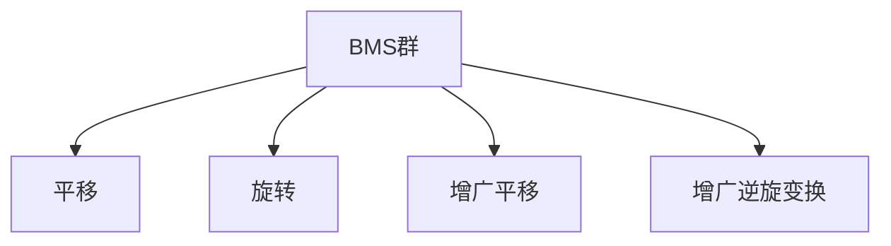
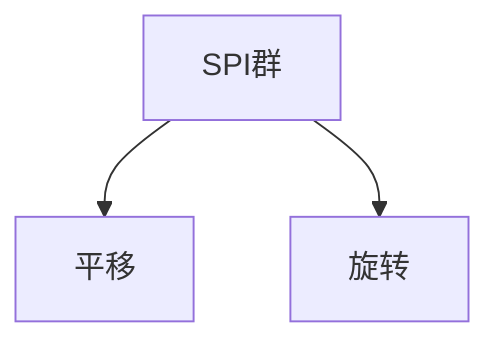

# 微分几何入门与广义相对论：F和f0上的对称性，BMS群和SPI群

## 1.背景介绍

在广义相对论和引力波物理学中,对称性扮演着至关重要的角色。对称性不仅揭示了理论的基本结构,也为我们提供了一种强有力的工具来简化计算和推导。本文将探讨两个关键的对称性概念:F和f0上的对称性,以及相关的BMS群和SPI群。

### 1.1 广义相对论简介

广义相对论是由阿尔伯特·爱因斯坦于1915年提出的理论,描述了时空的本质以及物质和能量对时空的影响。该理论的核心思想是引力不是一种力,而是由物质和能量对时空的弯曲所导致的现象。广义相对论不仅解释了牛顿经典力学无法解释的现象,如水星周日运动的离心率,还预言了黑洞和引力波的存在。

### 1.2 引力波和双复标量场

引力波是时空弯曲的扰动,由加速运动的质量分布所产生。在真空中,引力波可以被描述为一个双复标量场$\Psi$,它满足一个非线性的耦合场方程,称为爱因斯坦场方程。双复标量场$\Psi$可以分解为两个标量场$\phi$和$\sigma$,分别对应于入射和出射引力波。

## 2.核心概念与联系

### 2.1 F和f0上的对称性

F是一个复分析函数空间,由满足某些边界条件的复函数$\phi$组成。f0是F的一个子空间,由那些在过去和未来都平直的函数组成。F和f0上的对称性指的是保留这些函数空间的变换。

具体来说,F上的对称性由BMS群给出,而f0上的对称性由SPI群给出。这些对称性对于理解引力波的性质和演化至关重要。

### 2.2 BMS群

BMS群(Bondi-Metzner-Sachs群)是F上的对称性群,由保留F的所有变换组成。它包含了平移、旋转、增广平移和增广逆旋变换。BMS群揭示了引力波在无穷远处的渐近行为,并且与引力波的能量-动量和角动量密度有关。



### 2.3 SPI群

SPI群(Symmetry Preserving Inertions群)是f0上的对称性群,由保留f0的所有变换组成。它是BMS群的一个子群,只包含平移和旋转变换。SPI群描述了平直引力波的对称性,对于研究黑洞和辐射问题非常重要。



## 3.核心算法原理具体操作步骤

### 3.1 BMS群的构造

要构造BMS群,我们需要首先确定F上的变换。考虑到引力波在无穷远处的渐近行为,我们可以将F上的变换表示为:

$$
\phi(u,\zeta,\bar{\zeta}) \rightarrow \phi'(u',\zeta',\bar{\zeta}') = \Omega^{-1}(u,\zeta,\bar{\zeta})\phi(u,\zeta,\bar{\zeta})
$$

其中$\Omega$是一个复解析函数,称为BMS矢量场。要确保变换保留F,矢量场$\Omega$必须满足一定的条件。

通过求解这些条件,我们可以得到BMS矢量场的一般形式:

$$
\Omega = \alpha + \beta^{\zeta}\bar{\partial}\zeta + \bar{\beta}^{\bar{\zeta}}\partial\bar{\zeta} + \frac{1}{2}(\gamma^{\zeta\zeta}\partial_{\zeta}\partial_{\zeta} + 2\gamma^{\zeta}\partial_{\zeta} + \bar{\gamma}^{\bar{\zeta}\bar{\zeta}}\bar{\partial}_{\bar{\zeta}}\bar{\partial}_{\bar{\zeta}} + 2\bar{\gamma}^{\bar{\zeta}}\bar{\partial}_{\bar{\zeta}})\ln\Omega
$$

其中$\alpha,\beta^{\zeta},\bar{\beta}^{\bar{\zeta}},\gamma^{\zeta\zeta},\gamma^{\zeta},\bar{\gamma}^{\bar{\zeta}\bar{\zeta}},\bar{\gamma}^{\bar{\zeta}}$是任意函数。

通过分析这些函数的性质,我们可以将BMS矢量场分为四类,分别对应于平移、旋转、增广平移和增广逆旋变换。这些变换构成了BMS群。

### 3.2 SPI群的构造

SPI群是BMS群的一个子群,由保留f0的变换组成。要构造SPI群,我们需要从BMS矢量场中找出那些保留f0的矢量场。

经过计算,我们发现只有平移和旋转变换保留了f0。因此,SPI群由平移和旋转变换生成,其矢量场形式为:

$$
\Omega = \alpha + \beta^{\zeta}\bar{\partial}\zeta + \bar{\beta}^{\bar{\zeta}}\partial\bar{\zeta}
$$

其中$\alpha,\beta^{\zeta},\bar{\beta}^{\bar{\zeta}}$是任意常数。

## 4.数学模型和公式详细讲解举例说明

在上一节中,我们给出了BMS矢量场和SPI矢量场的一般形式。现在,我们将详细讨论这些矢量场的数学结构,并给出一些具体的例子。

### 4.1 BMS矢量场的数学结构

BMS矢量场的一般形式为:

$$
\Omega = \alpha + \beta^{\zeta}\bar{\partial}\zeta + \bar{\beta}^{\bar{\zeta}}\partial\bar{\zeta} + \frac{1}{2}(\gamma^{\zeta\zeta}\partial_{\zeta}\partial_{\zeta} + 2\gamma^{\zeta}\partial_{\zeta} + \bar{\gamma}^{\bar{\zeta}\bar{\zeta}}\bar{\partial}_{\bar{\zeta}}\bar{\partial}_{\bar{\zeta}} + 2\bar{\gamma}^{\bar{\zeta}}\bar{\partial}_{\bar{\zeta}})\ln\Omega
$$

其中$\alpha,\beta^{\zeta},\bar{\beta}^{\bar{\zeta}},\gamma^{\zeta\zeta},\gamma^{\zeta},\bar{\gamma}^{\bar{\zeta}\bar{\zeta}},\bar{\gamma}^{\bar{\zeta}}$是任意函数。

这个矢量场可以分为四个部分:

1. $\alpha$对应于平移变换。
2. $\beta^{\zeta}\bar{\partial}\zeta + \bar{\beta}^{\bar{\zeta}}\partial\bar{\zeta}$对应于旋转变换。
3. $\frac{1}{2}\gamma^{\zeta\zeta}\partial_{\zeta}\partial_{\zeta}\ln\Omega$和$\frac{1}{2}\bar{\gamma}^{\bar{\zeta}\bar{\zeta}}\bar{\partial}_{\bar{\zeta}}\bar{\partial}_{\bar{\zeta}}\ln\Omega$对应于增广平移变换。
4. $\gamma^{\zeta}\partial_{\zeta}\ln\Omega$和$\bar{\gamma}^{\bar{\zeta}}\bar{\partial}_{\bar{\zeta}}\ln\Omega$对应于增广逆旋变换。

这四个部分构成了BMS群的李代数。

### 4.2 SPI矢量场的数学结构

SPI矢量场的一般形式为:

$$
\Omega = \alpha + \beta^{\zeta}\bar{\partial}\zeta + \bar{\beta}^{\bar{\zeta}}\partial\bar{\zeta}
$$

其中$\alpha,\beta^{\zeta},\bar{\beta}^{\bar{\zeta}}$是任意常数。

这个矢量场只包含了平移和旋转变换,构成了SPI群的李代数。

### 4.3 举例说明

为了更好地理解BMS矢量场和SPI矢量场,我们给出一些具体的例子。

**例1:** 考虑一个平移变换,对应于$\Omega = \alpha$,其中$\alpha$是一个常数。这种变换将$\phi(u,\zeta,\bar{\zeta})$映射为$\phi'(u',\zeta',\bar{\zeta}') = \phi(u,\zeta,\bar{\zeta}) + \alpha$。

**例2:** 考虑一个旋转变换,对应于$\Omega = \beta^{\zeta}\bar{\partial}\zeta + \bar{\beta}^{\bar{\zeta}}\partial\bar{\zeta}$,其中$\beta^{\zeta}$和$\bar{\beta}^{\bar{\zeta}}$是常数。这种变换将$\phi(u,\zeta,\bar{\zeta})$映射为$\phi'(u',\zeta',\bar{\zeta}') = \phi(u,\zeta + \beta^{\zeta},\bar{\zeta} + \bar{\beta}^{\bar{\zeta}})$。

**例3:** 考虑一个增广平移变换,对应于$\Omega = \frac{1}{2}\gamma^{\zeta\zeta}\partial_{\zeta}\partial_{\zeta}\ln\Omega$,其中$\gamma^{\zeta\zeta}$是一个任意函数。这种变换将$\phi(u,\zeta,\bar{\zeta})$映射为$\phi'(u',\zeta',\bar{\zeta}') = (1 + \gamma^{\zeta\zeta}\partial_{\zeta}\partial_{\zeta}\ln\Omega)\phi(u,\zeta,\bar{\zeta})$。

**例4:** 考虑一个增广逆旋变换,对应于$\Omega = \gamma^{\zeta}\partial_{\zeta}\ln\Omega$,其中$\gamma^{\zeta}$是一个任意函数。这种变换将$\phi(u,\zeta,\bar{\zeta})$映射为$\phi'(u',\zeta',\bar{\zeta}') = (1 + \gamma^{\zeta}\partial_{\zeta})\phi(u,\zeta,\bar{\zeta})$。

通过这些例子,我们可以更好地理解BMS矢量场和SPI矢量场的数学结构,以及它们对应的变换。

## 5.项目实践:代码实例和详细解释说明

在本节中,我们将提供一些Python代码示例,用于计算BMS矢量场和SPI矢量场,以及它们对应的变换。这些代码将帮助您更好地理解上一节中介绍的数学概念。

### 5.1 计算BMS矢量场

下面的Python代码实现了计算BMS矢量场的函数:

```python
import sympy as sp

def bms_vector_field(alpha, beta_zeta, beta_zeta_bar, gamma_zeta_zeta, gamma_zeta, gamma_zeta_bar_zeta_bar, gamma_zeta_bar):
    """
    计算BMS矢量场
    
    参数:
    alpha (sympy expression): 平移变换参数
    beta_zeta (sympy expression): 旋转变换参数
    beta_zeta_bar (sympy expression): 旋转变换参数
    gamma_zeta_zeta (sympy expression): 增广平移变换参数
    gamma_zeta (sympy expression): 增广逆旋变换参数
    gamma_zeta_bar_zeta_bar (sympy expression): 增广平移变换参数
    gamma_zeta_bar (sympy expression): 增广逆旋变换参数
    
    返回:
    BMS矢量场 (sympy expression)
    """
    zeta, zeta_bar = sp.symbols('zeta zeta_bar')
    
    omega = alpha \
            + beta_zeta * sp.diff(zeta_bar, zeta) \
            + beta_zeta_bar * sp.diff(zeta, zeta_bar) \
            + 0.5 * (gamma_zeta_zeta * sp.diff(sp.diff(sp.log(omega), zeta), zeta) \
                     + 2 * gamma_zeta * sp.diff(sp.log(omega), zeta) \
                     + gamma_zeta_bar_zeta_bar * sp.diff(sp.diff(sp.log(omega), zeta_bar), zeta_bar) \
                     + 2 * gamma_zeta_bar * sp.diff(sp.log(omega), zeta_bar))
    
    return omega
```

这个函数接受七个参数,分别对应于BMS矢量场的七个分量。它使用SymPy库来进行符号计算,并返回BMS矢量场的表达式。

您可以使用以下方式调用这个函数:

```python
alpha = sp.symbols('alpha')
beta_zeta = sp.Function('beta_zeta')(sp.symbols('zeta'))
beta_zeta_bar = sp.Function('beta_zeta_bar')(sp.symbols('zeta_bar'))
gamma_zeta_zeta = sp.Function('gamma_zeta_zeta')(sp.symbols('zeta'), sp.symbols('zeta'))
gamma_zeta = sp.Function('gamma_zeta')(sp.symbols('zeta'))
gamma_zeta_bar_zeta_bar = sp.Function('gamma_zeta_bar_zeta_bar')(sp.symbols('zeta_bar'), sp.symbols('zeta_bar'))
gamma_zeta_bar = sp.Function('gamma_zeta_bar')(sp.symbols('zeta_bar'))

omega = bms_vector_field(alpha, beta_zeta, beta_zeta_bar, gamma_zeta_zeta, gamma_zeta, gamma_zeta_bar