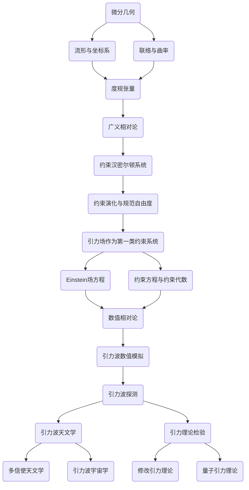

# 微分几何入门与广义相对论：作为第一类约束系统的引力场

## 1.背景介绍
### 1.1 微分几何的发展历程
#### 1.1.1 微分几何的起源
#### 1.1.2 微分几何的现代发展
#### 1.1.3 微分几何在物理学中的应用
### 1.2 广义相对论概述  
#### 1.2.1 狭义相对论的局限性
#### 1.2.2 广义相对论的诞生
#### 1.2.3 广义相对论的核心思想
### 1.3 引力场作为约束系统的意义
#### 1.3.1 约束系统的定义
#### 1.3.2 引力场作为约束系统的优势
#### 1.3.3 约束系统视角下研究引力场的意义

## 2.核心概念与联系
### 2.1 流形与坐标系
#### 2.1.1 流形的定义与性质
#### 2.1.2 坐标系与坐标变换
#### 2.1.3 切空间与切丛
### 2.2 联络与曲率
#### 2.2.1 平行移动与联络
#### 2.2.2 黎曼曲率张量
#### 2.2.3 曲率张量的性质
### 2.3 度规张量与广义相对论  
#### 2.3.1 度规张量的定义
#### 2.3.2 度规张量与时空几何
#### 2.3.3 广义相对论中的度规场方程
### 2.4 约束汉密尔顿系统
#### 2.4.1 约束系统的一般形式
#### 2.4.2 第一类约束与第二类约束
#### 2.4.3 约束汉密尔顿动力学

## 3.核心算法原理具体操作步骤
### 3.1 广义相对论场方程的推导
#### 3.1.1 Einstein-Hilbert作用量
#### 3.1.2 变分原理与场方程
#### 3.1.3 能动张量与场方程的物理意义  
### 3.2 约束汉密尔顿系统的构建
#### 3.2.1 引力场的Lagrangian表述
#### 3.2.2 共轭动量与主约束
#### 3.2.3 全部约束与约束代数
### 3.3 约束演化与规范自由度
#### 3.3.1 约束面上的汉密尔顿方程
#### 3.3.2 约束的一致性条件
#### 3.3.3 规范自由度与物理自由度

## 4.数学模型和公式详细讲解举例说明
### 4.1 黎曼流形与张量分析
#### 4.1.1 黎曼度量与christoffel符号
#### 4.1.2 协变导数与平行移动
#### 4.1.3 黎曼曲率张量及其性质
### 4.2 广义相对论的数学表述
#### 4.2.1 Einstein场方程与能动张量  
#### 4.2.2 Schwarzschild解与黑洞
#### 4.2.3 引力波的线性近似
### 4.3 约束汉密尔顿系统的数学处理
#### 4.3.1 约束面与相空间约化 
#### 4.3.2 Dirac括号与约束量子化
#### 4.3.3 规范不变性与物理态空间

## 5.项目实践：代码实例和详细解释说明
### 5.1 符号计算软件的使用
#### 5.1.1 张量分析包 xAct 介绍
#### 5.1.2 度规场方程的符号推导
#### 5.1.3 约束方程的符号化求解
### 5.2 数值相对论的算法实现 
#### 5.2.1 ADM 分解与初值问题  
#### 5.2.2 时空网格与有限差分方法
#### 5.2.3 边界条件与稳定性分析
### 5.3 引力波数值模拟
#### 5.3.1 线性化引力波方程的数值求解
#### 5.3.2 引力波波形提取与数据处理
#### 5.3.3 并行计算与代码优化

## 6.实际应用场景
### 6.1 黑洞与引力波天文学
#### 6.1.1 黑洞的观测证据
#### 6.1.2 引力波探测的原理与方法
#### 6.1.3 多信使天文学
### 6.2 宇宙学中的广义相对论效应
#### 6.2.1 宇宙学原理与Robertson-Walker度规
#### 6.2.2 Friedmann方程与宇宙动力学
#### 6.2.3 宇宙微波背景辐射
### 6.3 引力理论的检验与拓展
#### 6.3.1 广义相对论的经典检验
#### 6.3.2 修改引力理论与参数化后牛顿框架
#### 6.3.3 量子引力理论探索

## 7.工具和资源推荐 
### 7.1 教材与专著
#### 7.1.1 微分几何入门教材
#### 7.1.2 广义相对论专著
#### 7.1.3 约束动力学相关书籍
### 7.2 开源代码库与软件包
#### 7.2.1 张量分析符号计算包
#### 7.2.2 数值相对论开源代码库 
#### 7.2.3 数据分析与可视化工具
### 7.3 在线课程与视频资源
#### 7.3.1 微分几何与广义相对论课程
#### 7.3.2 数值相对论专题讲座
#### 7.3.3 引力波探测科普视频

## 8.总结：未来发展趋势与挑战
### 8.1 引力波天文学的未来
#### 8.1.1 第三代引力波探测器
#### 8.1.2 空间引力波探测计划
#### 8.1.3 引力波宇宙学
### 8.2 数值相对论的前沿进展
#### 8.2.1 高阶精度算法的发展
#### 8.2.2 自适应网格加密技术 
#### 8.2.3 人工智能与机器学习方法
### 8.3 量子引力研究展望
#### 8.3.1 圈量子引力
#### 8.3.2 弦论/M理论
#### 8.3.3 因果集动力学

## 9.附录：常见问题与解答
### 9.1 为什么要用微分几何来描述引力?
### 9.2 为什么引力场可以视为约束系统? 
### 9.3 数值相对论为什么需要并行计算?
### 9.4 引力波探测对广义相对论有何意义?
### 9.5 量子引力理论能否被实验检验?

作者：禅与计算机程序设计艺术 / Zen and the Art of Computer Programming

微分几何是广义相对论的数学基础,它提供了描述时空几何的工具。流形与坐标系、联络与曲率是微分几何的核心概念,它们构成了度规张量的基本要素。度规张量刻画了时空的几何性质,是广义相对论的核心数学对象。

广义相对论可以用约束汉密尔顿系统的语言来表述,引力场作为一个第一类约束系统,其动力学由Einstein场方程和约束方程所决定。约束汉密尔顿方程给出了约束面上的演化,约束代数反映了规范自由度与物理自由度之间的关系。

数值相对论致力于利用数值方法求解Einstein场方程,引力波数值模拟是其重要分支。通过引力波数值模拟,我们可以预言引力波信号的波形和频谱特征,为引力波探测提供理论支持。引力波的直接探测开启了引力波天文学时代,将与电磁、中微子等手段形成多信使天文学。引力波宇宙学有望利用引力波信号研究早期宇宙,回答宇宙起源的问题。

引力波探测为广义相对论提供了新的检验手段,同时也对修改引力理论提出了更高的要求。量子引力理论试图将引力与量子力学相结合,构建统一的物理理论。目前圈量子引力、弦论/M理论、因果集动力学等都是量子引力的候选理论,但尚未得到实验的直接检验。

微分几何与广义相对论的结合,约束汉密尔顿表述,数值相对论算法,引力波探测实验,共同推动着引力理论的发展。在可预见的未来,引力波天文学、前沿数值模拟技术、量子引力探索,将继续开拓引力研究的新疆域。理解引力作为时空几何的深刻内涵,探索时空与物质的本质联系,是物理学永恒的主题。