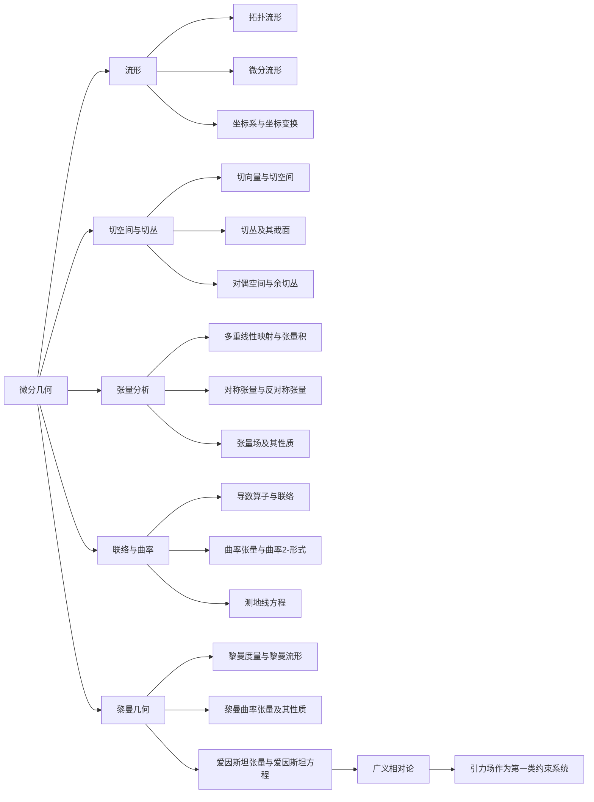

# 微分几何入门与广义相对论：作为第一类约束系统的引力场

## 1. 背景介绍
### 1.1 微分几何概述
### 1.2 广义相对论与微分几何的联系
### 1.3 引力场作为第一类约束系统的意义

## 2. 核心概念与联系
### 2.1 流形与坐标系
#### 2.1.1 拓扑流形
#### 2.1.2 微分流形
#### 2.1.3 坐标系与坐标变换
### 2.2 切空间与切丛
#### 2.2.1 切向量与切空间
#### 2.2.2 切丛及其截面
#### 2.2.3 对偶空间与余切丛
### 2.3 张量分析
#### 2.3.1 多重线性映射与张量积
#### 2.3.2 对称张量与反对称张量
#### 2.3.3 张量场及其性质
### 2.4 联络与曲率
#### 2.4.1 导数算子与联络
#### 2.4.2 曲率张量与曲率2-形式
#### 2.4.3 测地线方程
### 2.5 黎曼几何初步
#### 2.5.1 黎曼度量与黎曼流形
#### 2.5.2 黎曼曲率张量及其性质
#### 2.5.3 爱因斯坦张量与爱因斯坦方程

## 3. 核心算法原理具体操作步骤
### 3.1 流形上的微分形式及外微分
#### 3.1.1 微分形式的定义与性质
#### 3.1.2 外微分算子及其性质
#### 3.1.3 微分形式的积分与Stokes定理
### 3.2 流形上的Lie导数与Lie括号
#### 3.2.1 Lie导数的定义与性质
#### 3.2.2 向量场的Lie括号及其几何意义
#### 3.2.3 Lie导数与外微分的关系
### 3.3 纤维丛理论初步
#### 3.3.1 主丛与关联丛
#### 3.3.2 联络与曲率的纤维丛描述
#### 3.3.3 规范场论初步
### 3.4 约束哈密顿系统与Dirac括号
#### 3.4.1 约束哈密顿系统的一般理论
#### 3.4.2 第一类约束与第二类约束
#### 3.4.3 Dirac括号及其性质

## 4. 数学模型和公式详细讲解举例说明
### 4.1 黎曼流形上的测地线方程推导
### 4.2 爱因斯坦场方程的推导与解释
### 4.3 引力场作为第一类约束系统的数学模型
### 4.4 ADM分解与约束方程组

## 5. 项目实践：代码实例和详细解释说明
### 5.1 用Python实现黎曼流形上的平行移动
### 5.2 用Mathematica求解爱因斯坦场方程
### 5.3 用Matlab模拟约束哈密顿系统的演化

## 6. 实际应用场景
### 6.1 广义相对论在天体物理中的应用
#### 6.1.1 黑洞与视界
#### 6.1.2 引力波的产生与探测
#### 6.1.3 宇宙学模型
### 6.2 微分几何在其他物理学分支中的应用
#### 6.2.1 规范场论与粒子物理
#### 6.2.2 弦理论与额外维度
### 6.3 微分几何在计算机科学中的应用
#### 6.3.1 计算机视觉中的微分几何
#### 6.3.2 机器学习中的流形学习

## 7. 工具和资源推荐 
### 7.1 数学软件工具
#### 7.1.1 Mathematica
#### 7.1.2 Maple
#### 7.1.3 MATLAB
### 7.2 开源数值计算库
#### 7.2.1 NumPy与SciPy
#### 7.2.2 SymPy
#### 7.2.3 TensorFlow
### 7.3 经典教材与参考书目
#### 7.3.1 《微分几何入门》
#### 7.3.2 《广义相对论》
#### 7.3.3 《几何、拓扑与物理》

## 8. 总结：未来发展趋势与挑战
### 8.1 微分几何研究的前沿领域
### 8.2 广义相对论的未解之谜
### 8.3 第一类约束系统的进一步应用

## 9. 附录：常见问题与解答
### 9.1 为什么要学习微分几何？
### 9.2 广义相对论为什么需要用到微分几何？
### 9.3 约束哈密顿系统与经典力学有何区别？

微分几何是现代数学的一个重要分支,它在理论物理尤其是广义相对论中有着广泛而深刻的应用。本文将从微分几何的基本概念出发,系统介绍其核心内容,并重点探讨广义相对论框架下,引力场作为一个第一类约束哈密顿系统的数学描述。

微分几何的研究对象是流形,它是一个局部类似于欧氏空间的空间。在流形上可以定义切空间、张量场、外微分形式等几何量。黎曼几何进一步引入了度规张量,为流形赋予了丰富的几何和拓扑结构。广义相对论正是建立在四维时空流形的黎曼几何之上的。

在广义相对论中,引力场由时空度规张量描述,它满足爱因斯坦场方程。引力场的动力学演化可以用约束哈密顿系统的语言来刻画。在这个描述中,引力场的自由度受到微分同胚不变性等规范对称性的限制,从而形成若干个第一类约束。这些约束反映了广义相对论的几何本质。

为了深入理解引力场作为第一类约束系统的特点,我们需要系统掌握微分几何的基本工具,如外微分、Lie导数、纤维丛等。同时,约束哈密顿力学的一般理论,特别是Dirac括号的引入,为正则量子化广义相对论铺平了道路。

本文还将介绍微分几何和广义相对论在物理学和计算机科学等领域的应用,并总结它们面临的挑战和未来的发展方向。通过对微分几何的学习,我们不仅能够理解广义相对论的几何本质,也能开拓视野,触及数学和物理学的诸多前沿领域。

## 1. 背景介绍

微分几何是数学的一个分支,它主要研究光滑流形上的几何性质。流形是一个局部类似于欧氏空间的空间,许多物理模型都是建立在流形之上的。微分几何发展出了一套研究流形的工具和方法,如切空间、张量分析、外微分、黎曼曲率等,它们在现代物理学,特别是广义相对论中有着广泛的应用。

广义相对论是爱因斯坦在1915年提出的一个关于引力的理论。与牛顿引力不同,广义相对论把引力理解为时空几何的曲率效应。在广义相对论中,物质和能量使时空弯曲,而时空的曲率反过来又影响物质的运动。这种几何图景需要用黎曼几何来刻画。因此,微分几何成为理解和发展广义相对论的必备数学工具。

更有趣的是,广义相对论作为一个经典场论,其哈密顿结构具有一些独特的性质。由于广义协变性原理,引力场的动力学受到微分同胚不变性的限制,从而在相空间中产生若干个第一类约束。这些约束反映了时空的几何对称性,使引力场的自由度减少。因此,引力场可以视为一个第一类约束哈密顿系统。这一视角不仅加深了我们对广义相对论的理解,也为正则量子化引力场提供了新的思路。

总之,微分几何和广义相对论是数学和物理学中两个紧密相关的分支。作为第一类约束系统的引力场则展现了二者深刻的内在联系。本文将以几何的视角来探讨广义相对论的基础,并重点介绍约束哈密顿系统的相关理论。通过系统的学习,读者将能够把握微分几何的核心内容,并理解广义相对论的几何本质。

## 2. 核心概念与联系

### 2.1 流形与坐标系

流形是微分几何的研究对象。直观地说,流形是一个局部类似于欧氏空间的空间。更准确地,我们需要区分拓扑流形和微分流形的概念。

拓扑流形是一个拓扑空间,它的每一点都有一个同胚于欧氏空间的开邻域。这种局部欧氏性质使得我们可以在流形上引入坐标系。一个n维流形总可以用若干个n维欧氏空间的开子集来覆盖,每一个这样的开子集称为一个坐标卡。不同坐标卡之间通过坐标变换来衔接,坐标变换必须是光滑的,以保证流形的光滑结构。

微分流形则在拓扑流形的基础上引入了微分结构。更具体地,微分流形上的坐标变换函数都是无穷阶可微的。因此,我们可以在微分流形上定义光滑函数、切向量、微分形式等概念。本文后续讨论的流形默认都是微分流形。

### 2.2 切空间与切丛

切空间是微分几何的一个基本概念。对于流形上的一点p,其切空间$T_pM$是所有以p为基点的切向量的集合。直观地,切向量表示了曲线在p点的"速度",反映了流形在该点的局部特征。切空间是一个与流形维数相同的线性空间,为张量分析提供了基础。

将流形上每一点与其切空间相对应,就得到了切丛$TM$。切丛是一个2n维流形,它局部类似于流形与欧氏空间的直积。因此,切丛可以看作是一个纤维丛,其中流形M为底空间,欧氏空间$\mathbb{R}^n$为典型纤维。切丛的截面对应着流形上的向量场。

与切丛对偶的概念是余切丛$T^*M$。它的纤维是切空间的对偶空间,因此余切丛的截面对应着流形上的1-形式场。微分形式就定义在余切丛上。

### 2.3 张量分析

张量是一个多重线性映射,它将若干个向量和1-形式映射到实数。张量可以看作是向量和1-形式的推广。给定流形上的一个坐标系,张量可以用其分量来刻画。这些分量在坐标变换下满足一定的变换律。

张量可以做线性组合,也可以做张量积。两个张量的张量积仍然是一个张量。特别地,全反对称的张量称为外代数,而全对称的张量在黎曼几何中也有重要应用。

流形上光滑的张量场就组成了张量丛。协变导数算子将一个张量场映射到另一个阶数高一的张量场,反映了张量场的变化率。协变导数和李导数是研究张量场性质的重要工具。

### 2.4 联络与曲率

为了比较不同点处的切向量,我们需要引入联络的概念。联络本质上是一个线性映射,它将