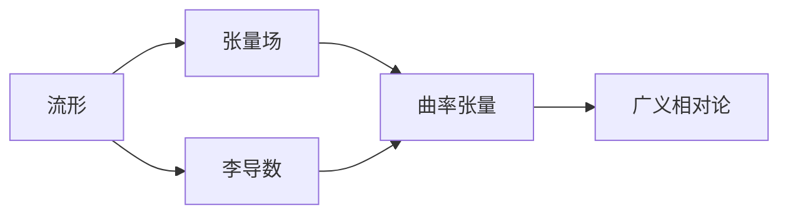

# 微分几何入门与广义相对论：弱孤立视界第一定律

## 1.背景介绍

微分几何是研究曲线、曲面及更高维流形的几何性质和微分性质的数学分支。它在广义相对论中扮演着至关重要的角色,因为广义相对论描述的是时空的几何结构及其与物质的相互作用。

广义相对论是由阿尔伯特·爱因斯坦于1915年提出的理论,旨在统一牛顿的经典力学和麦克斯韦的电磁理论。该理论的核心思想是,引力不是一种力,而是时空的曲率。物质的存在导致时空发生弯曲,而弯曲的时空又决定了物质的运动轨迹。

在广义相对论中,时空被描述为一个四维流形,其几何结构由一个度规张量(metric tensor)来刻画。度规张量决定了时空中的距离和角度,并且与物质的分布密切相关。爱因斯坦场方程给出了度规张量与物质分布之间的关系。

### 1.1 弱孤立视界第一定律的重要性

弱孤立视界第一定律是广义相对论中的一个重要定理,它描述了在某些特殊条件下,时空曲率的演化规律。该定律对于理解黑洞、宇宙学以及量子引力理论等领域具有重要意义。

弱孤立视界第一定律阐明了,在某些假设条件下,时空曲率的演化可以被简化为一个类似于热力学第二定律的形式。这种类比为我们研究黑洞的热力学性质、宇宙的演化以及量子引力理论提供了新的视角和工具。

### 1.2 微分几何在广义相对论中的应用

微分几何为广义相对论提供了必要的数学工具。例如,流形上的张量场、李导数、曲率张量等概念都是从微分几何中引入的。利用这些工具,我们可以精确地描述时空的几何结构,并研究其与物质的相互作用。

因此,掌握微分几何的基本概念和方法对于深入理解广义相对论是必不可少的。本文将介绍微分几何的基础知识,并着重探讨弱孤立视界第一定律及其在广义相对论中的应用。

## 2.核心概念与联系

### 2.1 流形(Manifold)

在研究微分几何之前,我们需要先了解流形的概念。流形是一种拓扑空间,在局部上类似于欧几里得空间,但在全局上可能具有更复杂的结构。

形式上,一个流形M是一个拓扑空间,对于每个点p∈M,都存在一个开邻域U,使得U同构于欧几里得空间R^n的一个开子集。这种同构映射被称为坐标映射,将U映射到R^n的一个开子集。

我们通常使用坐标系来描述流形上的点。例如,在二维欧几里得空间R^2中,我们可以使用笛卡尔坐标系(x,y)来标记每个点。类似地,在流形上,我们可以使用局部坐标系(x^1,x^2,...,x^n)来标记每个点。

流形的概念非常重要,因为它为我们研究更一般的几何对象提供了框架。例如,在广义相对论中,时空被描述为一个四维流形。

### 2.2 张量场(Tensor Field)

在流形上,我们可以定义张量场。张量场是一种几何对象,可以赋予每个点一个张量值。张量是一种具有特定变换性质的多线性映射,可以看作是向量和标量的推广。

设M是一个n维流形,在每个点p∈M上,我们可以定义一个(k,l)型张量T,它是一个多线性映射:

$$T: \underbrace{T_pM \times \cdots \times T_pM}_{k\text{ 个}} \times \underbrace{T_p^*M \times \cdots \times T_p^*M}_{l\text{ 个}} \rightarrow \mathbb{R}$$

其中,T_pM是p点处的切向量空间,T_p^*M是p点处的余切向量空间。

张量场在微分几何和广义相对论中扮演着核心角色。例如,度规张量就是一种(0,2)型张量场,它为每个点指定了一个内积,从而定义了时空中的距离和角度。另一个重要例子是黎曼曲率张量,它描述了时空的曲率。

### 2.3 李导数(Lie Derivative)

在研究流形上的张量场时,我们需要一种微分算子来描述张量场沿着向量场的变化率。这种微分算子就是李导数。

设M是一个流形,X是M上的一个向量场,T是M上的一个张量场。那么,T沿着X的李导数记作L_XT,它是另一个张量场,定义为:

$$L_XT(p) = \lim_{t\rightarrow 0}\frac{(\Phi_t^*T)(p) - T(p)}{t}$$

其中,Φ_t是X生成的一参数流形变换群,Φ_t^*T是T在Φ_t下的推回。

李导数具有许多重要的性质,例如满足莱布尼兹规则和可导性质。它在广义相对论中扮演着关键角色,用于描述张量场沿着时空中的曲线的变化。

### 2.4 曲率张量(Curvature Tensor)

曲率张量是描述流形内曲率的关键几何量。它反映了流形与欧几里得空间的区别,是衡量流形"弯曲"程度的一种度量。

在广义相对论中,黎曼曲率张量是最重要的曲率张量。它是一个(0,4)型张量场,定义为:

$$R(X,Y)Z = \nabla_X\nabla_YZ - \nabla_Y\nabla_XZ - \nabla_{[X,Y]}Z$$

其中,∇是在流形上定义的线性连接,[X,Y]是X和Y的李括号。

黎曼曲率张量包含了时空曲率的全部信息。例如,它的某些张量收缩可以得到黎曼曲率标量R,这个标量描述了时空的整体曲率。爱因斯坦场方程就是将黎曼曲率标量与物质的能量动量张量联系起来。

上图展示了这些核心概念之间的联系。流形为我们研究更一般的几何对象提供了基础框架。在流形上,我们可以定义张量场,并使用李导数来描述它们沿着向量场的变化。曲率张量则描述了流形的内在几何性质,是广义相对论的关键数学工具之一。

## 3.核心算法原理具体操作步骤

### 3.1 黎曼曲率张量的计算

要研究时空的曲率性质,我们需要计算黎曼曲率张量。虽然黎曼曲率张量的定义看起来复杂,但我们可以借助一些技巧来简化计算过程。

1) **选择合适的坐标系**

在给定的时空模型中,选择一个合适的坐标系可以大大简化计算。例如,对于球对称的黑洞时空,我们可以选择球坐标系;对于同调宇宙模型,我们可以选择共动坐标系。

2) **计算线性连接系数**

已知度规张量后,我们可以使用克里斯托费尔符号(Christoffel symbols)公式计算线性连接的系数:

$$\Gamma^i_{jk} = \frac{1}{2}g^{im}(g_{mj,k} + g_{mk,j} - g_{jk,m})$$

其中,g_{ij}是度规张量的分量,g^{ij}是其逆矩阵,逗号表示对应坐标的偏导数。

3) **计算黎曼张量的分量**

利用线性连接的系数,我们可以直接代入黎曼张量的定义公式计算其分量:

$$R^i_{jkl} = \Gamma^i_{jl,k} - \Gamma^i_{jk,l} + \Gamma^m_{jl}\Gamma^i_{mk} - \Gamma^m_{jk}\Gamma^i_{ml}$$

4) **张量收缩和简化**

通常,我们只需要关注黎曼张量的某些特定收缩,例如黎曼曲率标量R。这些收缩可以通过对张量分量进行合约(contraction)运算得到。

5) **利用对称性简化计算**

由于黎曼张量具有一些对称性质,我们可以利用这些性质减少需要计算的分量数量。例如,黎曼张量对前两个和后两个指标的交换是反对称的。

### 3.2 爱因斯坦场方程的求解

爱因斯坦场方程是广义相对论的核心方程,它将时空的曲率与物质的能量动量张量联系起来。求解这个方程是研究广义相对论的关键步骤。

1) **构造能量动量张量**

首先,我们需要根据具体的物质模型构造能量动量张量T_{ij}。对于理想流体,能量动量张量的形式为:

$$T_{ij} = (\rho + p)u_iu_j + pg_{ij}$$

其中,ρ是能量密度,p是压强,u^i是四速度。

2) **代入爱因斯坦场方程**

将计算得到的黎曼曲率张量和能量动量张量代入爱因斯坦场方程:

$$R_{ij} - \frac{1}{2}Rg_{ij} = \frac{8\pi G}{c^4}T_{ij}$$

这是一个耦合的非线性偏微分方程组,需要imposing适当的边界条件和坐标条件。

3) **求解方法**

对于一些简单的对称情况,我们可以直接求解爱因斯坦场方程的解析解。但是,对于更一般的情况,我们通常需要采用数值方法。常用的数值方法包括:

- 有限差分法
- 伪谱法
- 特征数值相对论

这些方法的基本思路是将爱因斯坦方程离散化,并使用迭代方法求解离散方程组。

4) **分析解的性质**

获得爱因斯坦场方程的解后,我们需要分析解的性质,例如是否存在奇点、是否具有horizon等。这些性质对于研究黑洞、宇宙学模型等具有重要意义。

### 3.3 微分几何在广义相对论中的其他应用

除了计算曲率张量和求解爱因斯坦场方程,微分几何在广义相对论中还有许多其他应用,例如:

1) **等离子体和电磁场的描述**

我们可以使用外微分和闭式来描述等离子体中的电磁场,并研究它们在曲空间中的演化。

2) **卡拉萨-克莱因理论**

卡拉萨-克莱因理论是一种统一场论,试图将电磁力和引力统一起来。它广泛地使用了微分几何的概念和方法。

3) **射影对称性和Killing向量场**

Killing向量场描述了时空中的对称性,对于简化爱因斯坦场方程和研究时空的性质具有重要意义。

4) **黑洞热力学**

利用微分几何的工具,我们可以研究黑洞的热力学性质,例如黑洞熵和霍金辐射等。

5) **卡尔赫斯-彭罗斯奇异性定理**

卡尔赫斯-彭罗斯奇异性定理阐明了在一定条件下,广义相对论中必然存在奇点。这个定理的证明需要使用到微分几何的概念和技巧。

总的来说,微分几何为广义相对论提供了坚实的数学基础,并在该理论的各个方面发挥着关键作用。掌握微分几何的知识对于深入理解和推进广义相对论研究是必不可少的。

## 4.数学模型和公式详细讲解举例说明

### 4.1 流形上的张量场

在第2节中,我们已经简要介绍了张量场的概念。现在,让我们更深入地探讨一下流形上张量场的数学结构。

设M是一个n维流形,在每个点p∈M上,我们可以定义一个(k,l)型张量T,它是一个多线性映射:

$$T: \