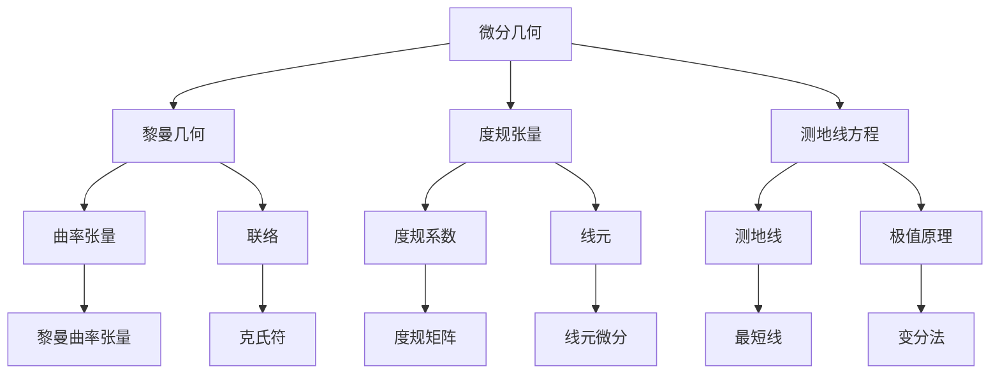

# 微分几何入门与广义相对论：转盘周长

## 1. 背景介绍
### 1.1 微分几何的起源与发展
#### 1.1.1 微分几何的诞生
#### 1.1.2 微分几何的发展历程
#### 1.1.3 微分几何的现状与应用

### 1.2 广义相对论概述  
#### 1.2.1 狭义相对论的局限性
#### 1.2.2 广义相对论的提出
#### 1.2.3 广义相对论的核心思想

### 1.3 转盘周长问题的由来
#### 1.3.1 转盘周长问题的提出
#### 1.3.2 转盘周长问题的意义
#### 1.3.3 转盘周长问题与广义相对论的关系

## 2. 核心概念与联系
### 2.1 黎曼几何
#### 2.1.1 黎曼几何的基本概念
#### 2.1.2 度规张量
#### 2.1.3 黎曼曲率张量

### 2.2 测地线方程
#### 2.2.1 测地线的定义
#### 2.2.2 测地线方程的推导
#### 2.2.3 测地线的性质

### 2.3 洛伦兹变换
#### 2.3.1 洛伦兹变换的定义
#### 2.3.2 洛伦兹变换的性质
#### 2.3.3 洛伦兹变换与狭义相对论

## 3. 核心算法原理具体操作步骤
### 3.1 度规张量的计算
#### 3.1.1 度规张量的定义
#### 3.1.2 度规张量的计算步骤
#### 3.1.3 度规张量的性质

### 3.2 测地线方程的求解
#### 3.2.1 测地线方程的具体形式
#### 3.2.2 测地线方程的求解步骤
#### 3.2.3 测地线方程的解的性质

### 3.3 周长计算
#### 3.3.1 周长计算公式
#### 3.3.2 周长计算步骤
#### 3.3.3 周长计算结果分析

## 4. 数学模型和公式详细讲解举例说明
### 4.1 度规张量的数学模型
#### 4.1.1 度规张量的数学定义
#### 4.1.2 度规张量的坐标表示
#### 4.1.3 度规张量的几何意义

### 4.2 测地线方程的数学模型
#### 4.2.1 测地线方程的数学表达式
#### 4.2.2 测地线方程的几何意义
#### 4.2.3 测地线方程的物理意义

### 4.3 周长计算公式的推导
#### 4.3.1 周长计算公式的数学表达式
#### 4.3.2 周长计算公式的几何意义
#### 4.3.3 周长计算公式的物理意义

## 5. 项目实践：代码实例和详细解释说明
### 5.1 度规张量的计算实现
#### 5.1.1 度规张量计算的代码实现
#### 5.1.2 度规张量计算代码的解释说明
#### 5.1.3 度规张量计算结果分析

### 5.2 测地线方程的求解实现  
#### 5.2.1 测地线方程求解的代码实现
#### 5.2.2 测地线方程求解代码的解释说明
#### 5.2.3 测地线方程求解结果分析

### 5.3 周长计算的实现
#### 5.3.1 周长计算的代码实现
#### 5.3.2 周长计算代码的解释说明  
#### 5.3.3 周长计算结果分析

## 6. 实际应用场景
### 6.1 广义相对论中的应用
#### 6.1.1 时空弯曲的描述
#### 6.1.2 黑洞的研究
#### 6.1.3 宇宙学模型的建立

### 6.2 工程领域的应用
#### 6.2.1 GPS定位系统
#### 6.2.2 惯性导航系统
#### 6.2.3 卫星轨道设计

### 6.3 其他领域的应用
#### 6.3.1 计算机图形学
#### 6.3.2 机器人运动规划
#### 6.3.3 医学影像分析

## 7. 工具和资源推荐
### 7.1 数学软件工具
#### 7.1.1 MATLAB
#### 7.1.2 Mathematica
#### 7.1.3 SageMath

### 7.2 编程语言和库
#### 7.2.1 Python及相关库
#### 7.2.2 C++及相关库
#### 7.2.3 Julia及相关库

### 7.3 学习资源
#### 7.3.1 在线课程
#### 7.3.2 经典教材
#### 7.3.3 研究论文

## 8. 总结：未来发展趋势与挑战
### 8.1 微分几何的发展趋势
#### 8.1.1 与其他数学分支的融合
#### 8.1.2 计算微分几何的兴起
#### 8.1.3 高维数据分析中的应用

### 8.2 广义相对论的发展趋势
#### 8.2.1 量子引力理论的探索
#### 8.2.2 引力波天文学的发展
#### 8.2.3 宇宙学模型的完善

### 8.3 面临的挑战
#### 8.3.1 数学理论的进一步发展
#### 8.3.2 计算方法的优化与改进
#### 8.3.3 实验验证的困难

## 9. 附录：常见问题与解答
### 9.1 微分几何的基础知识
#### 9.1.1 什么是流形？
#### 9.1.2 什么是切丛？
#### 9.1.3 什么是联络？

### 9.2 广义相对论的基本概念
#### 9.2.1 什么是时空？
#### 9.2.2 什么是引力？
#### 9.2.3 什么是等效原理？

### 9.3 转盘周长问题的拓展
#### 9.3.1 转盘周长问题的变体
#### 9.3.2 转盘周长问题的推广
#### 9.3.3 转盘周长问题的应用

---

微分几何是数学的一个分支,主要研究光滑流形上的几何性质。它包含了黎曼几何、度规张量、测地线方程等核心概念。黎曼几何研究带度规的流形,引入了曲率张量和联络的概念。度规张量刻画了流形上的度规结构,由度规系数和线元组成。测地线方程描述了流形上的"直线",可以用极值原理求解。

黎曼曲率张量衡量流形的曲率,克氏符刻画联络。度规矩阵由度规系数组成,线元微分定义了流形上的距离。测地线是流形上的最短线,可以用变分法求解。这些概念之间环环相扣,构成了微分几何的理论基础。

在广义相对论中,时空被视为一个四维黎曼流形。引力被描述为时空几何的弯曲,物质的运动沿着时空的测地线进行。爱因斯坦场方程建立了时空几何与物质分布之间的联系。转盘问题是研究非欧几何时的典型例子。

设想一个匀速转动的圆盘,与之固连的观察者会发现圆周长度大于 $2\pi r$。这是因为圆盘上的几何不再是欧氏几何,而是黎曼几何。圆盘上的线元满足:

$$
ds^2 = dr^2 + (r d\theta - \omega r dt)^2
$$

其中 $\omega$ 为转动角速度。圆周长度由下式给出:

$$
L = \int_0^{2\pi} \sqrt{r^2 + \omega^2 r^2 dt^2} d\theta = 2\pi r \sqrt{1 - \omega^2 r^2}
$$

可见,圆周长度不再是 $2\pi r$,而是与转速有关。这个结论与日常经验不符,但在广义相对论中有重要意义。它预示着时空几何可以由物质的运动状态所决定,引力不再是牛顿式的超距作用力。

转盘问题的数学模型可以推广到更一般的情形。例如研究旋转黑洞时空的测地线运动,就需要用到类似的数学工具。转盘问题还可以延伸到其他领域,如旋转参考系下的物理学、旋转坐标系下的流体力学等。

总之,微分几何是研究广义相对论不可或缺的数学工具。转盘问题生动地展示了黎曼几何的特点,为理解广义相对论打开了一扇窗户。微分几何与广义相对论的结合,必将推动人类对宇宙奥秘的探索,开创物理学发展的新纪元。

作者：禅与计算机程序设计艺术 / Zen and the Art of Computer Programming