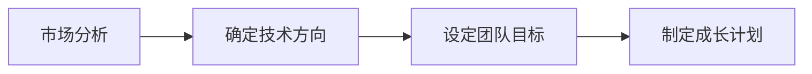
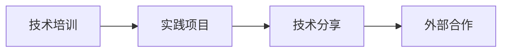
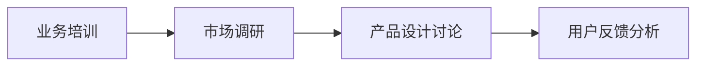

# 怎样建设和培养懂战略、懂技术、懂业务、懂产品的技术团队

## 1. 背景介绍
在当今快速变化的商业环境中，技术团队不再仅仅是编码和开发的执行者，他们需要具备更全面的能力，包括战略规划、技术洞察、业务理解和产品设计。一个多元化的技术团队能够更好地适应市场变化，推动创新，并为企业带来竞争优势。

## 2. 核心概念与联系
### 2.1 战略意识
战略意识是指团队对公司的长远目标和市场定位有清晰的认识，并能够将日常工作与这些目标相对接。

### 2.2 技术能力
技术能力是团队成员掌握核心技术知识和技能，能够高效解决技术难题。

### 2.3 业务理解
业务理解是指团队对公司的业务模式、市场需求和客户心理有深入的了解。

### 2.4 产品思维
产品思维是指团队在设计和开发过程中始终以用户价值为中心，关注产品的用户体验和市场表现。

## 3. 核心算法原理具体操作步骤
### 3.1 确定团队发展方向


### 3.2 技术能力提升


### 3.3 业务和产品知识培养


## 4. 数学模型和公式详细讲解举例说明
在团队能力评估中，我们可以使用数学模型来量化团队的综合能力。例如，我们可以定义一个团队能力向量 $ \vec{T} = (t_s, t_t, t_b, t_p) $，其中 $ t_s, t_t, t_b, t_p $ 分别代表战略、技术、业务和产品的能力指标。

$$ \vec{T} = \alpha \cdot \vec{S} + \beta \cdot \vec{Tech} + \gamma \cdot \vec{B} + \delta \cdot \vec{P} $$

其中，$ \alpha, \beta, \gamma, \delta $ 是权重系数，$ \vec{S}, \vec{Tech}, \vec{B}, \vec{P} $ 分别是对应领域的能力向量。

## 5. 项目实践：代码实例和详细解释说明
在项目实践中，我们可以通过具体的代码示例来提升团队的技术能力。例如，使用Python进行数据分析，可以帮助团队更好地理解业务数据。

```python
import pandas as pd

# 加载数据
data = pd.read_csv('business_data.csv')

# 数据分析
summary = data.describe()

# 输出结果
print(summary)
```

这个简单的代码示例可以帮助团队成员学习如何使用Python进行数据分析，从而更好地理解业务数据。

## 6. 实际应用场景
在实际应用场景中，技术团队需要将战略、技术、业务和产品的知识应用到具体的项目中。例如，在开发一个新的电商平台时，团队需要考虑市场定位、技术选型、用户体验和业务模式等多个方面。

## 7. 工具和资源推荐
为了帮助团队提升能力，以下是一些推荐的工具和资源：

- **战略规划**：SWOT分析工具、Porter五力模型
- **技术学习**：GitHub、Stack Overflow、Coursera
- **业务理解**：Harvard Business Review、业务模式画布
- **产品设计**：Sketch、InVision、用户旅程地图

## 8. 总结：未来发展趋势与挑战
随着技术的不断进步和市场的快速变化，技术团队需要不断地学习新的知识和技能，以适应未来的发展趋势。同时，团队也面临着如何保持创新、如何提高效率和如何增强团队凝聚力等挑战。

## 9. 附录：常见问题与解答
### Q1: 如何平衡团队成员的技术和非技术能力？
A1: 可以通过定期的培训和跨部门合作项目来提升团队成员的非技术能力，同时通过技术分享和实践项目来强化技术能力。

### Q2: 如何评估团队的综合能力？
A2: 可以通过设定具体的绩效指标和定期的团队评估来量化团队的综合能力。

### Q3: 如何激励团队不断学习和进步？
A3: 可以通过设立学习基金、组织内部竞赛和提供职业发展路径来激励团队成员不断学习和进步。

---

作者：禅与计算机程序设计艺术 / Zen and the Art of Computer Programming