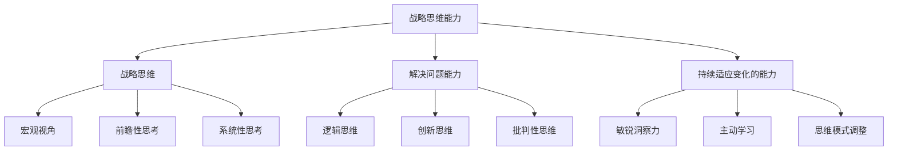
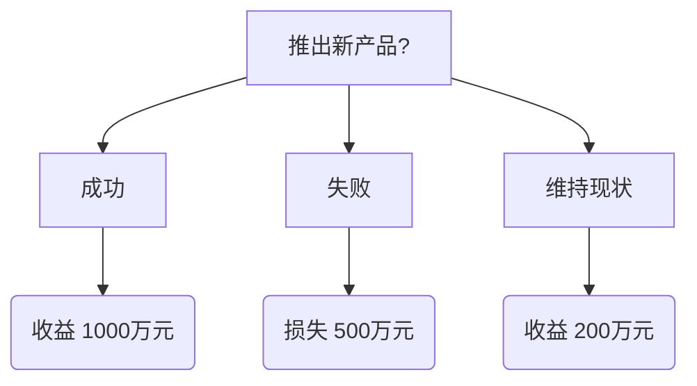

# 战略思维能力培养：具有战略思维、解决问题能力和持续适应变化的能力

## 1. 背景介绍

在当今瞬息万变的商业环境中，拥有战略思维能力对于个人和组织的成功至关重要。战略思维是一种认知过程,它涉及分析复杂情况、预测潜在结果、制定长期计划并做出明智决策。它不仅有助于解决当前的挑战,更重要的是培养持续适应变化的能力,为未来的发展做好准备。

战略思维能力的重要性不言而喻。它使个人和组织能够洞察市场趋势,把握机遇,规避风险,从而在激烈的竞争中占据优势地位。无论是在职场还是日常生活中,培养战略思维都有助于提高决策质量,实现更好的发展。

## 2. 核心概念与联系

战略思维能力包含三个核心概念:战略思维、解决问题能力和持续适应变化的能力。这三个概念相互关联,共同构建了一个完整的认知框架。

### 2.1 战略思维

战略思维是一种宏观的、前瞻性的思考方式,它关注长期目标和整体发展。它需要综合分析内外部环境,识别机遇和风险,制定符合组织使命和愿景的战略计划。战略思维强调系统性思考,关注各个要素之间的相互影响和整体效应。

### 2.2 解决问题能力

解决问题能力是指有效识别、分析和解决各种复杂问题的能力。它需要逻辑思维、创新思维和批判性思维的综合运用。解决问题能力不仅包括发现问题的根源,更重要的是提出可行的解决方案,并评估其潜在影响。

### 2.3 持续适应变化的能力

在瞬息万变的环境中,持续适应变化的能力至关重要。它需要对变化保持敏感,主动学习新知识和技能,调整思维模式和行为方式。持续适应变化的能力有助于个人和组织保持竞争力,抓住新机遇,应对新挑战。

这三个核心概念相互关联、相辅相成。战略思维为解决问题和适应变化提供了宏观指导,而解决问题能力和持续适应变化的能力则为战略思维的实施提供了支撑。只有将三者有机结合,才能真正培养出卓越的战略思维能力。



## 3. 核心算法原理具体操作步骤

培养战略思维能力是一个循序渐进的过程,需要遵循一定的原理和步骤。以下是核心算法原理和具体操作步骤:

1. **环境分析**
    - 全面收集内外部环境信息
    - 识别机遇和威胁
    - 评估自身优势和劣势

2. **目标制定**
    - 明确长期愿景和使命
    - 设定可衡量的战略目标
    - 确保目标与组织价值观相一致

3. **策略制定**
    - 生成多种可行策略方案
    - 评估每种策略的优缺点
    - 选择最佳策略方案

4. **行动计划**
    - 将策略分解为具体行动步骤
    - 分配资源和责任
    - 制定时间表和里程碑

5. **执行与监控**
    - 有效执行行动计划
    - 持续监控进度和结果
    - 根据反馈调整策略

6. **持续改进**
    - 总结经验教训
    - 识别改进机会
    - 优化流程,提高效率

这个算法强调了战略思维的循环性和动态性。它不是一次性的过程,而是需要持续优化和调整,以适应不断变化的环境。同时,它也强调了解决问题和持续适应变化的重要性,这两个能力贯穿于整个过程之中。

## 4. 数学模型和公式详细讲解举例说明

在战略思维过程中,数学模型和公式可以为决策提供有力支持。以下是一些常用的数学模型和公式:

### 4.1 决策树模型

决策树模型是一种图形化的决策支持工具,它可以帮助我们可视化不同决策路径及其潜在结果。决策树的构建过程如下:

1. 确定决策节点和结果节点
2. 为每个决策节点赋予概率
3. 计算每条路径的期望值
4. 选择期望值最大的路径作为最优决策

例如,假设一家公司正在考虑是否推出新产品。根据市场调研,如果推出新产品,有 60% 的概率获得成功,预期收益为 1000 万元;有 40% 的概率失败,预期损失为 500 万元。如果不推出新产品,公司将维持现状,预期收益为 200 万元。

我们可以构建如下决策树:



根据决策树,我们可以计算推出新产品的期望值为:

$$E(推出新产品) = 0.6 \times 1000 + 0.4 \times (-500) = 400万元$$

而维持现状的期望值为:

$$E(维持现状) = 200万元$$

由于推出新产品的期望值更高,因此这是更优的决策。

### 4.2 蒙特卡罗模拟

蒙特卡罗模拟是一种基于重复随机抽样的计算方法,它可以用于评估各种不确定性情况下的风险和回报。在战略决策中,蒙特卡罗模拟可以帮助我们量化不同策略的潜在结果分布,从而做出更加明智的选择。

假设一家公司正在考虑两种不同的营销策略 A 和 B。根据历史数据,策略 A 的年收益服从正态分布,均值为 800 万元,标准差为 200 万元;策略 B 的年收益服从对数正态分布,均值为 700 万元,标准差为 150 万元。

我们可以使用蒙特卡罗模拟来比较两种策略的收益分布:

```python
import numpy as np
import matplotlib.pyplot as plt

# 策略 A 参数
mu_A = 800
sigma_A = 200

# 策略 B 参数
mu_B = 700
sigma_B = 150

# 模拟次数
n_sims = 10000

# 策略 A 模拟
A_sims = np.random.normal(mu_A, sigma_A, n_sims)

# 策略 B 模拟
B_sims = np.random.lognormal(mu_B, sigma_B, n_sims)

# 绘制直方图
plt.figure(figsize=(10, 6))
plt.hist(A_sims, bins=50, alpha=0.5, label='策略 A')
plt.hist(B_sims, bins=50, alpha=0.5, label='策略 B')
plt.legend()
plt.xlabel('年收益（万元）')
plt.ylabel('频率')
plt.show()
```

通过模拟结果,我们可以比较两种策略的收益分布,评估它们的风险和回报,从而做出更加明智的决策。

这些数学模型和公式为战略思维提供了有力的支持,但它们并不能完全取代人类的判断和经验。在实际应用中,我们需要结合定性和定量分析,综合考虑各种因素,才能做出最佳决策。

## 5. 项目实践:代码实例和详细解释说明

为了更好地理解战略思维能力的培养,我们将通过一个实际项目来进行实践。假设我们是一家科技公司,正在考虑推出一款新的智能硬件产品。我们将使用前面介绍的算法和模型来指导决策过程。

### 5.1 环境分析

首先,我们需要全面分析内外部环境。以下是一个简化的 Python 代码示例,用于收集和处理相关数据:

```python
import pandas as pd

# 内部数据
sales_data = pd.read_csv('sales_data.csv')
financial_data = pd.read_csv('financial_data.csv')
employee_data = pd.read_csv('employee_data.csv')

# 外部数据
market_data = pd.read_csv('market_data.csv')
competitor_data = pd.read_csv('competitor_data.csv')
industry_data = pd.read_csv('industry_data.csv')

# 数据处理和分析
# ...

# 输出分析结果
print('内部优势:', internal_strengths)
print('内部劣势:', internal_weaknesses)
print('外部机遇:', external_opportunities)
print('外部威胁:', external_threats)
```

在这个示例中,我们从不同来源收集了内部和外部数据,包括销售数据、财务数据、员工数据、市场数据、竞争对手数据和行业数据。然后,我们可以对这些数据进行处理和分析,识别出公司的内部优势和劣势,以及外部机遇和威胁。

### 5.2 目标制定

根据环境分析的结果,我们可以制定战略目标。以下是一个示例代码,用于定义公司的愿景、使命和战略目标:

```python
# 公司愿景
vision = "成为领先的智能硬件解决方案提供商"

# 公司使命
mission = "通过创新技术,为客户提供卓越的智能硬件产品和服务"

# 战略目标
strategic_goals = [
    "在三年内占领智能硬件市场 20% 的市场份额",
    "实现年收入增长率 25%",
    "提高客户满意度至 95% 以上",
    "吸引并留住顶尖人才"
]

# 打印目标
print("公司愿景:", vision)
print("公司使命:", mission)
print("战略目标:")
for goal in strategic_goals:
    print("-", goal)
```

在这个示例中,我们定义了公司的愿景和使命,并设置了一系列可衡量的战略目标,包括市场份额、收入增长、客户满意度和人才吸引等方面。这些目标将为后续的策略制定和行动计划提供指导。

### 5.3 策略制定

接下来,我们需要制定具体的策略来实现战略目标。以下是一个示例代码,用于生成和评估不同的策略方案:

```python
import numpy as np

# 定义策略方案
strategies = [
    {
        'name': '策略 A',
        'description': '聚焦高端市场,提供高质量的智能硬件产品',
        'cost': 5000,
        'revenue': np.random.normal(10000, 2000)
    },
    {
        'name': '策略 B',
        'description': '瞄准大众市场,提供性价比高的智能硬件产品',
        'cost': 3000,
        'revenue': np.random.normal(8000, 1500)
    },
    {
        'name': '策略 C',
        'description': '开发智能硬件生态系统,提供一站式解决方案',
        'cost': 8000,
        'revenue': np.random.normal(15000, 3000)
    }
]

# 评估策略
for strategy in strategies:
    profit = strategy['revenue'] - strategy['cost']
    print(f"{strategy['name']}: {strategy['description']}")
    print(f"预期收益: {strategy['revenue']:.2f}")
    print(f"预期成本: {strategy['cost']:.2f}")
    print(f"预期利润: {profit:.2f}")
    print()

# 选择最佳策略
best_strategy = max(strategies, key=lambda x: x['revenue'] - x['cost'])
print(f"最佳策略: {best_strategy['name']}")
```

在这个示例中,我们定义了三种不同的策略方案,每种策略都有相应的描述、预期成本和预期收益。我们使用蒙特卡罗模拟来估计每种策略的预期收益,然后计算预期利润。最后,我们选择预期利润最高的策略作为最佳方案。

### 5.4 行动计划

选定最佳策略后,我们需要制定具体的行动计划来执行该策略。以下是一个示例代码,用于创建和管理