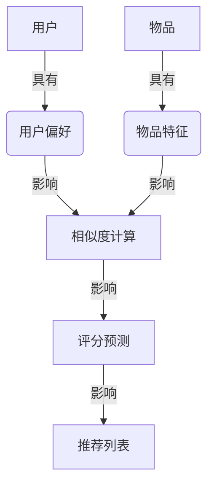

# 推荐系统 原理与代码实例讲解

## 1. 背景介绍

### 1.1 推荐系统的重要性

在当今信息过载的时代,推荐系统已经无处不在,成为了帮助用户发现有价值信息的重要工具。无论是电商网站推荐感兴趣的商品、视频网站推荐个性化的影视节目,还是社交媒体推荐你可能感兴趣的人和内容,推荐系统都在发挥着至关重要的作用。

推荐系统的核心目标是为用户提供最合适的信息或商品,提高用户体验和商业转化率。有效的推荐不仅能让用户更快捷地找到感兴趣的内容,还能帮助企业实现精准营销,增强用户粘性和忠诚度。

### 1.2 推荐系统的发展历程

推荐系统最初可追溯至20世纪90年代初期,当时主要采用基于内容的推荐算法。随着协同过滤算法的提出,推荐系统进入了一个新的发展阶段。2000年后,推荐系统开始融合更多的机器学习技术,如矩阵分解、贝叶斯方法等,显著提高了推荐质量。

近年来,深度学习的兴起为推荐系统带来了新的动力。利用深度神经网络可以更好地挖掘用户和物品的深层次特征,从而做出更加个性化和智能化的推荐。同时,注意力机制、对抗生成网络等前沿技术也逐渐被引入推荐系统中。

## 2. 核心概念与联系

推荐系统涉及多个核心概念,下面我们逐一介绍并阐明它们之间的联系。

### 2.1 用户(User)

用户是推荐系统的服务对象,推荐系统的目标就是为每个用户推荐最合适的物品。用户可以是个人,也可以是一个组织或群体。用户通常具有独特的偏好、行为模式和特征。

### 2.2 物品(Item)

物品指推荐系统中可被推荐的对象,如商品、电影、音乐、新闻等。每个物品都有自身的属性和特征,如类别、标签、评分等。物品的特征对于推荐算法至关重要。

### 2.3 用户偏好(User Preference)

用户偏好反映了用户对不同物品的喜好程度。推荐系统需要从用户的历史行为数据中挖掘出用户的隐式或显式偏好,并据此进行推荐。

### 2.4 相似度计算(Similarity Computation)

相似度计算是推荐系统的核心环节之一。通过计算用户与用户之间、物品与物品之间的相似度,可以发现具有相似偏好的用户群体或相似特征的物品集合,为推荐提供依据。

### 2.5 评分预测(Rating Prediction)

对于存在评分数据的推荐场景,评分预测是一个重要的任务。通过预测用户对某个物品的评分,可以推断出用户的偏好程度,从而进行个性化排序和推荐。

上图展示了这些核心概念之间的关系。用户和物品的特征决定了相似度计算的结果,而相似度计算又影响评分预测和最终的推荐列表生成。

## 3. 核心算法原理具体操作步骤

推荐系统中常用的核心算法有多种,本节将介绍其中三种经典算法的原理和具体操作步骤。

### 3.1 协同过滤算法(Collaborative Filtering)

协同过滤是推荐系统中最常用的一种技术,其核心思想是利用过去用户的行为记录,找到具有相似偏好的用户群体,并基于该群体的偏好为目标用户进行推荐。

协同过滤算法主要分为两种:基于用户的协同过滤和基于物品的协同过滤。

#### 3.1.1 基于用户的协同过滤

基于用户的协同过滤算法步骤如下:

1. 计算任意两个用户之间的相似度
2. 找到与目标用户最相似的 K 个用户,作为最近邻用户
3. 根据最近邻用户对物品的评分,预测目标用户对该物品的评分
4. 将预测评分较高的物品推荐给目标用户

用户相似度通常采用皮尔逊相关系数或余弦相似度等方法计算。

#### 3.1.2 基于物品的协同过滤  

基于物品的协同过滤算法步骤如下:

1. 计算任意两个物品之间的相似度
2. 对于目标用户未评分的物品,找到该物品的最近邻物品集合
3. 利用目标用户对最近邻物品的评分,预测该物品的评分
4. 将预测评分较高的物品推荐给目标用户

物品相似度通常采用调整余弦相似度等方法计算。

#### 3.1.3 优缺点分析

优点:
- 简单有效,可用于各种推荐场景
- 无需深入理解物品内容,只需用户行为数据

缺点:
- 存在冷启动问题,无法推荐全新物品
- 无法发现用户的潜在兴趣偏好
- 推荐列表过于相似,缺乏新颖性

### 3.2 基于内容的推荐算法(Content-based)

基于内容的推荐算法利用物品内容特征,分析目标用户的偏好,为其推荐与其历史兴趣相似的物品。算法步骤如下:

1. 提取物品的内容特征,如文本、图像等
2. 建立用户兴趣模型,表示用户对不同特征的偏好
3. 计算目标物品与用户兴趣模型的相似度
4. 将相似度较高的物品推荐给目标用户

用户兴趣模型可以采用多种方式构建,如关键词模型、主题模型等。

#### 3.2.1 优缺点分析  

优点:
- 可以发现用户的潜在兴趣偏好
- 推荐列表新颖性更好

缺点: 
- 需要提取物品内容特征,计算复杂
- 无法推荐全新物品
- 存在过度特化问题,推荐列表缺乏多样性

### 3.3 矩阵分解算法(Matrix Factorization)

矩阵分解算法将用户对物品的评分数据构建成用户-物品评分矩阵,然后将该矩阵分解为用户矩阵和物品矩阵的乘积,用于发现用户和物品的潜在特征向量。算法步骤如下:

1. 将评分数据构建成用户-物品评分矩阵 R
2. 将 R 矩阵分解为两个低维矩阵 P 和 Q 的乘积,即 R ≈ P * Q^T
3. P 和 Q 分别表示用户和物品的潜在特征矩阵
4. 利用 P 和 Q 计算用户对物品的预测评分
5. 将预测评分较高的物品推荐给目标用户

矩阵分解通常采用随机梯度下降等优化算法求解。

#### 3.3.1 优缺点分析

优点:
- 发现用户和物品的潜在特征向量
- 可以推荐全新物品
- 解决了冷启动问题

缺点:
- 需要评分数据作为训练集
- 计算复杂,需要大量迭代
- 无法处理隐式反馈数据

## 4. 数学模型和公式详细讲解举例说明

在推荐系统中,数学模型和公式扮演着至关重要的角色。本节将详细讲解几种常用的数学模型和公式。

### 4.1 相似度计算

相似度计算是推荐系统中一个核心环节,用于发现相似用户或相似物品。常用的相似度计算方法有:

#### 4.1.1 皮尔逊相关系数

皮尔逊相关系数用于计算两个向量之间的相似度,公式如下:

$$r_{xy} = \frac{\sum_{i=1}^{n}(x_i - \overline{x})(y_i - \overline{y})}{\sqrt{\sum_{i=1}^{n}(x_i - \overline{x})^2}\sqrt{\sum_{i=1}^{n}(y_i - \overline{y})^2}}$$

其中 $x$ 和 $y$ 分别表示两个向量, $\overline{x}$ 和 $\overline{y}$ 分别表示它们的均值。

皮尔逊相关系数的取值范围为 [-1, 1],值越接近 1 表示两个向量越相似。

#### 4.1.2 余弦相似度

余弦相似度通过计算两个向量的夹角余弦值来衡量它们的相似度,公式如下:

$$\text{sim}(x, y) = \cos(\theta) = \frac{x \cdot y}{\|x\| \|y\|} = \frac{\sum_{i=1}^{n}x_iy_i}{\sqrt{\sum_{i=1}^{n}x_i^2}\sqrt{\sum_{i=1}^{n}y_i^2}}$$

其中 $x$ 和 $y$ 分别表示两个向量, $\theta$ 为它们的夹角。

余弦相似度的取值范围为 [0, 1],值越接近 1 表示两个向量越相似。

#### 4.1.3 调整余弦相似度

调整余弦相似度是基于物品的协同过滤算法中常用的相似度计算方法,公式如下:

$$\text{sim}(i, j) = \frac{\sum_{u \in U(i,j)}(r_{ui} - \overline{r_u})(r_{uj} - \overline{r_u})}{\sqrt{\sum_{u \in U(i,j)}(r_{ui} - \overline{r_u})^2}\sqrt{\sum_{u \in U(i,j)}(r_{uj} - \overline{r_u})^2}}$$

其中 $i$ 和 $j$ 表示两个物品, $U(i,j)$ 表示对物品 $i$ 和 $j$ 均有评分的用户集合, $r_{ui}$ 表示用户 $u$ 对物品 $i$ 的评分, $\overline{r_u}$ 表示用户 $u$ 的平均评分。

调整余弦相似度通过减去用户平均评分,消除了用户评分存在的偏置,能更好地衡量物品之间的相似程度。

### 4.2 评分预测模型

对于存在评分数据的推荐场景,评分预测是一个关键任务。常用的评分预测模型有:

#### 4.2.1 基于邻居的评分预测

基于邻居的评分预测是协同过滤算法中常用的一种方法,公式如下:

$$\hat{r}_{ui} = \overline{r_u} + \frac{\sum_{v \in N(u,i)}sim(u, v)(r_{vi} - \overline{r_v})}{\sum_{v \in N(u,i)}sim(u, v)}$$

其中 $\hat{r}_{ui}$ 表示对用户 $u$ 对物品 $i$ 的预测评分, $\overline{r_u}$ 和 $\overline{r_v}$ 分别表示用户 $u$ 和用户 $v$ 的平均评分, $N(u,i)$ 表示与用户 $u$ 最相似的 K 个邻居用户集合, $sim(u, v)$ 表示用户 $u$ 和 $v$ 的相似度。

该模型的核心思想是利用与目标用户相似的邻居用户对该物品的评分,并根据相似度进行加权平均,得到预测评分。

#### 4.2.2 基于矩阵分解的评分预测

基于矩阵分解的评分预测模型利用用户和物品的潜在特征向量,计算它们的内积作为预测评分,公式如下:

$$\hat{r}_{ui} = \mu + b_u + b_i + q_i^Tp_u$$

其中 $\hat{r}_{ui}$ 表示对用户 $u$ 对物品 $i$ 的预测评分, $\mu$ 表示全局偏置项, $b_u$ 和 $b_i$ 分别表示用户 $u$ 和物品 $i$ 的偏置项, $q_i$ 和 $p_u$ 分别