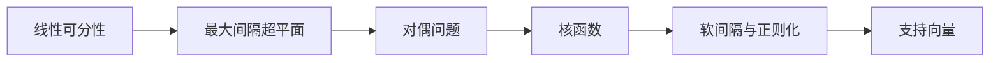

# 支持向量机 (Support Vector Machine)

## 1. 背景介绍

### 1.1 机器学习的发展历程

#### 1.1.1 早期的机器学习算法
#### 1.1.2 统计学习方法的兴起
#### 1.1.3 深度学习的崛起

### 1.2 支持向量机的诞生

#### 1.2.1 Vapnik 和 Chervonenkis 的早期工作
#### 1.2.2 支持向量机的提出和发展
#### 1.2.3 支持向量机在机器学习领域的地位

### 1.3 支持向量机的应用领域

#### 1.3.1 图像分类
#### 1.3.2 文本分类
#### 1.3.3 生物信息学

## 2. 核心概念与联系

### 2.1 线性可分性

#### 2.1.1 线性可分的定义
#### 2.1.2 线性可分问题的判定
#### 2.1.3 线性不可分问题的处理

### 2.2 最大间隔超平面

#### 2.2.1 超平面的概念
#### 2.2.2 函数间隔和几何间隔
#### 2.2.3 最大间隔超平面的求解

### 2.3 对偶问题

#### 2.3.1 原始问题与对偶问题的关系
#### 2.3.2 拉格朗日乘子法
#### 2.3.3 KKT 条件

### 2.4 核函数

#### 2.4.1 核函数的定义
#### 2.4.2 常用的核函数
#### 2.4.3 核函数的选择

### 2.5 软间隔与正则化

#### 2.5.1 硬间隔与软间隔
#### 2.5.2 松弛变量的引入
#### 2.5.3 正则化项的作用

### 2.6 支持向量

#### 2.6.1 支持向量的定义
#### 2.6.2 支持向量的作用
#### 2.6.3 支持向量的求解

### 2.7 概念联系图



## 3. 核心算法原理具体操作步骤

### 3.1 线性支持向量机

#### 3.1.1 原始问题的求解
#### 3.1.2 对偶问题的求解
#### 3.1.3 序列最小优化算法 (SMO)

### 3.2 非线性支持向量机

#### 3.2.1 核函数的引入
#### 3.2.2 核函数的选择
#### 3.2.3 非线性支持向量机的求解

### 3.3 多分类支持向量机

#### 3.3.1 一对一 (One-vs-One) 方法
#### 3.3.2 一对多 (One-vs-Rest) 方法
#### 3.3.3 有向无环图 (DAG) 方法

## 4. 数学模型和公式详细讲解举例说明

### 4.1 线性支持向量机的数学模型

#### 4.1.1 原始问题的数学表示
$$
\begin{aligned}
\min_{w,b} & \frac{1}{2}\|w\|^2 \\
s.t. & y_i(w^Tx_i+b) \geq 1, i=1,2,...,m
\end{aligned}
$$
#### 4.1.2 对偶问题的数学表示
$$
\begin{aligned}
\max_{\alpha} & \sum_{i=1}^m \alpha_i - \frac{1}{2}\sum_{i=1}^m\sum_{j=1}^m \alpha_i\alpha_jy_iy_jx_i^Tx_j \\
s.t. & \sum_{i=1}^m \alpha_iy_i = 0 \\
& \alpha_i \geq 0, i=1,2,...,m
\end{aligned}
$$
#### 4.1.3 KKT 条件的数学表示
$$
\begin{aligned}
\alpha_i(y_i(w^Tx_i+b)-1) &= 0 \\
y_i(w^Tx_i+b)-1 &\geq 0 \\
\alpha_i &\geq 0
\end{aligned}
$$

### 4.2 非线性支持向量机的数学模型

#### 4.2.1 核函数的数学表示
$$
K(x_i,x_j) = \phi(x_i)^T\phi(x_j)
$$
#### 4.2.2 常用核函数的数学表示
- 多项式核函数：$K(x_i,x_j) = (x_i^Tx_j + c)^d$
- 高斯核函数：$K(x_i,x_j) = \exp(-\frac{\|x_i-x_j\|^2}{2\sigma^2})$
- Sigmoid 核函数：$K(x_i,x_j) = \tanh(\beta x_i^Tx_j + \theta)$

### 4.3 软间隔支持向量机的数学模型

#### 4.3.1 原始问题的数学表示
$$
\begin{aligned}
\min_{w,b,\xi} & \frac{1}{2}\|w\|^2 + C\sum_{i=1}^m \xi_i \\
s.t. & y_i(w^Tx_i+b) \geq 1 - \xi_i, i=1,2,...,m \\
& \xi_i \geq 0, i=1,2,...,m
\end{aligned}
$$
#### 4.3.2 对偶问题的数学表示
$$
\begin{aligned}
\max_{\alpha} & \sum_{i=1}^m \alpha_i - \frac{1}{2}\sum_{i=1}^m\sum_{j=1}^m \alpha_i\alpha_jy_iy_jK(x_i,x_j) \\
s.t. & \sum_{i=1}^m \alpha_iy_i = 0 \\
& 0 \leq \alpha_i \leq C, i=1,2,...,m
\end{aligned}
$$

## 5. 项目实践：代码实例和详细解释说明

### 5.1 使用 scikit-learn 实现线性支持向量机

```python
from sklearn import svm
from sklearn.datasets import make_classification

# 生成线性可分的数据集
X, y = make_classification(n_samples=100, n_features=2, n_redundant=0, n_informative=2, 
                           random_state=1, n_clusters_per_class=1)

# 创建线性支持向量机模型
clf = svm.SVC(kernel='linear')

# 训练模型
clf.fit(X, y)

# 预测新样本
print(clf.predict([[2, 2]]))
```

### 5.2 使用 scikit-learn 实现非线性支持向量机

```python
from sklearn import svm
from sklearn.datasets import make_circles

# 生成非线性可分的数据集
X, y = make_circles(n_samples=100, noise=0.1, factor=0.5, random_state=1)

# 创建非线性支持向量机模型
clf = svm.SVC(kernel='rbf', gamma=0.7, C=1.0)

# 训练模型
clf.fit(X, y)

# 预测新样本
print(clf.predict([[0.5, 0.5]]))
```

### 5.3 使用 scikit-learn 实现多分类支持向量机

```python
from sklearn import svm
from sklearn.datasets import make_classification

# 生成多分类数据集
X, y = make_classification(n_samples=100, n_features=2, n_redundant=0, n_informative=2,
                           n_classes=3, random_state=1)

# 创建多分类支持向量机模型
clf = svm.SVC(kernel='linear', decision_function_shape='ovo')

# 训练模型
clf.fit(X, y)

# 预测新样本
print(clf.predict([[2, 2]]))
```

## 6. 实际应用场景

### 6.1 人脸识别

#### 6.1.1 数据预处理
#### 6.1.2 特征提取
#### 6.1.3 支持向量机分类

### 6.2 文本分类

#### 6.2.1 文本预处理
#### 6.2.2 特征表示
#### 6.2.3 支持向量机分类

### 6.3 生物信息学

#### 6.3.1 蛋白质结构预测
#### 6.3.2 基因表达数据分析
#### 6.3.3 药物设计与虚拟筛选

## 7. 工具和资源推荐

### 7.1 机器学习库

#### 7.1.1 scikit-learn
#### 7.1.2 LIBSVM
#### 7.1.3 Weka

### 7.2 数据集

#### 7.2.1 UCI 机器学习仓库
#### 7.2.2 Kaggle 数据集
#### 7.2.3 OpenML 数据集

### 7.3 在线学习资源

#### 7.3.1 Coursera 机器学习课程
#### 7.3.2 吴恩达的深度学习专项课程
#### 7.3.3 Google 机器学习速成课程

## 8. 总结：未来发展趋势与挑战

### 8.1 支持向量机的优势

#### 8.1.1 数学基础扎实
#### 8.1.2 泛化能力强
#### 8.1.3 适用于高维数据

### 8.2 支持向量机的局限性

#### 8.2.1 训练时间长
#### 8.2.2 参数选择困难
#### 8.2.3 对噪声敏感

### 8.3 未来发展趋势

#### 8.3.1 核方法的改进
#### 8.3.2 大规模训练算法的优化
#### 8.3.3 与深度学习的结合

### 8.4 面临的挑战

#### 8.4.1 非凸优化问题
#### 8.4.2 核函数的自动选择
#### 8.4.3 理论基础的进一步完善

## 9. 附录：常见问题与解答

### 9.1 支持向量机与神经网络的区别

#### 9.1.1 模型结构
#### 9.1.2 训练方式
#### 9.1.3 适用场景

### 9.2 支持向量机的参数调优

#### 9.2.1 惩罚参数 C
#### 9.2.2 核函数参数
#### 9.2.3 交叉验证

### 9.3 支持向量机的优缺点

#### 9.3.1 优点
#### 9.3.2 缺点
#### 9.3.3 适用场景

作者：禅与计算机程序设计艺术 / Zen and the Art of Computer Programming