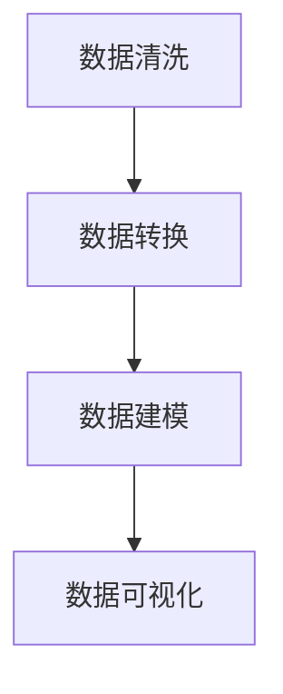

# 数据可视化与数据探索原理与代码实战案例讲解

## 1.背景介绍

在大数据时代，数据可视化和数据探索成为了数据分析和决策的重要工具。数据可视化通过图形化的方式展示数据，使得复杂的数据变得直观易懂；而数据探索则是通过交互式的方式深入挖掘数据中的潜在信息。无论是在商业、科研还是日常生活中，数据可视化和数据探索都扮演着不可或缺的角色。

## 2.核心概念与联系

### 2.1 数据可视化

数据可视化是指将数据转换为图形或图表的过程，以便更容易理解和分析。常见的数据可视化形式包括柱状图、折线图、饼图、散点图等。

### 2.2 数据探索

数据探索是指通过交互式的方式对数据进行深入分析，以发现数据中的模式、趋势和异常。数据探索通常包括数据清洗、数据转换、数据建模和数据分析等步骤。

### 2.3 数据可视化与数据探索的联系

数据可视化和数据探索是相辅相成的。数据可视化可以帮助我们快速识别数据中的模式和趋势，而数据探索则可以通过交互式的方式深入挖掘数据中的潜在信息。两者结合使用，可以大大提高数据分析的效率和准确性。

## 3.核心算法原理具体操作步骤

### 3.1 数据清洗

数据清洗是数据探索的第一步，目的是去除数据中的噪声和错误。常见的数据清洗操作包括缺失值处理、重复值处理和异常值处理。

### 3.2 数据转换

数据转换是指将数据从一种形式转换为另一种形式，以便更好地进行分析。常见的数据转换操作包括数据标准化、数据归一化和数据编码。

### 3.3 数据建模

数据建模是指通过数学模型对数据进行描述和分析。常见的数据建模方法包括回归分析、分类分析和聚类分析。

### 3.4 数据可视化

数据可视化是数据探索的最后一步，目的是通过图形化的方式展示数据分析的结果。常见的数据可视化工具包括Matplotlib、Seaborn和Plotly等。

以下是数据探索的具体操作步骤的Mermaid流程图：



## 4.数学模型和公式详细讲解举例说明

### 4.1 回归分析

回归分析是一种常见的数据建模方法，用于描述变量之间的关系。线性回归模型的数学公式如下：

$$
y = \beta_0 + \beta_1 x + \epsilon
$$

其中，$y$ 是因变量，$x$ 是自变量，$\beta_0$ 和 $\beta_1$ 是回归系数，$\epsilon$ 是误差项。

### 4.2 分类分析

分类分析是一种常见的数据建模方法，用于将数据分为不同的类别。逻辑回归模型的数学公式如下：

$$
P(y=1|x) = \frac{1}{1 + e^{-(\beta_0 + \beta_1 x)}}
$$

其中，$P(y=1|x)$ 是事件发生的概率，$x$ 是自变量，$\beta_0$ 和 $\beta_1$ 是回归系数。

### 4.3 聚类分析

聚类分析是一种常见的数据建模方法，用于将数据分为不同的组。K-means聚类算法的数学公式如下：

$$
J = \sum_{i=1}^{k} \sum_{j=1}^{n} ||x_j^{(i)} - \mu_i||^2
$$

其中，$J$ 是目标函数，$k$ 是聚类的数量，$n$ 是数据点的数量，$x_j^{(i)}$ 是第 $i$ 个聚类中的第 $j$ 个数据点，$\mu_i$ 是第 $i$ 个聚类的中心。

## 5.项目实践：代码实例和详细解释说明

### 5.1 数据清洗

以下是使用Python进行数据清洗的代码示例：

```python
import pandas as pd

# 读取数据
data = pd.read_csv('data.csv')

# 处理缺失值
data = data.dropna()

# 处理重复值
data = data.drop_duplicates()

# 处理异常值
data = data[(data['value'] >= data['value'].quantile(0.01)) & (data['value'] <= data['value'].quantile(0.99))]
```

### 5.2 数据转换

以下是使用Python进行数据转换的代码示例：

```python
from sklearn.preprocessing import StandardScaler

# 数据标准化
scaler = StandardScaler()
data['value'] = scaler.fit_transform(data[['value']])
```

### 5.3 数据建模

以下是使用Python进行数据建模的代码示例：

```python
from sklearn.linear_model import LinearRegression

# 线性回归模型
model = LinearRegression()
model.fit(data[['x']], data['y'])

# 预测
predictions = model.predict(data[['x']])
```

### 5.4 数据可视化

以下是使用Python进行数据可视化的代码示例：

```python
import matplotlib.pyplot as plt

# 绘制散点图
plt.scatter(data['x'], data['y'], label='Data')

# 绘制回归线
plt.plot(data['x'], predictions, color='red', label='Regression Line')

plt.xlabel('X')
plt.ylabel('Y')
plt.legend()
plt.show()
```

## 6.实际应用场景

### 6.1 商业分析

在商业分析中，数据可视化和数据探索可以帮助企业识别市场趋势、客户行为和销售模式，从而制定更有效的商业策略。

### 6.2 科学研究

在科学研究中，数据可视化和数据探索可以帮助研究人员发现数据中的规律和异常，从而提出新的假设和理论。

### 6.3 医疗健康

在医疗健康中，数据可视化和数据探索可以帮助医生和研究人员分析患者数据，从而制定更有效的治疗方案和预防措施。

## 7.工具和资源推荐

### 7.1 数据可视化工具

- Matplotlib：一个强大的Python绘图库，适用于创建静态、动态和交互式图表。
- Seaborn：基于Matplotlib的高级绘图库，提供了更简洁的API和更美观的默认样式。
- Plotly：一个用于创建交互式图表的Python库，支持多种图表类型和丰富的交互功能。

### 7.2 数据探索工具

- Pandas：一个强大的Python数据分析库，提供了高效的数据操作和分析功能。
- NumPy：一个用于科学计算的Python库，提供了高效的数组操作和数学函数。
- Scikit-learn：一个用于机器学习的Python库，提供了丰富的机器学习算法和工具。

## 8.总结：未来发展趋势与挑战

数据可视化和数据探索在未来将继续发挥重要作用。随着数据量的不断增加和数据分析技术的不断进步，数据可视化和数据探索将变得更加智能和高效。然而，数据隐私和数据安全问题也将成为重要的挑战。如何在保护数据隐私的同时，充分利用数据的价值，将是未来数据可视化和数据探索领域的重要课题。

## 9.附录：常见问题与解答

### 9.1 数据可视化和数据探索的区别是什么？

数据可视化是指将数据转换为图形或图表的过程，以便更容易理解和分析；而数据探索是指通过交互式的方式对数据进行深入分析，以发现数据中的模式、趋势和异常。

### 9.2 如何选择合适的数据可视化工具？

选择数据可视化工具时，可以根据数据的类型、分析的需求和个人的偏好来选择。Matplotlib适用于创建静态图表，Seaborn适用于创建美观的统计图表，Plotly适用于创建交互式图表。

### 9.3 数据探索的主要步骤有哪些？

数据探索的主要步骤包括数据清洗、数据转换、数据建模和数据可视化。数据清洗是去除数据中的噪声和错误，数据转换是将数据从一种形式转换为另一种形式，数据建模是通过数学模型对数据进行描述和分析，数据可视化是通过图形化的方式展示数据分析的结果。

---

作者：禅与计算机程序设计艺术 / Zen and the Art of Computer Programming