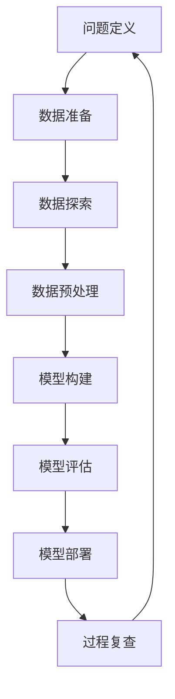

# 数据挖掘 原理与代码实例讲解

## 1.背景介绍

### 1.1 数据爆炸时代

在当今时代,数据的产生和积累正以前所未有的速度呈爆炸式增长。随着互联网、物联网、云计算等新兴技术的迅猛发展,海量的结构化和非结构化数据不断涌现。这些数据蕴藏着巨大的商业价值和洞见,但同时也给数据处理和分析带来了巨大挑战。

### 1.2 数据挖掘的重要性

数据挖掘作为一门新兴的跨学科技术,应运而生。它集成了数据库理论、人工智能、机器学习、统计学、模式识别等多个领域的理论与技术,旨在从大规模数据中发现隐藏的、潜在有用的知识和规律。数据挖掘为企业和组织提供了洞察数据、发现新机遇、优化业务流程的强大工具。

### 1.3 数据挖掘的应用场景

数据挖掘技术已广泛应用于各个领域,包括但不限于:

- 金融行业:贷款风险评估、欺诈检测、客户细分等
- 零售业:购物篮分析、促销策略制定等 
- 电信业:用户流失预测、网络优化等
- 生物医学:基因表达分析、疾病诊断等
- 网络安全:入侵检测、垃圾邮件过滤等

## 2.核心概念与联系

### 2.1 数据挖掘的任务类型

数据挖掘主要包括以下几种任务类型:

1. **关联分析(Association Analysis)**: 发现数据对象之间的关联关系。典型应用如购物篮分析。

2. **分类(Classification)**: 基于已知对象的特征,将对象划分到预先定义的类别中。如垃圾邮件过滤。

3. **聚类(Clustering)**: 根据数据对象之间的相似性,将数据对象自动划分为有意义的组或簇。如客户细分。

4. **异常检测(Anomaly Detection)**: 发现与绝大多数模式不符的异常数据对象。如欺诈检测。

5. **回归分析(Regression Analysis)**: 预测连续型目标变量的值。如房价预测。

### 2.2 数据挖掘的过程

数据挖掘是一个循环迭代的过程,主要包括以下几个阶段:



1. **问题定义**: 明确分析目标和任务类型。
2. **数据准备**: 收集所需数据,整理格式。
3. **数据探索**: 对数据进行初步分析,发现潜在规律。
4. **数据预处理**: 清洗、集成、转换和归一化数据。
5. **模型构建**: 选择合适的算法,构建数据挖掘模型。
6. **模型评估**: 评估模型的有效性和质量。
7. **模型部署**: 将模型应用于实际场景。
8. **过程复查**: 跟踪分析结果,必要时返回前面阶段。

### 2.3 数据挖掘与其他技术的关系

数据挖掘与多个相关领域紧密相连:

- **统计学**: 数据挖掘借鉴了统计学的理论和方法。
- **机器学习**: 机器学习算法是数据挖掘的核心技术。
- **数据库系统**: 数据库为数据挖掘提供了存储和管理数据的基础。
- **人工智能**: 数据挖掘吸收了人工智能的知识表示和推理技术。
- **可视化**: 数据可视化有助于更好地理解和解释挖掘结果。

## 3.核心算法原理具体操作步骤

数据挖掘涉及多种算法,我们以关联规则挖掘算法为例,介绍其核心原理和具体操作步骤。

### 3.1 Apriori算法

Apriori算法是关联规则挖掘中最经典和最重要的算法之一。它用于发现数据集中满足最小支持度要求的频繁项集。

#### 3.1.1 基本概念

- **项集(Itemset)**: 数据集中的一组项(项目)的集合。
- **支持度计数(Support Count)**: 包含某项集的交易记录数。
- **支持度(Support)**: 项集的支持度计数与总交易数之比,反映项集的普遍程度。
- **频繁项集(Frequent Itemset)**: 支持度不小于预设最小支持度阈值的项集。
- **关联规则(Association Rule)**: 一种形如 X→Y 的模式,表示事务包含X也很可能包含Y。

#### 3.1.2 算法原理

Apriori算法基于这样一个事实:如果一个项集是频繁的,那么它的所有子集也是频繁的。该性质被称为**先验性质(Apriori Property)**。

算法分为两个主要步骤:

1. **找出所有频繁项集**
   - 首先从大小为1的候选项集C1开始
   - 计算每个候选项集的支持度
   - 保留满足最小支持度的频繁项集L1
   - 利用L1生成新的候选项集C2
   - 重复上述过程,直到没有新的频繁项集为止

2. **从频繁项集中生成关联规则**
   - 对每个频繁项集L,提取所有非空子集
   - 对每个非空子集a,计算规则a→(L-a)的可信度
   - 保留可信度不小于最小可信度阈值的规则

#### 3.1.3 算法步骤

1. 扫描数据集,统计每个项的支持度计数
2. 找出满足最小支持度的项,构成频繁1-项集L1
3. 对L1进行自连接,生成候选2-项集C2
4. 扫描数据集,统计C2中项集的支持度计数
5. 找出满足最小支持度的候选2-项集,构成L2
6. 重复上述过程,构建L3,L4...直到没有新的频繁项集
7. 对每个频繁项集Li,提取所有非空子集a
8. 对每个a,计算规则a→(Li-a)的可信度
9. 保留可信度不小于最小可信度阈值的规则

### 3.2 FP-Growth算法 

FP-Growth(Frequent Pattern Growth)算法是另一种高效的关联规则挖掘算法,它采用了一种全新的数据结构 - 频繁模式树(FP-Tree)来压缩数据集。

#### 3.2.1 FP-Tree结构

FP-Tree是一种基于前缀树的特殊数据结构,用于存储频繁项集信息。它具有以下特点:

- 由一个根节点和多个节点路径组成
- 每个节点代表一种项,节点值为该项的名称及计数
- 节点链接指向下一个相同项的节点,方便遍历
- 频繁项集可从任意节点路径直接读取

#### 3.2.2 算法原理

FP-Growth算法分为两个主要步骤:

1. **构建FP-Tree**
   - 扫描数据集两遍
   - 第一遍统计每个项的支持度
   - 删除非频繁项,按支持度排序
   - 第二遍构建FP-Tree

2. **从FP-Tree中挖掘频繁项集**
   - 从FP-Tree中直接提取频繁1-项集
   - 对每个频繁项,构建条件模式基
   - 递归构建条件FP-Tree,挖掘其条件频繁模式

#### 3.2.3 算法步骤

1. 扫描数据集,统计每个项的支持度计数
2. 删除非频繁项,按支持度排序,得到L
3. 扫描数据集,按L中项的先后顺序构建初始FP-Tree
4. 对L中每个项构建条件模式基
5. 构建该项的条件FP-Tree
6. 递归在条件FP-Tree中挖掘频繁项集
7. 将所有频繁项集合并

FP-Growth算法通过有效压缩数据集,减少了对数据集的重复扫描,从而提高了算法效率。

## 4.数学模型和公式详细讲解举例说明

### 4.1 支持度计算

支持度是衡量项集频繁程度的一个重要指标。对于一个项集X,其支持度计算公式如下:

$$\text{Support}(X) = \frac{\text{支持度计数}(X)}{\text{总交易数}}$$

其中,支持度计数指包含项集X的交易记录数。

**例子**:假设一个交易数据集包含10条记录,其中有3条记录包含项集{A,B},则该项集的支持度为:

$$\text{Support}(\{A,B\}) = \frac{3}{10} = 0.3$$

如果设定最小支持度阈值为0.2,那么{A,B}就是一个频繁项集。

### 4.2 可信度计算

可信度用于衡量关联规则的准确性。对于一条关联规则 X→Y,其可信度计算公式如下:

$$\text{Confidence}(X\rightarrow Y) = \frac{\text{Support}(X\cup Y)}{\text{Support}(X)}$$

**例子**:假设项集{A,B}和{B,C}的支持度分别为0.4和0.3,则关联规则 B→C 的可信度为:

$$\text{Confidence}(B\rightarrow C) = \frac{0.3}{0.4} = 0.75$$

如果设定最小可信度阈值为0.7,那么该规则就是一条强关联规则。

### 4.3 其他指标

除了支持度和可信度,数据挖掘中还有一些其他常用指标,如:

- **覆盖率(Coverage)**: 包含规则前件的交易记录占总记录的比例。
- **提升度(Lift)**: 描述规则前件和后件是否相互依赖的程度。
- **杠杆率(Leverage)**: 反映规则的增量效用。

不同的指标适用于不同的应用场景,在实际应用中需要结合具体需求选择合适的指标。

## 5.项目实践:代码实例和详细解释说明  

为了更好地理解数据挖掘算法的原理和实现,我们将通过Python代码示例,演示如何实现Apriori算法进行关联规则挖掘。

### 5.1 准备工作

首先,我们需要导入所需的Python库:

```python
import numpy as np
import pandas as pd
from mlxtend.frequent_patterns import apriori, association_rules
```

其中,`mlxtend`是一个提供数据挖掘算法实现的第三方库。

### 5.2 加载示例数据集

我们将使用一个经典的购物篮数据集作为示例,该数据集包含一些虚构的交易记录。

```python
# 加载示例数据集
dataset = [['牛奶', '面包', '薯片'],
           ['牛奶', '面包', '啤酒', '鸡蛋'],
           ['牛奶', '面包', '薯片', '啤酒'],
           ['牛奶', '面包', '啤酒', '鸡蛋'],
           ['牛奶', '薯片']]
```

### 5.3 运行Apriori算法

接下来,我们调用`apriori`函数来执行Apriori算法,并指定最小支持度阈值:

```python
# 运行Apriori算法
frequent_itemsets = apriori(dataset, min_support=0.3, use_colnames=True)
```

`frequent_itemsets`变量将存储所有发现的频繁项集。

### 5.4 查看频繁项集结果

我们可以打印出发现的频繁项集:

```python
# 打印频繁项集
print(frequent_itemsets)
```

输出结果如下:

```
     support                 itemsets
0    0.800000                 (牛奶)
1    0.600000                 (面包)
2    0.600000                 (啤酒)
3    0.400000            (面包, 牛奶)
4    0.400000            (啤酒, 牛奶)
5    0.400000        (面包, 啤酒, 牛奶)
6    0.400000            (薯片, 牛奶)
7    0.300000        (面包, 薯片, 牛奶)
```

每一行表示一个频繁项集,包含该项集的支持度和项集本身。