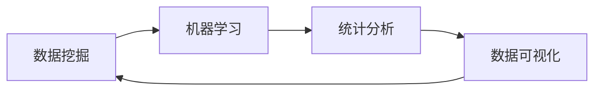

# 数据科学 (Data Science)

## 1. 背景介绍

数据科学是一门综合性学科，它涉及到统计学、计算机科学、信息科学以及相关领域的知识，旨在从数据中提取知识和洞察力。随着大数据时代的到来，数据科学的重要性日益凸显，它已经成为企业和组织做出基于数据的决策的关键工具。

## 2. 核心概念与联系

数据科学的核心概念包括数据挖掘、机器学习、统计分析和数据可视化。这些概念相互联系，共同构成了数据科学的基础。



## 3. 核心算法原理具体操作步骤

在数据科学中，核心算法包括分类、聚类、回归和关联规则学习。这些算法的操作步骤通常包括数据预处理、模型选择、模型训练、评估和优化。

## 4. 数学模型和公式详细讲解举例说明

数据科学中的数学模型和公式是对现实世界问题的抽象。例如，线性回归模型可以表示为：

$$ y = \beta_0 + \beta_1x_1 + \beta_2x_2 + ... + \beta_nx_n + \epsilon $$

其中，$y$ 是响应变量，$x_1, x_2, ..., x_n$ 是解释变量，$\beta_0, \beta_1, ..., \beta_n$ 是模型参数，$\epsilon$ 是误差项。

## 5. 项目实践：代码实例和详细解释说明

在数据科学项目中，代码是实现数据分析的工具。例如，使用Python的pandas库可以进行数据预处理：

```python
import pandas as pd

# 加载数据
data = pd.read_csv('data.csv')

# 数据清洗
data.dropna(inplace=True)
```

## 6. 实际应用场景

数据科学在多个领域都有应用，如金融风控、医疗健康、推荐系统等。在金融风控中，数据科学可以帮助识别潜在的风险和欺诈行为。

## 7. 工具和资源推荐

数据科学的学习和实践需要依赖一些工具和资源。推荐使用Python和R语言进行数据分析，以及Jupyter Notebook作为开发环境。此外，Kaggle和UCI Machine Learning Repository是优秀的数据资源平台。

## 8. 总结：未来发展趋势与挑战

数据科学的未来发展趋势包括自动化数据分析、深度学习的进一步应用以及大数据技术的不断进步。面临的挑战包括数据隐私保护、数据质量控制和算法的可解释性。

## 9. 附录：常见问题与解答

Q1: 数据科学和数据分析有什么区别？
A1: 数据科学是一个更广泛的领域，包括数据分析、机器学习、数据挖掘等。数据分析更侧重于从数据中提取有用信息。

Q2: 如何成为一名数据科学家？
A2: 成为一名数据科学家需要具备统计学、编程和业务分析的知识和技能。此外，实践经验也非常重要。

作者：禅与计算机程序设计艺术 / Zen and the Art of Computer Programming