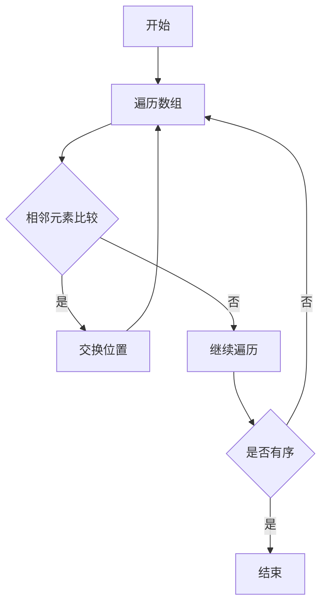
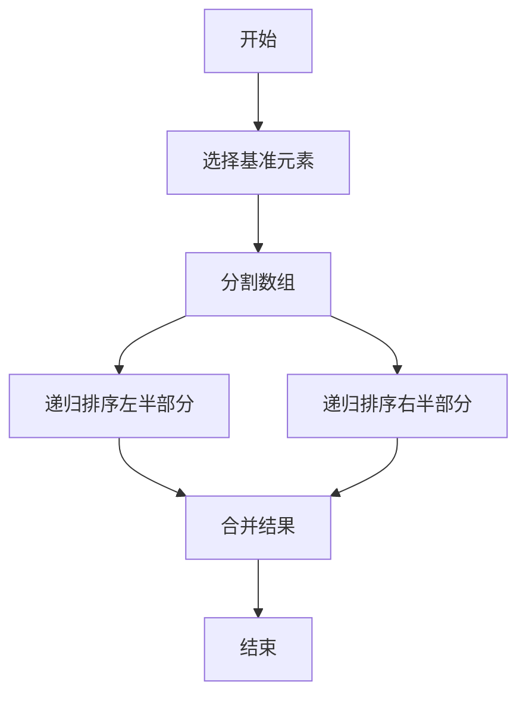
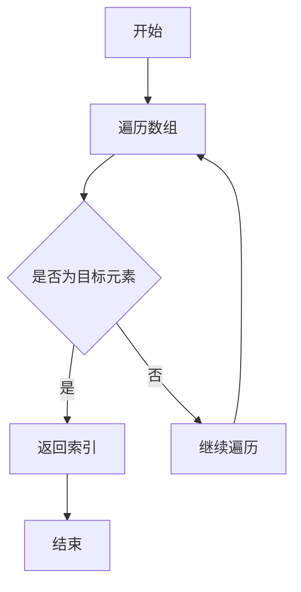
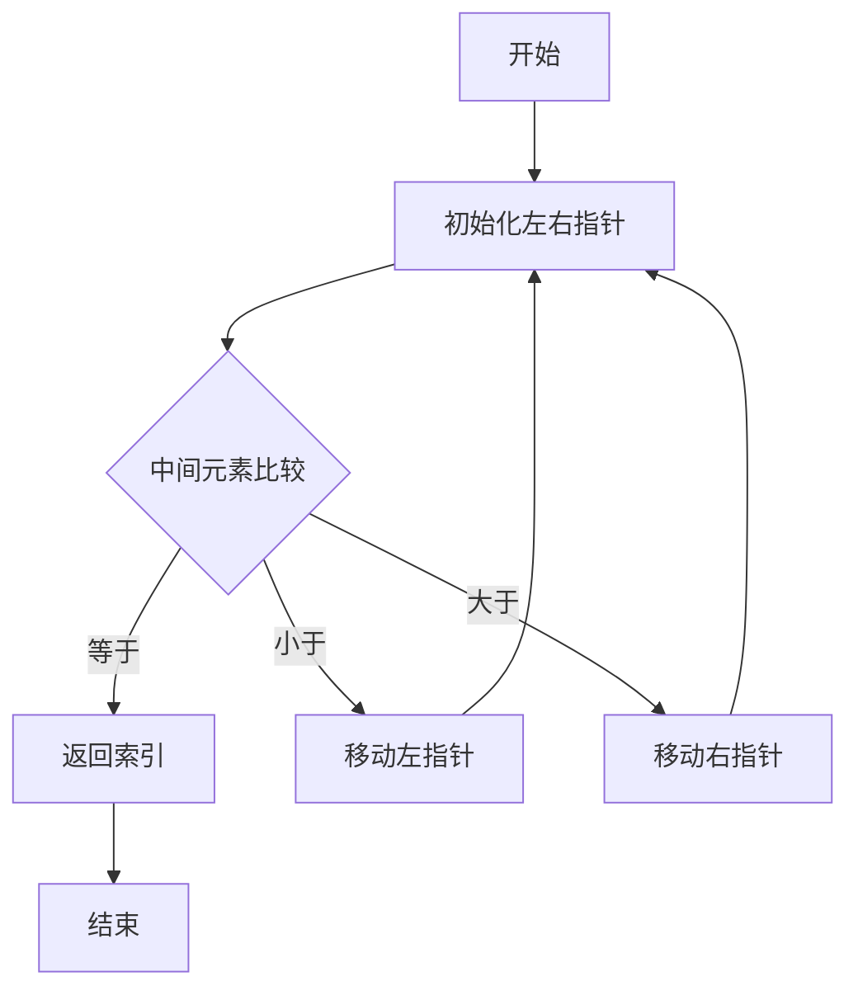
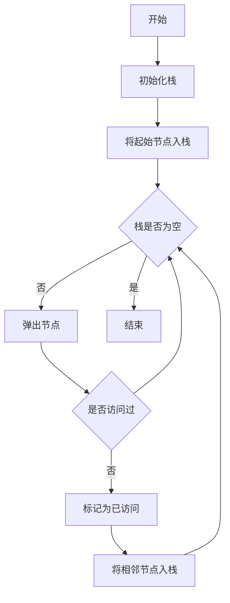
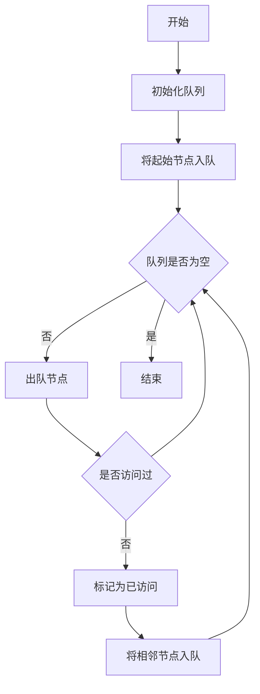

# 数据结构与算法原理与代码实战案例讲解

## 1.背景介绍

在计算机科学领域，数据结构和算法是两大基础支柱。数据结构是指数据组织、管理和存储的方式，而算法则是解决问题的步骤和方法。无论是开发高效的软件系统，还是进行复杂的数据分析，掌握数据结构和算法都是必不可少的技能。

### 1.1 数据结构的重要性

数据结构决定了数据的存储方式和访问方式。不同的数据结构适用于不同类型的问题。例如，数组适用于需要快速访问元素的场景，而链表则适用于需要频繁插入和删除元素的场景。

### 1.2 算法的重要性

算法是解决问题的核心。一个好的算法不仅能解决问题，还能以高效的方式解决问题。算法的效率通常用时间复杂度和空间复杂度来衡量。理解和优化算法是提高程序性能的关键。

### 1.3 数据结构与算法的关系

数据结构和算法是相辅相成的。数据结构为算法提供了操作的数据基础，而算法则在数据结构上执行操作。选择合适的数据结构和算法可以显著提高程序的性能和可维护性。

## 2.核心概念与联系

### 2.1 数据结构的分类

数据结构可以分为线性结构和非线性结构。线性结构包括数组、链表、栈和队列，非线性结构包括树和图。

#### 2.1.1 线性结构

- **数组**：一组连续的内存位置，用于存储相同类型的元素。
- **链表**：由节点组成的线性集合，每个节点包含数据和指向下一个节点的指针。
- **栈**：一种后进先出（LIFO）的数据结构。
- **队列**：一种先进先出（FIFO）的数据结构。

#### 2.1.2 非线性结构

- **树**：一种层次结构，由节点和边组成，每个节点有零个或多个子节点。
- **图**：由节点和边组成的结构，节点可以通过边相互连接。

### 2.2 算法的分类

算法可以根据其功能和应用场景进行分类。常见的算法包括排序算法、搜索算法、图算法和动态规划算法。

#### 2.2.1 排序算法

- **冒泡排序**：通过重复遍历数组，比较相邻元素并交换位置。
- **快速排序**：通过选择一个基准元素，将数组分为两部分，递归排序。

#### 2.2.2 搜索算法

- **线性搜索**：逐个检查每个元素，直到找到目标元素。
- **二分搜索**：在有序数组中，通过反复折半查找目标元素。

#### 2.2.3 图算法

- **深度优先搜索（DFS）**：从起始节点开始，沿着每条路径尽可能深入。
- **广度优先搜索（BFS）**：从起始节点开始，逐层遍历每个节点。

#### 2.2.4 动态规划算法

- **斐波那契数列**：通过存储中间结果，避免重复计算。
- **背包问题**：通过构建状态转移方程，求解最优解。

### 2.3 数据结构与算法的联系

数据结构和算法是相互依赖的。选择合适的数据结构可以简化算法的设计，而高效的算法可以充分利用数据结构的特性。例如，使用哈希表可以显著提高查找操作的效率，而使用堆可以优化优先队列的操作。

## 3.核心算法原理具体操作步骤

### 3.1 排序算法

#### 3.1.1 冒泡排序

冒泡排序是一种简单的排序算法，通过重复遍历数组，比较相邻元素并交换位置，直到数组有序。



#### 3.1.2 快速排序

快速排序是一种高效的排序算法，通过选择一个基准元素，将数组分为两部分，递归排序。



### 3.2 搜索算法

#### 3.2.1 线性搜索

线性搜索逐个检查每个元素，直到找到目标元素。



#### 3.2.2 二分搜索

二分搜索在有序数组中，通过反复折半查找目标元素。



### 3.3 图算法

#### 3.3.1 深度优先搜索（DFS）

深度优先搜索从起始节点开始，沿着每条路径尽可能深入。



#### 3.3.2 广度优先搜索（BFS）

广度优先搜索从起始节点开始，逐层遍历每个节点。



## 4.数学模型和公式详细讲解举例说明

### 4.1 时间复杂度

时间复杂度是衡量算法效率的重要指标。常见的时间复杂度有 $O(1)$、$O(n)$、$O(\log n)$、$O(n \log n)$ 和 $O(n^2)$。

#### 4.1.1 常数时间复杂度 $O(1)$

常数时间复杂度表示算法的执行时间不随输入规模的变化而变化。例如，访问数组的某个元素。

$$
T(n) = O(1)
$$

#### 4.1.2 线性时间复杂度 $O(n)$

线性时间复杂度表示算法的执行时间与输入规模成正比。例如，线性搜索。

$$
T(n) = O(n)
$$

#### 4.1.3 对数时间复杂度 $O(\log n)$

对数时间复杂度表示算法的执行时间与输入规模的对数成正比。例如，二分搜索。

$$
T(n) = O(\log n)
$$

#### 4.1.4 线性对数时间复杂度 $O(n \log n)$

线性对数时间复杂度表示算法的执行时间与输入规模和对数的乘积成正比。例如，快速排序。

$$
T(n) = O(n \log n)
$$

#### 4.1.5 平方时间复杂度 $O(n^2)$

平方时间复杂度表示算法的执行时间与输入规模的平方成正比。例如，冒泡排序。

$$
T(n) = O(n^2)
$$

### 4.2 空间复杂度

空间复杂度是衡量算法所需内存空间的重要指标。常见的空间复杂度有 $O(1)$、$O(n)$ 和 $O(n^2)$。

#### 4.2.1 常数空间复杂度 $O(1)$

常数空间复杂度表示算法所需的内存空间不随输入规模的变化而变化。例如，交换两个变量的值。

$$
S(n) = O(1)
$$

#### 4.2.2 线性空间复杂度 $O(n)$

线性空间复杂度表示算法所需的内存空间与输入规模成正比。例如，存储一个数组。

$$
S(n) = O(n)
$$

#### 4.2.3 平方空间复杂度 $O(n^2)$

平方空间复杂度表示算法所需的内存空间与输入规模的平方成正比。例如，存储一个二维矩阵。

$$
S(n) = O(n^2)
$$

## 5.项目实践：代码实例和详细解释说明

### 5.1 排序算法实例

#### 5.1.1 冒泡排序代码实例

```python
def bubble_sort(arr):
    n = len(arr)
    for i in range(n):
        for j in range(0, n-i-1):
            if arr[j] > arr[j+1]:
                arr[j], arr[j+1] = arr[j+1], arr[j]
    return arr

# 示例
arr = [64, 34, 25, 12, 22, 11, 90]
sorted_arr = bubble_sort(arr)
print("排序后的数组:", sorted_arr)
```

#### 5.1.2 快速排序代码实例

```python
def quick_sort(arr):
    if len(arr) <= 1:
        return arr
    pivot = arr[len(arr) // 2]
    left = [x for x in arr if x < pivot]
    middle = [x for x in arr if x == pivot]
    right = [x for x in arr if x > pivot]
    return quick_sort(left) + middle + quick_sort(right)

# 示例
arr = [64, 34, 25, 12, 22, 11, 90]
sorted_arr = quick_sort(arr)
print("排序后的数组:", sorted_arr)
```

### 5.2 搜索算法实例

#### 5.2.1 线性搜索代码实例

```python
def linear_search(arr, target):
    for i in range(len(arr)):
        if arr[i] == target:
            return i
    return -1

# 示例
arr = [64, 34, 25, 12, 22, 11, 90]
target = 22
index = linear_search(arr, target)
print("目标元素的索引:", index)
```

#### 5.2.2 二分搜索代码实例

```python
def binary_search(arr, target):
    left, right = 0, len(arr) - 1
    while left <= right:
        mid = (left + right) // 2
        if arr[mid] == target:
            return mid
        elif arr[mid] < target:
            left = mid + 1
        else:
            right = mid - 1
    return -1

# 示例
arr = [11, 12, 22, 25, 34, 64, 90]
target = 22
index = binary_search(arr, target)
print("目标元素的索引:", index)
```

### 5.3 图算法实例

#### 5.3.1 深度优先搜索（DFS）代码实例

```python
def dfs(graph, start, visited=None):
    if visited is None:
        visited = set()
    visited.add(start)
    print(start, end=' ')
    for next in graph[start] - visited:
        dfs(graph, next, visited)
    return visited

# 示例
graph = {
    'A': {'B', 'C'},
    'B': {'A', 'D', 'E'},
    'C': {'A', 'F'},
    'D': {'B'},
    'E': {'B', 'F'},
    'F': {'C', 'E'}
}
dfs(graph, 'A')
```

#### 5.3.2 广度优先搜索（BFS）代码实例

```python
from collections import deque

def bfs(graph, start):
    visited = set()
    queue = deque([start])
    while queue:
        vertex = queue.popleft()
        if vertex not in visited:
            print(vertex, end=' ')
            visited.add(vertex)
            queue.extend(graph[vertex] - visited)

# 示例
graph = {
    'A': {'B', 'C'},
    'B': {'A', 'D', 'E'},
    'C': {'A', 'F'},
    'D': {'B'},
    'E': {'B', 'F'},
    'F': {'C', 'E'}
}
bfs(graph, 'A')
```

## 6.实际应用场景

### 6.1 排序算法的应用

排序算法在许多实际应用中都非常重要。例如，在电子商务网站中，商品列表需要按照价格、销量等进行排序；在数据库中，数据需要按照某个字段进行排序以提高查询效率。

### 6.2 搜索算法的应用

搜索算法在信息检索、数据库查询等领域有广泛应用。例如，搜索引擎需要在大量网页中快速找到与查询相关的内容；数据库系统需要高效地查找记录。

### 6.3 图算法的应用

图算法在网络分析、路径规划等领域有重要应用。例如，社交网络分析需要使用图算法来发现社区结构；导航系统需要使用图算法来计算最短路径。

## 7.工具和资源推荐

### 7.1 在线编程平台

- **LeetCode**：提供大量数据结构和算法的练习题目。
- **HackerRank**：提供编程挑战和竞赛，涵盖多种算法和数据结构。

### 7.2 书籍推荐

- **《算法导论》**：全面介绍了各种算法及其应用。
- **《数据结构与算法分析》**：深入讲解了数据结构和算法的基本原理。

### 7.3 在线课程

- **Coursera**：提供斯坦福大学、普林斯顿大学等名校的算法课程。
- **edX**：提供麻省理工学院、哈佛大学等名校的计算机科学课程。

## 8.总结：未来发展趋势与挑战

### 8.1 未来发展趋势

随着大数据和人工智能的发展，数据结构和算法的重要性将进一步凸显。未来，新的数据结构和算法将不断涌现，以应对更加复杂和多样化的问题。

### 8.2 挑战

尽管数据结构和算法已经取得了长足的进展，但仍然面临许多挑战。例如，如何在大规模数据集上高效地执行算法，如何设计适应新硬件架构的算法，都是亟待解决的问题。

## 9.附录：常见问题与解答

### 9.1 什么是时间复杂度和空间复杂度？

时间复杂度是衡量算法执行时间随输入规模变化的指标，空间复杂度是衡量算法所需内存空间随输入规模变化的指标。

### 9.2 如何选择合适的数据结构？

选择数据结构时需要考虑数据的存储方式、访问方式和操作需求。例如，数组适用于需要快速访问元素的场景，链表适用于需要频繁插入和删除元素的场景。

### 9.3 如何优化算法？

优化算法可以从减少时间复杂度和空间复杂度入手。例如，通过使用更高效的数据结构、减少不必要的计算、使用动态规划等方法，可以显著提高算法的效率。

---

作者：禅与计算机程序设计艺术 / Zen and the Art of Computer Programming