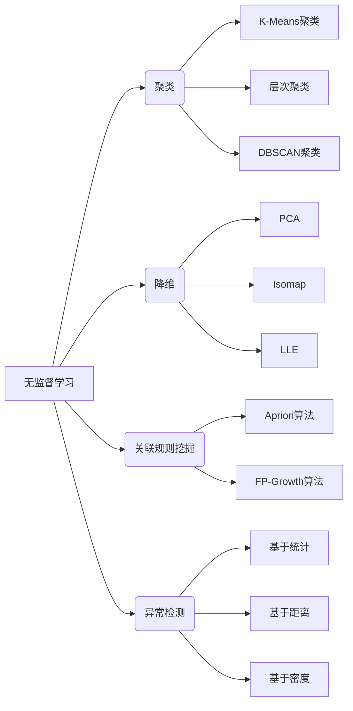
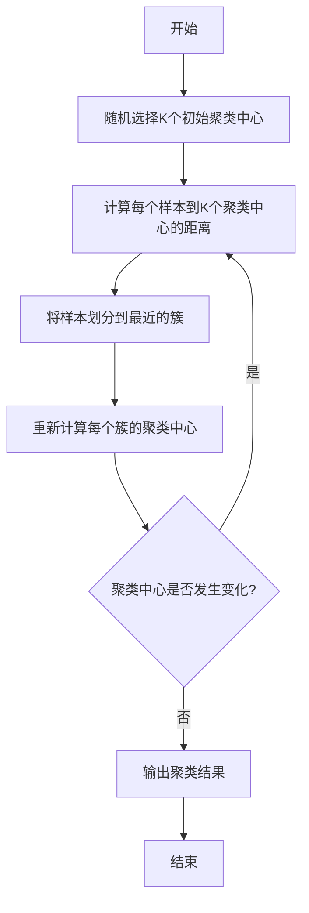
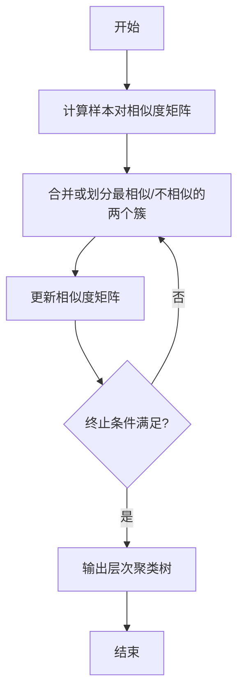
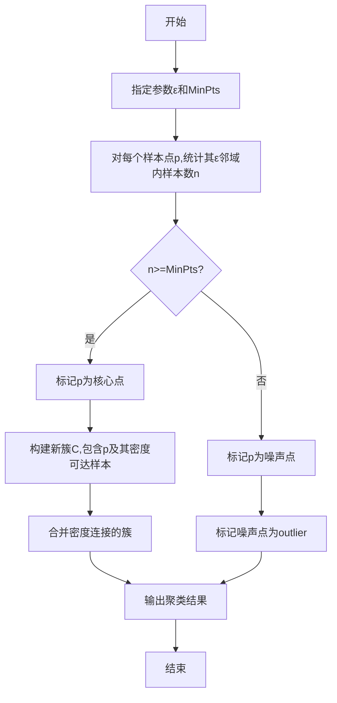

# 无监督学习 (Unsupervised Learning) 原理与代码实例讲解

## 1.背景介绍

### 1.1 什么是无监督学习?

无监督学习(Unsupervised Learning)是机器学习中一种重要的学习范式,其主要目标是从未标记的原始数据中发现隐藏的模式或内在数据表示。与监督学习不同,无监督学习算法不需要人工标注的训练数据,而是直接从输入数据中自动提取统计规律、结构和模式。

无监督学习广泛应用于数据挖掘、计算机视觉、自然语言处理、推荐系统等领域,能够有效地处理大规模、高维、异构的复杂数据,为数据分析提供有力支持。

### 1.2 无监督学习的意义

在现实世界中,大量数据都是未标记的原始数据,如社交网络数据、互联网日志数据、基因组数据等。无监督学习可以从这些海量数据中挖掘出有价值的知识,为决策提供依据。

此外,无监督学习也可以作为监督学习的预处理步骤,从原始数据中学习出良好的数据表示,为后续的监督任务提供有效的特征表示,提高模型的性能。

### 1.3 无监督学习的挑战

尽管无监督学习具有广阔的应用前景,但也面临着诸多挑战:

- 无Ground Truth(地面真值):缺乏标准答案,难以评估学习结果的优劣。
- 高维数据挑战:高维数据存在"维数灾难"问题,需要特殊的降维技术。
- 异常值敏感:无监督算法对异常值较为敏感,需要数据预处理。
- 模型选择困难:无监督任务目标通常不明确,模型选择困难。

## 2.核心概念与联系

### 2.1 无监督学习的主要任务

无监督学习主要包括以下几种任务类型:

1. **聚类(Clustering)**:将相似的数据对象划分到同一个簇,使簇内相似度高,簇间相似度低。常见算法有K-Means、层次聚类、DBSCAN等。

2. **降维(Dimensionality Reduction)**:将高维数据映射到低维空间,保留数据的主要特征,降低数据复杂度。常见算法有PCA、Isomap、LLE等。

3. **关联规则挖掘(Association Rule Mining)**:从大规模数据集中发现有趣且频繁出现的项集模式。常见算法有Apriori、FP-Growth等。

4. **异常检测(Anomaly Detection)**:从数据集中识别出与绝大多数样本模式显著不同的异常数据。常见算法有基于统计、基于距离、基于密度等。

### 2.2 无监督学习与监督学习的区别

无监督学习与监督学习是机器学习中两种基本的学习范式,存在以下主要区别:

1. **训练数据**:监督学习需要大量标注好的训练数据,而无监督学习直接从未标记的原始数据中学习。

2. **任务目标**:监督学习的目标是从训练数据中学习出一个映射函数,对新数据进行预测或分类。无监督学习则是发现数据内在的模式或结构。

3. **评估方式**:监督学习可以通过预测准确率等指标评估模型性能,而无监督学习缺乏标准答案,需要借助其他评估指标。

4. **应用场景**:监督学习更适用于具有明确输入输出映射的任务,如图像分类、语音识别等。无监督学习则适用于发现数据内在结构的任务,如聚类、降维等。

5. **可解释性**:无监督学习模型通常具有更好的可解释性,因为其目标是发现数据本身的模式。而监督学习模型往往是一个黑箱映射。

总的来说,无监督学习和监督学习是相辅相成的,二者结合可以发挥更大的潜力。

## 3.核心算法原理具体操作步骤

### 3.1 K-Means聚类算法

K-Means聚类是一种简单而有效的无监督聚类算法,其主要思想是通过迭代最小化样本到聚类中心的距离平方和,从而将数据集划分为K个簇。算法步骤如下:

1. 随机选择K个初始聚类中心。
2. 计算每个样本到K个聚类中心的距离,将样本划分到距离最近的簇。
3. 重新计算每个簇的聚类中心,更新为簇内所有样本的均值向量。
4. 重复步骤2和3,直到聚类中心不再发生变化或达到最大迭代次数。

K-Means算法的优点是简单、高效、易于理解和实现。但其也存在一些缺陷,如对初始聚类中心的选择敏感、对噪声和异常值敏感、无法发现非凸形状的簇等。

### 3.2 层次聚类算法

层次聚类算法根据数据之间的相似度,将数据对象分层次地构造成一种树形结构,可分为自底向上(Agglomerative)和自顶向下(Divisive)两种策略。算法步骤如下:

1. 计算所有样本对之间的相似度矩阵。
2. 根据相似度矩阵,合并或划分最相似(或最不相似)的两个簇。
3. 更新相似度矩阵。
4. 重复步骤2和3,直到所有样本聚为一个簇或每个样本都是一个簇。

层次聚类算法的优点是不需要预先确定聚类数目,可以很好地处理任意形状的簇。但其计算复杂度较高,对于大规模数据集效率较低。常见的层次聚类算法包括AGNES(Agglomerative Nesting)、DIANA(Divisive Analysis)等。

### 3.3 DBSCAN聚类算法

DBSCAN(Density-Based Spatial Clustering of Applications with Noise)是一种基于密度的聚类算法,能够发现任意形状的簇,并有效识别噪声。算法步骤如下:

1. 指定两个参数:邻域半径$\epsilon$和最小样本数MinPts。
2. 对每个样本点p,统计其$\epsilon$邻域内的样本数目n。
   - 若n<MinPts,则p为噪声点。
   - 若n≥MinPts,则p为核心点。
3. 对每个核心点p,构建一个新簇C,将p及其所有密度可达样本加入C。
4. 合并密度连接的簇。
5. 将噪声点标记为outlier。

DBSCAN算法的优点是能够发现任意形状的簇,并有效识别噪声。但其对参数$\epsilon$和MinPts的选择较为敏感,需要一定的经验和调参技巧。

## 4.数学模型和公式详细讲解举例说明

### 4.1 K-Means聚类目标函数

K-Means聚类算法的目标是最小化所有样本到其所属簇中心的距离平方和,即最小化目标函数:

$$J = \sum_{i=1}^{K}\sum_{x \in C_i}\left \| x - \mu_i \right \|^2$$

其中:
- $K$为聚类数目
- $C_i$为第$i$个簇
- $\mu_i$为第$i$个簇的聚类中心
- $\left \| x - \mu_i \right \|$为样本$x$到聚类中心$\mu_i$的欧氏距离

通过不断迭代优化上述目标函数,K-Means算法逐步收敛到局部最优解。

### 4.2 层次聚类相似度计算

层次聚类算法需要计算样本对之间的相似度,常用的相似度度量包括:

1. **欧氏距离**:
   $$d(x,y) = \sqrt{\sum_{i=1}^{n}(x_i - y_i)^2}$$

2. **曼哈顿距离**:
   $$d(x,y) = \sum_{i=1}^{n}\left | x_i - y_i \right |$$

3. **余弦相似度**:
   $$\text{sim}(x,y) = \frac{x \cdot y}{\left \| x \right \| \left \| y \right \|}$$

4. **Jaccard相似系数**:
   $$\text{sim}(A,B) = \frac{\left | A \cap B \right |}{\left | A \cup B \right |}$$

不同的相似度度量适用于不同的数据类型和应用场景。

### 4.3 DBSCAN密度可达性

DBSCAN算法中的核心概念是**密度可达性(Density-Reachability)**,用于定义样本点之间的可达关系。

对于样本点$p$和$q$,如果存在一个由核心点组成的序列$p_1,p_2,...,p_n$,使得$p=p_1$且$q$位于$p_n$的$\epsilon$邻域内,则称$q$从$p$密度可达。

密度可达性是一种渐近的、不对称的关系。如果$p$和$q$互相密度可达,则称它们**密度连接(Density-Connected)**。

基于密度可达性和密度连接,DBSCAN算法能够发现任意形状的簇,并有效识别噪声点。

### 4.4 PCA降维原理

主成分分析(Principal Component Analysis, PCA)是一种常用的无监督降维方法,其基本思想是将高维数据投影到一个低维子空间,使投影数据的方差最大化。

具体地,PCA通过求解数据协方差矩阵的特征值和特征向量,将原始数据投影到由前$k$个主成分(特征向量)构成的$k$维子空间,从而实现降维。

设原始数据矩阵为$X \in \mathbb{R}^{n \times d}$,则PCA降维的步骤如下:

1. 对数据$X$进行中心化,得到$\tilde{X}$。
2. 计算$\tilde{X}$的协方差矩阵$\Sigma = \frac{1}{n}\tilde{X}^T\tilde{X}$。
3. 求解$\Sigma$的前$k$个最大特征值$\lambda_1,\lambda_2,...,\lambda_k$及对应的特征向量$v_1,v_2,...,v_k$。
4. 将$\tilde{X}$投影到由$v_1,v_2,...,v_k$构成的$k$维子空间,得到降维后的数据$Y=\tilde{X}V_k$,其中$V_k=[v_1,v_2,...,v_k]$。

PCA降维可