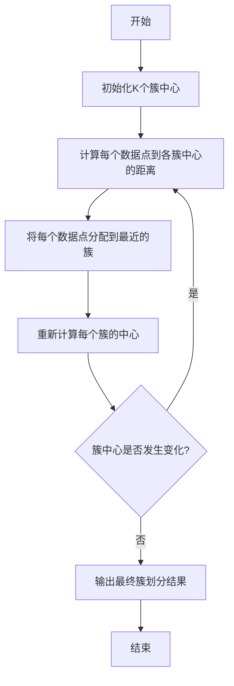
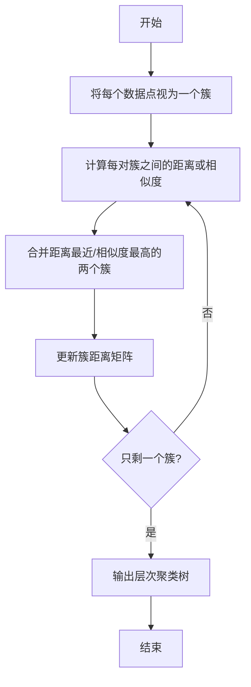
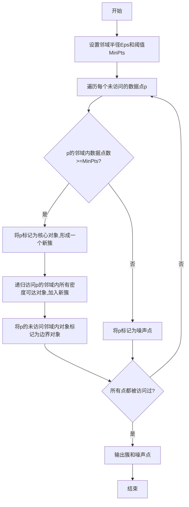

# 无监督学习(Unsupervised Learning) - 原理与代码实例讲解

## 1. 背景介绍

### 1.1 什么是无监督学习?

无监督学习(Unsupervised Learning)是机器学习的一个重要分支,它旨在从未标记的数据中发现隐藏的模式或内在结构。与监督学习不同,无监督学习没有预定义的目标变量,算法必须自主发现数据中的内在规律和结构。

无监督学习在许多领域都有广泛的应用,例如聚类分析、降维、异常检测和关联规则挖掘等。它可以帮助我们更好地理解复杂数据,发现隐藏的洞见,并为进一步的分析和决策提供有价值的输入。

### 1.2 无监督学习的重要性

在现实世界中,大部分数据都是未标记的,获取标记数据的成本往往很高。无监督学习为我们提供了一种从原始数据中提取有用信息的方法,避免了昂贵的人工标注过程。

此外,无监督学习还可以发现人类难以察觉的模式和关系,为我们提供新的见解和洞察力。它在数据挖掘、计算机视觉、自然语言处理等领域都有重要应用。

### 1.3 无监督学习算法分类

无监督学习算法可以分为以下几类:

- **聚类算法(Clustering Algorithms)**: 将数据划分为多个簇或组,使得同一簇内的数据相似,不同簇之间的数据差异较大。常见算法包括K-Means、层次聚类、DBSCAN等。

- **关联规则挖掘(Association Rule Mining)**: 发现数据集中频繁出现的项集模式,并从中推导出有趣的关联规则。典型算法有Apriori和FP-Growth。

- **降维算法(Dimensionality Reduction)**: 将高维数据映射到低维空间,同时保留数据的主要特征和结构。常用算法有主成分分析(PCA)、t-SNE等。

- **密度估计(Density Estimation)**: 估计数据的概率密度函数,用于异常检测、数据生成等任务。著名算法包括高斯混合模型(GMM)、核密度估计(KDE)等。

## 2. 核心概念与联系

### 2.1 聚类分析

聚类分析是无监督学习中最常见和最重要的任务之一。它的目标是将相似的数据点分组到同一个簇中,而将不同的数据点分配到不同的簇。聚类分析广泛应用于客户细分、图像分割、基因表达模式分析等领域。

常见的聚类算法包括:

- **K-Means聚类**: 将数据划分为K个簇,每个数据点归属于离其最近的簇中心。算法迭代更新簇中心,直到收敛。

- **层次聚类**: 通过递归地合并或分割簇来构建层次结构。可分为自底向上(凝聚式)和自顶向下(分裂式)两种方法。

- **DBSCAN**: 基于密度的聚类算法,将高密度区域视为簇,低密度区域视为噪声。适用于任意形状的簇。

- **均值漂移(Mean Shift)**: 通过迭代移动数据点到其最近的峰值密度区域,实现聚类。

### 2.2 降维

高维数据存在"维数灾难"问题,如数据稀疏、计算复杂度高等。降维技术可以将高维数据映射到低维空间,同时保留数据的主要特征和结构,从而简化后续的分析和可视化过程。

常用的降维算法包括:

- **主成分分析(PCA)**: 通过正交变换将原始数据转换为一组线性无关的主成分,选取方差贡献最大的前几个主成分作为低维表示。

- **核化主成分分析(Kernel PCA)**: 在高维特征空间执行PCA,可以发现非线性结构。

- **t-SNE(t-Distributed Stochastic Neighbor Embedding)**: 将高维数据映射到低维空间,并尽可能保留数据点之间的相对距离。常用于可视化高维数据。

- **自编码器(Autoencoder)**: 一种无监督神经网络,通过训练网络将输入数据重构,从而学习数据的低维表示。

### 2.3 密度估计

密度估计旨在估计样本数据的概率密度函数,可用于异常检测、数据生成等任务。常见的密度估计方法包括:

- **高斯混合模型(GMM)**: 假设数据由多个高斯分布的混合生成,通过期望最大化(EM)算法学习每个分布的参数。

- **核密度估计(KDE)**: 通过在每个数据点周围放置一个核函数(如高斯核),然后对所有核函数求和得到密度估计。

- **基于神经网络的密度估计**: 使用生成对抗网络(GAN)、变分自编码器(VAE)等深度学习模型来估计复杂数据分布。

### 2.4 关联规则挖掘

关联规则挖掘旨在从大规模数据集中发现有趣的关联模式或频繁项集。这些规则可用于商品关联分析、网页链接分析等应用场景。

- **Apriori算法**: 利用先验知识,通过迭代搜索频繁项集,再从中生成关联规则。

- **FP-Growth算法**: 通过构建FP树来高效发现频繁项集,避免了Apriori算法的候选集产生问题。

### 2.5 核心概念联系

无监督学习算法虽然各有侧重,但它们之间存在内在联系:

1. **距离/相似度度量**: 许多算法(如聚类、降维)都需要定义数据点之间的距离或相似度,以发现潜在的结构。

2. **概率密度建模**: 一些算法(如GMM、KDE)通过估计数据的概率密度函数来发现其内在结构。

3. **优化目标**: 算法通常需要优化某个目标函数(如聚类中的簇内距离和)来发现最优解。

4. **稀疏表示**: 一些算法(如PCA、自编码器)试图找到数据的稀疏表示,以降低维度和提取主要特征。

5. **可解释性**: 无监督学习算法发现的模式和结构往往具有可解释性,有助于人类理解数据。

通过掌握这些核心概念及其联系,我们可以更好地理解和应用无监督学习算法。

## 3. 核心算法原理具体操作步骤

### 3.1 K-Means聚类算法

K-Means是一种简单而有效的聚类算法,它将数据划分为K个簇,每个数据点归属于离其最近的簇中心。算法的具体步骤如下:

1. **初始化K个簇中心**: 通常随机选择K个数据点作为初始簇中心。

2. **计算每个数据点到各簇中心的距离**: 常用的距离度量包括欧氏距离、曼哈顿距离等。

3. **将每个数据点分配到最近的簇**: 遍历所有数据点,将其分配到距离最近的簇中。

4. **重新计算每个簇的中心**: 对于每个簇,计算其所有数据点的均值作为新的簇中心。

5. **判断簇中心是否发生变化**: 如果所有簇中心都没有变化,则算法收敛,输出最终簇划分结果;否则返回步骤2,继续迭代。

K-Means算法的优点是简单、高效,但也存在一些缺陷:

- 需要预先指定簇数K,对结果影响较大。
- 对初始簇中心的选择敏感,可能陷入局部最优。
- 对异常值和非凸形状的簇敏感。

### 3.2 层次聚类算法

层次聚类算法通过递归地合并或分割簇来构建层次结构。根据合并或分割的方向,可分为自底向上(凝聚式)和自顶向下(分裂式)两种方法。

以凝聚式层次聚类为例,算法步骤如下:

1. **初始化**: 将每个数据点视为一个单独的簇。

2. **计算簇间距离或相似度**: 常用的距离度量包括最短距离(单链接)、最长距离(完全链接)、平均距离等。

3. **合并最近/最相似的两个簇**: 根据距离或相似度矩阵,找到最近或最相似的两个簇,将它们合并为一个新的簇。

4. **更新簇距离矩阵**: 计算新簇与其他簇之间的距离或相似度,更新距离矩阵。

5. **判断是否只剩一个簇**: 如果只剩一个簇,则输出层次聚类树;否则返回步骤2,继续迭代。

层次聚类算法的优点是不需要预先指定簇数,可以很好地处理任意形状的簇。但缺点是计算复杂度较高(通常为$O(N^2\log N)$),对于大规模数据集可能效率较低。

### 3.3 DBSCAN聚类算法

DBSCAN(Density-Based Spatial Clustering of Applications with Noise)是一种基于密度的聚类算法,它将高密度区域视为簇,低密度区域视为噪声。DBSCAN可以发现任意形状的簇,并对噪声具有鲁棒性。

算法的核心思想是:如果一个数据点的邻域半径内存在足够多的数据点(大于给定的阈值MinPts),则将这个数据点及其邻域内的所有数据点视为一个簇。

DBSCAN算法的具体步骤如下:

1. **设置邻域半径Eps和阈值MinPts**: Eps定义了数据点的邻域范围,MinPts是判断核心对象所需的最小邻域数据点数。

2. **遍历每个未访问的数据点p**: 对于每个未访问的数据点p,检查其邻域内的数据点数量。

3. **判断p是否为核心对象**: 如果p的邻域内数据点数大于等于MinPts,则将p标记为核心对象,形成一个新的簇。

4. **递归访问密度可达对象**: 从p出发,递归访问p的邻域内所有密度可达对象(直接密度可达或通过其他核心对象密度可达),并将它们加入新簇。

5. **标记边界对象**: 将p的未访问邻域内对象标记为边界对象(不属于任何簇)。

6. **判断是否所有点都被访问过**: 如果所有点都被访问过,则输出簇和噪声点;否则返回步骤2,继续遍历。

DBSCAN算法的优点是能够发现任意形状的簇,对噪声具有鲁棒性,且不需要预先指定簇数。缺点是对参数Eps和MinPts较为敏感,需要合