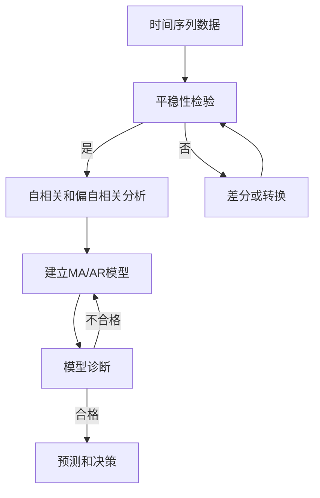

# 时间序列分析原理与代码实战案例讲解

## 1.背景介绍

时间序列分析是一种用于分析随时间变化的数据序列的统计方法。它在各个领域都有广泛的应用,例如金融、经济、气象、医疗等。随着大数据时代的到来,时间序列分析在数据挖掘、模式识别、预测和决策支持等方面扮演着越来越重要的角色。

时间序列数据具有以下几个特点:

1. 序列性:数据按照时间顺序排列,存在前后关联性。
2. 趋势性:数据可能存在一定的趋势,如上升、下降或周期性波动。
3. 随机性:数据中通常包含随机噪声,需要进行建模和分析。

时间序列分析的主要目标包括:

- 探索数据的内在规律和趋势
- 构建适当的数学模型来描述和预测时间序列
- 评估模型的准确性和可靠性
- 基于模型进行预测和决策

## 2.核心概念与联系

时间序列分析涉及多个核心概念,这些概念相互关联,构成了完整的理论体系。以下是一些重要概念:

### 2.1 平稳性(Stationarity)

平稳性是时间序列建模的基础假设之一。一个严格平稳的时间序列指的是其统计特性(如均值、方差和自协方差)在时间上保持不变。如果时间序列不平稳,需要进行差分或其他转换使其平稳化。

### 2.2 自相关(Autocorrelation)和偏自相关(Partial Autocorrelation)

自相关描述了时间序列在不同时间点之间的相关性,是衡量序列相依性的重要指标。偏自相关则是在消除了其他时滞的影响后,计算两个时间点之间的相关性。自相关和偏自相关函数对于识别和构建适当的时间序列模型非常重要。

### 2.3 白噪声(White Noise)

白噪声是一种理想的随机过程,其中每个观测值都是相互独立的,服从相同的概率分布。白噪声在时间序列建模中扮演着重要角色,许多模型都假设残差是白噪声过程。

### 2.4 移动平均模型(MA)和自回归模型(AR)

移动平均模型(MA)和自回归模型(AR)是两种基本的时间序列模型。MA模型描述了当前观测值是过去有限个白噪声的加权和,而AR模型则表示当前观测值是过去有限个观测值的加权和。这两种模型可以组合形成更复杂的ARMA、ARIMA等模型。



上图展示了时间序列分析的基本流程。首先检验数据的平稳性,如果不平稳需要进行差分或转换。然后计算自相关和偏自相关函数,根据结果识别和构建MA、AR或其他模型。接下来对模型进行诊断,如果模型合格则可用于预测和决策,否则需要重新建模。

## 3.核心算法原理具体操作步骤

时间序列分析涉及多种算法和模型,这里将重点介绍ARIMA(自回归综合移动平均)模型的原理和具体操作步骤。

### 3.1 ARIMA模型

ARIMA(AutoRegressive Integrated Moving Average)模型是时间序列分析中最常用和最通用的模型之一。它结合了自回归(AR)、差分(I)和移动平均(MA)三个部分,可以很好地描述和预测许多实际时间序列。

ARIMA模型的一般形式为ARIMA(p,d,q),其中:

- p是自回归(AR)项的阶数
- d是差分的阶数
- q是移动平均(MA)项的阶数

对于一个给定的ARIMA(p,d,q)模型,它可以表示为:

$$
\begin{aligned}
(1-\phi_1B-\phi_2B^2-\cdots-\phi_pB^p)(1-B)^dY_t &= (1+\theta_1B+\theta_2B^2+\cdots+\theta_qB^q)\varepsilon_t\\
\phi(B)(1-B)^dY_t &= \theta(B)\varepsilon_t
\end{aligned}
$$

其中:

- $\phi(B)$是自回归(AR)多项式
- $(1-B)^d$是差分项
- $\theta(B)$是移动平均(MA)多项式
- $\varepsilon_t$是白噪声过程

### 3.2 ARIMA模型构建步骤

构建ARIMA模型的一般步骤如下:

1. **数据准备和可视化**:绘制时间序列图,观察数据的趋势和季节性等特征。

2. **平稳性检验**:使用单位根检验(如ADF检验)检查时间序列的平稳性。如果不平稳,需要进行适当的差分使其平稳化。

3. **确定模型阶数(p,d,q)**:通过自相关函数(ACF)和偏自相关函数(PACF)的图形,确定自回归(AR)阶数p和移动平均(MA)阶数q。差分阶数d由平稳性检验结果决定。

4. **模型估计**:使用最小二乘法或最大似然估计等方法估计ARIMA模型的参数。

5. **模型诊断**:检查模型残差是否满足白噪声假设,并评估模型的适当性。如果不满足,需要重新确定模型阶数或进行其他调整。

6. **预测**:使用估计的ARIMA模型对未来时间点进行预测。

下面是一个使用Python的statsmodels库构建ARIMA模型的代码示例:

```python
import pandas as pd
from statsmodels.tsa.stattools import adfuller
from statsmodels.graphics.tsaplots import plot_acf, plot_pacf
from statsmodels.tsa.arima.model import ARIMA

# 加载数据
data = pd.read_csv('time_series_data.csv', index_col='date', parse_dates=True)

# 绘制时间序列图
data.plot()

# 平稳性检验
result = adfuller(data['value'])
print(f'ADF Statistic: {result[0]}')
print(f'p-value: {result[1]}')

# 差分
data_diff = data.diff().dropna()

# 绘制ACF和PACF图
plot_acf(data_diff, lags=30)
plot_pacf(data_diff, lags=30)

# 构建ARIMA模型
model = ARIMA(data_diff, order=(1,1,1))
model_fit = model.fit()

# 模型诊断
residuals = model_fit.resid
plot_acf(residuals, lags=30)

# 预测
forecast = model_fit.forecast(steps=10)
```

上述代码展示了构建ARIMA模型的基本流程,包括数据加载、平稳性检验、差分、ACF和PACF分析、模型估计、诊断和预测等步骤。在实际应用中,可能需要根据具体情况进行调整和优化。

## 4.数学模型和公式详细讲解举例说明

在时间序列分析中,数学模型和公式扮演着重要角色。本节将详细讲解一些核心的数学模型和公式,并给出具体的例子说明。

### 4.1 自相关函数(ACF)

自相关函数(Autocorrelation Function, ACF)描述了时间序列在不同时滞(lag)下的相关性。对于时间序列$\{X_t\}$,滞后k的自相关系数$\rho_k$定义为:

$$
\rho_k = \frac{Cov(X_t, X_{t-k})}{Var(X_t)}
$$

其中$Cov(X_t, X_{t-k})$是$X_t$和$X_{t-k}$的协方差,$Var(X_t)$是$X_t$的方差。

自相关函数可用于识别时间序列的模式,如趋势、周期性和自回归特征。例如,对于一个AR(1)过程$X_t = \phi X_{t-1} + \varepsilon_t$,其自相关函数为$\rho_k = \phi^k$,呈现指数衰减的形式。

### 4.2 偏自相关函数(PACF)

偏自相关函数(Partial Autocorrelation Function, PACF)描述了在消除了其他时滞的影响后,时间序列在特定时滞下的相关性。对于时间序列$\{X_t\}$,滞后k的偏自相关系数$\phi_{kk}$定义为:

$$
\phi_{kk} = Corr(X_t - \hat{X}_t, X_{t-k} - \hat{X}_{t-k})
$$

其中$\hat{X}_t$和$\hat{X}_{t-k}$分别是基于$X_1, X_2, \ldots, X_{t-1}$和$X_1, X_2, \ldots, X_{t-k-1}$的最小二乘预测。

偏自相关函数对于识别自回归(AR)模型的阶数非常有用。例如,对于一个AR(p)过程,其PACF在滞后p之后截尾为0。

### 4.3 移动平均模型(MA)

移动平均模型(Moving Average, MA)是一种常用的时间序列模型,它描述了当前观测值是过去有限个白噪声的加权和。一个MA(q)模型可以表示为:

$$
X_t = \varepsilon_t + \theta_1\varepsilon_{t-1} + \theta_2\varepsilon_{t-2} + \cdots + \theta_q\varepsilon_{t-q}
$$

其中$\varepsilon_t$是白噪声过程,满足$E(\varepsilon_t) = 0$和$Var(\varepsilon_t) = \sigma^2$。

MA模型的自相关函数在滞后q之后截尾为0,而偏自相关函数呈现指数衰减的形式。

### 4.4 自回归模型(AR)

自回归模型(Autoregressive, AR)是另一种常用的时间序列模型,它描述了当前观测值是过去有限个观测值的加权和。一个AR(p)模型可以表示为:

$$
X_t = \phi_1X_{t-1} + \phi_2X_{t-2} + \cdots + \phi_pX_{t-p} + \varepsilon_t
$$

其中$\varepsilon_t$是白噪声过程,满足$E(\varepsilon_t) = 0$和$Var(\varepsilon_t) = \sigma^2$。

AR模型的自相关函数呈现指数衰减的形式,而偏自相关函数在滞后p之后截尾为0。

### 4.5 ARIMA模型

ARIMA(AutoRegressive Integrated Moving Average)模型是时间序列分析中最常用和最通用的模型之一。它结合了自回归(AR)、差分(I)和移动平均(MA)三个部分,可以很好地描述和预测许多实际时间序列。

对于一个ARIMA(p,d,q)模型,它可以表示为:

$$
\begin{aligned}
(1-\phi_1B-\phi_2B^2-\cdots-\phi_pB^p)(1-B)^dX_t &= (1+\theta_1B+\theta_2B^2+\cdots+\theta_qB^q)\varepsilon_t\\
\phi(B)(1-B)^dX_t &= \theta(B)\varepsilon_t
\end{aligned}
$$

其中:

- $\phi(B)$是自回归(AR)多项式
- $(1-B)^d$是差分项
- $\theta(B)$是移动平均(MA)多项式
- $\varepsilon_t$是白噪声过程

ARIMA模型可以捕捉时间序列中的趋势、季节性和自回归特征,是一种非常强大和灵活的模型。

### 4.6 例子:构建ARIMA模型预测航空客运量

以下是一个使用ARIMA模型预测航空客运量的例子。

首先,我们加载并可视化航空客运量数据:

```python
import pandas as pd
import matplotlib.pyplot as plt

# 加载数据
data = pd.read_csv('air_passengers.csv', index_col='Month', parse_dates=True)
data.index.freq = 'M'

# 可视化数据
data.plot(figsize=(12,6))
plt.show()
```


可以观察到,数据呈现明显的季节性和上升趋势。接下来,我们构建ARIMA模型进行预测。

```python
from statsmodels.tsa.