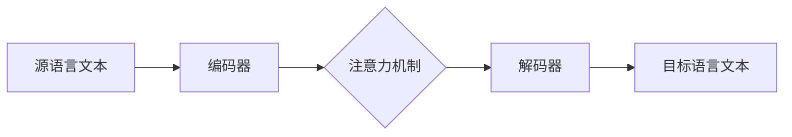

# 机器翻译(Machine Translation) - 原理与代码实例讲解

## 1. 背景介绍
机器翻译（MT）是自然语言处理（NLP）领域的一个重要分支，它致力于使用计算机程序将一种自然语言文本翻译成另一种语言。从早期的基于规则的方法到现在的基于深度学习的模型，机器翻译技术经历了飞速的发展。随着全球化进程的加快，机器翻译在跨文化交流、国际贸易、信息获取等方面发挥着越来越重要的作用。

## 2. 核心概念与联系
机器翻译涉及多个核心概念，包括但不限于语言模型、序列到序列（Seq2Seq）模型、注意力机制、编码器-解码器架构等。这些概念之间相互联系，共同构成了现代机器翻译系统的基础。

## 3. 核心算法原理具体操作步骤
现代机器翻译系统通常采用编码器-解码器架构，其中编码器负责理解源语言文本，解码器则负责生成目标语言文本。注意力机制在此过程中起到关键作用，它能够帮助模型关注源文本中的相关部分以生成准确的翻译。



## 4. 数学模型和公式详细讲解举例说明
机器翻译中的数学模型主要基于概率和统计学原理。例如，语言模型通常使用条件概率来预测句子中的下一个词。Seq2Seq模型则通过最大化给定源语言句子时目标语言句子的条件概率来训练模型。

$$ P(y_1, ..., y_n | x_1, ..., x_m) = \prod_{i=1}^{n} P(y_i | y_1, ..., y_{i-1}, x_1, ..., x_m) $$

其中，$x_1, ..., x_m$ 表示源语言句子中的词序列，$y_1, ..., y_n$ 表示目标语言句子中的词序列。

## 5. 项目实践：代码实例和详细解释说明
以TensorFlow和Keras框架为例，我们可以构建一个简单的Seq2Seq模型来实现机器翻译。以下是一个简化的代码实例，展示了如何搭建和训练一个基本的机器翻译模型。

```python
# 代码示例（简化版）
from keras.models import Model
from keras.layers import Input, LSTM, Dense

# 定义模型参数
num_encoder_tokens = ...
num_decoder_tokens = ...
latent_dim = ...

# 构建编码器
encoder_inputs = Input(shape=(None, num_encoder_tokens))
encoder = LSTM(latent_dim, return_state=True)
encoder_outputs, state_h, state_c = encoder(encoder_inputs)
encoder_states = [state_h, state_c]

# 构建解码器
decoder_inputs = Input(shape=(None, num_decoder_tokens))
decoder_lstm = LSTM(latent_dim, return_sequences=True, return_state=True)
decoder_outputs, _, _ = decoder_lstm(decoder_inputs, initial_state=encoder_states)
decoder_dense = Dense(num_decoder_tokens, activation='softmax')
decoder_outputs = decoder_dense(decoder_outputs)

# 定义整个模型
model = Model([encoder_inputs, decoder_inputs], decoder_outputs)

# 编译和训练模型
model.compile(optimizer='rmsprop', loss='categorical_crossentropy')
model.fit([input_data, target_data], target_labels, batch_size=64, epochs=100, validation_split=0.2)
```

## 6. 实际应用场景
机器翻译技术广泛应用于在线翻译服务（如Google翻译、百度翻译）、国际会议同声传译、跨语言信息检索等场景。随着技术的进步，机器翻译的准确性和流畅性不断提高，应用范围也在不断扩大。

## 7. 工具和资源推荐
对于机器翻译的研究和实践，以下是一些推荐的工具和资源：
- TensorFlow和Keras：用于构建和训练机器翻译模型的深度学习框架。
- OpenNMT和MarianNMT：开源的神经机器翻译工具包，适合研究和生产使用。
- WMT（Workshop on Machine Translation）：提供机器翻译评测任务和数据集的国际会议。

## 8. 总结：未来发展趋势与挑战
机器翻译的未来发展趋势包括更深层次的语义理解、多模态翻译（结合视觉信息等）、低资源语言的翻译支持等。同时，挑战也很明显，如如何处理文化差异、俚语和双关语等语言现象，以及如何进一步提高翻译的实时性和准确性。

## 9. 附录：常见问题与解答
Q1: 机器翻译是否能够完全取代人工翻译？
A1: 尽管机器翻译的能力在不断提升，但目前还无法完全取代人工翻译，特别是在需要深层次文化理解和创造性表达的场合。

Q2: 如何评价机器翻译的质量？
A2: 机器翻译的质量通常通过BLEU（Bilingual Evaluation Understudy）等自动评价指标以及人工评估来衡量。

作者：禅与计算机程序设计艺术 / Zen and the Art of Computer Programming