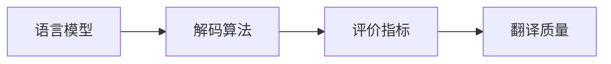
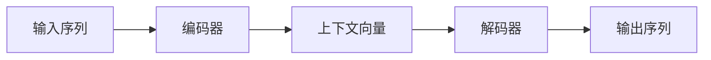

# 机器翻译(Machine Translation)原理与代码实战案例讲解

## 1. 背景介绍
机器翻译（Machine Translation, MT）是自然语言处理（NLP）领域的一个重要分支，它旨在使用计算机程序将一种自然语言文本翻译成另一种语言。从早期的基于规则的翻译系统，到统计机器翻译，再到如今的神经机器翻译，MT技术经历了长足的发展。随着全球化进程的加快，MT在跨语言交流、国际贸易、信息获取等方面发挥着越来越重要的作用。

## 2. 核心概念与联系
机器翻译涉及多个核心概念，包括但不限于语言模型、解码算法、评价指标等。这些概念之间存在着紧密的联系。语言模型用于评估翻译的流畅度，解码算法负责在模型生成的候选翻译中选择最佳输出，而评价指标则用于衡量翻译质量。



## 3. 核心算法原理具体操作步骤
神经机器翻译（Neural Machine Translation, NMT）是当前MT领域的主流技术。其核心算法原理是使用深度学习模型，尤其是序列到序列（Seq2Seq）模型，通过编码器-解码器架构来处理翻译任务。



## 4. 数学模型和公式详细讲解举例说明
Seq2Seq模型的核心是循环神经网络（RNN）或其变体，如长短期记忆网络（LSTM）和门控循环单元（GRU）。以LSTM为例，其数学模型可以表示为：

$$
\begin{align*}
f_t &= \sigma(W_f \cdot [h_{t-1}, x_t] + b_f) \\
i_t &= \sigma(W_i \cdot [h_{t-1}, x_t] + b_i) \\
\tilde{C}_t &= \tanh(W_C \cdot [h_{t-1}, x_t] + b_C) \\
C_t &= f_t * C_{t-1} + i_t * \tilde{C}_t \\
o_t &= \sigma(W_o \cdot [h_{t-1}, x_t] + b_o) \\
h_t &= o_t * \tanh(C_t)
\end{align*}
$$

其中，$f_t, i_t, o_t$ 分别是遗忘门、输入门和输出门的激活向量，$C_t$ 是细胞状态，$h_t$ 是隐藏状态，$x_t$ 是输入向量，$W$ 和 $b$ 是模型参数。

## 5. 项目实践：代码实例和详细解释说明
以TensorFlow和Keras为例，我们可以构建一个简单的Seq2Seq模型进行机器翻译。以下是构建模型的代码片段：

```python
from keras.models import Model
from keras.layers import Input, LSTM, Dense

# 定义模型参数
num_encoder_tokens = 256
num_decoder_tokens = 256
latent_dim = 256

# 编码器
encoder_inputs = Input(shape=(None, num_encoder_tokens))
encoder = LSTM(latent_dim, return_state=True)
encoder_outputs, state_h, state_c = encoder(encoder_inputs)
encoder_states = [state_h, state_c]

# 解码器
decoder_inputs = Input(shape=(None, num_decoder_tokens))
decoder_lstm = LSTM(latent_dim, return_sequences=True, return_state=True)
decoder_outputs, _, _ = decoder_lstm(decoder_inputs, initial_state=encoder_states)
decoder_dense = Dense(num_decoder_tokens, activation='softmax')
decoder_outputs = decoder_dense(decoder_outputs)

# 定义整个模型
model = Model([encoder_inputs, decoder_inputs], decoder_outputs)
```

## 6. 实际应用场景
机器翻译在多个领域都有广泛应用，如在线翻译服务（Google翻译、百度翻译）、国际会议同声传译、跨语言信息检索等。

## 7. 工具和资源推荐
- TensorFlow和Keras：用于构建和训练机器翻译模型的深度学习框架。
- OpenNMT和MarianNMT：开源的神经机器翻译工具。
- WMT（Workshop on Machine Translation）：提供机器翻译评测数据集和任务。

## 8. 总结：未来发展趋势与挑战
机器翻译的未来发展趋势包括更深层次的语义理解、多模态翻译、低资源语言的翻译等。同时，挑战也很明显，如翻译质量的进一步提升、处理长文本的能力、文化差异的适应等。

## 9. 附录：常见问题与解答
Q1: 机器翻译是否可以完全取代人工翻译？
A1: 目前还不能。机器翻译虽然在速度和成本上有优势，但在理解语境、文化差异等方面仍然存在局限。

Q2: 如何评价机器翻译的质量？
A2: 通常使用BLEU、METEOR等自动评价指标，也需要人工评估来衡量翻译的准确性和流畅性。

作者：禅与计算机程序设计艺术 / Zen and the Art of Computer Programming