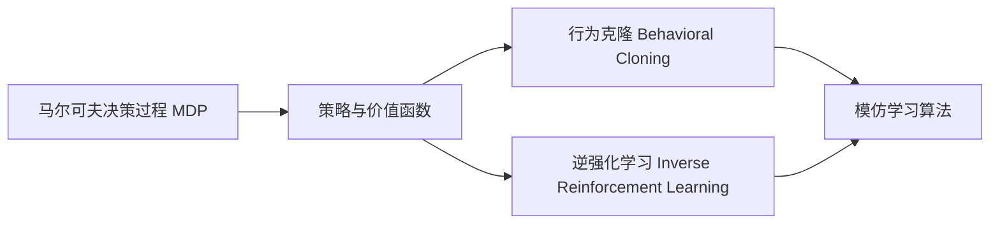

# 模仿学习 (Imitation Learning) 原理与代码实例讲解

## 1. 背景介绍

### 1.1 模仿学习的定义与起源

模仿学习（Imitation Learning，IL）是一种机器学习范式，它旨在通过模仿专家的行为来学习策略，从而使智能体能够完成特定任务。模仿学习起源于20世纪80年代早期的机器人领域，研究人员希望通过示范和模仿的方式来教授机器人执行任务，而无需对环境进行建模或编写复杂的控制算法。

### 1.2 模仿学习的应用场景

模仿学习在许多领域都有广泛的应用，例如：

- 机器人控制：通过示范动作来教授机器人执行复杂的操作，如装配、抓取等。
- 自动驾驶：通过模仿人类驾驶员的行为来训练自动驾驶系统。
- 游戏AI：通过观察人类玩家的游戏过程来学习游戏策略。
- 自然语言处理：通过模仿人类的对话和写作来生成自然语言文本。

### 1.3 模仿学习的优势与挑战

模仿学习的主要优势在于：

- 无需对环境进行显式建模，降低了问题复杂度。
- 通过模仿专家的行为，可以学习到有效的策略。
- 数据采集相对容易，可以通过示范或录制专家的行为来获取训练数据。

然而，模仿学习也面临一些挑战：

- 专家示范的质量和多样性会影响学习效果。
- 学习到的策略可能过于依赖专家的行为，泛化能力有限。
- 在复杂环境中，专家的行为可能不够优化，导致学习到次优策略。

## 2. 核心概念与联系

### 2.1 马尔可夫决策过程（MDP）

马尔可夫决策过程是一种用于描述序贯决策问题的数学框架，它由以下元素组成：

- 状态空间 $\mathcal{S}$：表示智能体所处的所有可能状态。
- 动作空间 $\mathcal{A}$：表示智能体在每个状态下可以采取的所有可能动作。
- 转移概率 $\mathcal{P}(s'|s,a)$：表示在状态 $s$ 下采取动作 $a$ 后转移到状态 $s'$ 的概率。
- 奖励函数 $\mathcal{R}(s,a)$：表示智能体在状态 $s$ 下采取动作 $a$ 后获得的即时奖励。
- 折扣因子 $\gamma \in [0,1]$：表示未来奖励的折扣程度，用于平衡即时奖励和长期奖励。

MDP为模仿学习提供了一个理论基础，使得我们可以将模仿学习问题形式化为在MDP中寻找最优策略的问题。

### 2.2 策略与价值函数

在MDP中，策略 $\pi(a|s)$ 表示智能体在状态 $s$ 下选择动作 $a$ 的概率分布。一个好的策略应该能够最大化累积奖励的期望值。

价值函数用于评估策略的优劣，常见的价值函数有：

- 状态价值函数 $V^\pi(s)$：表示从状态 $s$ 开始，遵循策略 $\pi$ 的期望累积奖励。
- 动作价值函数 $Q^\pi(s,a)$：表示在状态 $s$ 下采取动作 $a$，然后遵循策略 $\pi$ 的期望累积奖励。

在模仿学习中，我们希望学习到一个与专家策略相似的策略，使得智能体的行为能够模仿专家的行为。

### 2.3 行为克隆（Behavioral Cloning）

行为克隆是一种简单直接的模仿学习方法，其基本思想是通过监督学习的方式，直接学习专家的策略。

给定一组专家示范数据 $\mathcal{D} = \{(s_i, a_i)\}_{i=1}^N$，其中 $s_i$ 表示状态，$a_i$ 表示专家在该状态下采取的动作。行为克隆的目标是学习一个策略 $\pi_\theta(a|s)$，使其能够最小化在专家示范数据上的损失函数：

$$
\mathcal{L}(\theta) = \frac{1}{N} \sum_{i=1}^N \ell(\pi_\theta(a|s_i), a_i)
$$

其中，$\ell(\cdot,\cdot)$ 表示损失函数，常用的损失函数包括均方误差和交叉熵损失。

行为克隆的优点是简单易实现，但其缺点是容易出现分布漂移问题，即学习到的策略在面对未见过的状态时，表现可能会显著下降。

### 2.4 逆强化学习（Inverse Reinforcement Learning）

逆强化学习的目标是从专家的示范数据中恢复奖励函数，然后再利用学习到的奖励函数来优化策略。

假设专家的行为是由一个未知的奖励函数 $R^*(s,a)$ 所驱动的，那么逆强化学习的目标就是找到一个奖励函数 $\hat{R}(s,a)$，使得在该奖励函数下，专家的策略 $\pi^*$ 是最优的：

$$
\pi^* = \arg\max_\pi \mathbb{E}_{\tau \sim \pi} \left[ \sum_{t=0}^\infty \gamma^t \hat{R}(s_t, a_t) \right]
$$

其中，$\tau$ 表示轨迹 $(s_0, a_0, s_1, a_1, \dots)$，$\gamma$ 是折扣因子。

逆强化学习的优点是可以恢复奖励函数，从而更好地理解专家的行为偏好。但其缺点是计算复杂度较高，且学习到的奖励函数不一定是唯一的。

### 2.5 模仿学习算法之间的联系

行为克隆和逆强化学习是模仿学习的两大类主要方法，它们在实现方式和理论基础上有所不同，但都旨在通过模仿专家的行为来学习策略。

此外，还有一些结合了行为克隆和逆强化学习思想的模仿学习算法，如广义对比度（Generative Adversarial Imitation Learning，GAIL）和最大熵逆强化学习（Maximum Entropy Inverse Reinforcement Learning）等，它们通过引入对抗训练或最大熵原则，来提高模仿学习的稳定性和样本效率。

下图展示了模仿学习中几个核心概念之间的联系：

## 3. 核心算法原理与具体操作步骤

### 3.1 行为克隆算法

行为克隆算法的核心思想是通过监督学习的方式，直接学习专家策略 $\pi^*(a|s)$。具体操作步骤如下：

1. 收集专家示范数据 $\mathcal{D} = \{(s_i, a_i)\}_{i=1}^N$，其中 $s_i$ 表示状态，$a_i$ 表示专家在该状态下采取的动作。
2. 构建一个参数化的策略模型 $\pi_\theta(a|s)$，常用的模型包括深度神经网络、决策树等。
3. 定义损失函数 $\mathcal{L}(\theta)$，用于衡量策略模型的输出与专家动作之间的差异，常用的损失函数包括均方误差和交叉熵损失。
4. 使用优化算法（如梯度下降）来最小化损失函数，更新策略模型的参数 $\theta$。
5. 重复步骤3-4，直到策略模型收敛或达到预设的性能指标。

在实际应用中，为了提高行为克隆的性能，可以采取以下措施：

- 数据增强：通过对专家示范数据进行旋转、平移、噪声添加等操作，生成更多的训练样本。
- 迁移学习：利用预训练的模型（如在大规模数据集上训练的图像分类模型）来初始化策略模型，加速训练过程。
- 集成学习：训练多个策略模型，然后通过投票或加权平均的方式来组合它们的输出，提高决策的稳健性。

### 3.2 逆强化学习算法

逆强化学习算法的核心思想是从专家示范数据中恢复奖励函数 $R^*(s,a)$，然后再利用学习到的奖励函数来优化策略。具体操作步骤如下：

1. 收集专家示范数据 $\mathcal{D} = \{\tau_i\}_{i=1}^N$，其中 $\tau_i$ 表示专家的轨迹 $(s_0, a_0, s_1, a_1, \dots)$。
2. 构建一个参数化的奖励函数模型 $R_\psi(s,a)$，常用的模型包括线性组合特征函数和深度神经网络。
3. 定义损失函数 $\mathcal{L}(\psi)$，用于衡量学习到的奖励函数与专家策略之间的差异，常用的损失函数包括最大熵IRL和对比度IRL。
4. 使用优化算法（如梯度下降）来最小化损失函数，更新奖励函数模型的参数 $\psi$。
5. 利用学习到的奖励函数 $R_\psi(s,a)$，通过强化学习算法（如Q-learning或策略梯度）来优化策略 $\pi(a|s)$。
6. 重复步骤3-5，直到奖励函数模型和策略模型都收敛或达到预设的性能指标。

在实际应用中，为了提高逆强化学习的性能，可以采取以下措施：

- 特征工程：选择合适的特征函数来表示状态和动作，以便更好地捕捉专家策略的特点。
- 正则化：在奖励函数模型中引入正则化项，如L1/L2正则化或最大熵正则化，以避免过拟合。
- 多专家学习：同时学习多个专家的策略，然后将它们组合起来，以获得更稳健和通用的奖励函数。

### 3.3 广义对比度算法（GAIL）

GAIL算法是一种结合了行为克隆和逆强化学习思想的模仿学习算法，其核心思想是通过对抗训练的方式，使得学习到的策略能够欺骗一个判别器，使其无法区分该策略与专家策略。具体操作步骤如下：

1. 收集专家示范数据 $\mathcal{D} = \{\tau_i\}_{i=1}^N$，其中 $\tau_i$ 表示专家的轨迹 $(s_0, a_0, s_1, a_1, \dots)$。
2. 构建一个参数化的策略模型 $\pi_\theta(a|s)$ 和一个参数化的判别器模型 $D_\phi(s,a)$，常用的模型都是深度神经网络。
3. 定义策略模型的损失函数 $\mathcal{L}_\pi(\theta)$ 和判别器模型的损失函数 $\mathcal{L}_D(\phi)$：

$$
\mathcal{L}_\pi(\theta) = \mathbb{E}_{s \sim \pi_\theta}[\log D_\phi(s, \pi_\theta(s))] \\
\mathcal{L}_D(\phi) = \mathbb{E}_{(s,a) \sim \mathcal{D}}[\log D_\phi(s,a)] + \mathbb{E}_{s \sim \pi_\theta}[\log(1 - D_\phi(s, \pi_\theta(s)))]
$$

4. 交替训练策略模型和判别器模型，即固定 $\phi$ 优化 $\mathcal{L}_\pi(\theta)$，然后固定 $\theta$ 优化 $\mathcal{L}_D(\phi)$。
5. 重复步骤4，直到策略模型和判别器模型都收敛或达到预设的性能指标。

在实际应用中，为了提高GAIL的性能，可以采取以下措施：

- 引入熵正则化：在策略模型的损失函数中加入熵正则化项，以鼓励策略的探索性和多样性。
- 引入梯度惩罚：在判别器模型的损失函