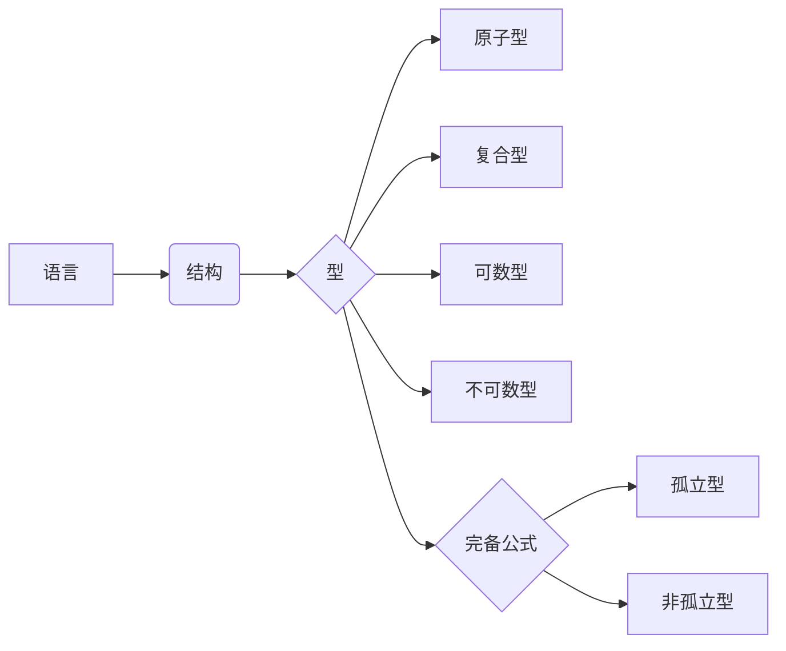

# 模型论基础：型，完备公式和孤立型

## 1. 背景介绍

### 1.1 模型论的起源与发展
#### 1.1.1 模型论的诞生
#### 1.1.2 模型论的早期发展
#### 1.1.3 模型论的现代发展

### 1.2 模型论在数学逻辑中的地位
#### 1.2.1 模型论与证明论的关系  
#### 1.2.2 模型论与集合论的关系
#### 1.2.3 模型论与计算理论的关系

### 1.3 模型论的应用领域
#### 1.3.1 模型论在代数学中的应用
#### 1.3.2 模型论在计算机科学中的应用  
#### 1.3.3 模型论在其他学科中的应用

## 2. 核心概念与联系

### 2.1 语言、结构与解释
#### 2.1.1 一阶语言的定义
#### 2.1.2 结构的定义
#### 2.1.3 解释的定义

### 2.2 型的概念与分类
#### 2.2.1 型的定义
#### 2.2.2 原子型与复合型  
#### 2.2.3 可数型与不可数型

### 2.3 型与结构之间的关系
#### 2.3.1 型决定论  
#### 2.3.2 型与同构
#### 2.3.3 型与基数

### 2.4 型与公式之间的关系
#### 2.4.1 型与可满足性
#### 2.4.2 型与公式的保持
#### 2.4.3 型与公式的定义性质

## 3. 核心算法原理具体操作步骤

### 3.1 构造型的算法
#### 3.1.1 原子型的构造
#### 3.1.2 复合型的构造
#### 3.1.3 构造型算法的复杂度分析

### 3.2 判定型等价的算法  
#### 3.2.1 有限型等价判定算法
#### 3.2.2 可数型等价判定算法
#### 3.2.3 判定型等价算法的复杂度分析

### 3.3 计算型的基数的算法
#### 3.3.1 有限型基数的计算
#### 3.3.2 可数型基数的计算
#### 3.3.3 计算型基数算法的复杂度分析

## 4. 数学模型和公式详细讲解举例说明

### 4.1 语言的形式化定义
#### 4.1.1 字母表、项、原子公式
#### 4.1.2 公式、句子、理论的定义
#### 4.1.3 语言的例子

### 4.2 结构的形式化定义
#### 4.2.1 域、解释、满足的定义  
#### 4.2.2 子结构、初等子结构的定义
#### 4.2.3 结构的例子

### 4.3 型的形式化定义
#### 4.3.1 分隔公式与完备公式  
#### 4.3.2 型的定义与例子
#### 4.3.3 孤立型的定义与例子

### 4.4 型与结构的关系定理
#### 4.4.1 型决定论定理
#### 4.4.2 可数型的结构存在定理
#### 4.4.3 不可数型的结构存在定理

## 5. 项目实践：代码实例和详细解释说明

### 5.1 构造型的程序实现
#### 5.1.1 原子型构造程序
#### 5.1.2 复合型构造程序  
#### 5.1.3 程序运行示例与解释

### 5.2 判定型等价的程序实现
#### 5.2.1 有限型等价判定程序
#### 5.2.2 可数型等价判定程序
#### 5.2.3 程序运行示例与解释

### 5.3 计算型基数的程序实现  
#### 5.3.1 有限型基数计算程序
#### 5.3.2 可数型基数计算程序
#### 5.3.3 程序运行示例与解释

## 6. 实际应用场景

### 6.1 在代数学中的应用
#### 6.1.1 判定代数结构的性质
#### 6.1.2 构造特殊的代数结构
#### 6.1.3 研究代数结构之间的关系

### 6.2 在计算机科学中的应用
#### 6.2.1 数据库理论中的应用
#### 6.2.2 形式验证中的应用
#### 6.2.3 逻辑程序设计中的应用

### 6.3 在其他学科中的应用
#### 6.3.1 语言学中的应用
#### 6.3.2 物理学中的应用
#### 6.3.3 经济学中的应用

## 7. 工具和资源推荐

### 7.1 学习模型论的书籍推荐
#### 7.1.1 入门级书籍推荐
#### 7.1.2 进阶级书籍推荐
#### 7.1.3 专题书籍推荐

### 7.2 研究模型论的论文数据库
#### 7.2.1 ArXiv论文数据库
#### 7.2.2 DBLP计算机科学文献数据库
#### 7.2.3 Web of Science数据库

### 7.3 模型论的开源项目与工具
#### 7.3.1 Coq证明助手
#### 7.3.2 Isabelle定理证明器
#### 7.3.3 Alloy形式化建模工具

## 8. 总结：未来发展趋势与挑战

### 8.1 模型论研究的前沿方向
#### 8.1.1 无穷结构的模型论
#### 8.1.2 抽象初等类的模型论
#### 8.1.3 连续逻辑的模型论

### 8.2 模型论面临的主要挑战
#### 8.2.1 判定问题的复杂性挑战
#### 8.2.2 无穷结构的刻画挑战
#### 8.2.3 非经典逻辑的模型论挑战

### 8.3 模型论的发展前景展望
#### 8.3.1 与其他数学分支的交叉融合
#### 8.3.2 在计算机科学中的应用拓展
#### 8.3.3 对其他学科发展的促进作用

## 9. 附录：常见问题与解答

### 9.1 型与公式的区别与联系
### 9.2 "型决定论"的直观解释
### 9.3 "完备公式"的概念辨析
### 9.4 "孤立型"有何特殊性？
### 9.5 模型论三大基本问题的内涵

作者：禅与计算机程序设计艺术 / Zen and the Art of Computer Programming

模型论是数理逻辑的一个重要分支，它主要研究数学结构及其性质。作为数学逻辑的一个分支，模型论与其他数学分支如代数、拓扑、集合论等有着密切的联系。模型论的核心概念包括语言、结构、解释、型、公式等。

语言是模型论研究的基础，它规定了研究对象的表达方式。一阶语言是模型论中最常用的语言，由逻辑联结词、量词、变元、常元、函数和谓词等符号组成。结构是语言的解释，它为语言中的符号赋予了具体含义。一个结构由一个非空域和在其上定义的常元、函数、关系等组成。型是刻画结构的重要工具，它由一系列公式组成，这些公式在结构中都成立。原子型由原子公式组成，复合型则由更复杂的公式组成。可数型的域是可数的，而不可数型的域是不可数的。

完备公式在结构中非真即假，它们将结构分为两类。如果一个型中包含某个完备公式，则该型只有一个结构满足，这样的型称为孤立型。孤立型有许多优良的性质，在模型论中占有重要地位。判定一个型是否孤立，构造满足型的结构，计算型的基数，是模型论的三大基本问题。

在实际应用中，模型论被广泛用于研究代数结构的性质。例如，利用模型论的方法可以判定一个群是否是单群，判定一个环是否是整环等。在计算机科学中，模型论被用于数据库理论、形式验证、逻辑程序设计等领域。模型论强大的表达能力和推理能力，使其在形式化需求分析、系统设计与验证等方面发挥了重要作用。

模型论经过一个多世纪的发展，已经成为数理逻辑的一个成熟分支。但是，模型论仍然面临许多挑战，如判定问题的复杂性、无穷结构的刻画等。随着数学和计算机科学的不断发展，模型论也在不断拓展其研究领域和方法。模型论与其他数学分支的交叉融合，必将推动模型论的进一步发展，并为其他学科的发展注入新的活力。

$\textbf{定义1}$ 设$\mathcal{L}$是一个一阶语言，$\mathcal{L}$-结构$\mathcal{M}$由以下数据组成：

(1) 一个非空集合$M$，称为$\mathcal{M}$的域，记为$|\mathcal{M}|$;

(2) 对于$\mathcal{L}$中的每个常元符号$c$，指定$M$中的一个元素$c^{\mathcal{M}}$;

(3) 对于$\mathcal{L}$中的每个$n$元函数符号$f$，指定$M$上的一个$n$元函数$f^{\mathcal{M}}:M^n \to M$;

(4) 对于$\mathcal{L}$中的每个$n$元关系符号$R$，指定$M$上的一个$n$元关系$R^{\mathcal{M}} \subseteq M^n$。

$\textbf{定义2}$ 设$\mathcal{M}$是$\mathcal{L}$-结构，$\varphi(x_1,\ldots,x_n)$是$\mathcal{L}$中的公式，$a_1,\ldots,a_n \in M$。称$\mathcal{M}$满足$\varphi[a_1,\ldots,a_n]$，记为$\mathcal{M} \models \varphi[a_1,\ldots,a_n]$，是指把$a_1,\ldots,a_n$依次代入$\varphi$中的自由变元$x_1,\ldots,x_n$，所得$\mathcal{L}(\mathcal{M})$公式在$\mathcal{M}$中为真。这里$\mathcal{L}(\mathcal{M})$是在$\mathcal{L}$中加入对应于$M$中元素的新常元符号得到的语言。

$\textbf{定义3}$ $\mathcal{L}$-结构$\mathcal{M}$的一个型是由一些$\mathcal{L}$-公式组成的集合$p(\bar{x})$，这些公式在$\mathcal{M}$中都成立，即对每个$\varphi(\bar{x}) \in p$，有$\mathcal{M} \models \varphi(\bar{a})$对某个$\bar{a} \in M$成立。型$p$称为是$n$型，如果$p$中的公式都有$n$个自由变元。

综上所述，型、完备公式和孤立型是模型论的核心概念，它们刻画了数学结构的本质特征，揭示了结构之间的内在联系，在理论研究和实际应用中都有着不可或缺的作用。深入理解和运用这些概念，对于开展模型论研究和将其应用于解决实际问题，具有重要意义。