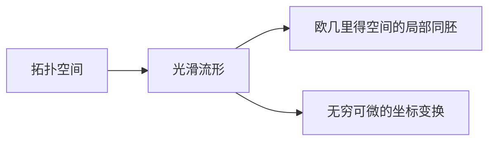
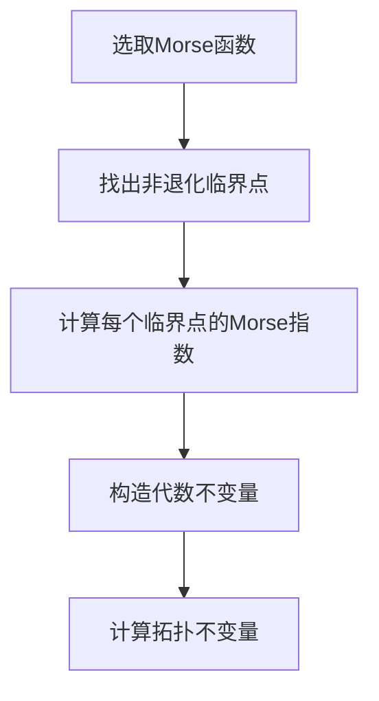
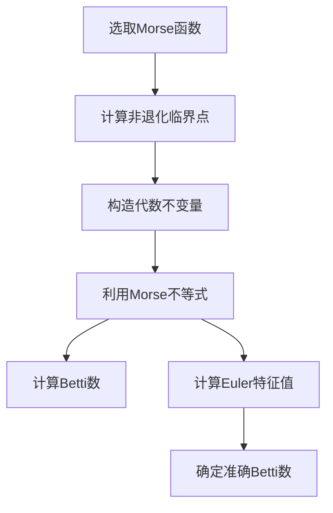

# 流形拓扑学理论与概念的实质：Morse理论(II)

## 1.背景介绍

### 1.1 拓扑学简介
拓扑学是一门研究空间几何性质的数学分支,尤其关注那些在连续变形下保持不变的性质。它起源于对曲线和曲面等基本几何对象的研究,后来发展成为一个独立的数学领域。

拓扑学的核心思想是研究空间中对象的形状和相互位置关系,而忽略刚性变换、缩放等不改变本质的变形。因此,拓扑学常被形象地描述为"橡皮几何学"。

### 1.2 流形理论概述
流形(manifold)是拓扑学中的一个基本概念。直观地说,流形是局部类似于欧几里得空间,但在全局上可能扭曲并具有更复杂的结构。

流形理论为探索各种几何和拓扑性质提供了坚实的基础。例如,通过研究流形上的映射、微分形式、向量丛等概念,可以揭示空间的本质结构和不变量。

### 1.3 Morse理论的重要性
Morse理论是拓扑学中一个极其重要的分支,由20世纪著名数学家Morse于1925年创立。它为研究流形的拓扑不变量提供了有力的工具,在许多数学和物理领域都有广泛的应用。

Morse理论的核心思想是利用一个函数的临界点来研究流形的拓扑结构。通过分析函数的临界点的指数和拓扑类型,可以计算出流形的若干基本拓扑不变量,如Betti数、Euler特征值等。

## 2.核心概念与联系

### 2.1 光滑流形
在研究Morse理论之前,我们首先需要了解光滑流形的概念。一个光滑流形是一个拓扑空间,在局部上等同于欧几里得空间,并且在不同坐标邻域间的转换是无穷可微的。

形式上,如果一个拓扑空间M可以覆盖成一族坐标邻域{(Uα,φα)},使得每个φα:Uα→Rn都是一个同胚映射,那么M就是一个n维光滑流形。

光滑流形保证了在局部上可以使用微分和积分的概念和工具,为发展Morse理论奠定了基础。



### 2.2 Morse函数
Morse理论的核心概念是Morse函数。设M是一个光滑流形,f:M→R是一个光滑函数。如果f的所有临界点都是非退化的(即Hesse矩阵在临界点处是非奇异的),那么f就被称为Morse函数。

非退化条件保证了临界点在局部上有一个标准形式,这对于研究流形的拓扑结构至关重要。

$$
\begin{aligned}
f(x_1,\ldots,x_n) &= f(x_0) - \sum_{i=1}^{\lambda} x_i^2 + \sum_{j=\lambda+1}^{n} x_j^2\\
&= \text{const} - \sum \text{(正项)} + \sum \text{(负项)}
\end{aligned}
$$

其中$\lambda$被称为临界点的Morse指数,反映了临界点的拓扑类型。


### 2.3 Morse理论与其他概念的联系
Morse理论与拓扑学中的许多其他概念密切相关:

- 拓扑不变量(Betti数、Euler特征值等)
- 射影空间和单射度理论
- 微分形式和de Rham上同调
- 向量丛和切丛
- 李群和李代数
- 代数拓扑和同伦理论

Morse理论为计算和理解这些重要的拓扑概念提供了有力的工具。同时,Morse理论本身也需要借助于其他数学工具,如微分几何、代数拓扑等。

## 3.核心算法原理具体操作步骤

### 3.1 Morse理论的基本思路
Morse理论的核心思路是:通过研究一个合适的Morse函数f在流形M上的临界点,来计算M的若干拓扑不变量。具体步骤如下:

1. 在流形M上选取一个Morse函数f。
2. 找出f的所有非退化临界点,计算每个临界点的Morse指数。
3. 根据临界点的指数和个数,构造一些代数不变量,如Morse多项式等。
4. 利用这些代数不变量计算出流形M的拓扑不变量,如Betti数、Euler特征值等。



### 3.2 Morse不等式
Morse不等式是Morse理论的一个重要结果,它建立了流形的Betti数与Morse函数临界点个数之间的关系。

设M是一个紧致无边界的n维光滑流形,f是M上的一个Morse函数,mi表示指数为i的临界点个数,那么对任意k≥0,有:

$$
\sum_{j=0}^k (-1)^{k-j} m_j \leq \sum_{j=0}^k (-1)^{k-j} \beta_j \leq \sum_{j=0}^{k+1} (-1)^{k+1-j} m_j
$$

其中$\beta_j$是M的第j维Betti数。当k=n时,等号必然成立,这就给出了M的Euler特征值:

$$
\chi(M) = \sum_{j=0}^n (-1)^j m_j = \sum_{j=0}^n (-1)^j \beta_j
$$

### 3.3 Morse理论的一般流程
根据上述基本思路,我们可以总结出Morse理论的一般计算流程:

1. 选取一个合适的Morse函数f。
2. 计算f的所有非退化临界点及其Morse指数。
3. 构造Morse多项式或其他代数不变量。
4. 利用Morse不等式计算Betti数。
5. 当k=n时,计算出Euler特征值。
6. 结合其他工具(如单射度理论),确定准确的Betti数。

这个流程为计算拓扑不变量提供了一种有效的算法框架。当然,在具体应用中,我们还需要结合问题的特殊性,做出适当的调整和优化。



## 4.数学模型和公式详细讲解举例说明

在前面的部分,我们已经介绍了Morse理论的一些核心概念和基本思路。现在,让我们通过具体的数学模型和公式,来深入理解Morse理论的本质内涵。

### 4.1 Morse函数的局部形式
回顾一下Morse函数的定义:设M是一个n维光滑流形,f:M→R是一个光滑函数。如果f的所有临界点都是非退化的,即在每个临界点p处,Hesse矩阵H(p)是非奇异的,那么f就被称为Morse函数。

根据Morse引理,在一个非退化临界点p的某个邻域U内,存在适当的局部坐标系(x1,x2,...,xn),使得f在U内具有如下标准形式:

$$
f(x_1,\ldots,x_n) = f(p) - \sum_{i=1}^{\lambda} x_i^2 + \sum_{j=\lambda+1}^{n} x_j^2
$$

其中$\lambda$是Hesse矩阵H(p)的负惯性指数,被称为p的Morse指数。Morse指数反映了临界点的拓扑类型,对于计算拓扑不变量至关重要。

例如,对于一个2维球面S^2,考虑高度函数f(x,y,z)=z。易见f是一个Morse函数,它有两个非退化临界点:北极点(0,0,1)和南极点(0,0,-1)。在北极点邻域内,f具有形式f=1-x^2-y^2;在南极点邻域内,f=(-1)-x^2-y^2。因此,北极点的Morse指数是0,南极点的Morse指数是2。

### 4.2 Morse多项式
Morse多项式是Morse理论中一个重要的代数不变量,它由Morse函数的临界点个数和指数构成。

设M是一个n维紧致无边界流形,f是M上的一个Morse函数,mi表示指数为i的临界点个数,则M的Morse多项式定义为:

$$
M_t(f) = \sum_{i=0}^n m_i t^i
$$

Morse多项式对研究流形的拓扑结构很有用,因为它与流形的Betti数和Euler特征值之间存在着密切的关系。

具体来说,如果令t=1,那么M_1(f)就是所有临界点的总数,等于n+1。当t=-1时,M_{-1}(f)就是Euler特征值$\chi(M)$的相反数。

更一般地,Morse多项式的系数与流形的Betti数之间满足Morse不等式的约束关系。

### 4.3 Morse不等式的证明
Morse不等式是Morse理论的一个核心结果,建立了流形的Betti数与Morse函数临界点个数之间的关系。现在让我们来看一下它的证明思路。

证明的关键在于构造一个链复形,其中每个链由Morse函数的一个子级集组成。具体来说,对于每个k≥0,定义k-链群C_k为所有k维子级集的正式线性组合,其中子级集的维数由Morse指数决定。

接下来,我们定义一个边界同调映射∂:C_k→C_{k-1},将每个k维子级集映射到它的边界(k-1)维子级集之和。利用Morse理论的一些基本结果,可以证明∂∂=0,从而(C_*,∂)构成一个链复形。

现在,我们来计算这个链复形的k维同伦群H_k(C_*)。由于每个k维子级集都可以由指数为k的临界点生成,所以H_k(C_*)的维数就是指数为k的临界点个数m_k。

另一方面,根据同伦理论,H_k(C_*)与流形M的k维Betti数β_k之间存在一个关系:

$$
\beta_k \leq \dim H_k(C_*) \leq \beta_k + \dim H_{k+1}(C_*)
$$

将这两个结果结合,就可以导出Morse不等式:

$$
\sum_{j=0}^k (-1)^{k-j} m_j \leq \sum_{j=0}^k (-1)^{k-j} \beta_j \leq \sum_{j=0}^{k+1} (-1)^{k+1-j} m_j
$$

当k=n时,等号必然成立,从而可以计算出流形的Euler特征值。

这个证明过程揭示了Morse理论的深刻内涵:通过研究Morse函数的拓扑性质,可以有效地计算出流形的基本拓扑不变量。

## 5.项目实践:代码实例和详细解释说明

为了更好地理解Morse理论的实际应用,让我们来看一个具体的编程实例。在这个例子中,我们将计算一个2维球面S^2的Betti数和Euler特征值。

我们将使用Python和NumPy库来实现相关的数值计算。首先,导入所需的库:

```python
import numpy as np
```

### 5.1 定义Morse函数
我们选取S^2上的高度函数f(x,y,z)=z作为Morse函数。在代码中,我们将使用一个Python函数来表示f:

```python
def f(x, y, z):
    return z
```

### 5.2 计算临界点和Morse指数
接下来,我们需要找出f的所有非退化临界点,并计算它们的Morse指数。对于2维球面,我们可以直接分析得到两个临界点:(0,0,1)和(0,0,-1),它们的Morse指数分别为