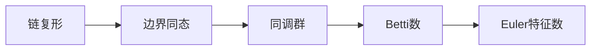

# 流形拓扑学理论与概念的实质：同调理论

## 1.背景介绍

拓扑学是一门研究空间几何性质的数学分支,尤其关注形状和空间在经过连续变形后保持不变的性质。流形拓扑学是拓扑学的一个重要分支,专注于研究流形(Manifold)这一概念,流形可以简单理解为在某种意义上"看起来像欧几里得空间"的拓扑空间。

同调理论(Homology Theory)是流形拓扑学中最基础也最重要的理论之一。它提供了一种代数化的方法来研究和分类流形的拓扑不变量,为人们理解和操作抽象的拓扑空间提供了强有力的工具。

### 1.1 同调理论的重要意义

同调理论在数学、物理、计算机科学等诸多领域都有广泛的应用:

- 在代数拓扑学中,同调理论是研究高维空间拓扑性质的基础理论。
- 在微分几何和微分拓扑学中,同调理论为研究流形的不变量提供了有力工具。
- 在代数几何中,同调理论为研究代数多样体的性质提供了重要手段。
- 在组合拓扑学中,同调理论为分类和计算简单多元拓扑空间的不变量提供了有效方法。
- 在数据分析和机器学习中,拓扑数据分析(TDA)利用同调理论研究数据集的形状和结构。
- 在计算机图形学和计算机视觉中,同调理论为三维重建、形状分析等提供了理论基础。

总的来说,同调理论为研究几何拓扑对象的代数不变量提供了强有力的工具,在数学和应用数学的诸多领域都有重要应用。

### 1.2 同调理论发展简史

同调理论的起源可以追溯到19世纪初,当时数学家们开始研究高维空间的代数拓扑性质。1895年,Henri Poincaré在研究代数曲线时引入了后来被称为Betti数的概念,为现代同调理论奠定了基础。20世纪初,Emil Artin和其他数学家进一步发展了同调理论,将其推广到更一般的情况。

1930年代至1940年代,Samuel Eilenberg和Norman Steenrod建立了单链复形和单链同调的理论体系,为同调理论提供了坚实的代数基础。1945年,Jean Leray引入了谱序列,将同调理论与其他数学分支(如微分拓扑学)联系起来。

20世纪后半叶,同调理论得到了进一步发展和推广,例如扩张到更一般的系数群、交叉理论、K同调理论等。同时,同调理论也在应用数学的诸多领域得到了广泛应用,成为一个活跃的研究领域。

## 2.核心概念与联系

同调理论中有几个核心概念,相互之间存在密切联系:



### 2.1 链复形(Chain Complex)

链复形是同调理论的基本代数结构,由一系列Abel群(通常为自由Abel群)及其之间的边界同态(Boundary Homomorphism)组成。每个Abel群中的元素称为链(Chain),代表着空间中的某种代数拓扑结构。

例如,对于一个简单的三角形,我们可以构造如下链复形:

$$
0 \xrightarrow{\ \partial_3\ } \mathbb{Z} \xrightarrow{\ \partial_2\ } \mathbb{Z}^3 \xrightarrow{\ \partial_1\ } \mathbb{Z}^3 \xrightarrow{\ \partial_0\ } 0
$$

其中 $\mathbb{Z}$ 表示整数群, $\partial_i$ 是将 $i$ 维链映射到 $(i-1)$ 维链的边界同态。

### 2.2 边界同态(Boundary Homomorphism)

边界同态是链复形中的同态映射,将高维链映射到低维链的边界之上。边界同态满足 $\partial_{i-1} \circ \partial_i = 0$,即边界的边界为零,这是同调理论的基本公理。

例如,在上面的三角形链复形中, $\partial_2$ 将一个三角形面映射到它的三条边, $\partial_1$ 则将一条边映射到它的两个端点,而 $\partial_0$ 映射为零。

### 2.3 同调群(Homology Group)

同调群是同调理论中最核心的代数不变量。对于每个维数 $i$,我们定义 $i$ 维同调群为:

$$
H_i(X) = \ker \partial_i / \text{im} \partial_{i+1}
$$

即 $\partial_i$ 的核心模去 $\partial_{i+1}$ 的像。直观地说,同调群测量了链复形中"没有边界"的 $i$ 维链的数量。

同调群能够很好地刻画空间的"洞"和"连通分量"等拓扑不变量。例如,对于一个环面,它的 0 维和 2 维同调群都是 $\mathbb{Z}$,而 1 维同调群是 $\mathbb{Z}^2$,这刻画了环面有一个连通分量和两个一维洞。

### 2.4 Betti 数(Betti Number)

Betti 数是同调群的一个重要代数不变量,定义为同调群的rank。第 $i$ 个 Betti 数 $\beta_i$ 等于第 $i$ 维同调群中的元素个数。

Betti 数能够测度空间中不同维度的"洞"的数量。例如,对于一个环面, $\beta_0 = 1, \beta_1 = 2, \beta_2 = 1$,这说明它有一个连通分量,两个一维洞,一个二维洞。

### 2.5 Euler 特征数(Euler Characteristic)

Euler 特征数是一个重要的拓扑不变量,由 Betti 数按如下公式计算:

$$
\chi(X) = \sum_{i=0}^{\infty} (-1)^i \beta_i
$$

对于紧致流形,Euler 特征数只依赖于流形的维数和连通分量个数。这个著名的结果被称为Poincaré-Hopf 定理。

例如,对于一个球面, $\chi = 1 + 0 + 1 = 2$;对于一个环面, $\chi = 1 - 2 + 1 = 0$。Euler 特征数为 0 意味着该流形是非球面的。

## 3.核心算法原理具体操作步骤

计算同调群和 Betti 数的一种有效方法是使用简单矩阵运算。我们将介绍如何对一个简单的三角形网格计算同调群。

### 3.1 构建链复形矩阵

首先,我们需要为每个维数构建一个矩阵,其中的行向量表示该维数的链。例如,对于一个由三个三角形组成的网格:

```
       3
      /\
     /  \
    /    \
   /      \
  1-------2
```

其 0 维、1 维和 2 维链复形矩阵分别为:

$$
C_0 = \begin{bmatrix}
1 & 0 & 0 & 0\\
0 & 1 & 0 & 0\\  
0 & 0 & 1 & 0\\
0 & 0 & 0 & 1
\end{bmatrix} \qquad
C_1 = \begin{bmatrix}
1 & 0 & 0 & -1 & -1 & 0\\
0 & 1 & 0 & 1 & 0 & -1\\
0 & 0 & 1 & 0 & -1 & 1
\end{bmatrix} \qquad
C_2 = \begin{bmatrix}
1 & 1 & 1
\end{bmatrix}
$$

这里 $C_0$ 的列向量表示 4 个顶点, $C_1$ 的列向量表示 6 条边, $C_2$ 只有 1 个三角形面。

### 3.2 计算边界矩阵

接下来,我们需要计算边界矩阵 $\partial_i$,它将 $i$ 维链映射到 $(i-1)$ 维链的边界之上。对于上面的例子,边界矩阵为:

$$
\partial_2 = C_2 \qquad
\partial_1 = \begin{bmatrix}
-1 & 1 & 0 & -1 & 0 & 0\\
0 & -1 & 1 & 0 & -1 & 0\\
1 & 0 & -1 & 1 & 1 & 0\\
0 & 0 & 0 & 0 & 0 & 1\\
0 & 0 & 0 & 0 & 0 & -1
\end{bmatrix} \qquad
\partial_0 = 0
$$

可以验证 $\partial_1 \circ \partial_2 = 0$ 和 $\partial_0 \circ \partial_1 = 0$,这就是边界的边界为零的公理。

### 3.3 计算同调群

现在我们可以计算同调群了。对于每个维数 $i$,我们先找到 $\partial_i$ 的核心,即所有被映射到 0 的链;然后在这个核心中去掉 $\partial_{i+1}$ 的像,剩下的就是同调群。

对于上面的例子:

- $\ker \partial_2 = \{0\}$,因为三角形面的边界不为 0
- $\text{im} \partial_3 = \{0\}$,因为没有 3 维链
- 所以 $H_2 = \ker \partial_2 / \text{im} \partial_3 = 0$

- $\ker \partial_1 = \text{span}\{(1,1,0,-1,0,0), (0,1,-1,0,1,0), (1,0,1,0,0,-1)\}$
- $\text{im} \partial_2 = \text{span}\{(1,1,1)\}$  
- 所以 $H_1 = \ker \partial_1 / \text{im} \partial_2 \cong \mathbb{Z}^2$

- $\ker \partial_0 = C_0 = \mathbb{Z}^4$
- $\text{im} \partial_1 = \text{span}\{(1,-1,0,0,0), (0,1,-1,0,0), (0,0,1,-1,0), (0,0,0,1,-1)\} \cong \mathbb{Z}^3$
- 所以 $H_0 = \ker \partial_0 / \text{im} \partial_1 \cong \mathbb{Z}$

因此,这个三角形网格的 Betti 数为 $\beta_0 = 1, \beta_1 = 2, \beta_2 = 0$,这说明它有一个连通分量和两个一维洞。

### 3.4 算法复杂度

上述算法的时间复杂度主要取决于矩阵运算的复杂度。构建链复形矩阵的复杂度为 $O(n)$,其中 $n$ 是 $k$ 簇的数量。计算边界矩阵的复杂度为 $O(n^2)$。而计算同调群需要进行矩阵化简,时间复杂度为 $O(n^3)$。

因此,该算法的总体时间复杂度为 $O(n^3)$,其中 $n$ 是输入数据中的 $k$ 簇数量。对于大规模数据集,这种基于矩阵的算法可能会变得低效,需要使用更高级的算法如流式算法等。

## 4.数学模型和公式详细讲解举例说明

在同调理论中,有许多重要的数学模型和公式,我们将详细讲解其中的几个核心概念。

### 4.1 单链复形(Singular Chain Complex)

单链复形是同调理论中最基本和最常用的链复形模型。对于一个拓扑空间 $X$,我们定义它的 $i$ 维单链群 $C_i(X)$ 为所有从标准 $i$ 维单体 $\Delta^i$ 到 $X$ 的奇异映射之自由阿贝尔群。

更精确地,设 $\Delta^i$ 表示标准 $i$ 维单形,即 $i$ 维单位球面的一个 $i$ 维面。一个 $i$ 维奇异单链就是一个形如 $\sum_j n_j \sigma_j$ 的形式之和,其中 $n_j \in \mathbb{Z}$ 是整数系数, $\sigma_j: \Delta^i \rightarrow X$ 是从标准 $i$ 维单形到空间 $X$ 的奇异映射。

所有这样的 $i$ 维奇异单链在适当的加法下构成了一个阿贝尔群 $C_i(