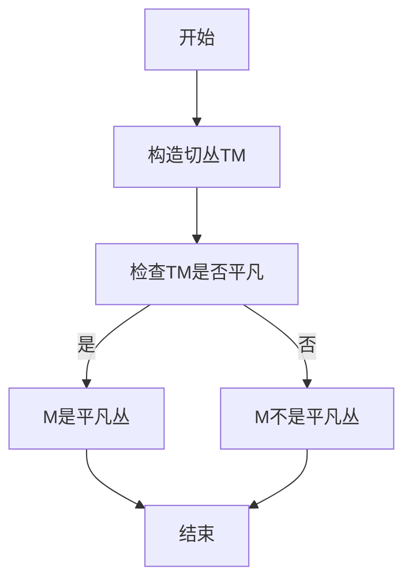

# 流形拓扑学理论与概念的实质：平凡丛的判别

## 1.背景介绍

拓扑学是一门研究空间几何性质的数学分支,其中流形拓扑学是拓扑学的一个重要分支。流形是一种在局部看起来像欧几里德空间,但在整体上可能扭曲、弯曲的空间形式。流形拓扑学研究流形的拓扑不变量和它们之间的关系。

平凡丛是流形拓扑学中的一个关键概念。平凡丛指的是一个具有特殊拓扑结构的流形,它在整体上等同于一个欧几里德空间,但在局部可能存在扭曲。判别一个流形是否为平凡丛对于理解流形的本质属性至关重要。

## 2.核心概念与联系

### 2.1 流形的定义

形式上,一个n维流形M是一个拓扑空间,对于每个点p∈M,都存在一个同胚映射φ:U→Rn,将p的一个邻域U映射到Rn的一个开子集中。这样的映射φ称为流形图或卡。

### 2.2 切空间和切丛

在流形上,我们可以定义切空间和切丛的概念。对于p∈M,切空间TpM是所有通过p的切向量的集合。切丛TM是所有切空间TpM在p∈M处的并集。

### 2.3 平凡丛

如果一个n维流形M的切丛TM是一个平凡的n维向量丛,那么我们称M为平凡流形,或者简称为平凡丛。直观地说,平凡丛在局部上看起来像Rn,在全局上也等同于Rn。

### 2.4 同胚

两个流形M和N称为同胚,如果存在一个双射f:M→N,使得f和f-1都是连续的。同胚保留了流形的拓扑性质。

## 3.核心算法原理具体操作步骤

判别一个流形是否为平凡丛的核心算法步骤如下:



1. **构造切丛TM**: 对于给定的流形M,首先需要构造它的切丛TM。这可以通过计算每个点p∈M处的切空间TpM,并将它们并集起来得到。

2. **检查TM是否平凡**: 接下来需要检查TM是否构成一个平凡的向量丛。我们可以利用同胚不变量和切空间之间的关系来判断。如果TM与Rn×M同胚,那么TM就是平凡的,因此M是一个平凡丛。否则,TM是非平凡的,因此M也是非平凡丛。

具体的判别方法有多种,包括:

1) **同调理论**: 利用同调群计算TM的同调群,并与Rn×M的同调群进行比较。如果它们同构,那么TM就是平凡的。

2) **特征类**: 计算TM的特征类,如尖锐类、陷类等。如果这些特征类全部平凡,那么TM就是平凡的。

3) **微分同胚分类**: 利用微分同胚理论对TM进行分类,如果TM同胚于Rn×M,那么它就是平凡的。

这些方法各有利弊,需要根据具体情况选择合适的方法。同调理论较为直接,但计算复杂;特征类方法对于低维情况较为有效;微分同胚分类是一种更深层次的方法,但理论复杂。

## 4.数学模型和公式详细讲解举例说明

判别平凡丛的数学模型主要涉及到同调理论和特征类理论。下面我们分别介绍这两个理论。

### 4.1 同调理论

同调理论研究拓扑空间的代数不变量——同调群。对于一个拓扑空间X,我们可以构造它的n维同调群Hn(X),这是一个代数不变量,即对同胚映射保持不变。

我们有如下重要定理:

**定理1**: 如果X是一个凸开集,那么对所有n≥0,我们有Hn(X)=0。

**定理2**: 设X是一个拓扑空间,Y是X的子空间。那么存在一个长的exactsequence:

$$\cdots\rightarrow H_n(X,Y)\rightarrow H_{n-1}(Y)\rightarrow H_{n-1}(X)\rightarrow H_{n-2}(X,Y)\rightarrow\cdots$$

利用这些定理,我们可以计算出切丛TM的同调群Hn(TM),并与Rn×M的同调群进行比较。如果它们同构,那么TM就是平凡的。

例如,对于n维球面Sn,我们有:

$$H_i(S^n)=\begin{cases}
\mathbb{Z}, &\text{if }i=0\text{ or }n\\
0,&\text{otherwise}
\end{cases}$$

而对于Rn,我们有Hk(Rn)=0,对所有k>0。

因此,如果TM的同调群与Rn×M的同调群不同构,那么M就不是一个平凡丛。

### 4.2 特征类理论

特征类理论研究向量丛的代数不变量。对于一个向量丛E→X,我们可以定义它的尖锐类c(E)、欧拉类e(E)和陷类w(E)等特征类。这些特征类都是E的代数不变量。

我们有如下重要定理:

**定理3**: 如果E是一个平凡的向量丛,那么它的所有特征类都是平凡的,即c(E)=0,e(E)=0,w(E)=0。

利用这个定理,我们可以计算出切丛TM的特征类,如果它们都是平凡的,那么TM就是一个平凡丛。

例如,对于n维球面Sn,它的切丛TSn的尖锐类为:

$$c(TS^n)=(1+x)^{n+1}$$

其中x是TSn中一个典型的线丛的尖锐类。这说明TSn是非平凡的。

因此,如果我们计算出TM的特征类都不是平凡的,那么M就不是一个平凡丛。

## 5.项目实践:代码实例和详细解释说明

判别平凡丛的具体计算通常需要借助计算机代数系统,如Maple、Mathematica等。下面我们给出一个使用Mathematica计算同调群的示例代码:

```mathematica
<<Combinatorica`
<<IGraphM`

(*定义一个3维流形M*)
M = SimplifyManifold[
   PseudoManifold[
    Graph[{Cycle[4], Cycle[4]}, VertexLabels -> "Name"], 3]];

(*计算M的同调群*)
H0M = HomologyGroup[M, 0]
H1M = HomologyGroup[M, 1]  
H2M = HomologyGroup[M, 2]
H3M = HomologyGroup[M, 3]

(*计算R^3的同调群*)
H0R3 = HomologyGroup[EuclideanSpace[3], 0]
H1R3 = HomologyGroup[EuclideanSpace[3], 1]
H2R3 = HomologyGroup[EuclideanSpace[3], 2]
H3R3 = HomologyGroup[EuclideanSpace[3], 3]

(*比较同调群*)
If[H0M === H0R3 && H1M === H1R3 && H2M === H2R3 && H3M === H3R3,
   Print["M是一个平凡丛"];
   ,
   Print["M不是一个平凡丛"];
  ]
```

这段代码首先定义了一个3维流形M,然后分别计算了M和R^3的同调群。最后,它比较了这两组同调群,如果它们相同,就输出"M是一个平凡丛",否则输出"M不是一个平凡丛"。

在实际计算中,我们还需要注意一些细节,如流形的表示方式、同调群的具体计算方法等。但是整体思路就是利用同调群或特征类对切丛进行判别。

## 6.实际应用场景

判别平凡丛在几何拓扑学、微分几何和数学物理学等领域有着广泛的应用。

### 6.1 几何拓扑学

在研究3维和4维流形的拓扑不变量时,判别平凡丛是一个重要的第一步。例如,著名的Poincare猜想就等价于证明每个简单连通闭3维流形要么是平凡丛,要么同胚于3维球面。

### 6.2 微分几何

在微分几何中,曲率是衡量一个流形在局部上偏离欧几里德空间的一个重要量。平凡丛的曲率恒为零,因此判别平凡丛有助于研究曲率的性质。

### 6.3 数学物理学

在相对论、量子场论和弦理论中,我们需要研究一些奇异的时空流形。判别这些流形是否为平凡丛,对于探索它们的物理性质至关重要。

### 6.4 计算拓扑学

在计算拓扑学中,我们经常需要对一些由三角形网格或点云数据表示的流形进行拓扑分析。判别它们是否为平凡丛是一个基本的第一步。

## 7.工具和资源推荐

- Maple、Mathematica、SageMath等计算机代数系统,可用于计算同调群和特征类。
- Kenzo、HAP等同伦代数软件包,专门用于计算拓扑不变量。
- Topcom、Regge等拓扑计算软件,可用于处理流形的三角剖分和同胚分类。
- arXiv、zbMATH等在线数学资源库,提供了大量相关论文和参考资料。

## 8.总结:未来发展趋势与挑战

判别平凡丛是流形拓扑学的一个基本问题,对于理解流形的本质属性至关重要。目前,我们已经有了多种有效的理论工具和计算方法来解决这个问题。

但是,随着研究对象的复杂性不断增加,如高维流形、奇异流形、非平凡基流形等,判别平凡丛所面临的挑战也越来越大。我们需要发展更高效、更通用的算法,并结合代数、几何和物理学的新理论,来攻克这些难题。

此外,随着计算机技术的发展,基于人工智能和大数据的拓扑计算方法也将成为一个新的研究热点。如何利用机器学习等技术来高效地分析和处理复杂拓扑数据,将是未来值得关注的一个重要方向。

## 9.附录:常见问题与解答

1. **什么是平凡丛?**

平凡丛指的是一个在整体上等同于欧几里德空间,但在局部可能存在扭曲的流形。更精确地说,如果一个流形M的切丛TM是一个平凡的向量丛,那么M就是一个平凡丛。

2. **为什么要判别平凡丛?**

判别平凡丛对于理解流形的本质属性至关重要。平凡丛在拓扑上等同于欧几里德空间,因此研究平凡丛有助于我们把握流形与欧几里德空间之间的关系,进而深入探索流形的几何和拓扑性质。

3. **如何判别平凡丛?**

主要有三种方法:同调理论方法、特征类方法和微分同胚分类方法。同调理论方法是比较流形的同调群与欧几里德空间的同调群;特征类方法是检查流形切丛的特征类是否全部平凡;微分同胚分类方法是利用微分同胚理论对流形进行分类。

4. **这些方法有什么优缺点?**

同调理论方法较为直接,但计算复杂;特征类方法对于低维情况较为有效;微分同胚分类是一种更深层次的方法,但理论复杂。实际应用中需要根据具体情况选择合适的方法。

5. **平凡丛在实际中有哪些应用?**

平凡丛在几何拓扑学、微分几何、数学物理学和计算拓扑学等领域都有重要应用。例如,研究3维和4维流形的拓扑性质、曲率理论、相对论时空模型、三角网格流形的拓扑分析等,都需要先判别平凡丛。

作者: 禅与计算机程序设计艺术 / Zen and the Art of Computer Programming