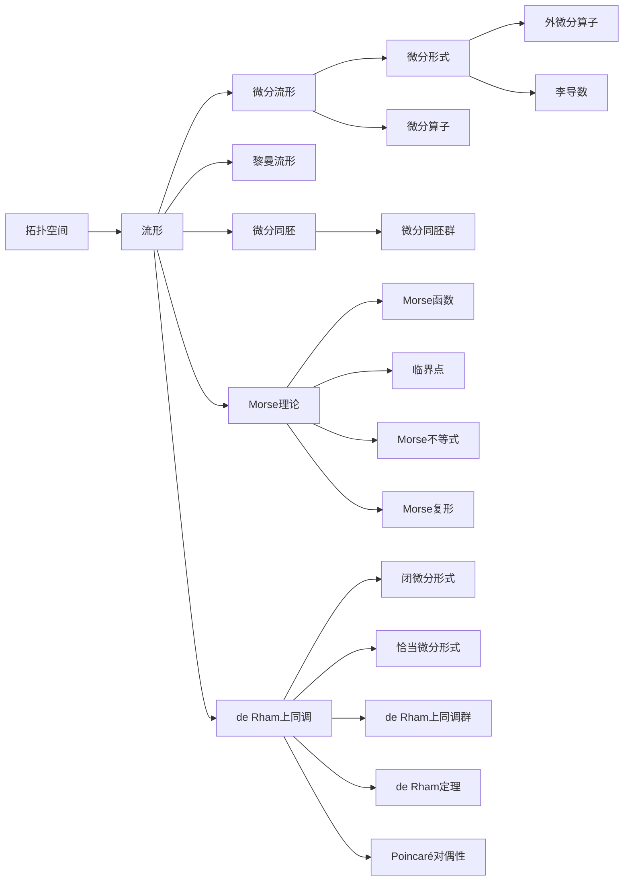

# 流形拓扑学理论与概念的实质：引言

## 1. 背景介绍
### 1.1 流形的历史渊源
### 1.2 流形在数学和物理学中的重要性
### 1.3 流形拓扑学的研究意义

## 2. 核心概念与联系
### 2.1 拓扑空间与流形
#### 2.1.1 拓扑空间的定义与性质
#### 2.1.2 流形的定义与分类
#### 2.1.3 拓扑空间与流形的关系
### 2.2 微分流形与黎曼流形  
#### 2.2.1 微分流形的定义与性质
#### 2.2.2 黎曼流形的定义与性质
#### 2.2.3 微分流形与黎曼流形的联系
### 2.3 流形上的微分形式与微分算子
#### 2.3.1 微分形式的定义与运算
#### 2.3.2 外微分算子与李导数
#### 2.3.3 微分形式与微分算子在流形上的应用

## 3. 核心算法原理具体操作步骤
### 3.1 流形上的微分同胚与微分同胚群
#### 3.1.1 微分同胚的定义与性质
#### 3.1.2 微分同胚群及其生成元
#### 3.1.3 微分同胚在流形分类中的应用
### 3.2 流形上的Morse理论
#### 3.2.1 Morse函数的定义与性质  
#### 3.2.2 临界点与临界值的分类
#### 3.2.3 Morse不等式与Morse复形
### 3.3 流形上的de Rham上同调
#### 3.3.1 闭微分形式与恰当微分形式
#### 3.3.2 de Rham上同调群的定义与计算
#### 3.3.3 de Rham定理与Poincaré对偶性

## 4. 数学模型和公式详细讲解举例说明 
### 4.1 流形的局部坐标表示
#### 4.1.1 局部坐标卡与坐标变换
#### 4.1.2 切空间与切丛的概念
#### 4.1.3 余切空间与余切丛的概念
### 4.2 流形上的微分形式与积分
#### 4.2.1 外代数与微分形式的坐标表示  
#### 4.2.2 微分形式的外积与内积
#### 4.2.3 流形上的积分与Stokes定理
### 4.3 流形的基本示例
#### 4.3.1 欧氏空间与球面的流形结构
#### 4.3.2 射影空间与Grassmann流形
#### 4.3.3 李群与李代数的流形结构

## 5. 项目实践：代码实例和详细解释说明
### 5.1 用Python实现流形数据的可视化
#### 5.1.1 流形数据的采样与局部坐标表示
#### 5.1.2 不同坐标卡之间的过渡函数
#### 5.1.3 流形数据的可视化与交互式探索
### 5.2 用TensorFlow实现流形上的机器学习
#### 5.2.1 流形正则化与流形约束优化
#### 5.2.2 流形上的卷积神经网络
#### 5.2.3 流形上的生成对抗网络
### 5.3 用PyTorch Geometric实现图神经网络
#### 5.3.1 将图数据嵌入到流形空间
#### 5.3.2 流形上的图卷积神经网络
#### 5.3.3 流形上的图注意力网络

## 6. 实际应用场景
### 6.1 流形学习在计算机视觉中的应用
#### 6.1.1 人脸识别中的流形表示
#### 6.1.2 动作识别中的流形约束
#### 6.1.3 图像分割中的流形正则化
### 6.2 流形优化在信号处理中的应用  
#### 6.2.1 稀疏表示中的流形约束
#### 6.2.2 压缩感知中的流形正则化
#### 6.2.3 矩阵补全中的流形正则化
### 6.3 流形控制在机器人中的应用
#### 6.3.1 机器人运动规划中的流形表示
#### 6.3.2 机器人动力学控制中的流形约束
#### 6.3.3 机器人视觉伺服中的流形控制

## 7. 工具和资源推荐
### 7.1 流形拓扑学的数学工具
#### 7.1.1 微分几何与拓扑学
#### 7.1.2 代数拓扑与同调代数
#### 7.1.3 李群与李代数
### 7.2 流形拓扑学的编程工具
#### 7.2.1 Python中的流形学习工具包
#### 7.2.2 MATLAB中的流形优化工具包 
#### 7.2.3 C++中的流形控制工具包
### 7.3 流形拓扑学的学习资源
#### 7.3.1 经典教材与参考书
#### 7.3.2 在线课程与视频教程
#### 7.3.3 学术会议与期刊论文

## 8. 总结：未来发展趋势与挑战
### 8.1 流形表示学习的发展趋势
### 8.2 流形约束优化的研究热点
### 8.3 流形控制理论的应用前景
### 8.4 流形拓扑学面临的挑战与机遇

## 9. 附录：常见问题与解答
### 9.1 如何直观理解流形的概念？
### 9.2 流形学习与深度学习有何区别和联系？
### 9.3 流形优化与传统优化方法有何优势？
### 9.4 流形控制如何克服传统控制的局限性？

流形拓扑学是现代数学的一个重要分支,它综合了拓扑学、微分几何以及代数拓扑等多个数学分支的思想和方法,在理论数学和应用数学中都有广泛的应用。流形这一概念最早由黎曼提出,他在研究复变函数论时引入了黎曼面的概念,这实际上就是一维复流形。后来庞加莱、爱因斯坦等数学家和物理学家进一步发展了流形的理论,使之成为描述物理时空的重要工具。

直观上,流形可以看作是局部类似于欧氏空间的空间,但在整体上可能具有非平凡的拓扑结构。例如球面、环面、克莱因瓶等都是典型的流形。更一般地,流形可定义为一个拓扑空间,且要求其每一点都有一个同胚于欧氏空间的开邻域。如果这些同胚映射还满足一定的光滑性条件,那么就得到了微分流形的概念。进一步,如果在微分流形上引入一个黎曼度量,就得到了黎曼流形。

流形拓扑学的核心问题之一就是研究流形的分类问题,即给出不同的流形之间的等价关系,并给出完全分类。根据庞加莱猜想(现已被证明),二维的紧致可定向流形只有球面一种。三维的情形要复杂得多,直到20世纪80年代,在Thurston几何化猜想的指导下,数学家才给出了它们的完全分类。更高维流形的分类问题则至今仍是一个公开问题。

在流形拓扑学中,另一个重要的工具是微分形式和微分算子。微分形式可以看作是流形上的反对称协变张量场,它们在流形上的积分与经典的线积分、曲面积分等有密切联系。微分形式的一个重要性质是,它们在微分同胚下是不变的。因此,微分形式可以用来刻画流形的微分拓扑不变量。

微分形式上有两个重要的微分算子:外微分算子和李导数。外微分算子将k次微分形式映射为k+1次微分形式,而李导数则刻画了微分形式沿着向量场的方向导数。这两个算子满足一些重要恒等式,如外微分的反对称性、李导数的莱布尼兹法则等。

在流形上,还可以定义一些重要的同调和上同调群。其中最著名的是de Rham上同调群,它由闭微分形式对恰当微分形式的商空间给出。de Rham定理指出,de Rham上同调群与奇异上同调群是同构的,因此给出了微分形式与拓扑不变量之间的一个重要联系。

Morse理论是流形拓扑学中的另一个重要工具。它研究了流形上的一类特殊函数——Morse函数的临界点与流形拓扑之间的关系。Morse不等式给出了流形的Betti数与Morse函数临界点指标之间的关系,而Morse复形则给出了如何用临界点来构造流形的CW复形。Morse理论在流形的拓扑分类中有重要应用。

流形拓扑学的思想和方法在计算机科学和工程中也有广泛应用。例如在计算机视觉中,图像数据通常可以看作是高维流形采样得到的。因此,可以用流形学习的方法来降低数据的维数,同时保持其内在的拓扑结构。这种方法在人脸识别、动作识别、图像分割等任务中都取得了很好的效果。

在优化和机器学习中,流形正则化的思想也得到了广泛应用。传统的机器学习模型通常假设数据点位于欧氏空间中,但实际上许多数据如图像、文本等往往位于一些低维流形上。因此,在优化目标函数时加入流形正则化项,可以使得学习到的模型更好地适应数据的内在流形结构。流形正则化可以看作是一种先验知识,它对优化问题起到了很好的约束作用。

在控制论中,许多系统如机器人系统的状态空间往往具有流形结构。因此,在研究这些系统的运动规划与控制问题时,需要用到流形上的分析方法。例如机器人臂的构型空间通常是一个高维流形,其运动规划问题可以转化为在该流形上寻找最优路径的问题。类似地,机器人的视觉伺服控制也可以看作是在图像流形与机器人构型流形之间的一个映射问题。

总之,流形拓扑学是数学的一个重要分支,它不仅在理论数学中有深刻的内容,在应用数学和工程中也有广泛的应用前景。随着数据科学和人工智能的快速发展,流形拓扑学的思想和方法必将在这些领域发挥越来越重要的作用。同时,如何将流形拓扑学与其他数学分支如代数拓扑、微分几何、范畴论等进一步结合,也是值得关注的研究方向。可以期待,流形拓扑学在未来的数学发展中将扮演更加重要的角色。

作者：禅与计算机程序设计艺术 / Zen and the Art of Computer Programming