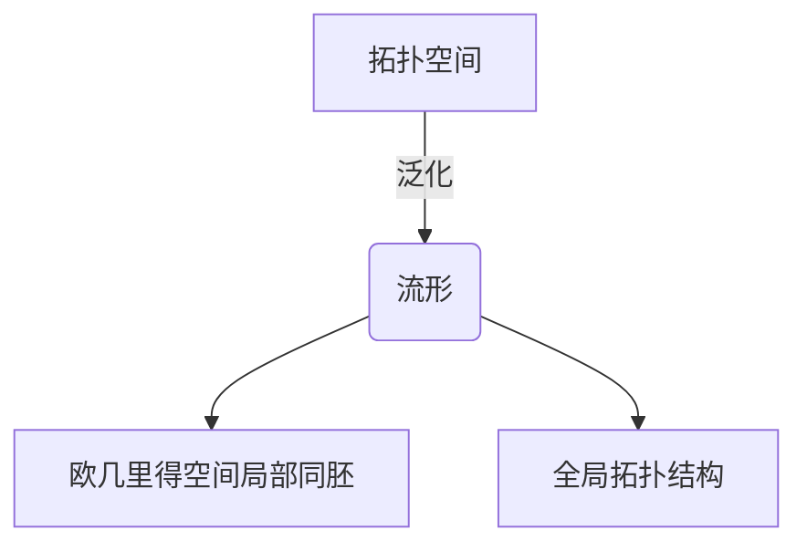

# 流形拓扑学理论与概念的实质：正合序列的应用

## 1.背景介绍

### 1.1 拓扑学的重要性

拓扑学是现代数学的一个重要分支,它研究空间几何形状的性质,尤其是在连续变形下保持不变的性质。拓扑学概念广泛应用于多个学科领域,包括理论物理、数据分析、计算机图形学和机器人导航等。在这些领域中,拓扑学提供了描述和分析复杂系统的强大工具。

### 1.2 流形的概念

流形(Manifold)是拓扑学中的一个核心概念。简单来说,一个流形是一个局部类似于欧几里得空间的拓扑空间。更精确地说,流形是一个拓扑空间,在该空间中的每个点都有一个邻域,该邻域同构于欧几里得空间的一个开子集。流形广泛应用于数学物理、相对论、微分几何等领域。

### 1.3 正合序列的重要性

在研究流形的拓扑性质时,正合序列(Exact Sequence)扮演着关键角色。正合序列提供了一种描述代数或拓扑不变量之间关系的方法,使得我们能够从已知的不变量推导出其他不变量的信息。正合序列在同调理论、黎曼几何和代数拓扑等领域有着广泛的应用。

## 2.核心概念与联系  

### 2.1 拓扑空间

拓扑空间是拓扑学的基本研究对象。一个拓扑空间由一个非空集合X和X的开集族构成。开集族满足以下条件:

1. 空集和X本身都是开集。
2. 任意多个开集的并集仍是开集。
3. 任意有限个开集的交集仍是开集。

拓扑空间的概念为研究连续性提供了坚实的数学基础。

### 2.2 流形

流形是一个拓扑空间,在该空间中的每个点都有一个邻域,该邻域同构于欧几里得空间的一个开子集。更精确地说,如果一个拓扑空间M满足以下条件,则称M为n维流形:

1. M是一个无边界的拓扑空间。
2. 对于M中的每个点p,存在一个同胚映射φ,将p的一个邻域映射到R^n的一个开子集。

流形的概念将局部欧几里得结构与全局拓扑结构相结合,为研究复杂几何对象提供了强大的工具。

### 2.3 链复形和同调群

链复形是研究流形拓扑性质的重要工具。一个n维链复形由一系列阿贝尔群$C_k$及边界同态$\partial_k: C_k \rightarrow C_{k-1}$构成,满足$\partial_{k-1} \circ \partial_k = 0$。

同调群是链复形的核与像之商,定义为:

$$H_k(C_\bullet) = \ker(\partial_k) / \text{im}(\partial_{k+1})$$

同调群反映了流形的某些拓扑不变量,如连通分量、洞穿等。

### 2.4 正合序列

正合序列是一种描述代数或拓扑不变量之间关系的序列。一个正合序列由一系列同态组成,每个同态的像恰好等于下一个同态的核。形式上,一个正合序列可以表示为:

$$\cdots \rightarrow A_n \xrightarrow{f_n} A_{n+1} \xrightarrow{f_{n+1}} A_{n+2} \xrightarrow{f_{n+2}} \cdots$$

其中$\text{im}(f_n) = \ker(f_{n+1})$对于所有的n都成立。

正合序列在同调理论中扮演着关键角色,它们提供了计算同调群的有效方法,并揭示了不同同调群之间的联系。

## 3.核心算法原理具体操作步骤

### 3.1 构造链复形

要研究一个流形的拓扑性质,首先需要构造与之对应的链复形。对于一个n维流形M,我们可以构造一个n维链复形$C_\bullet(M)$,其中$C_k(M)$是由M上的k维奇异单形所生成的阿贝尔群。

具体步骤如下:

1. 确定流形M的维数n。
2. 对于每个$k \leq n$,列出M上所有k维奇异单形的集合$S_k(M)$。
3. 将$S_k(M)$视为一个阿贝尔群,即$C_k(M) = \langle S_k(M) \rangle$。
4. 定义边界同态$\partial_k: C_k(M) \rightarrow C_{k-1}(M)$,将每个k维单形映射到其边界上。

通过这种方式,我们得到了一个n维链复形$C_\bullet(M) = (C_k(M), \partial_k)_{k \leq n}$,它捕捉了流形M的拓扑结构。

### 3.2 计算同调群

有了链复形$C_\bullet(M)$,我们就可以计算其同调群$H_k(C_\bullet(M))$,从而揭示流形M的拓扑不变量。具体步骤如下:

1. 计算每个$\partial_k$的核$\ker(\partial_k) = \{c \in C_k(M) | \partial_k(c) = 0\}$。
2. 计算每个$\partial_{k+1}$的像$\text{im}(\partial_{k+1}) = \{\partial_{k+1}(c) | c \in C_{k+1}(M)\}$。
3. 计算商群$H_k(C_\bullet(M)) = \ker(\partial_k) / \text{im}(\partial_{k+1})$。

同调群$H_k(C_\bullet(M))$反映了流形M在维数k处的"洞穿"情况。例如,对于一个2维球面,$H_0 \cong \mathbb{Z}$表示它有一个连通分量,$H_1 = 0$表示它没有1维洞穿,$H_2 \cong \mathbb{Z}$表示它有一个2维洞穿。

### 3.3 利用正合序列

在实践中,直接计算同调群往往是困难的。这时,我们可以利用正合序列来简化计算。假设我们有一个短正合序列:

$$0 \rightarrow A \xrightarrow{f} B \xrightarrow{g} C \rightarrow 0$$

其中$\text{im}(f) = \ker(g)$。那么,存在一个长正合序列:

$$\cdots \rightarrow H_{k+1}(C) \xrightarrow{\partial} H_k(A) \xrightarrow{H_k(f)} H_k(B) \xrightarrow{H_k(g)} H_k(C) \xrightarrow{\partial} H_{k-1}(A) \rightarrow \cdots$$

利用这个长正合序列,我们可以从已知的同调群推导出其他同调群的信息。例如,如果$H_k(A)$和$H_k(C)$已知,那么我们可以计算出$H_k(B)$。

这种利用正合序列的方法在同调理论中有着广泛的应用,它为计算复杂流形的同调群提供了有力工具。

## 4.数学模型和公式详细讲解举例说明

在研究流形拓扑学时,我们经常需要处理一些数学模型和公式。下面将详细讲解其中的一些核心内容,并给出具体的例子说明。

### 4.1 奇异同调群

奇异同调群是计算流形同调群的一种常用方法。它基于奇异单形的概念,将流形M嵌入到一个高维欧几里得空间$\mathbb{R}^N$中,然后研究$\mathbb{R}^N$到M的连续映射。

具体来说,对于一个n维流形M,我们定义其k维奇异链群$C_k(M)$为所有从$\Delta^k$到M的连续映射所构成的阿贝尔群,其中$\Delta^k$是一个k维单形。边界同态$\partial_k: C_k(M) \rightarrow C_{k-1}(M)$定义为:

$$\partial_k(\sigma) = \sum_{i=0}^k (-1)^i \sigma|_{[v_0, \dots, \hat{v_i}, \dots, v_k]}$$

其中$\sigma: \Delta^k \rightarrow M$是一个奇异k单形,而$\sigma|_{[v_0, \dots, \hat{v_i}, \dots, v_k]}$表示将$\sigma$限制在$\Delta^k$的$(k-1)$维面$[v_0, \dots, \hat{v_i}, \dots, v_k]$上。

有了链群$C_\bullet(M)$和边界同态$\partial_\bullet$,我们就可以定义M的k维奇异同调群为:

$$H_k(M) = \ker(\partial_k) / \text{im}(\partial_{k+1})$$

奇异同调群捕捉了流形M的拓扑不变量,如连通分量、洞穿等。

作为例子,让我们计算2维球面$S^2$的奇异同调群:

- $C_0(S^2)$由所有常数映射生成,故$H_0(S^2) \cong \mathbb{Z}$,反映了$S^2$只有一个连通分量。
- $C_1(S^2)$由所有闭环生成,但任何闭环在$S^2$上都是可缩的,故$H_1(S^2) = 0$,反映了$S^2$没有1维洞穿。
- $C_2(S^2)$由所有映射$\Delta^2 \rightarrow S^2$生成,但只有常数映射在边界上是0,故$H_2(S^2) \cong \mathbb{Z}$,反映了$S^2$有一个2维洞穿。

### 4.2 Mayer-Vietoris序列

Mayer-Vietoris序列是一个重要的正合序列,它将一个空间的同调群与其开覆盖的同调群联系起来。具体来说,假设X是一个拓扑空间,U和V是X的两个开覆盖,那么存在一个长正合序列:

$$\cdots \rightarrow H_k(X) \xrightarrow{\phi_k} H_k(U) \oplus H_k(V) \xrightarrow{\psi_k} H_k(U \cap V) \xrightarrow{\delta_k} H_{k-1}(X) \rightarrow \cdots$$

其中$\phi_k$是由包含关系诱导的同态,$\psi_k$是由开集并的同态,$\delta_k$是连接同态。

Mayer-Vietoris序列为计算复杂空间的同调群提供了有力工具。例如,如果我们已经知道U、V和U∩V的同调群,那么就可以利用这个正合序列来计算X的同调群。

作为例子,让我们计算实射影空间$\mathbb{RP}^2$的同调群。我们可以将$\mathbb{RP}^2$覆盖为两个开集U和V,其中U和V都同胚于$\mathbb{R}^2$,而U∩V同胚于$\mathbb{R} \times (0,1)$。利用Mayer-Vietoris序列,我们可以得到:

$$\cdots \rightarrow H_2(\mathbb{RP}^2) \rightarrow 0 \rightarrow \mathbb{Z} \rightarrow H_1(\mathbb{RP}^2) \rightarrow 0 \rightarrow 0 \rightarrow H_0(\mathbb{RP}^2) \rightarrow \mathbb{Z} \rightarrow 0 \rightarrow \cdots$$

从而推导出$H_0(\mathbb{RP}^2) \cong \mathbb{Z}$,$H_1(\mathbb{RP}^2) \cong \mathbb{Z}_2$,$H_2(\mathbb{RP}^2) = 0$。这反映了$\mathbb{RP}^2$只有一个连通分量,有一个1维洞穿,但没有2维洞穿。

### 4.3 de Rham上同调群

除了奇异同调群,de Rham上同调群也是研究流形拓扑性质的一种重要工具。它基于微分形式的概念,将流形上的拓扑性质与其上的微分结构联系起来。

具体来说,对于一个n维流形M,我们定义其k阶de Rham链群$\Omega^k(M)$为M上所有k阶微分形式所构成的实线性空间。外微分算子$d: \Omega^k(M) \rightarrow \Omega^{k+1}(M)$定义为:

$$d\omega(