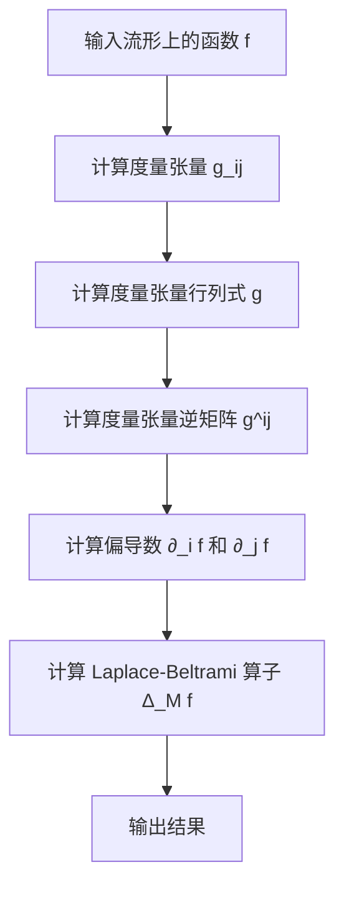

# 流形拓扑学：Laplace-Beltrami算子

## 1.背景介绍

流形拓扑学是现代数学和物理学中的一个重要分支，研究的是高维空间中的几何结构和拓扑性质。流形（Manifold）是一个局部类似于欧几里得空间的空间，而拓扑学则研究这些空间在连续变换下的性质。Laplace-Beltrami算子是流形上的一个重要微分算子，它在几何分析、物理学和计算机科学中有广泛的应用。

Laplace-Beltrami算子是Laplace算子的推广，适用于任意流形。它在研究流形上的热传导、波动方程和量子力学等问题中起着关键作用。本文将深入探讨Laplace-Beltrami算子的核心概念、算法原理、数学模型、实际应用以及未来发展趋势。

## 2.核心概念与联系

### 2.1 流形

流形是一个局部类似于欧几里得空间的空间。简单来说，一个流形在每个小区域内看起来像一个平坦的欧几里得空间，但整体上可能具有复杂的几何结构。例如，地球表面是一个二维流形，尽管它在局部看起来是平坦的，但整体上是一个球面。

### 2.2 Laplace算子

Laplace算子是一个二阶微分算子，定义为
$$
\Delta f = \nabla \cdot \nabla f
$$
其中 $\nabla$ 是梯度算子，$\cdot$ 表示点积。Laplace算子在欧几里得空间中用于描述热传导、波动和电势等物理现象。

### 2.3 Laplace-Beltrami算子

Laplace-Beltrami算子是Laplace算子的推广，适用于任意流形。它在局部坐标系中表示为
$$
\Delta_M f = \frac{1}{\sqrt{g}} \partial_i \left( \sqrt{g} g^{ij} \partial_j f \right)
$$
其中 $g$ 是度量张量的行列式，$g^{ij}$ 是度量张量的逆矩阵，$\partial_i$ 表示对第 $i$ 个坐标的偏导数。

### 2.4 核心联系

Laplace-Beltrami算子将Laplace算子的概念推广到任意流形上，使得我们能够在更广泛的几何背景下研究物理现象和数学问题。它在几何分析、物理学和计算机科学中有广泛的应用，例如在图像处理、机器学习和量子力学中。

## 3.核心算法原理具体操作步骤

### 3.1 流形上的坐标系

在流形上，我们通常使用局部坐标系来描述点的位置。一个流形 $M$ 可以被覆盖一组坐标图 $(U_i, \phi_i)$，其中 $U_i$ 是流形上的开集，$\phi_i: U_i \to \mathbb{R}^n$ 是一个局部坐标映射。

### 3.2 度量张量

度量张量 $g_{ij}$ 描述了流形上的内积结构。在局部坐标系中，度量张量定义为
$$
g_{ij} = \langle \frac{\partial}{\partial x^i}, \frac{\partial}{\partial x^j} \rangle
$$
其中 $\frac{\partial}{\partial x^i}$ 和 $\frac{\partial}{\partial x^j}$ 是局部坐标系中的基向量。

### 3.3 Laplace-Beltrami算子的计算

Laplace-Beltrami算子的计算步骤如下：

1. 计算度量张量 $g_{ij}$ 和其行列式 $g$。
2. 计算度量张量的逆矩阵 $g^{ij}$。
3. 计算偏导数 $\partial_i f$ 和 $\partial_j f$。
4. 计算Laplace-Beltrami算子
   $$
   \Delta_M f = \frac{1}{\sqrt{g}} \partial_i \left( \sqrt{g} g^{ij} \partial_j f \right)
   $$

### 3.4 算法流程图



## 4.数学模型和公式详细讲解举例说明

### 4.1 度量张量的计算

度量张量 $g_{ij}$ 是流形上内积的局部表示。在二维球面 $S^2$ 上，使用球坐标 $(\theta, \phi)$，度量张量为
$$
g_{ij} = \begin{pmatrix}
1 & 0 \\
0 & \sin^2 \theta
\end{pmatrix}
$$

### 4.2 Laplace-Beltrami算子的计算

在二维球面 $S^2$ 上，Laplace-Beltrami算子为
$$
\Delta_{S^2} f = \frac{1}{\sin \theta} \frac{\partial}{\partial \theta} \left( \sin \theta \frac{\partial f}{\partial \theta} \right) + \frac{1}{\sin^2 \theta} \frac{\partial^2 f}{\partial \phi^2}
$$

### 4.3 举例说明

假设我们在二维球面上有一个函数 $f(\theta, \phi) = \sin \theta \cos \phi$，我们可以计算其Laplace-Beltrami算子。

1. 计算偏导数：
   $$
   \frac{\partial f}{\partial \theta} = \cos \theta \cos \phi
   $$
   $$
   \frac{\partial f}{\partial \phi} = -\sin \theta \sin \phi
   $$

2. 计算Laplace-Beltrami算子：
   $$
   \Delta_{S^2} f = \frac{1}{\sin \theta} \frac{\partial}{\partial \theta} \left( \sin \theta \cos \theta \cos \phi \right) + \frac{1}{\sin^2 \theta} \frac{\partial^2}{\partial \phi^2} (-\sin \theta \sin \phi)
   $$
   经过计算，我们得到
   $$
   \Delta_{S^2} f = -2 \sin \theta \cos \phi
   $$

## 5.项目实践：代码实例和详细解释说明

### 5.1 Python代码实现

我们可以使用Python和NumPy库来实现Laplace-Beltrami算子的计算。以下是一个简单的代码示例：

```python
import numpy as np

def laplace_beltrami_sphere(f, theta, phi):
    sin_theta = np.sin(theta)
    cos_theta = np.cos(theta)
    sin_phi = np.sin(phi)
    cos_phi = np.cos(phi)
    
    # 计算偏导数
    df_dtheta = cos_theta * cos_phi
    df_dphi = -sin_theta * sin_phi
    
    # 计算Laplace-Beltrami算子
    term1 = (1 / sin_theta) * np.gradient(sin_theta * df_dtheta, theta)
    term2 = (1 / sin_theta**2) * np.gradient(df_dphi, phi)
    
    laplace_beltrami = term1 + term2
    return laplace_beltrami

# 示例函数
theta = np.linspace(0, np.pi, 100)
phi = np.linspace(0, 2 * np.pi, 100)
f = np.sin(theta) * np.cos(phi)

# 计算Laplace-Beltrami算子
result = laplace_beltrami_sphere(f, theta, phi)
print(result)
```

### 5.2 代码解释

1. **导入库**：我们使用NumPy库来进行数值计算。
2. **定义函数**：`laplace_beltrami_sphere` 函数计算球面上的Laplace-Beltrami算子。
3. **计算偏导数**：我们使用NumPy的`gradient`函数来计算偏导数。
4. **计算Laplace-Beltrami算子**：根据公式计算Laplace-Beltrami算子。
5. **示例函数**：定义一个示例函数并计算其Laplace-Beltrami算子。

## 6.实际应用场景

### 6.1 图像处理

在图像处理领域，Laplace-Beltrami算子可以用于图像的平滑和去噪。通过在图像的像素网格上定义一个流形，我们可以使用Laplace-Beltrami算子来平滑图像，去除噪声，同时保留图像的边缘特征。

### 6.2 机器学习

在机器学习中，Laplace-Beltrami算子可以用于流形学习和降维。通过在高维数据空间中定义一个流形，我们可以使用Laplace-Beltrami算子来捕捉数据的内在几何结构，从而实现降维和特征提取。

### 6.3 量子力学

在量子力学中，Laplace-Beltrami算子用于描述粒子的波函数演化。通过在流形上定义Laplace-Beltrami算子，我们可以研究粒子在复杂几何背景下的运动和行为。

### 6.4 热传导和波动方程

Laplace-Beltrami算子在热传导和波动方程中也有广泛应用。通过在流形上定义热传导方程和波动方程，我们可以研究复杂几何背景下的热传导和波动现象。

## 7.工具和资源推荐

### 7.1 数学软件

- **Mathematica**：强大的数学计算软件，支持符号计算和数值计算。
- **MATLAB**：广泛用于科学计算和工程应用，提供丰富的数学工具箱。
- **SageMath**：开源数学软件，集成了多种数学库和工具。

### 7.2 编程语言和库

- **Python**：广泛用于科学计算和数据分析，提供丰富的数学库，如NumPy、SciPy和SymPy。
- **R**：用于统计计算和数据分析，提供丰富的数学和统计工具。
- **Julia**：高性能的科学计算语言，提供丰富的数学库和工具。

### 7.3 在线资源

- **arXiv**：提供最新的数学和物理学论文，涵盖流形拓扑学和Laplace-Beltrami算子等领域。
- **MathWorld**：由Wolfram Research提供的数学百科全书，涵盖广泛的数学概念和定理。
- **YouTube**：提供丰富的数学和物理学视频教程，涵盖流形拓扑学和Laplace-Beltrami算子等主题。

## 8.总结：未来发展趋势与挑战

### 8.1 未来发展趋势

随着计算能力的不断提升和数学工具的不断发展，Laplace-Beltrami算子在各个领域的应用将会更加广泛。特别是在机器学习和人工智能领域，流形学习和几何深度学习将成为重要的研究方向。通过结合Laplace-Beltrami算子和深度学习算法，我们可以更好地理解和处理高维数据的几何结构。

### 8.2 挑战

尽管Laplace-Beltrami算子在理论上有广泛的应用，但在实际应用中仍然面临一些挑战。例如，在高维流形上计算Laplace-Beltrami算子可能会非常复杂，需要高效的数值算法和计算资源。此外，如何在不规则和复杂的几何结构上定义和计算Laplace-Beltrami算子也是一个重要的研究课题。

## 9.附录：常见问题与解答

### 9.1 什么是流形？

流形是一个局部类似于欧几里得空间的空间。它在每个小区域内看起来像一个平坦的欧几里得空间，但整体上可能具有复杂的几何结构。

### 9.2 什么是Laplace-Beltrami算子？

Laplace-Beltrami算子是Laplace算子的推广，适用于任意流形。它在流形上用于描述热传导、波动和量子力学等物理现象。

### 9.3 Laplace-Beltrami算子有哪些实际应用？

Laplace-Beltrami算子在图像处理、机器学习、量子力学和热传导等领域有广泛的应用。它可以用于图像平滑和去噪、流形学习和降维、描述粒子的波函数演化以及研究热传导和波动现象。

### 9.4 如何计算Laplace-Beltrami算子？

计算Laplace-Beltrami算子需要以下步骤：计算度量张量及其行列式和逆矩阵，计算偏导数，然后根据公式计算Laplace-Beltrami算子。

### 9.5 有哪些推荐的工具和资源？

推荐的工具包括Mathematica、MATLAB、SageMath等数学软件，以及Python、R、Julia等编程语言和库。推荐的在线资源包括arXiv、MathWorld和YouTube等。

---

作者：禅与计算机程序设计艺术 / Zen and the Art of Computer Programming