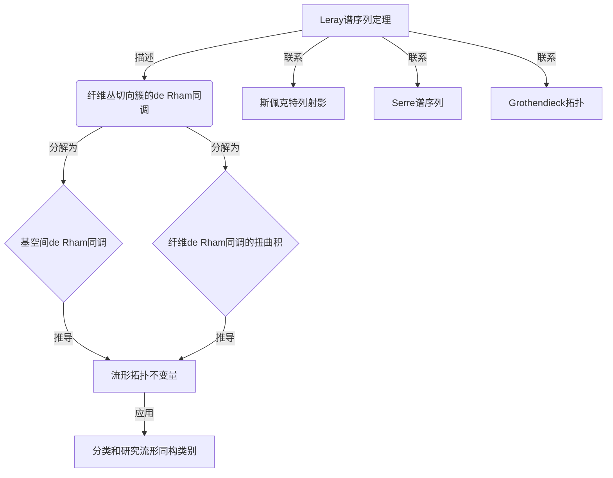

# 流形拓扑学：Leray谱序列定理

## 1.背景介绍

在研究流形的代数拓扑性质时,Leray谱序列定理是一个非常重要的工具。它为我们提供了一种计算纤维丛上切向簇的同调群的有效方法。本文将深入探讨Leray谱序列定理的内涵、证明过程以及在具体问题中的应用。

### 1.1 流形和纤维丛

流形(Manifold)是一种在现代几何和拓扑学中扮演核心角色的数学对象。简单来说,一个流形是一种局部类似于欧几里得空间,但在全局上可能存在曲率的拓扑空间。

纤维丛(Fiber Bundle)是将一个空间"分层"的一种方式。具体来说,一个纤维丛由一个基空间(Base Space)、一个总空间(Total Space)和一个投影映射(Projection Map)组成。每个基点对应总空间中的一个"层",这个层就是所谓的纤维(Fiber)。

### 1.2 切向簇和de Rham上同调

切向簇(Tangent Sheaf)是流形上一个重要的向量丛,它的纤维在每个点是流形的切空间。研究流形的切向簇对于了解流形的局部和全局性质至关重要。

de Rham上同调(de Rham Cohomology)是研究流形上微分形式的一种同调论工具。它为我们提供了一种计算流形上同调群的代数化方法,并与流形的几何和拓扑性质密切相关。

## 2.核心概念与联系 

### 2.1 Leray谱序列概述

Leray谱序列定理描述了一个纤维丛的切向簇的de Rham上同调群与基空间和纤维的de Rham上同调群之间的关系。更精确地说,它给出了一个长的精确序列,将纤维丛切向簇的de Rham上同调群分解为基空间和纤维的de Rham上同调群的某种扭曲积的直和。

### 2.2 Leray谱序列与流形拓扑学的联系

Leray谱序列为我们研究流形的局部和全局性质提供了有力的工具。通过计算纤维丛切向簇的de Rham上同调群,我们可以推导出流形自身的拓扑不变量,如贝体数、欧拉特征数等。这些不变量对于分类和研究流形的同构类别至关重要。

此外,Leray谱序列还与其他一些重要的数学概念和理论存在内在联系,如斯佩克特列射影、Serre谱序列、Grothendieck拓扑等。它在代数几何、代数拓扑和代数等领域都有广泛的应用。



## 3.核心算法原理具体操作步骤

Leray谱序列定理的证明过程相当复杂,需要引入一些辅助概念和工具。我们将按照以下步骤来阐述它的核心思路。

### 3.1 纤维积分与纤维积分映射

对于一个纤维丛 $\pi: E \rightarrow B$,我们定义纤维积分(Fiber Integration)为一个从 $E$ 上的微分形式到 $B$ 上的微分形式的线性映射,记作 $\int_f$。具体来说,对于 $E$ 上的一个 $k$ 形式 $\omega$,其纤维积分 $\int_f \omega$ 是一个 $B$ 上的 $(k-n)$ 形式,其在每个点 $b \in B$ 的值由下式给出:

$$\left(\int_f \omega\right)_b = \int_{F_b} \omega|_{F_b}$$

其中 $F_b = \pi^{-1}(b)$ 是纤维,而 $\omega|_{F_b}$ 表示 $\omega$ 在纤维 $F_b$ 上的限制。

纤维积分映射 $\int_f$ 具有以下重要性质:

1. $\int_f$ 是链复形之间的链映射,即对于任意微分形式 $\omega$,有 $d\int_f\omega = \int_f d\omega$。
2. $\int_f$ 诱导出了de Rham复形之间的映射,从而得到了de Rham上同调群之间的映射。

### 3.2 Leray谱序列的构造

利用纤维积分映射,我们可以构造出一个长的精确序列,即所谓的Leray谱序列。具体步骤如下:

1. 考虑纤维丛切向簇 $\mathcal{T}(E/B)$ 的de Rham复形,记作 $\Omega^*(\mathcal{T}(E/B))$。
2. 对于每个 $p \geq 0$,构造出一个短精确序列:

$$0 \rightarrow \Omega^p(B) \xrightarrow{\pi^*} \Omega^p(\mathcal{T}(E/B)) \xrightarrow{\int_f} \Omega^{p-n}(B) \otimes \Omega^n(F) \rightarrow 0$$

其中 $\pi^*$ 是拉回映射,而 $\int_f$ 是纤维积分映射。

3. 将这些短精确序列"缝合"起来,就得到了一个长的精确序列:

$$\cdots \rightarrow \Omega^{p-1}(B) \otimes \Omega^n(F) \xrightarrow{\delta} \Omega^p(\mathcal{T}(E/B)) \xrightarrow{\int_f} \Omega^p(B) \otimes \Omega^n(F) \xrightarrow{\delta} \Omega^{p+1}(\mathcal{T}(E/B)) \rightarrow \cdots$$

这就是著名的Leray谱序列。其中的 $\delta$ 是一个微分映射,称为Leray微分。

### 3.3 Leray谱序列与de Rham同调的关系

Leray谱序列不仅是微分形式之间的一个精确序列,更重要的是,它诱导出了de Rham上同调群之间的一个长精确序列:

$$\cdots \rightarrow H^{p-1}(B,\Omega^n(F)) \xrightarrow{\delta} H^p(\mathcal{T}(E/B)) \xrightarrow{\int_f} H^p(B,\Omega^n(F)) \xrightarrow{\delta} H^{p+1}(\mathcal{T}(E/B)) \rightarrow \cdots$$

其中 $H^p(\mathcal{T}(E/B))$ 表示纤维丛切向簇的第 $p$ 个de Rham上同调群,而 $H^p(B,\Omega^n(F))$ 表示一个扭曲积的de Rham上同调群。

这个精确序列为我们提供了一种计算纤维丛切向簇de Rham上同调群的有效方法。只要我们知道基空间和纤维的de Rham上同调群,就可以通过这个序列来求解纤维丛切向簇的de Rham上同调群。

## 4.数学模型和公式详细讲解举例说明

为了更好地理解Leray谱序列定理,我们将通过一个具体的例子来说明其中涉及的数学模型和公式。

### 4.1 例子:圆环纤维丛

考虑一个简单的纤维丛:将单位圆环 $S^1$ 作为纤维,基空间为另一个圆环 $S^1$,总空间为环面 $T^2 = S^1 \times S^1$。这个纤维丛可以写作:

$$\pi: T^2 \rightarrow S^1$$

我们将计算这个纤维丛切向簇的de Rham上同调群。

首先,我们需要知道基空间 $S^1$ 和纤维 $S^1$ 的de Rham上同调群。对于圆环,它的非零de Rham上同调群只有 $H^0(S^1) \cong \mathbb{R}$ 和 $H^1(S^1) \cong \mathbb{R}$。

其次,我们构造Leray谱序列。对于这个例子,序列的前几项为:

$$0 \rightarrow \Omega^0(S^1) \xrightarrow{\pi^*} \Omega^0(\mathcal{T}(T^2/S^1)) \xrightarrow{\int_f} \Omega^0(S^1) \rightarrow 0$$
$$0 \rightarrow \Omega^1(S^1) \xrightarrow{\pi^*} \Omega^1(\mathcal{T}(T^2/S^1)) \xrightarrow{\int_f} \Omega^0(S^1) \otimes \Omega^1(S^1) \rightarrow 0$$
$$0 \rightarrow \Omega^0(S^1) \otimes \Omega^1(S^1) \xrightarrow{\delta} \Omega^2(\mathcal{T}(T^2/S^1)) \xrightarrow{\int_f} \Omega^2(S^1) \rightarrow 0$$

利用这些短精确序列,我们可以得到de Rham上同调群之间的长精确序列:

$$\cdots \rightarrow 0 \rightarrow H^0(\mathcal{T}(T^2/S^1)) \xrightarrow{\int_f} H^0(S^1,\Omega^1(S^1)) \xrightarrow{\delta} H^1(\mathcal{T}(T^2/S^1)) \rightarrow \cdots$$

由于 $H^0(S^1,\Omega^1(S^1)) = 0$,所以 $H^0(\mathcal{T}(T^2/S^1)) \cong \mathbb{R}$。同理,我们可以推导出 $H^1(\mathcal{T}(T^2/S^1)) \cong \mathbb{R}^2$,而更高维的de Rham上同调群都为零。

### 4.2 Leray微分的计算

在上面的例子中,我们没有显式计算Leray微分 $\delta$。事实上,对于一般的纤维丛,计算Leray微分是一个相当复杂的过程。我们将给出它的定义和一些性质。

对于 $\omega \in \Omega^{p-1}(B) \otimes \Omega^n(F)$,其Leray微分 $\delta\omega \in \Omega^p(\mathcal{T}(E/B))$ 定义为:

$$(\delta\omega)_x = \sum_{i=1}^n (-1)^{i-1} \pi^*(\omega_i) \wedge e_i^*$$

其中 $\{e_1, \ldots, e_n\}$ 是纤维 $F_{\pi(x)}$ 上的一个基,而 $\{e_1^*, \ldots, e_n^*\}$ 是它们在 $x$ 处的对偶基。

Leray微分 $\delta$ 满足以下性质:

1. $\delta^2 = 0$,即 $\delta$ 是一个微分。
2. $\delta$ 是链映射,即对任意 $\omega$,有 $d\delta\omega = \delta d\omega$。
3. $\delta$ 使得Leray谱序列成为一个精确序列。

通过计算Leray微分,我们可以确定Leray谱序列中的像和核,从而得到纤维丛切向簇de Rham上同调群的准确信息。

## 5.项目实践:代码实例和详细解释说明

虽然Leray谱序列定理是一个纯粹的数学理论,但我们可以通过编程来帮助计算和可视化一些具体的例子。下面是一个使用Python和SymPy库计算圆环纤维丛切向簇de Rham上同调群的代码示例。

```python
from sympy import symbols, diff, simplify, zeros
from sympy.matrices import Matrix

# 定义基空间和纤维的坐标
t = symbols('t')
s = symbols('s')

# 定义微分形式
omega0 = 1
omega1 = symbols('a')*diff(t) + symbols('b')*diff(s)
omega2 = diff(t, s)

# 定义纤维积分映射
def fiber_integrate(form, n):
    integral = 0
    for i in range(n+1):
        integral += form.coeff(diff(s, i)) * s**(n-i)
    integral = integral.subs(s, 2*pi)
    return integral.trigsimp()

# 计算de Rham上同调群
H0_base = [omega0.subs(