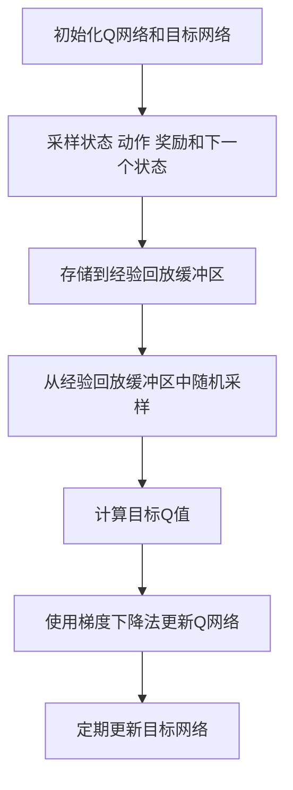
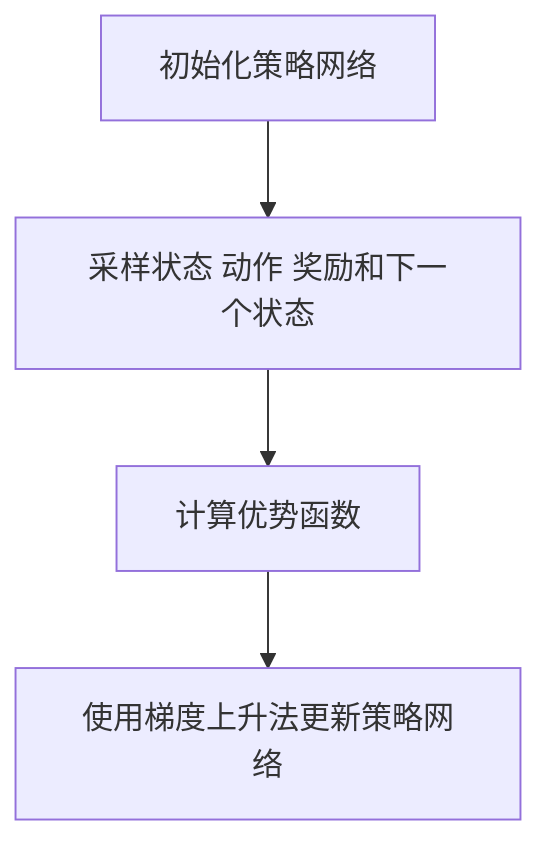
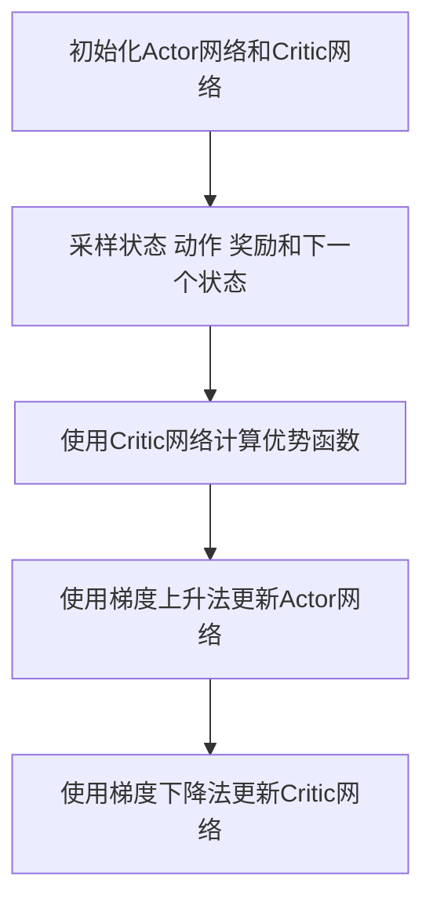

# 深度强化学习 (Deep Reinforcement Learning) 原理与代码实例讲解

## 1.背景介绍

深度强化学习（Deep Reinforcement Learning, DRL）是人工智能领域的一个重要分支，它结合了深度学习和强化学习的优势，能够在复杂环境中实现智能体的自主学习和决策。近年来，DRL在游戏、机器人控制、自动驾驶等领域取得了显著的成果，吸引了大量研究者和工程师的关注。

### 1.1 强化学习的基本概念

强化学习是一种通过与环境交互来学习策略的机器学习方法。智能体通过执行动作从环境中获得奖励，并根据奖励调整策略，以最大化累积奖励。强化学习的基本框架包括以下几个要素：

- **状态（State, S）**：智能体在某一时刻所处的环境状态。
- **动作（Action, A）**：智能体在某一状态下可以执行的操作。
- **奖励（Reward, R）**：智能体执行某一动作后从环境中获得的反馈。
- **策略（Policy, π）**：智能体在各个状态下选择动作的规则。
- **价值函数（Value Function, V）**：评估某一状态或状态-动作对的好坏程度。

### 1.2 深度学习的基本概念

深度学习是一种基于人工神经网络的机器学习方法，能够自动从数据中提取特征并进行分类或回归。深度学习的基本单元是神经元，多个神经元组成层，多个层组成网络。通过反向传播算法，深度学习模型可以在大量数据上进行训练，从而实现复杂的模式识别和预测任务。

### 1.3 深度强化学习的结合

深度强化学习将深度学习的强大特征提取能力与强化学习的决策能力结合起来，使得智能体能够在高维状态空间中进行学习和决策。深度Q网络（Deep Q-Network, DQN）是深度强化学习的一个经典算法，它使用深度神经网络来近似Q值函数，从而实现高效的策略学习。

## 2.核心概念与联系

在深入探讨深度强化学习的具体算法和实现之前，我们需要理解一些核心概念及其相互联系。

### 2.1 马尔可夫决策过程（MDP）

马尔可夫决策过程（Markov Decision Process, MDP）是强化学习的数学框架。MDP由五元组（S, A, P, R, γ）组成：

- **S**：状态空间
- **A**：动作空间
- **P**：状态转移概率矩阵，表示从一个状态转移到另一个状态的概率
- **R**：奖励函数，表示在某一状态下执行某一动作所获得的奖励
- **γ**：折扣因子，表示未来奖励的折扣率

### 2.2 Q值函数与贝尔曼方程

Q值函数（Q-Value Function, Q）表示在某一状态下执行某一动作的预期累积奖励。贝尔曼方程（Bellman Equation）是Q值函数的递归定义：

$$
Q(s, a) = R(s, a) + \gamma \sum_{s'} P(s'|s, a) \max_{a'} Q(s', a')
$$

### 2.3 策略与策略梯度

策略（Policy, π）是智能体在各个状态下选择动作的规则。策略可以是确定性的，也可以是随机的。策略梯度（Policy Gradient）方法通过优化策略的参数来最大化累积奖励。

### 2.4 深度Q网络（DQN）

深度Q网络（Deep Q-Network, DQN）使用深度神经网络来近似Q值函数。DQN通过经验回放和目标网络等技术，解决了Q学习在高维状态空间中的不稳定性问题。

### 2.5 Actor-Critic方法

Actor-Critic方法结合了策略梯度和价值函数方法。Actor网络负责选择动作，Critic网络负责评估动作的价值。通过同时优化Actor和Critic网络，Actor-Critic方法能够实现高效的策略学习。

## 3.核心算法原理具体操作步骤

在本节中，我们将详细介绍几种常见的深度强化学习算法及其具体操作步骤。

### 3.1 深度Q网络（DQN）

#### 3.1.1 算法原理

DQN使用深度神经网络来近似Q值函数，通过经验回放和目标网络等技术，解决了Q学习在高维状态空间中的不稳定性问题。

#### 3.1.2 具体操作步骤

1. **初始化**：初始化Q网络和目标网络的参数，初始化经验回放缓冲区。
2. **采样**：从环境中采样状态、动作、奖励和下一个状态，存储到经验回放缓冲区。
3. **经验回放**：从经验回放缓冲区中随机采样一批数据，计算目标Q值。
4. **更新Q网络**：使用梯度下降法最小化Q网络的损失函数。
5. **更新目标网络**：定期将Q网络的参数复制到目标网络。



### 3.2 策略梯度方法

#### 3.2.1 算法原理

策略梯度方法通过优化策略的参数来最大化累积奖励。常见的策略梯度方法包括REINFORCE和PPO（Proximal Policy Optimization）。

#### 3.2.2 具体操作步骤

1. **初始化**：初始化策略网络的参数。
2. **采样**：从环境中采样状态、动作、奖励和下一个状态。
3. **计算优势函数**：计算每个状态-动作对的优势函数。
4. **更新策略网络**：使用梯度上升法最大化策略网络的目标函数。



### 3.3 Actor-Critic方法

#### 3.3.1 算法原理

Actor-Critic方法结合了策略梯度和价值函数方法。Actor网络负责选择动作，Critic网络负责评估动作的价值。

#### 3.3.2 具体操作步骤

1. **初始化**：初始化Actor网络和Critic网络的参数。
2. **采样**：从环境中采样状态、动作、奖励和下一个状态。
3. **计算优势函数**：使用Critic网络计算每个状态-动作对的优势函数。
4. **更新Actor网络**：使用梯度上升法最大化Actor网络的目标函数。
5. **更新Critic网络**：使用梯度下降法最小化Critic网络的损失函数。



## 4.数学模型和公式详细讲解举例说明

在本节中，我们将详细讲解深度强化学习中的数学模型和公式，并通过具体例子说明其应用。

### 4.1 贝尔曼方程

贝尔曼方程是强化学习中的核心公式，用于描述Q值函数的递归关系。对于状态$s$和动作$a$，贝尔曼方程表示为：

$$
Q(s, a) = R(s, a) + \gamma \sum_{s'} P(s'|s, a) \max_{a'} Q(s', a')
$$

### 4.2 策略梯度定理

策略梯度定理用于计算策略的梯度，以优化策略参数。对于策略$\pi_\theta$，策略梯度定理表示为：

$$
\nabla_\theta J(\theta) = \mathbb{E}_{\pi_\theta} \left[ \nabla_\theta \log \pi_\theta(a|s) Q^{\pi_\theta}(s, a) \right]
$$

### 4.3 优势函数

优势函数用于评估某一动作相对于其他动作的优越性。对于状态$s$和动作$a$，优势函数表示为：

$$
A(s, a) = Q(s, a) - V(s)
$$

其中，$V(s)$是状态价值函数，表示在状态$s$下的预期累积奖励。

### 4.4 具体例子说明

假设我们有一个简单的迷宫环境，智能体需要从起点到达终点。我们可以使用DQN算法来训练智能体。具体步骤如下：

1. **定义状态和动作**：状态是智能体在迷宫中的位置，动作是智能体可以移动的方向（上、下、左、右）。
2. **初始化Q网络和目标网络**：使用深度神经网络来近似Q值函数。
3. **采样和经验回放**：智能体在迷宫中移动，采样状态、动作、奖励和下一个状态，并存储到经验回放缓冲区。
4. **更新Q网络**：使用经验回放缓冲区中的数据，计算目标Q值，并使用梯度下降法更新Q网络。
5. **更新目标网络**：定期将Q网络的参数复制到目标网络。

通过多次迭代，智能体能够学会在迷宫中找到最优路径。

## 5.项目实践：代码实例和详细解释说明

在本节中，我们将通过一个具体的代码实例，展示如何使用深度强化学习算法来解决实际问题。

### 5.1 环境设置

首先，我们需要安装必要的库和设置环境。我们将使用OpenAI Gym作为模拟环境，使用TensorFlow或PyTorch作为深度学习框架。

```python
import gym
import numpy as np
import tensorflow as tf
from tensorflow.keras import layers

# 创建环境
env = gym.make('CartPole-v1')

# 设置随机种子
np.random.seed(42)
tf.random.set_seed(42)
env.seed(42)
```

### 5.2 构建Q网络

接下来，我们构建一个简单的Q网络，用于近似Q值函数。

```python
num_actions = env.action_space.n
num_states = env.observation_space.shape[0]

def create_q_network():
    model = tf.keras.Sequential([
        layers.Dense(24, activation='relu', input_shape=(num_states,)),
        layers.Dense(24, activation='relu'),
        layers.Dense(num_actions, activation='linear')
    ])
    model.compile(optimizer=tf.keras.optimizers.Adam(learning_rate=0.001), loss='mse')
    return model

q_network = create_q_network()
target_network = create_q_network()
target_network.set_weights(q_network.get_weights())
```

### 5.3 经验回放缓冲区

我们需要一个经验回放缓冲区来存储智能体的经验，并从中随机采样进行训练。

```python
from collections import deque
import random

class ReplayBuffer:
    def __init__(self, max_size):
        self.buffer = deque(maxlen=max_size)
    
    def add(self, experience):
        self.buffer.append(experience)
    
    def sample(self, batch_size):
        return random.sample(self.buffer, batch_size)
    
    def size(self):
        return len(self.buffer)

replay_buffer = ReplayBuffer(max_size=10000)
```

### 5.4 训练过程

我们定义训练过程，包括采样、计算目标Q值、更新Q网络和目标网络。

```python
def train_dqn(env, q_network, target_network, replay_buffer, num_episodes, batch_size, gamma, update_target_freq):
    epsilon = 1.0
    epsilon_decay = 0.995
    epsilon_min = 0.01

    for episode in range(num_episodes):
        state = env.reset()
        total_reward = 0

        while True:
            if np.random.rand() < epsilon:
                action = env.action_space.sample()
            else:
                q_values = q_network.predict(state[np.newaxis])
                action = np.argmax(q_values)

            next_state, reward, done, _ = env.step(action)
            total_reward += reward

            replay_buffer.add((state, action, reward, next_state, done))
            state = next_state

            if replay_buffer.size() >= batch_size:
                batch = replay_buffer.sample(batch_size)
                states, actions, rewards, next_states, dones = zip(*batch)

                states = np.array(states)
                next_states = np.array(next_states)
                rewards = np.array(rewards)
                dones = np.array(dones)

                target_q_values = target_network.predict(next_states)
                max_target_q_values = np.max(target_q_values, axis=1)
                targets = rewards + gamma * max_target_q_values * (1 - dones)

                q_values = q_network.predict(states)
                for i, action in enumerate(actions):
                    q_values[i][action] = targets[i]

                q_network.train_on_batch(states, q_values)

            if done:
                break

        if epsilon > epsilon_min:
            epsilon *= epsilon_decay

        if episode % update_target_freq == 0:
            target_network.set_weights(q_network.get_weights())

        print(f"Episode {episode + 1}/{num_episodes}, Total Reward: {total_reward}")

# 训练DQN
train_dqn(env, q_network, target_network, replay_buffer, num_episodes=500, batch_size=64, gamma=0.99, update_target_freq=10)
```

### 5.5 评估模型

训练完成后，我们可以评估模型的性能。

```python
def evaluate_model(env, q_network, num_episodes):
    total_rewards = []

    for episode in range(num_episodes):
        state = env.reset()
        total_reward = 0

        while True:
            q_values = q_network.predict(state[np.newaxis])
            action = np.argmax(q_values)
            next_state, reward, done, _ = env.step(action)
            total_reward += reward
            state = next_state

            if done:
                break

        total_rewards.append(total_reward)
        print(f"Episode {episode + 1}/{num_episodes}, Total Reward: {total_reward}")

    avg_reward = np.mean(total_rewards)
    print(f"Average Reward over {num_episodes} episodes: {avg_reward}")

# 评估模型
evaluate_model(env, q_network, num_episodes=10)
```

## 6.实际应用场景

深度强化学习在多个领域中展现了其强大的应用潜力。以下是一些实际应用场景：

### 6.1 游戏AI

深度强化学习在游戏AI中取得了显著成果。例如，DeepMind的AlphaGo使用深度强化学习击败了世界顶级围棋选手。通过训练，AI能够在复杂的游戏环境中做出最优决策。

### 6.2 机器人控制

在机器人控制领域，深度强化学习被用于训练机器人完成各种任务，如抓取物体、行走和导航。通过与环境的交互，机器人能够自主学习并适应不同的任务和环境。

### 6.3 自动驾驶

自动驾驶汽车需要在复杂的交通环境中做出实时决策。深度强化学习可以帮助自动驾驶系统学习如何在不同的交通状况下安全驾驶，从而提高自动驾驶的安全性和可靠性。

### 6.4 金融交易

在金融交易中，深度强化学习被用于优化交易策略。通过分析市场数据和历史交易记录，AI能够学习到最优的买卖策略，从而实现利润最大化。

### 6.5 医疗诊断

深度强化学习在医疗诊断中也有广泛应用。例如，通过分析医学影像数据，AI可以辅助医生进行疾病诊断，提高诊断的准确性和效率。

## 7.工具和资源推荐

在进行深度强化学习研究和开发时，以下工具和资源可以提供很大的帮助：

### 7.1 开源库

- **TensorFlow**：一个广泛使用的深度学习框架，支持多种深度强化学习算法。
- **PyTorch**：另一个流行的深度学习框架，具有灵活的动态计算图和强大的社区支持。
- **OpenAI Gym**：一个用于开发和比较强化学习算法的工具包，提供了多种模拟环境。

### 7.2 在线课程

- **Coursera**：提供多门关于深度学习和强化学习的在线课程，如Andrew Ng的深度学习课程。
- **Udacity**：提供强化学习纳米学位课程，涵盖了从基础到高级的强化学习知识。

### 7.3 研究论文

- **ArXiv**：一个开放获取的学术论文预印本平台，包含大量关于深度强化学习的最新研究论文。
- **Google Scholar**：一个学术搜索引擎，可以查找和阅读深度强化学习领域的研究论文。

### 7.4 社区和论坛

- **Reddit**：有多个关于深度学习和强化学习的讨论社区，如r/MachineLearning。
- **Stack Overflow**：一个编程问答社区，可以在这里找到关于深度强化学习的技术问题的解答。

## 8.总结：未来发展趋势与挑战

深度强化学习作为人工智能领域的重要分支，已经在多个领域展现了其强大的应用潜力。然而，深度强化学习仍然面临一些挑战和未来的发展方向。

### 8.1 计算资源需求

深度强化学习的训练过程通常需要大量的计算资源，尤其是在处理高维状态空间和复杂环境时。未来的发展需要更加高效的算法