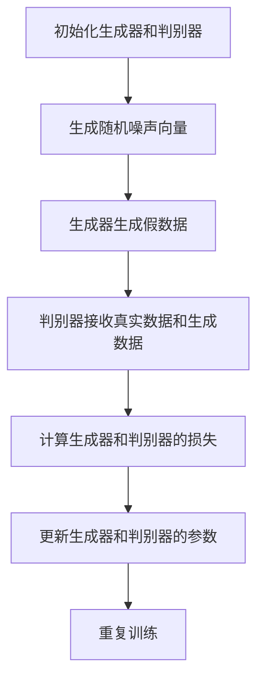

# 生成对抗网络GAN原理与代码实例讲解

## 1.背景介绍

生成对抗网络（Generative Adversarial Networks，简称GAN）是由Ian Goodfellow等人在2014年提出的一种深度学习模型。GAN的出现为生成模型领域带来了革命性的变化，使得计算机能够生成逼真的图像、音频和文本等数据。GAN的核心思想是通过两个神经网络——生成器（Generator）和判别器（Discriminator）之间的对抗训练，使得生成器能够生成以假乱真的数据。

## 2.核心概念与联系

### 2.1 生成器（Generator）

生成器的任务是从随机噪声中生成逼真的数据。它接收一个随机向量作为输入，通过一系列的非线性变换，输出与真实数据分布相似的样本。

### 2.2 判别器（Discriminator）

判别器的任务是区分真实数据和生成数据。它接收一个数据样本作为输入，输出一个概率值，表示该样本是真实数据的概率。

### 2.3 对抗训练

生成器和判别器通过对抗训练的方式进行优化。生成器试图欺骗判别器，使其认为生成的数据是真实的；而判别器则试图提高其辨别能力，正确区分真实数据和生成数据。

### 2.4 损失函数

GAN的损失函数由生成器和判别器的损失函数组成。生成器的目标是最小化判别器的输出，而判别器的目标是最大化其输出。具体的损失函数将在后续章节详细讲解。

## 3.核心算法原理具体操作步骤

### 3.1 初始化

初始化生成器和判别器的参数。生成器的输入是一个随机噪声向量，判别器的输入是真实数据和生成数据。

### 3.2 生成数据

生成器接收随机噪声向量，生成假数据。

### 3.3 判别数据

判别器接收真实数据和生成数据，输出每个样本为真实数据的概率。

### 3.4 计算损失

计算生成器和判别器的损失。生成器的损失是判别器对生成数据的输出，判别器的损失是对真实数据和生成数据的输出之和。

### 3.5 更新参数

使用梯度下降法更新生成器和判别器的参数。生成器的参数更新方向是最小化其损失，判别器的参数更新方向是最大化其损失。

### 3.6 重复训练

重复上述步骤，直到生成器能够生成逼真的数据，判别器无法区分真实数据和生成数据。

以下是GAN的训练流程图：



## 4.数学模型和公式详细讲解举例说明

### 4.1 损失函数

GAN的损失函数由生成器和判别器的损失函数组成。生成器的目标是最小化判别器的输出，而判别器的目标是最大化其输出。具体的损失函数如下：

$$
\min_G \max_D V(D, G) = \mathbb{E}_{x \sim p_{data}(x)}[\log D(x)] + \mathbb{E}_{z \sim p_z(z)}[\log(1 - D(G(z)))]
$$

其中，$G$ 是生成器，$D$ 是判别器，$p_{data}(x)$ 是真实数据的分布，$p_z(z)$ 是噪声向量的分布。

### 4.2 生成器的损失

生成器的损失函数是判别器对生成数据的输出：

$$
L_G = -\mathbb{E}_{z \sim p_z(z)}[\log D(G(z))]
$$

### 4.3 判别器的损失

判别器的损失函数是对真实数据和生成数据的输出之和：

$$
L_D = -\mathbb{E}_{x \sim p_{data}(x)}[\log D(x)] - \mathbb{E}_{z \sim p_z(z)}[\log(1 - D(G(z)))]
$$

### 4.4 优化算法

使用梯度下降法更新生成器和判别器的参数。生成器的参数更新方向是最小化其损失，判别器的参数更新方向是最大化其损失。

$$
\theta_G \leftarrow \theta_G - \eta \nabla_{\theta_G} L_G
$$

$$
\theta_D \leftarrow \theta_D - \eta \nabla_{\theta_D} L_D
$$

## 5.项目实践：代码实例和详细解释说明

### 5.1 环境配置

首先，确保你已经安装了以下库：

- TensorFlow 或 PyTorch
- NumPy
- Matplotlib

### 5.2 数据准备

我们将使用MNIST数据集进行训练。MNIST数据集包含手写数字的图像，每个图像是28x28像素的灰度图。

```python
import tensorflow as tf
from tensorflow.keras.datasets import mnist
import numpy as np

# 加载MNIST数据集
(x_train, _), (_, _) = mnist.load_data()
x_train = x_train / 255.0
x_train = np.expand_dims(x_train, axis=-1)
```

### 5.3 构建生成器

生成器将随机噪声向量转换为28x28像素的图像。

```python
from tensorflow.keras import layers

def build_generator():
    model = tf.keras.Sequential()
    model.add(layers.Dense(256, input_dim=100))
    model.add(layers.LeakyReLU(alpha=0.2))
    model.add(layers.BatchNormalization(momentum=0.8))
    model.add(layers.Dense(512))
    model.add(layers.LeakyReLU(alpha=0.2))
    model.add(layers.BatchNormalization(momentum=0.8))
    model.add(layers.Dense(1024))
    model.add(layers.LeakyReLU(alpha=0.2))
    model.add(layers.BatchNormalization(momentum=0.8))
    model.add(layers.Dense(28 * 28 * 1, activation='tanh'))
    model.add(layers.Reshape((28, 28, 1)))
    return model

generator = build_generator()
generator.summary()
```

### 5.4 构建判别器

判别器将28x28像素的图像分类为真实或生成的。

```python
def build_discriminator():
    model = tf.keras.Sequential()
    model.add(layers.Flatten(input_shape=(28, 28, 1)))
    model.add(layers.Dense(512))
    model.add(layers.LeakyReLU(alpha=0.2))
    model.add(layers.Dense(256))
    model.add(layers.LeakyReLU(alpha=0.2))
    model.add(layers.Dense(1, activation='sigmoid'))
    return model

discriminator = build_discriminator()
discriminator.summary()
```

### 5.5 构建和编译GAN

将生成器和判别器组合成一个GAN模型。

```python
from tensorflow.keras.optimizers import Adam

# 编译判别器
discriminator.compile(loss='binary_crossentropy', optimizer=Adam(0.0002, 0.5), metrics=['accuracy'])

# 构建GAN
z = layers.Input(shape=(100,))
img = generator(z)
discriminator.trainable = False
valid = discriminator(img)

gan = tf.keras.Model(z, valid)
gan.compile(loss='binary_crossentropy', optimizer=Adam(0.0002, 0.5))
```

### 5.6 训练GAN

定义训练过程并开始训练。

```python
import matplotlib.pyplot as plt

def train(epochs, batch_size=128, save_interval=50):
    (X_train, _), (_, _) = mnist.load_data()
    X_train = (X_train.astype(np.float32) - 127.5) / 127.5
    X_train = np.expand_dims(X_train, axis=3)
    half_batch = int(batch_size / 2)

    for epoch in range(epochs):
        # 训练判别器
        idx = np.random.randint(0, X_train.shape[0], half_batch)
        imgs = X_train[idx]
        noise = np.random.normal(0, 1, (half_batch, 100))
        gen_imgs = generator.predict(noise)
        d_loss_real = discriminator.train_on_batch(imgs, np.ones((half_batch, 1)))
        d_loss_fake = discriminator.train_on_batch(gen_imgs, np.zeros((half_batch, 1)))
        d_loss = 0.5 * np.add(d_loss_real, d_loss_fake)

        # 训练生成器
        noise = np.random.normal(0, 1, (batch_size, 100))
        valid_y = np.array([1] * batch_size)
        g_loss = gan.train_on_batch(noise, valid_y)

        # 输出训练过程
        print(f"{epoch} [D loss: {d_loss[0]}, acc.: {100*d_loss[1]}%] [G loss: {g_loss}]")

        # 保存生成的图像
        if epoch % save_interval == 0:
            save_imgs(epoch)

def save_imgs(epoch):
    r, c = 5, 5
    noise = np.random.normal(0, 1, (r * c, 100))
    gen_imgs = generator.predict(noise)
    gen_imgs = 0.5 * gen_imgs + 0.5

    fig, axs = plt.subplots(r, c)
    cnt = 0
    for i in range(r):
        for j in range(c):
            axs[i, j].imshow(gen_imgs[cnt, :, :, 0], cmap='gray')
            axs[i, j].axis('off')
            cnt += 1
    fig.savefig(f"images/mnist_{epoch}.png")
    plt.close()

train(epochs=10000, batch_size=64, save_interval=200)
```

## 6.实际应用场景

### 6.1 图像生成

GAN可以用于生成高质量的图像，如人脸、风景等。通过训练GAN模型，可以生成以假乱真的图像，广泛应用于娱乐、广告等领域。

### 6.2 数据增强

在数据不足的情况下，GAN可以用于生成更多的训练数据，增强模型的泛化能力。例如，在医学图像分析中，GAN可以生成更多的病理图像，帮助提高诊断模型的准确性。

### 6.3 图像修复

GAN可以用于图像修复，如去噪、超分辨率、缺失部分的填补等。通过训练GAN模型，可以将低质量的图像修复为高质量的图像。

### 6.4 文本生成

GAN不仅可以生成图像，还可以生成文本。通过训练文本生成的GAN模型，可以生成自然语言文本，应用于对话系统、自动写作等领域。

## 7.工具和资源推荐

### 7.1 开源框架

- TensorFlow: 一个广泛使用的深度学习框架，支持GAN的实现。
- PyTorch: 另一个流行的深度学习框架，具有灵活的动态计算图，适合GAN的研究和开发。

### 7.2 数据集

- MNIST: 手写数字图像数据集，适合GAN的入门练习。
- CelebA: 包含名人面部图像的数据集，适合人脸生成的研究。
- CIFAR-10: 包含10类物体的图像数据集，适合图像生成和分类的研究。

### 7.3 书籍和教程

- 《深度学习》：Ian Goodfellow等人编写的经典教材，详细介绍了GAN的原理和应用。
- 《生成对抗网络实战》：一本专注于GAN的实战教程，包含多个实际项目和代码示例。

## 8.总结：未来发展趋势与挑战

### 8.1 未来发展趋势

GAN作为一种强大的生成模型，未来有望在更多领域得到应用。随着计算能力的提升和算法的改进，GAN的生成质量和效率将不断提高。未来，GAN可能在虚拟现实、自动驾驶、智能制造等领域发挥重要作用。

### 8.2 挑战

尽管GAN具有巨大的潜力，但在实际应用中仍面临一些挑战。首先，GAN的训练过程不稳定，容易出现模式崩溃（Mode Collapse）等问题。其次，GAN生成的数据质量和多样性仍有待提高。最后，GAN的应用需要大量的计算资源和数据，如何在资源有限的情况下实现高效的训练和生成是一个重要的研究方向。

## 9.附录：常见问题与解答

### 9.1 什么是模式崩溃（Mode Collapse）？

模式崩溃是指生成器在训练过程中只生成有限的几种样本，导致生成数据的多样性不足。解决模式崩溃的方法包括改进损失函数、使用多生成器和多判别器等。

### 9.2 如何提高GAN的生成质量？

提高GAN生成质量的方法包括使用更复杂的网络结构、改进损失函数、增加训练数据量等。此外，使用预训练模型和迁移学习也可以提高生成质量。

### 9.3 GAN的训练为什么不稳定？

GAN的训练不稳定主要是由于生成器和判别器的对抗训练过程。生成器和判别器的训练目标相反，容易导致训练过程中的梯度消失或爆炸。解决训练不稳定的方法包括使用改进的优化算法、调整网络结构和超参数等。

### 9.4 GAN可以应用于哪些领域？

GAN可以应用于图像生成、数据增强、图像修复、文本生成等多个领域。随着技术的发展，GAN的应用范围将不断扩大，未来有望在更多领域发挥重要作用。

---

作者：禅与计算机程序设计艺术 / Zen and the Art of Computer Programming