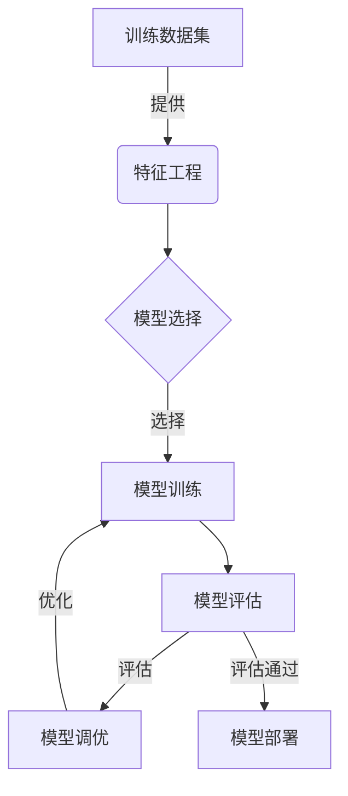

# 监督学习(Supervised Learning) - 原理与代码实例讲解

## 1.背景介绍

监督学习是机器学习中最广泛应用的一种范式。它是一种从标记数据中学习的方法,通过构建一个映射模型,使模型能够将新的输入数据映射到已知的输出标签或值上。监督学习在许多领域都有广泛的应用,如图像识别、自然语言处理、语音识别、预测分析等。

监督学习算法的训练过程需要一组训练数据,其中包含输入变量(特征)和期望输出变量(标签)。算法的目标是从训练数据中学习出一个函数,使其能够对新的输入数据做出准确的预测或分类。常见的监督学习任务包括回归(预测连续值输出)和分类(预测离散类别输出)。

## 2.核心概念与联系

### 2.1 训练数据集

训练数据集是监督学习算法学习的基础,它由输入特征向量和对应的标签或目标值组成。数据集的质量对模型的性能有着至关重要的影响。

### 2.2 特征工程

特征工程是从原始数据中提取有意义的特征,以供机器学习算法使用。合理的特征工程可以显著提高模型的性能。

### 2.3 模型选择

根据任务的性质(回归或分类)和数据集的特点,选择合适的监督学习算法模型,如线性回归、逻辑回归、决策树、支持向量机等。

### 2.4 模型训练

使用训练数据集训练所选择的模型,通过优化算法调整模型参数,使模型能够很好地拟合训练数据。

### 2.5 模型评估

在保留的测试数据集上评估模型的性能,常用指标包括准确率、精确率、召回率、F1分数等。

### 2.6 模型调优

根据模型在测试集上的表现,通过调整超参数、特征选择、正则化等方法来提高模型的泛化能力。

### 2.7 模型部署

将训练好的模型部署到实际的应用系统中,对新的输入数据进行预测或分类。



## 3.核心算法原理具体操作步骤

监督学习算法的核心思想是从训练数据中学习出一个映射函数,使其能够对新的输入数据做出准确的预测或分类。不同的算法采用不同的学习策略,但通常都遵循以下步骤:

1. **数据预处理**:对原始数据进行清洗、标准化等预处理,以提高数据质量。

2. **特征工程**:从原始数据中提取有意义的特征,以供模型使用。

3. **数据集分割**:将数据集分为训练集和测试集,用于模型训练和评估。

4. **模型初始化**:根据选择的算法,初始化模型参数。

5. **模型训练**:使用训练数据集训练模型,通过优化算法调整模型参数,使模型能够很好地拟合训练数据。

6. **模型评估**:在测试数据集上评估模型的性能,计算相关指标。

7. **模型调优**:根据模型在测试集上的表现,通过调整超参数、特征选择、正则化等方法来提高模型的泛化能力。

8. **模型部署**:将训练好的模型部署到实际的应用系统中,对新的输入数据进行预测或分类。

以线性回归为例,其具体操作步骤如下:

1. 导入必要的库和数据集。
2. 对数据进行预处理,包括处理缺失值、特征缩放等。
3. 将数据集分为训练集和测试集。
4. 初始化线性回归模型。
5. 使用训练数据拟合线性回归模型。
6. 在测试数据集上评估模型的均方根误差(RMSE)。
7. 可选:使用交叉验证等技术进一步调优模型。
8. 将训练好的模型应用于新的输入数据,进行预测。

## 4.数学模型和公式详细讲解举例说明

监督学习算法通常基于某些数学模型和公式,这些模型和公式定义了算法的核心逻辑和优化目标。以下是一些常见算法的数学模型和公式:

### 4.1 线性回归

线性回归试图找到一条最佳拟合直线,使得数据点到直线的残差平方和最小。其数学模型如下:

$$y = \theta_0 + \theta_1x_1 + \theta_2x_2 + ... + \theta_nx_n$$

其中,$y$是预测值,$x_i$是特征值,$\theta_i$是模型参数。

残差平方和:

$$J(\theta) = \frac{1}{2m}\sum_{i=1}^m(h_\theta(x^{(i)}) - y^{(i)})^2$$

其中,$m$是训练样本数量,$h_\theta(x^{(i)})$是对第$i$个样本的预测值,$y^{(i)}$是第$i$个样本的真实值。

### 4.2 逻辑回归

逻辑回归用于二分类问题,它通过sigmoid函数将线性回归的输出映射到0到1之间,作为样本属于正类的概率。其数学模型如下:

$$h_\theta(x) = \frac{1}{1 + e^{-\theta^Tx}}$$

其中,$h_\theta(x)$是样本$x$属于正类的概率,$\theta$是模型参数向量。

逻辑回归的损失函数(代价函数)为:

$$J(\theta) = -\frac{1}{m}\sum_{i=1}^m[y^{(i)}\log(h_\theta(x^{(i)})) + (1 - y^{(i)})\log(1 - h_\theta(x^{(i)}))]$$

其中,$m$是训练样本数量,$y^{(i)}$是第$i$个样本的真实标签(0或1)。

### 4.3 决策树

决策树是一种基于树形结构的监督学习算法,它根据特征的条件将数据集分割成更小的子集,直到每个子集中的实例都属于同一类别或满足某个停止条件。

决策树的构建过程可以使用信息增益或基尼系数作为选择最优特征的标准。

- 信息增益:

$$\text{Gain}(S, A) = \text{Entropy}(S) - \sum_{v \in \text{Values}(A)} \frac{|S_v|}{|S|} \text{Entropy}(S_v)$$

其中,$S$是当前数据集,$A$是选择的特征,$S_v$是根据特征$A$的值$v$分割后的子集,$\text{Entropy}(S)$是数据集$S$的信息熵。

- 基尼系数:

$$\text{Gini}(S) = 1 - \sum_{i=1}^c(p_i)^2$$

其中,$c$是类别数,$p_i$是第$i$类样本占$S$的比例。

在构建决策树时,选择能够最大化信息增益或最小化基尼系数的特征作为分割节点。

### 4.4 支持向量机(SVM)

支持向量机是一种常用的监督学习算法,它试图找到一个最优超平面,将不同类别的样本分开,并最大化两类样本到超平面的距离(即间隔)。

对于线性可分的情况,SVM的目标是:

$$\begin{aligned}
&\text{minimize} &\frac{1}{2}\|w\|^2\\
&\text{subject to} &y_i(w^Tx_i + b) \geq 1, i = 1, 2, ..., m
\end{aligned}$$

其中,$w$是超平面的法向量,$b$是偏置项,$x_i$是第$i$个训练样本,$y_i$是第$i$个样本的标签(+1或-1),$m$是训练样本数量。

对于线性不可分的情况,SVM引入了松弛变量,允许一些样本落在间隔边界内或错分,并通过惩罚项$C$控制间隔和误分类之间的权衡。

这些数学模型和公式揭示了监督学习算法的核心思想和优化目标,为算法的实现和理解提供了坚实的理论基础。

## 5.项目实践:代码实例和详细解释说明

以下是一个使用Python和scikit-learn库实现线性回归的示例:

```python
# 导入必要的库
import numpy as np
from sklearn.linear_model import LinearRegression
from sklearn.datasets import make_regression
from sklearn.model_selection import train_test_split
from sklearn.metrics import mean_squared_error

# 生成模拟数据
X, y = make_regression(n_samples=1000, n_features=5, noise=25, random_state=42)

# 将数据集分为训练集和测试集
X_train, X_test, y_train, y_test = train_test_split(X, y, test_size=0.2, random_state=42)

# 创建线性回归模型
model = LinearRegression()

# 训练模型
model.fit(X_train, y_train)

# 在测试集上评估模型
y_pred = model.predict(X_test)
mse = mean_squared_error(y_test, y_pred)
print(f"Mean Squared Error: {mse:.2f}")
```

代码解释:

1. 首先导入必要的库,包括`numpy`、`sklearn.linear_model`、`sklearn.datasets`、`sklearn.model_selection`和`sklearn.metrics`。

2. 使用`make_regression`函数生成模拟的回归数据,包含1000个样本和5个特征,并添加了一些噪声。

3. 使用`train_test_split`函数将数据集分为训练集和测试集,测试集占20%。

4. 创建`LinearRegression`对象,即线性回归模型。

5. 使用训练数据`X_train`和`y_train`拟合(训练)线性回归模型。

6. 在测试数据`X_test`上进行预测,得到预测值`y_pred`。

7. 使用`mean_squared_error`函数计算预测值`y_pred`和真实值`y_test`之间的均方根误差(RMSE),作为模型性能的评估指标。

8. 打印RMSE值。

在实际项目中,您可能还需要进行数据预处理、特征工程、模型调优等步骤,以提高模型的性能和泛化能力。此外,还可以尝试其他监督学习算法,如逻辑回归、决策树、支持向量机等,并根据具体任务和数据特点选择合适的算法。

## 6.实际应用场景

监督学习在现实世界中有着广泛的应用,以下是一些典型的应用场景:

1. **图像识别和计算机视觉**:监督学习在图像分类、目标检测、语义分割等计算机视觉任务中发挥着重要作用。例如,基于深度卷积神经网络的图像分类模型可以准确识别图像中的物体、人物等。

2. **自然语言处理(NLP)**:监督学习在文本分类、机器翻译、文本生成等NLP任务中有着广泛的应用。例如,基于循环神经网络的文本分类模型可以准确判断文本的主题或情感倾向。

3. **金融和风险管理**:监督学习可以用于信用评分、欺诈检测、风险评估等金融领域的任务。例如,基于逻辑回归的信用评分模型可以预测借款人的违约风险。

4. **医疗健康**:监督学习在疾病诊断、药物发现、医学影像分析等医疗健康领域有着重要应用。例如,基于支持向量机的癌症诊断模型可以根据医学影像和生物标记物数据预测患者是否患有癌症。

5. **推荐系统**:监督学习可以用于构建个性化推荐系统,为用户推荐感兴趣的商品、新闻、视频等。例如,基于协同过滤算法的推荐系统可以根据用户的历史行为数据预测用户的偏好。

6. **预测分析**:监督学习在销售预测、需求预测、天气预报等预测分析任务中有着广泛的应用。例如,基于线性回归的销售预测模型可以根据历史销售数据和其他影响因素预测未来的销售量。

7. **语音识别和语音合成**:监督学习在语音识别和语音合成领域发挥着关键作用。例如,基于深度神经网络的语音识别