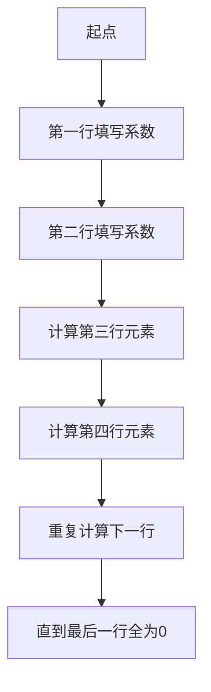
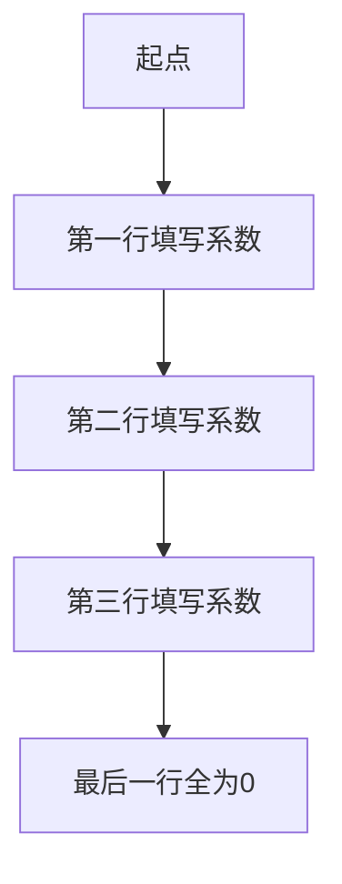

# 矩阵理论与应用：Routh-Hurwitz问题与Schur-Cohn问题

## 1.背景介绍

在线性代数和控制理论中,矩阵理论扮演着至关重要的角色。它为分析和设计各种系统提供了强大的数学工具。其中,Routh-Hurwitz问题和Schur-Cohn问题是两个经典的矩阵问题,广泛应用于系统稳定性分析、滤波器设计、信号处理等领域。

### 1.1 Routh-Hurwitz问题

Routh-Hurwitz问题源于19世纪,旨在确定一个多项式的所有根是否都具有负实部。这在控制理论中等同于判断一个系统是否稳定。Routh-Hurwitz准则提供了一种有效的代数方法,无需计算多项式的根,即可判断系统的稳定性。

### 1.2 Schur-Cohn问题

Schur-Cohn问题则关注于判断一个多项式的所有根是否都位于单位圆内。这在数字信号处理中具有重要意义,因为它等价于判断一个离散时间系统是否稳定。Schur-Cohn准则为解决这一问题提供了一种矩阵理论方法。

## 2.核心概念与联系

### 2.1 多项式稳定性

多项式稳定性是Routh-Hurwitz问题和Schur-Cohn问题的核心概念。对于一个n阶多项式:

$$P(z) = a_0 + a_1z + a_2z^2 + \cdots + a_nz^n$$

- Routh-Hurwitz问题关注所有根的实部是否都小于0,即$Re(z_i) < 0, i=1,2,\ldots,n$
- Schur-Cohn问题关注所有根的模是否都小于1,即$|z_i| < 1, i=1,2,\ldots,n$

两个问题虽然侧重点不同,但都涉及到多项式根的位置判断,因此在解题思路上有许多相似之处。

### 2.2 矩阵理论方法

Routh-Hurwitz准则和Schur-Cohn准则都利用了矩阵理论,将多项式系数排列成特殊形式的矩阵,通过研究这些矩阵的性质来判断多项式根的位置。

例如,对于一个4阶多项式$P(z) = a_0 + a_1z + a_2z^2 + a_3z^3 + a_4z^4$,Routh-Hurwitz矩阵和Schur-Cohn矩阵分别为:

$$
R_H = \begin{bmatrix}
a_4 & a_2 & a_0\\
a_3 & a_1 & 0\\
b_1 & b_0 & 0\\
c_1 & c_0 & 0
\end{bmatrix}
\quad
S_C = \begin{bmatrix}
a_4 & a_3 & a_2 & a_1\\
a_0 & a_4 & a_3 & a_2\\
a_2 & a_1 & a_0 & 0\\
a_0 & 0 & 0 & 0  
\end{bmatrix}
$$

通过研究这些矩阵的行列式、主子式等性质,可以得出多项式根的位置信息。

## 3.核心算法原理具体操作步骤

### 3.1 Routh-Hurwitz准则

对于一个n阶多项式$P(z) = a_0 + a_1z + a_2z^2 + \cdots + a_nz^n$,构造Routh-Hurwitz矩阵$R_H$如下:



1. 第一行填写$a_n, a_{n-2}, a_{n-4}, \ldots$
2. 第二行填写$a_{n-1}, a_{n-3}, a_{n-5}, \ldots$
3. 从第三行开始,每个元素按照下面公式计算:
   $$b_k = \frac{a_{n-2k-1}a_{n-2k+1} - a_{n-2k}a_{n-2k}}{a_{n-2k}}$$
4. 重复计算下一行,直到最后一行全为0
5. 如果矩阵每一行的第一个元素同号且不为0,则多项式根都有负实部,系统稳定

### 3.2 Schur-Cohn准则  

对于一个n阶多项式$P(z) = a_0 + a_1z + a_2z^2 + \cdots + a_nz^n$,构造Schur-Cohn矩阵$S_C$如下:



1. 第一行填写$a_n, a_{n-1}, a_{n-2}, \ldots, a_0$  
2. 第二行填写$a_0, a_n, a_{n-1}, \ldots, a_1$
3. 第三行填写$a_2, a_1, a_0, 0, \ldots, 0$
4. 最后一行全为0
5. 计算矩阵的所有顺序主子式的值
6. 如果所有顺序主子式值都大于0,则多项式根都在单位圆内,系统稳定

通过这两种准则,我们可以有效判断系统的稳定性,而无需直接求解多项式根,大大简化了计算复杂度。

## 4.数学模型和公式详细讲解举例说明

### 4.1 Routh-Hurwitz准则数学模型

设$P(z) = a_0 + a_1z + a_2z^2 + \cdots + a_nz^n$是一个n阶多项式,对应的系统函数为:

$$H(z) = \frac{b_0 + b_1z + \cdots + b_mz^m}{a_0 + a_1z + a_2z^2 + \cdots + a_nz^n}$$

我们的目标是判断$H(z)$的极点(即$P(z)$的根)是否都有负实部。根据Routh-Hurwitz准则,我们构造如下矩阵:

$$
R_H = \begin{bmatrix}
a_n & a_{n-2} & a_{n-4} & \cdots & a_0\\
a_{n-1} & a_{n-3} & a_{n-5} & \cdots & 0\\
b_1 & b_2 & b_3 & \cdots & 0\\
c_1 & c_2 & c_3 & \cdots & 0\\
\vdots & \vdots & \vdots & \ddots & \vdots
\end{bmatrix}
$$

其中,第三行元素按照下面公式计算:

$$b_k = \frac{a_{n-2k-1}a_{n-2k+1} - a_{n-2k}a_{n-2k}}{a_{n-2k}}$$

后续每一行也按照类似方式计算。如果矩阵每一行的第一个元素同号且不为0,则$H(z)$的极点都有负实部,系统稳定。

**例子**: 对于一个4阶多项式$P(z) = 3 + 2z + 5z^2 + 4z^3 + z^4$,我们构造Routh-Hurwitz矩阵:

$$
R_H = \begin{bmatrix}
1 & 5 & 3\\
4 & 2 & 0\\
\frac{15}{4} & \frac{3}{2} & 0\\
\frac{1}{8} & 0 & 0
\end{bmatrix}
$$

由于每一行的第一个元素同号且不为0,因此根据Routh-Hurwitz准则,该多项式的根都有负实部,对应的系统是稳定的。

### 4.2 Schur-Cohn准则数学模型

设$P(z) = a_0 + a_1z + a_2z^2 + \cdots + a_nz^n$是一个n阶多项式,我们的目标是判断它的根是否都在单位圆内,即$|z_i| < 1, i=1,2,\ldots,n$。根据Schur-Cohn准则,我们构造如下矩阵:

$$
S_C = \begin{bmatrix}
a_n & a_{n-1} & a_{n-2} & \cdots & a_0\\
a_0 & a_n & a_{n-1} & \cdots & a_1\\
a_2 & a_1 & a_0 & \cdots & 0\\
\vdots & \vdots & \vdots & \ddots & \vdots\\
0 & 0 & 0 & \cdots & 0
\end{bmatrix}
$$

接下来,我们计算该矩阵的所有顺序主子式的值。如果所有顺序主子式的值都大于0,则多项式的根都在单位圆内,对应的系统是稳定的。

**例子**: 对于一个3阶多项式$P(z) = 1 + z + 2z^2 + z^3$,我们构造Schur-Cohn矩阵:

$$
S_C = \begin{bmatrix}
1 & 1 & 2 & 1\\
1 & 1 & 1 & 2\\
2 & 1 & 1 & 0\\
0 & 0 & 0 & 0
\end{bmatrix}
$$

计算所有顺序主子式:

$$
\begin{aligned}
|S_C| &= 1 \\
\begin{vmatrix}
1 & 1\\
1 & 1
\end{vmatrix} &= 2 \\
\begin{vmatrix}
1 & 1 & 2\\
1 & 1 & 1\\
2 & 1 & 1
\end{vmatrix} &= 1 \\
\begin{vmatrix}
1 & 1 & 2 & 1\\
1 & 1 & 1 & 2\\
2 & 1 & 1 & 0\\
0 & 0 & 0 & 0
\end{vmatrix} &= 1
\end{aligned}
$$

由于所有顺序主子式的值都大于0,根据Schur-Cohn准则,该多项式的根都在单位圆内,对应的系统是稳定的。

通过上述数学模型和例子,我们可以清楚地看到Routh-Hurwitz准则和Schur-Cohn准则在判断系统稳定性方面的强大功能。它们提供了有效的代数方法,避免了直接求解多项式根的复杂计算。

## 5.项目实践:代码实例和详细解释说明

为了更好地理解和应用Routh-Hurwitz准则和Schur-Cohn准则,我们提供了Python代码实现,并对关键步骤进行了详细的解释说明。

### 5.1 Routh-Hurwitz准则Python实现

```python
import numpy as np

def routh_hurwitz(poly_coeff):
    """
    Routh-Hurwitz稳定性判断
    
    参数:
        poly_coeff (list): 多项式系数列表,高次项在前
        
    返回:
        bool: True表示系统稳定,False表示系统不稳定
    """
    n = len(poly_coeff) - 1  # 多项式阶数
    rh = np.zeros((n+1, n+1))  # 初始化Routh-Hurwitz矩阵
    
    # 填充第一行和第二行
    rh[0, :n+1:2] = poly_coeff[::-1]  # 奇数列填充原多项式系数
    rh[1, :n:2] = poly_coeff[:0:-1]  # 偶数列填充原多项式系数
    
    # 计算剩余行
    for i in range(2, n+1):
        for j in range(n-i+1):
            numer = rh[i-2, j] * rh[i-1, j+1] - rh[i-2, j+1] * rh[i-1, j]
            denom = rh[i-1, j]
            if denom != 0:
                rh[i, j] = numer / denom
    
    # 检查第一列元素的符号
    first_col = rh[:, 0]
    first_col = first_col[~np.isnan(first_col)]  # 去除NaN元素
    if np.all(first_col > 0) or np.all(first_col < 0):
        return True
    else:
        return False
```

该函数`routh_hurwitz`接受一个多项式系数列表作为输入,返回一个布尔值,表示系统是否稳定。

1. 首先,我们初始化一个$(n+1) \times (n+1)$的Routh-Hurwitz矩阵`rh`。
2. 然后,我们填充矩阵的第一行和第二行,分别为原多项式系数的倒序和倒序后错位一位。
3. 