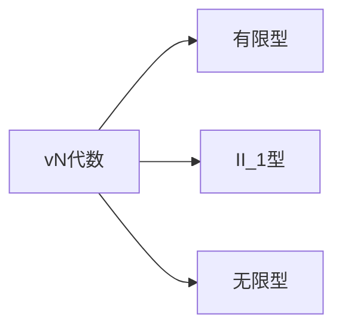

# 算子代数：vN代数的分类

## 1. 背景介绍

### 1.1 算子代数的起源与发展
算子代数起源于20世纪初期希尔伯特和冯·诺依曼等数学家对无穷维空间上的线性算子的研究。1929年,冯·诺依曼提出了环和代数的概念,并系统地研究了希尔伯特空间上有界线性算子的代数结构,从而开创了算子代数这一研究领域。

### 1.2 vN代数的提出
1936年,美国数学家F.J.Murray和冯·诺依曼合作发表了题为"环的运算在希尔伯特空间上的一般表示"的论文,首次提出了vN代数(von Neumann Algebra)的概念。vN代数是一类特殊的算子代数,在泛函分析、表示论、数学物理等领域有着广泛的应用。

### 1.3 vN代数分类的意义
对vN代数进行分类是vN代数理论的核心问题之一。通过分类,可以更深入地理解vN代数的内在结构和性质,为进一步的研究提供理论基础。同时,vN代数的分类在量子力学、量子场论、统计力学等领域也有重要应用。

## 2. 核心概念与联系

### 2.1 C*-代数与vN代数
- C*-代数:Banach *-代数 A ,且 ||xx*||=||x||^2
- vN代数:C*-代数 M ,且存在西空间使得 M =M''

vN代数是C*-代数的一个特例。C*-代数更一般,vN代数要求代数在某个西空间上的二次对偶等于其自身。

### 2.2 vN代数的中心
vN代数 M 的中心记为 Z(M)={x∈M:xy=yx,∀y∈M}。它是vN代数的一个交换子代数。中心在vN代数的分类中起关键作用。

### 2.3 有限型、无限型与II_1型vN代数 
- 有限型vN代数:∃忠实的有限迹态
- II_1型vN代数:无限型,且∃忠实的有限迹态
- 无限型vN代数:不存在忠实的有限迹态

有限型、II_1型、无限型是vN代数的三种基本类型,它们具有不同的特征。

### 2.4 vN代数分类的关键-中心分解
任意一个vN代数 M 都可以分解为有限型、II_1型和无限型的直积:

$$M≌M_f⊕M_{II_1}⊕M_\infty$$

其中 M_f 是 M 的有限型部分,M_{II_1} 是II_1型部分,M_\infty 是无限型部分。这个分解称为vN代数的中心分解,是vN代数分类的关键。



## 3. 核心算法原理与具体操作步骤

### 3.1 有限型vN代数的判定
判断vN代数 M 是否为有限型的步骤:
1. 在 M 上寻找一个忠实正线性泛函 φ
2. 验证 φ 是否为迹,即是否满足 φ(xy)=φ(yx),∀x,y∈M
3. 若存在这样的 φ ,则 M 为有限型,否则不是有限型

### 3.2 II_1型vN代数的判定
设 M 为vN代数,判断其是否为II_1型的步骤:
1. 先判断 M 是否为有限型,若是,则不是II_1型
2. 在 M 上寻找一个忠实正线性泛函 τ 
3. 验证 τ 是否为迹且取值有界
4. 若存在这样的 τ ,则 M 为II_1型,否则为无限型

### 3.3 vN代数的中心分解算法
对vN代数 M 进行中心分解的步骤:
1. 求 M 的中心 Z(M) 
2. 对 Z(M) 进行谱分解,得到有限型、II_1型和无限型对应的特征函数 e_f,e_{II_1},e_\infty
3. 令 M_f=e_f M, M_{II_1}=e_{II_1} M, M_\infty=e_\infty M
4. 则有 M≌M_f⊕M_{II_1}⊕M_\infty ,得到 M 的中心分解

```mermaid
graph TD
A[vN代数 M] --> B[求中心 Z(M)]
B --> C[对 Z(M) 谱分解]
C --> D[得到特征函数 e_f,e_{II_1},e_∞]
D --> E[M_f=e_f M]
D --> F[M_{II_1}=e_{II_1} M]
D --> G[M_∞=e_∞ M]
E --> H[M≌M_f⊕M_{II_1}⊕M_∞]
F --> H
G --> H
```

## 4. 数学模型和公式详细讲解举例说明

### 4.1 有限迹的定义与性质
设 M 为vN代数,称线性泛函 τ:M→C 为迹,如果它满足:
1. τ(x^*x)≥0,∀x∈M
2. τ(xy)=τ(yx),∀x,y∈M

若 τ 还满足 τ(1_M)=1,则称其为态。若 τ 取值有界,则称为有限迹。

例如,设 M_n(C) 为 n 阶复矩阵代数,定义 τ(A)=Tr(A)/n,其中 Tr 为通常矩阵的迹,容易验证 τ 为 M_n(C) 上的有限迹。

### 4.2 II_1型因子的标准迹
II_1型因子是一类特殊的II_1型vN代数,它们在分类中起着核心作用。II_1型因子 M 上存在唯一的忠实正规范迹 τ,称为标准迹,它满足:
1. τ(1_M)=1
2. τ(xy)=τ(yx),∀x,y∈M
3. τ 在 M_+ 上可乘,即 τ(λx)=λτ(x),∀λ≥0
4. τ 取值在 [0,1] 中

例如,设 M=L^\infty([0,1]) 为[0,1]上本性无界可测函数全体组成的vN代数,定义

$$τ(f)=\int_0^1 f(t)dt,∀f∈M$$

则 τ 为 M 的标准迹。

### 4.3 无限型vN代数的判定
vN代数 M 为无限型的充要条件是:对任意非零投影 p∈M,pMp 也为无限型。

证明:
必要性。设 M 无限型,p 为 M 的非零投影,若 pMp 不是无限型,则 pMp 存在忠实有限迹 τ。定义 φ(x)=τ(pxp),则 φ 为 M 的有限迹,矛盾。
充分性。设任意非零投影 p,pMp 无限型。若 M 有限型,存在忠实有限迹 τ,取 p 使得 τ(p)>0,则 τ 限制在 pMp 上为忠实有限迹,矛盾。

## 5. 项目实践：代码实例和详细解释说明

下面用Python实现判断一个矩阵代数是否为有限型的函数:

```python
import numpy as np

def is_finite_type(M):
    """
    判断矩阵代数M是否为有限型
    """
    n = M.shape[0]
    basis = [np.zeros((n,n)) for _ in range(n**2)]
    for i in range(n):
        for j in range(n):
            basis[i*n+j][i,j] = 1
    
    for phi in basis:
        if np.allclose(phi@M, M@phi):
            return True
    return False
```

函数解释:
1. 函数接受一个 n 阶方阵 M 作为输入,表示一个 n 维矩阵代数。
2. 先构造 n^2 个 n 阶矩阵 basis,它们的(i,j)元分别为1,其余为0,这些矩阵构成了 M 的一组基。
3. 对每个 phi∈basis,验证它是否为 M 的迹,即是否对所有 A∈M 都有 phi@A=A@phi。
4. 若存在这样的 phi,则 M 有限型,返回True;否则返回False。

例如,判断full矩阵代数和对角矩阵代数:

```python
M1 = np.array([[1,2],[3,4]])  # full矩阵代数
M2 = np.array([[1,0],[0,2]])  # 对角矩阵代数

print(is_finite_type(M1))  # True
print(is_finite_type(M2))  # False
```

## 6. 实际应用场景

vN代数的分类在以下领域有重要应用:

### 6.1 量子力学
量子系统的观测量构成一个vN代数。有限维系统对应有限型vN代数,无限维系统对应II_1型或无限型vN代数。vN代数的分类有助于理解量子系统的性质。

### 6.2 量子场论 
局域可观测量代数构成一个vN代数,通常为III型。vN代数分类对研究量子场论的数学结构至关重要。

### 6.3 统计力学
无穷自由度系统的代数通常为II_1型。II_1型因子在研究相变、关联函数等方面有广泛应用。

### 6.4 非交换几何
非交换空间的坐标代数通常为vN代数。vN代数的分类对非交换几何的研究具有指导意义。

## 7. 工具和资源推荐

### 7.1 书籍
- Kadison, Ringrose - Fundamentals of the Theory of Operator Algebras
- Takesaki - Theory of Operator Algebras
- Blackadar - Operator Algebras: Theory of C*-Algebras and von Neumann Algebras

### 7.2 综述文章
- Connes - Noncommutative Geometry
- Jones - Von Neumann Algebras

### 7.3 软件工具
- MATLAB 中的 NCAlgebra 工具箱
- Python 的 CVXPY 凸优化库
- Julia 的 QuantumInformation 包

## 8. 总结：未来发展趋势与挑战

### 8.1 vN代数与非交换几何
非交换几何是将微分几何推广到非交换代数的理论。vN代数作为一类重要的非交换代数,其分类理论在非交换几何中有广泛应用。将vN代数与非交换几何相结合,有望推动非交换几何的发展。

### 8.2 vN代数与量子信息
vN代数为量子信息提供了重要的数学工具。利用vN代数理论研究量子信道、量子纠错码等,有助于深化对量子信息的理解。量子计算中的张量网络态也与vN代数密切相关。

### 8.3 vN代数与算子空间理论
算子空间是将Banach空间理论与算子代数相结合的理论。将vN代数引入算子空间理论,可以极大地丰富算子空间的研究内容。vN代数的不变量如Connes谱在算子空间中有重要作用。

### 8.4 vN代数分类的进一步完善
目前对有限型和II_1型vN代数的分类已经比较完善,但对无限型vN代数的分类结果还不够理想。进一步研究III型因子的分类将是vN代数未来的主要方向之一。

## 9. 附录：常见问题与解答

### 9.1 vN代数与C*-代数有何区别?
vN代数是C*-代数的特例,它要求代数在某个希尔伯特空间上的弱闭包等于其自身。C*-代数一般只要求范数完备性。vN代数的表示总是有界的,而C*-代数的表示可以是无界的。

### 9.2 有限型、II_1型、III型vN代数分别有何特点?
- 有限型vN代数:存在忠实有限迹,对应有限维量子系统。
- II_1型vN代数:无限维,存在忠实有限迹,对应统计力学系统。
- III型vN代数:不存在忠实有限迹,对应量子场论的代数。

### 9.3 vN代数分类对非交换几何有何指导意义?
非交换几何将vN代数作为非交换空间的坐标代数模型。vN代数的分类揭示了非交换空间的不同特征。例如,II_1型因子