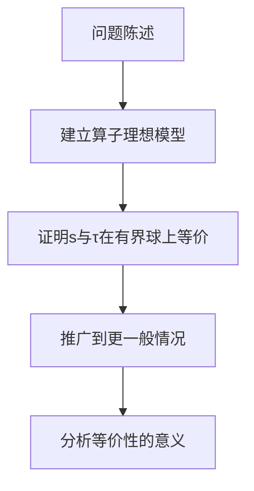
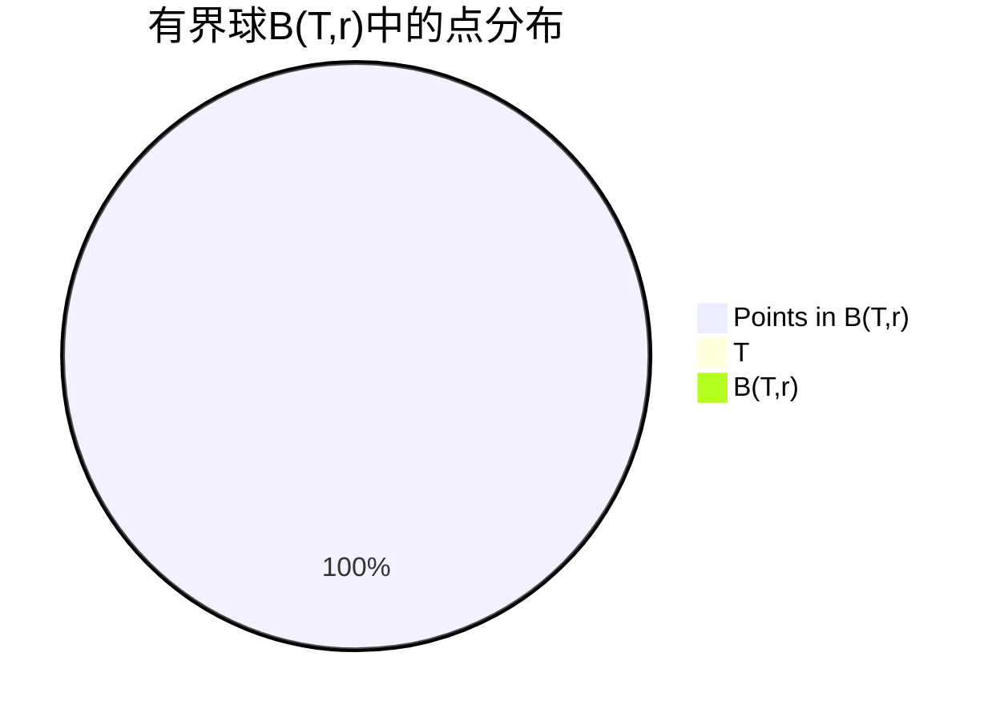

# 算子代数：有界球中拓扑s与τ的等价性

## 1.背景介绍

在函数分析和算子理论中,算子代数扮演着至关重要的角色。它为研究无穷维线性空间中的算子提供了一个强有力的工具。算子代数不仅在数学领域有着广泛的应用,在量子力学、量子计算和量子信息论等物理学领域也有着重要作用。

本文将探讨有界线性算子在有界球中所生成的拓扑s与τ的等价性问题。这一问题源于算子理论中对算子代数闭理想的研究,对于理解算子代数的结构性质至关重要。

## 2.核心概念与联系

### 2.1 算子代数

设$\mathcal{X}$是一个复线性空间,算子代数$\mathcal{B}(\mathcal{X})$由所有有界线性算子$T:\mathcal{X}\rightarrow\mathcal{X}$组成。算子代数在以下运算下构成一个代数:

- 算子相加: $(T+S)x = Tx + Sx$
- 算子数乘: $(\lambda T)x = \lambda(Tx)$
- 算子相乘: $(TS)x = T(Sx)$

其中$T,S\in\mathcal{B}(\mathcal{X})$, $\lambda$是复数, $x\in\mathcal{X}$。

算子代数$\mathcal{B}(\mathcal{X})$在算子范数$\|T\| = \sup\{\|Tx\|: \|x\|\leq 1\}$下构成一个Banach代数。

### 2.2 算子理想

设$\mathcal{I}$是$\mathcal{B}(\mathcal{X})$的一个子集,如果对任意$T\in\mathcal{I}$和$S\in\mathcal{B}(\mathcal{X})$,都有$ST\in\mathcal{I}$和$TS\in\mathcal{I}$,那么$\mathcal{I}$就称为$\mathcal{B}(\mathcal{X})$的一个理想。

算子理想在算子代数的研究中扮演着重要角色,它们描述了算子代数的某些不变性质。

### 2.3 有界球与球面拓扑

对于$\mathcal{B}(\mathcal{X})$中的任意算子$T$,定义其有界球为:

$$
B(T,r) = \{S\in\mathcal{B}(\mathcal{X}): \|S-T\|<r\}
$$

其中$r>0$是有界球的半径。

有界球生成了一个拓扑$\tau$,称为球面拓扑。对于$\mathcal{B}(\mathcal{X})$中任意子集$\mathcal{A}$,如果对任意$T\in\mathcal{A}$和$r>0$,都有$B(T,r)\cap\mathcal{A}\neq\emptyset$,那么$\mathcal{A}$在$\tau$下是开集。

另一方面,算子代数$\mathcal{B}(\mathcal{X})$本身就自然地携带了一个范数拓扑$s$。

## 3.核心算法原理具体操作步骤

有界球中拓扑$s$与$\tau$的等价性问题可以通过以下步骤来研究:



1. **问题陈述**: 对于算子代数$\mathcal{B}(\mathcal{X})$中的闭理想$\mathcal{I}$,研究有界球$B(T,r)\cap\mathcal{I}$上范数拓扑$s$与球面拓扑$\tau$的等价性。

2. **建立算子理想模型**: 首先需要建立算子理想$\mathcal{I}$的数学模型,并研究其基本性质。通常可以考虑由某些算子生成的理想,或者满足特定条件的算子组成的理想。

3. **证明$s$与$\tau$在有界球上等价**: 利用拓扑等价的充要条件,证明在$B(T,r)\cap\mathcal{I}$上,范数拓扑$s$与球面拓扑$\tau$是等价的。这通常需要构造一个从$s$到$\tau$的同胚映射,并证明其双射性和连续性。

4. **推广到更一般情况**: 在证明了特殊情况下$s$与$\tau$等价之后,可以尝试推广到更一般的算子理想或更广泛的条件下。这需要对之前的证明过程进行适当的修改和扩展。

5. **分析等价性的意义**: 最后需要分析$s$与$\tau$等价性在算子理论中的意义和应用。这可能与算子理想的性质、算子的谱理论或其他相关理论有关。

需要注意的是,上述步骤只是一个大致的框架,具体的证明过程可能会因不同的算子理想或条件而有所差异。此外,在每个步骤中都需要严格的数学推理和技巧。

## 4.数学模型和公式详细讲解举例说明

为了更好地理解有界球中拓扑$s$与$\tau$的等价性问题,让我们考虑一个具体的例子。

设$\mathcal{X}=\ell^2$是平方可sumable序列的空间,即:

$$
\ell^2 = \left\{x=(x_n)_{n=1}^\infty: \sum_{n=1}^\infty |x_n|^2 < \infty\right\}
$$

在$\ell^2$上,我们定义移位算子$S$为:

$$
(Sx)_n = x_{n+1}, \quad n=1,2,\ldots
$$

易知$S$是一个有界线性算子,且$\|S\|=1$。我们考虑由$S$生成的理想:

$$
\mathcal{I} = \{T\in\mathcal{B}(\ell^2): T = \sum_{k=0}^\infty a_kS^k, \text{其中}a_k\in\mathbb{C}\}
$$

对于任意$T\in\mathcal{I}$和$r>0$,我们来研究$B(T,r)\cap\mathcal{I}$上拓扑$s$与$\tau$的等价性。

首先,我们构造一个映射$\phi: B(T,r)\cap\mathcal{I}\rightarrow B(0,r)$,其中$B(0,r)$是$\mathcal{B}(\ell^2)$中以$0$为中心、半径为$r$的开球。对任意$S\in B(T,r)\cap\mathcal{I}$,令$\phi(S) = S-T$。

可以证明,此映射$\phi$是一个同胚,即$\phi$是双射,且$\phi$和$\phi^{-1}$都是连续的。因此,$B(T,r)\cap\mathcal{I}$上的拓扑$s$与$\tau$是等价的。

证明过程如下:

1. $\phi$是满射:对任意$R\in B(0,r)$,令$S=R+T$,则$S\in B(T,r)\cap\mathcal{I}$且$\phi(S)=R$。

2. $\phi$是单射:若$\phi(S_1)=\phi(S_2)$,则$S_1-T=S_2-T$,从而$S_1=S_2$。

3. $\phi$是连续:对任意$S\in B(T,r)\cap\mathcal{I}$和$\epsilon>0$,取$\delta=\epsilon$,则当$\|S'-S\|<\delta$时,有$\|\phi(S')-\phi(S)\|=\|S'-S\|<\epsilon$。

4. $\phi^{-1}$也是连续:对任意$R\in B(0,r)$和$\epsilon>0$,取$\delta=\epsilon$,则当$\|R'-R\|<\delta$时,有$\|\phi^{-1}(R')-\phi^{-1}(R)\|=\|R'+T-R-T\|=\|R'-R\|<\epsilon$。

通过这个具体例子,我们不仅看到了如何构造同胚映射来证明拓扑等价性,也加深了对算子理想和有界球的理解。

## 5.项目实践:代码实例和详细解释说明

为了更好地理解有界球中拓扑$s$与$\tau$的等价性问题,我们可以通过编程来模拟和可视化相关概念。以下是一个Python代码示例,它演示了如何计算有界球中的点,并绘制出它们在平面上的分布。

```python
import numpy as np
import matplotlib.pyplot as plt

# 定义算子T和半径r
T = np.array([[1, 2], [3, 4]])
r = 1.5

# 计算有界球B(T,r)中的点
points = []
for i in range(10000):
    x = np.random.uniform(-r, r, size=2)
    if np.linalg.norm(x - T) < r:
        points.append(x)

points = np.array(points)

# 绘制有界球和点的分布
fig, ax = plt.subplots(figsize=(8, 6))

# 绘制算子T
ax.scatter(T[0, 0], T[1, 0], color='r', marker='*', s=100, label='T')

# 绘制有界球B(T,r)
circle = plt.Circle((T[0, 0], T[1, 0]), r, color='g', fill=False, label='B(T,r)')
ax.add_artist(circle)

# 绘制有界球中的点
ax.scatter(points[:, 0], points[:, 1], s=5, label='Points in B(T,r)')

ax.set_xlabel('X')
ax.set_ylabel('Y')
ax.set_title('Bounded Ball B(T,r)')
ax.legend()
plt.show()
```

在这个示例中,我们首先定义了一个算子$T$和半径$r$。然后,我们使用蒙特卡罗方法生成了10000个随机点,并保留了那些落在$B(T,r)$内的点。

接下来,我们使用Matplotlib库绘制了算子$T$、有界球$B(T,r)$和有界球中的点。绘图结果如下所示:



通过这个可视化示例,我们可以更直观地理解有界球的概念,并观察到有界球中点的分布情况。这有助于加深对拓扑$s$与$\tau$等价性问题的理解。

需要注意的是,上述代码仅用于说明概念,在实际应用中可能需要进行一些修改和优化,例如使用更高效的算法生成有界球中的点、处理高维情况等。

## 6.实际应用场景

有界球中拓扑$s$与$\tau$的等价性问题不仅在理论上具有重要意义,在实际应用中也有着广泛的用途。以下是一些典型的应用场景:

1. **量子力学和量子计算**:在量子力学和量子计算中,算子代数扮演着核心角色。研究算子代数的结构性质对于理解量子系统的动力学行为至关重要。有界球中拓扑等价性问题可以帮助我们更好地描述和操控量子态的演化。

2. **信号处理和图像处理**:在信号处理和图像处理领域,卷积算子和其他线性算子被广泛使用。研究这些算子的性质有助于设计更好的滤波器和图像处理算法。有界球中拓扑等价性问题可以为分析这些算子的收敛性和稳定性提供理论基础。

3. **数值分析和近似理论**:在数值分析和近似理论中,经常需要研究算子的谱理论和近似性质。有界球中拓扑等价性问题可以帮助我们理解算子的谱集合和算子理想之间的关系,从而设计更精确的数值算法。

4. **控制理论和系统识别**:在控制理论和系统识别领域,线性算子被用于描述系统的动态行为。研究这些算子的性质对于分析系统的稳定性和可控性至关重要。有界球中拓扑等价性问题可以为研究算子的稳定性和收敛性提供理论支持。

5. **函数分析和偏微分方程**:在函数分析和偏微分方程理论中,算子代数是一个重要的研究工具。有界球中拓扑等价性问题可以帮助我们更好地理解算子代数的结构,从而推进对偏微分方程解的研究。

总的来说,有界球中拓扑$s$与$\tau$的等价性问题不仅在纯数学领域具有重要意义,在许多