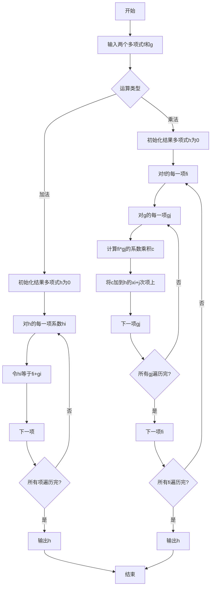

# 线性代数导引：实系数多项式环

## 1.背景介绍

在数学和计算机科学领域中,多项式环是一个基础且重要的代数结构。实系数多项式环是指系数来自实数集合的多项式组成的环。它不仅在抽象代数理论中扮演着重要角色,同时也广泛应用于计算机科学的诸多领域,如密码学、编码理论、计算机代数等。本文将深入探讨实系数多项式环的基本概念、运算法则、重要性质以及相关应用,为读者提供一个全面而系统的理解。

## 2.核心概念与联系

### 2.1 多项式的定义

一个实系数多项式$f(x)$可以表示为:

$$f(x) = a_nx^n + a_{n-1}x^{n-1} + \cdots + a_1x + a_0$$

其中,$ a_i \in \mathbb{R} $ ($ 0 \leq i \leq n $)称为多项式的系数,$ n $称为多项式的次数或阶数。如果$ a_n \neq 0 $,则$ a_n $称为多项式的leading coefficient(首系数)。特别地,多项式$ f(x) = 0 $称为零多项式。

### 2.2 多项式环的定义

实系数多项式环,记作$ \mathbb{R}[x] $,是指所有实系数多项式组成的集合,在加法和数乘运算之下构成一个环。也就是说,对于任意$ f(x),g(x) \in \mathbb{R}[x] $,以及任意实数$ a,b \in \mathbb{R} $,都有:

1. $ f(x) + g(x) \in \mathbb{R}[x] $
2. $ (f(x) + g(x)) + h(x) = f(x) + (g(x) + h(x)) $ (加法交换律)
3. 存在$ 0 \in \mathbb{R}[x] $,使得对任意$ f(x) \in \mathbb{R}[x] $,有$ f(x) + 0 = f(x) $ (存在加法单位元)
4. 对任意$ f(x) \in \mathbb{R}[x] $,存在$ -f(x) \in \mathbb{R}[x] $,使得$ f(x) + (-f(x)) = 0 $ (存在加法逆元)
5. $ (af(x))g(x) = f(x)(ag(x)) = a(f(x)g(x)) $ (数乘满足分配律)
6. $ (f(x) + g(x))h(x) = f(x)h(x) + g(x)h(x) $ (乘法分配于加法)
7. 存在$ 1 \in \mathbb{R}[x] $,使得对任意$ f(x) \in \mathbb{R}[x] $,有$ 1f(x) = f(x) $ (存在乘法单位元)

### 2.3 多项式环与其他代数结构的联系

多项式环$ \mathbb{R}[x] $不仅是一个环,也是一个交换环、整环和整除域。它与其他一些重要的代数结构存在紧密联系:

- 实数集$ \mathbb{R} $是$ \mathbb{R}[x] $的子环
- $ \mathbb{R}[x] $是$ \mathbb{C}[x] $(复系数多项式环)的子环
- $ \mathbb{Z}[x] $(整系数多项式环)是$ \mathbb{R}[x] $的子环
- $ \mathbb{R}[x] $是$ \mathbb{R}(x) $(有理分式域)的子环

## 3.核心算法原理具体操作步骤

### 3.1 多项式的表示

在计算机中,通常使用系数表示法来存储一个多项式。具体来说,一个次数为n的多项式$ f(x) $可以用一个长度为$ n+1 $的系数数组$ [a_0, a_1, \ldots, a_n] $来表示,其中$ a_i $是$ x^i $项的系数。

例如,多项式$ f(x) = x^3 - 2x^2 + x + 5 $可表示为$ [5, 1, -2, 1] $。

### 3.2 多项式的基本运算

#### 3.2.1 多项式加法

两个多项式$ f(x) $和$ g(x) $的和$ h(x) = f(x) + g(x) $可以这样计算:对于$ h(x) $的每一个系数$ h_i $,令$ h_i = f_i + g_i $,其中$ f_i $和$ g_i $分别是$ f(x) $和$ g(x) $的$ x^i $项系数。

例如,若$ f(x) = x^3 + x^2 - 1 $,$ g(x) = 2x^2 - x + 3 $,则$ f(x) + g(x) = x^3 + 3x^2 - x + 2 $。

#### 3.2.2 多项式乘法

两个多项式$ f(x) $和$ g(x) $的积可以使用经典的多项式乘法算法计算,时间复杂度为$ O(n^2) $,其中$ n $是两个多项式次数的较大者。

更高效的乘法算法有Karatsuba算法(时间复杂度$ O(n^{\log_2 3}) \approx O(n^{1.585}) $)和FFT(快速傅里叶变换)算法(时间复杂度$ O(n\log n) $)。

#### 3.2.3 多项式除法

多项式除法可以使用经典的长除法算法,时间复杂度为$ O(n^2) $。更高效的算法包括Euclidean算法(时间复杂度$ O(n^2) $)和Hensel求值法(时间复杂度$ O(n\log^2 n\log\log n) $)。

#### 3.2.4 其他运算

求多项式的值、导数、不定积分等运算也有相应的高效算法,这里不再赘述。

### 3.3 Mermaid流程图

以下是多项式加法和乘法的Mermaid流程图:



上面的流程图描述了多项式加法和乘法的基本步骤,可以作为实现这些运算的伪代码。

## 4.数学模型和公式详细讲解举例说明

### 4.1 多项式的根和因式分解

一个实系数多项式$ f(x) $的根是指使$ f(x) = 0 $的实数解。如果$ \alpha $是$ f(x) $的根,那么$ x - \alpha $是$ f(x) $的因子。根与因式分解之间存在着紧密的联系。

具体来说,如果一个次数为$ n $的多项式$ f(x) $有$ n $个不同的根$ \alpha_1, \alpha_2, \ldots, \alpha_n $,那么$ f(x) $可以因式分解为:

$$f(x) = a_n(x - \alpha_1)(x - \alpha_2) \cdots (x - \alpha_n)$$

其中$ a_n $是$ f(x) $的首系数。

例如,多项式$ f(x) = x^3 - 6x^2 + 11x - 6 $有根$ \alpha_1 = 1,\alpha_2 = 2,\alpha_3 = 3 $,因此可以因式分解为:

$$f(x) = (x - 1)(x - 2)(x - 3)$$

### 4.2 多项式的商和余式定理

设$ f(x),g(x) \in \mathbb{R}[x] $,其中$ g(x) \neq 0 $。则存在唯一的$ q(x),r(x) \in \mathbb{R}[x] $,使得:

$$f(x) = g(x)q(x) + r(x)$$

其中$ r(x) = 0 $或$ \deg r(x) < \deg g(x) $。我们称$ q(x) $为$ f(x) $除以$ g(x) $的商,$ r(x) $为余式。

商和余式定理为多项式除法提供了理论基础,也可以推广到更一般的环和域中。

### 4.3 多项式的插值

插值问题是这样的:已知一个多项式在$ n+1 $个不同点处的函数值,求出这个多项式的表达式。

这个问题可以用拉格朗日插值法解决。设已知点为$ (x_0,y_0),(x_1,y_1),\ldots,(x_n,y_n) $,则通过这些点的唯一$ n $次多项式为:

$$p(x) = \sum_{i=0}^n y_i \prod_{j\neq i} \frac{x - x_j}{x_i - x_j}$$

例如,已知$ p(0) = 1,p(1) = 2,p(2) = 4 $,则$ p(x) $的拉格朗日插值多项式为:

$$p(x) = 1\cdot\frac{(x-1)(x-2)}{(-1)(-2)} + 2\cdot\frac{x(x-2)}{1(-1)} + 4\cdot\frac{x(x-1)}{2\cdot1} = x^2 + x + 1$$

## 5.项目实践：代码实例和详细解释说明

这里给出一个用Python实现多项式环的简单示例:

```python
from typing import List

class Polynomial:
    def __init__(self, coeffs: List[float]):
        self.coeffs = coeffs

    def __repr__(self):
        terms = []
        for i, c in enumerate(self.coeffs):
            if c != 0:
                if i == 0:
                    term = f"{c:g}"
                elif i == 1:
                    term = f"{c:g}x"
                else:
                    term = f"{c:g}x^{i}"
                terms.append(term)
        if not terms:
            return "0"
        return " + ".join(terms)

    def __add__(self, other):
        n = max(len(self.coeffs), len(other.coeffs))
        coeffs = [0] * n
        for i, c in enumerate(self.coeffs):
            coeffs[i] += c
        for i, c in enumerate(other.coeffs):
            coeffs[i] += c
        return Polynomial(coeffs)

    def __mul__(self, other):
        m, n = len(self.coeffs), len(other.coeffs)
        coeffs = [0] * (m + n - 1)
        for i, a in enumerate(self.coeffs):
            for j, b in enumerate(other.coeffs):
                coeffs[i + j] += a * b
        return Polynomial(coeffs)

    def eval(self, x: float):
        y = 0
        for c in self.coeffs[::-1]:
            y = y * x + c
        return y

# 使用示例
f = Polynomial([1, 2, 1])  # f(x) = x^2 + 2x + 1
g = Polynomial([-1, 0, 3]) # g(x) = 3x^2 - 1
print(f + g)  # 4x^2 + 2x + 0
print(f * g)  # 3x^4 + 5x^3 + x^2 - 1
print(f.eval(2))  # 9.0
```

这个简单的`Polynomial`类实现了多项式的表示、加法、乘法和求值等基本操作。

- `__init__`方法接受一个系数列表,用于初始化多项式。
- `__repr__`方法返回多项式的字符串表示形式。
- `__add__`方法重载了加法运算符,实现了多项式加法。
- `__mul__方法重载了乘法运算符,实现了多项式乘法。
- `eval`方法用于计算给定点处多项式的函数值。

您可以根据需要扩展这个类,添加更多功能,如多项式除法、导数、积分等。

## 6.实际应用场景

实系数多项式环在计算机科学和数学的诸多领域都有广泛的应用,包括但不限于:

1. **密码学**: 在现代密码学中,多项式环常被用于构造加密算法,如RSA、ElGamal等。
2. **编码理论**: 在纠错码的构造中,多项式环扮演着重要角色,如BCH码、RS码等。
3. **计算机代数**: 多项式环是符号计算的基础,在计算机代数系