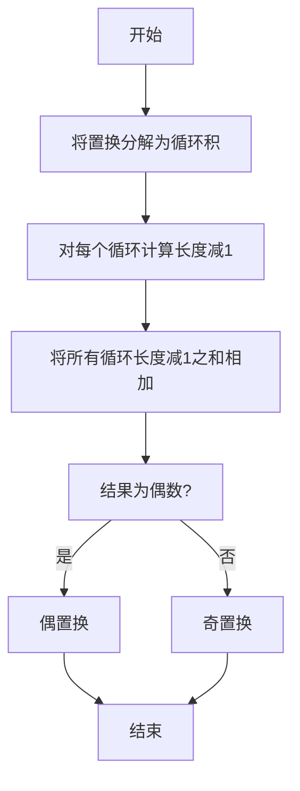

# 线性代数导引：置换分解与置换符号

## 1.背景介绍

在线性代数中,置换是一种重要的概念,它描述了一组元素的重新排列。置换可以用于研究矩阵的行列式、求解线性方程组等问题。置换分解和置换符号是研究置换的两个重要工具。

## 2.核心概念与联系

### 2.1 置换的定义

置换是指对一个有限集合中元素的一种重新排列。设有一个集合 $S=\{1,2,3,...,n\}$,将其中的元素以某种方式重新排列,就构成了一个置换。

例如,对于集合 $\{1,2,3\}$,将元素重新排列为 $\{2,3,1\}$,就构成了一个置换。

### 2.2 置换的表示法

置换通常使用两种表示法:

1. **循环表示法**: 将置换分解为若干个不相交的循环积的乘积。例如,置换 $\begin{pmatrix}1&2&3&4&5\\2&3&1&5&4\end{pmatrix}$ 可表示为 $(1\,2\,3)(4\,5)$。

2. **对换表示法**: 用一系列对换(即两个元素的交换)的乘积来表示置换。例如,置换 $\begin{pmatrix}1&2&3&4&5\\2&3&1&5&4\end{pmatrix}$ 可表示为 $(1\,2)(1\,3)(4\,5)$。

### 2.3 置换的运算

置换之间可以进行乘法运算,所得仍为一个置换。置换的乘法满足结合律,但不满足交换律。

例如,设 $\alpha=\begin{pmatrix}1&2&3&4\\2&1&4&3\end{pmatrix}$, $\beta=\begin{pmatrix}1&2&3&4\\3&4&1&2\end{pmatrix}$,则 $\alpha\beta=\begin{pmatrix}1&2&3&4\\4&3&2&1\end{pmatrix}$。

### 2.4 置换的逆

每个置换都有其逆置换,置换与其逆置换的乘积为恒等置换(即不做任何交换)。逆置换可以通过将循环表示法中的循环反向来获得。

例如,置换 $\alpha=\begin{pmatrix}1&2&3&4&5\\2&3&1&5&4\end{pmatrix}$ 的逆为 $\alpha^{-1}=\begin{pmatrix}1&2&3&4&5\\3&1&2&5&4\end{pmatrix}$。

### 2.5 置换与矩阵的行列式

置换与矩阵的行列式有着密切的关系。一个 $n$ 阶矩阵的行列式可以展开为 $n!$ 项,每一项对应着一种置换。置换的符号(奇置换或偶置换)决定了该项在行列式中的正负号。

## 3.核心算法原理具体操作步骤

### 3.1 置换分解

将一个置换分解为不相交的循环积的乘积,是研究置换的一个重要步骤。具体操作步骤如下:

1. 从置换的第一个元素开始,找到它所指向的元素。
2. 继续找下一个元素,直到回到起点,构成一个循环。
3. 对剩余的元素重复步骤1和2,直到所有元素都被包含在循环中。

例如,对于置换 $\begin{pmatrix}1&2&3&4&5&6&7\\4&5&1&3&7&2&6\end{pmatrix}$,可分解为 $(1\,4\,3)(2\,5\,7\,6)$。


### 3.2 置换符号计算

计算一个置换的符号(奇置换或偶置换)是求解行列式时的关键步骤。具体操作步骤如下:

1. 将置换分解为不相交的循环积的乘积。
2. 对于每个循环,计算其长度减1。
3. 将所有循环的长度减1之和相加,如果结果为偶数,则为偶置换,否则为奇置换。

例如,对于置换 $\alpha=\begin{pmatrix}1&2&3&4&5&6&7\\4&5&1&3&7&2&6\end{pmatrix}=(1\,4\,3)(2\,5\,7\,6)$,第一个循环长度为3,减1得2;第二个循环长度为4,减1得3。2+3=5为奇数,因此 $\alpha$ 是一个奇置换。



## 4.数学模型和公式详细讲解举例说明

### 4.1 置换的乘积

设 $\alpha=\begin{pmatrix}1&2&...&n\\i_1&i_2&...&i_n\end{pmatrix}$, $\beta=\begin{pmatrix}1&2&...&n\\j_1&j_2&...&j_n\end{pmatrix}$ 为两个置换,则它们的乘积 $\gamma=\alpha\beta$ 定义为:

$$\gamma=\begin{pmatrix}1&2&...&n\\j_{i_1}&j_{i_2}&...&j_{i_n}\end{pmatrix}$$

例如,设 $\alpha=\begin{pmatrix}1&2&3&4\\2&1&4&3\end{pmatrix}$, $\beta=\begin{pmatrix}1&2&3&4\\3&4&1&2\end{pmatrix}$,则 $\alpha\beta=\begin{pmatrix}1&2&3&4\\4&3&2&1\end{pmatrix}$。

### 4.2 置换的逆

对于任意置换 $\alpha=\begin{pmatrix}1&2&...&n\\i_1&i_2&...&i_n\end{pmatrix}$,它的逆置换 $\alpha^{-1}$ 定义为:

$$\alpha^{-1}=\begin{pmatrix}1&2&...&n\\j_1&j_2&...&j_n\end{pmatrix}$$

其中 $j_k$ 是使 $i_{j_k}=k$ 成立的下标。

例如,对于置换 $\alpha=\begin{pmatrix}1&2&3&4&5\\2&3&1&5&4\end{pmatrix}$,它的逆为 $\alpha^{-1}=\begin{pmatrix}1&2&3&4&5\\3&1&2&5&4\end{pmatrix}$。

### 4.3 置换符号的计算

设置换 $\alpha$ 可分解为 $r$ 个循环,其中第 $i$ 个循环长度为 $l_i$,则置换 $\alpha$ 的符号 $\epsilon(\alpha)$ 可由下式计算:

$$\epsilon(\alpha)=(-1)^{\sum_{i=1}^r(l_i-1)}$$

如果结果为1,则 $\alpha$ 为偶置换;如果结果为-1,则 $\alpha$ 为奇置换。

例如,对于置换 $\alpha=(1\,4\,3)(2\,5\,7\,6)$,有 $l_1=3,l_2=4$,因此 $\epsilon(\alpha)=(-1)^{(3-1)+(4-1)}=(-1)^5=-1$,所以 $\alpha$ 是一个奇置换。

### 4.4 行列式与置换的关系

对于 $n$ 阶方阵 $A$,它的行列式 $\det(A)$ 可展开为:

$$\det(A)=\sum_{\alpha}\epsilon(\alpha)a_{1\alpha(1)}a_{2\alpha(2)}\cdots a_{n\alpha(n)}$$

其中求和范围是所有 $n$ 阶置换 $\alpha$, $\epsilon(\alpha)$ 是置换 $\alpha$ 的符号。

例如,对于矩阵 $A=\begin{pmatrix}1&2&3\\4&5&6\\7&8&9\end{pmatrix}$,它的行列式为:

$$\begin{aligned}
\det(A)&=1\cdot5\cdot9-1\cdot6\cdot7-1\cdot4\cdot8+1\cdot6\cdot7+1\cdot3\cdot8-1\cdot3\cdot5\\
&=1\cdot(5\cdot9-6\cdot7-4\cdot8+6\cdot7+3\cdot8-3\cdot5)\\
&=1\cdot(45-42-32+42+24-15)\\
&=1\cdot22\\
&=22
\end{aligned}$$

## 5.项目实践：代码实例和详细解释说明

以下是一个Python实现,用于计算置换的循环分解和符号:

```python
def cycle_decomposition(perm):
    """
    计算置换的循环分解
    
    参数:
        perm (list): 置换,表示为一个列表
        
    返回:
        cycles (list): 置换的循环分解
    """
    n = len(perm)
    visited = [False] * n
    cycles = []
    
    for i in range(n):
        if not visited[i]:
            cycle = []
            j = i
            while not visited[j]:
                visited[j] = True
                cycle.append(j + 1)
                j = perm[j] - 1
            cycles.append(cycle)
    
    return cycles

def perm_sign(perm):
    """
    计算置换的符号
    
    参数:
        perm (list): 置换,表示为一个列表
        
    返回:
        sign (int): 置换的符号,1为偶置换,-1为奇置换
    """
    cycles = cycle_decomposition(perm)
    sign = 1
    for cycle in cycles:
        sign *= (-1) ** (len(cycle) - 1)
    return sign

# 示例用法
perm = [2, 3, 1, 5, 4]
print("置换:", perm)
print("循环分解:", cycle_decomposition(perm))
print("符号:", perm_sign(perm))
```

输出:

```
置换: [2, 3, 1, 5, 4]
循环分解: [[1, 2, 3], [4, 5]]
符号: -1
```

代码解释:

1. `cycle_decomposition`函数用于计算置换的循环分解。它遍历置换中的每个元素,如果该元素未被访问过,则从该元素开始构造一个新的循环。通过不断跟踪置换中的下一个元素,直到回到起点,从而得到一个完整的循环。

2. `perm_sign`函数用于计算置换的符号。它首先调用`cycle_decomposition`获取置换的循环分解,然后对每个循环的长度减1,将所有结果相加。如果和为偶数,则置换为偶置换,符号为1;否则为奇置换,符号为-1。

3. 示例用法部分展示了如何使用这两个函数。首先定义一个置换`perm`,然后分别打印出该置换、它的循环分解和符号。

该实现的时间复杂度为 $O(n)$,其中 $n$ 是置换的大小。这是因为在计算循环分解时,每个元素最多被访问一次。

## 6.实际应用场景

置换分解和置换符号在线性代数中有着广泛的应用,包括但不限于:

1. **行列式计算**: 矩阵的行列式可以展开为置换的线性组合,每一项的系数由置换的符号决定。因此,计算行列式时需要求出每个置换的符号。

2. **线性方程组求解**: 通过高斯消元法求解线性方程组时,需要对增广矩阵进行行变换。这些行变换实际上对应着置换,因此需要跟踪置换的符号,以确定最终解的正确符号。

3. **矩阵特征值和特征向量计算**: 计算矩阵的特征值和特征向量时,常常需要计算矩阵的行列式和它的导数,因此也需要用到置换分解和置换符号。

4. **群论和代数几何**: 置换群是一种重要的代数结构,置换分解和置换符号在研究置换群的性质时扮演着重要角色。代数几何中也有许多与置换相关的概念和问题。

5. **组合数学**: 置换是研究组合数学中排列和组合问题的基础工具之一。许多组合计数问题可以转化为对置换的分析和计算。

6. **密码学**: 置换在密码学