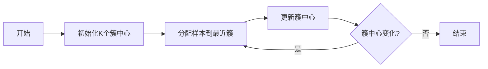

# 聚类分析原理与代码实例讲解

## 1. 背景介绍

聚类分析是数据挖掘和统计学中的一项基本技术，它旨在将数据集中的样本划分为若干个通常是不相交的子集，即“簇”。这一过程涉及到测量不同样本之间的相似性或距离，并根据这些度量将样本分组。聚类分析在市场细分、社交网络分析、生物信息学等领域有着广泛的应用。

## 2. 核心概念与联系

聚类分析的核心概念包括簇、距离度量、相似性度量和聚类算法。簇是数据的子集，它们内部的相似性较高而与其他簇的相似性较低。距离度量（如欧氏距离、曼哈顿距离）和相似性度量（如余弦相似性）是评估样本间关系的标准。聚类算法则是执行聚类任务的具体方法，如K-means、层次聚类和DBSCAN等。

## 3. 核心算法原理具体操作步骤

以K-means算法为例，其操作步骤如下：

1. 初始化：随机选择K个样本作为初始簇中心。
2. 分配：将每个样本分配到最近的簇中心所在的簇。
3. 更新：重新计算每个簇的中心。
4. 迭代：重复步骤2和3，直到簇中心不再变化。



## 4. 数学模型和公式详细讲解举例说明

K-means算法的目标是最小化簇内样本与簇中心的距离之和，即目标函数：

$$ J = \sum_{i=1}^{k} \sum_{x \in S_i} ||x - \mu_i||^2 $$

其中，$k$ 是簇的数量，$S_i$ 是第$i$个簇中的样本集合，$\mu_i$ 是第$i$个簇的中心，$||x - \mu_i||^2$ 是样本$x$与簇中心$\mu_i$之间的欧氏距离的平方。

## 5. 项目实践：代码实例和详细解释说明

以下是使用Python实现K-means算法的简单示例：

```python
import numpy as np

def kmeans(X, k, max_iters=100):
    centroids = X[np.random.choice(range(len(X)), k, replace=False)]
    for i in range(max_iters):
        C = np.array([np.argmin([np.dot(x - y, x - y) for y in centroids]) for x in X])
        centroids = [X[C == j].mean(axis=0) for j in range(k)]
        if np.allclose(centroids, prev_centroids):
            break
        prev_centroids = centroids
    return C, centroids

# 示例数据
X = np.array([[1, 2], [1, 4], [1, 0],
              [10, 2], [10, 4], [10, 0]])

# 执行K-means算法
labels, centroids = kmeans(X, k=2)
print(labels)
print(centroids)
```

## 6. 实际应用场景

聚类分析在许多领域都有实际应用，例如：

- 市场细分：根据消费者购买行为或偏好将其分为不同的群体。
- 图像分割：将图像中的像素根据颜色或纹理聚类，用于图像识别。
- 基因表达分析：将具有相似表达模式的基因聚类，以研究它们的功能。

## 7. 工具和资源推荐

- Scikit-learn：一个强大的Python机器学习库，提供了多种聚类算法的实现。
- R语言：统计计算和图形显示的编程语言和软件环境，适合进行聚类分析。
- Weka：一个包含多种数据挖掘算法的Java开源软件。

## 8. 总结：未来发展趋势与挑战

聚类分析的未来发展趋势包括算法的扩展和优化、大数据环境下的聚类、以及聚类结果的解释性。挑战则包括如何选择合适的聚类算法、如何确定簇的数量、以及如何处理高维数据。

## 9. 附录：常见问题与解答

Q1: 如何确定K-means算法中的K值？
A1: 可以使用肘部法则、轮廓系数等方法来评估不同K值的效果。

Q2: 聚类分析是否总是可靠的？
A2: 聚类分析的结果依赖于所选算法和参数，可能需要多次尝试和专业知识来验证。

作者：禅与计算机程序设计艺术 / Zen and the Art of Computer Programming