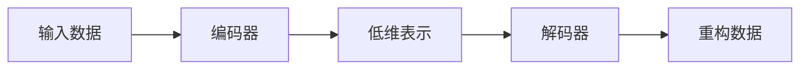

## 1. 背景介绍

自编码器（Autoencoders）是一种无监督学习技术，它利用神经网络来学习数据的有效表示（即编码）。自编码器的目标是使输出尽可能接近输入，同时在这个过程中学习数据的压缩表示。这种技术在降维、特征学习、生成模型等领域有着广泛的应用。

## 2. 核心概念与联系

自编码器由两部分组成：编码器（Encoder）和解码器（Decoder）。编码器的作用是将输入数据转换为一个低维表示，而解码器则将这个低维表示恢复为原始数据。这两部分通常由神经网络实现，它们可以通过最小化重构误差来共同训练。



## 3. 核心算法原理具体操作步骤

自编码器的训练过程包括以下步骤：

1. 将输入数据传递给编码器。
2. 编码器将输入转换为低维表示。
3. 低维表示被传递给解码器。
4. 解码器尝试将低维表示恢复为原始输入。
5. 计算重构误差（通常是输入和输出之间的差异）。
6. 使用反向传播算法更新网络权重以最小化重构误差。

## 4. 数学模型和公式详细讲解举例说明

自编码器的数学模型可以表示为：

$$
h = f(Wx + b)
$$
$$
r = g(Wh + b')
$$

其中，$x$ 是输入数据，$h$ 是编码器的隐藏层表示，$r$ 是解码器的输出，$W$ 和 $b$ 是网络参数，$f$ 和 $g$ 是激活函数。

重构误差可以用均方误差（MSE）来计算：

$$
L(x, r) = ||x - r||^2
$$

## 5. 项目实践：代码实例和详细解释说明

以下是一个简单的自编码器实现，使用Python和TensorFlow库：

```python
import tensorflow as tf
from tensorflow.keras.layers import Input, Dense
from tensorflow.keras.models import Model

# 定义编码器和解码器的维度
encoding_dim = 32
input_img = Input(shape=(784,))

# 编码器
encoded = Dense(encoding_dim, activation='relu')(input_img)

# 解码器
decoded = Dense(784, activation='sigmoid')(encoded)

# 自编码器模型
autoencoder = Model(input_img, decoded)

# 编译模型
autoencoder.compile(optimizer='adam', loss='binary_crossentropy')

# 训练自编码器
autoencoder.fit(x_train, x_train, epochs=50, batch_size=256, shuffle=True)
```

在这个例子中，我们构建了一个简单的自编码器，它将784维的输入压缩到32维的表示，然后再重构回784维。

## 6. 实际应用场景

自编码器在多个领域有着广泛的应用，包括：

- 数据去噪
- 图像压缩
- 特征提取
- 生成模型

## 7. 工具和资源推荐

- TensorFlow和Keras：用于构建和训练自编码器的强大库。
- PyTorch：另一个流行的深度学习库，适合研究和原型开发。
- Scikit-learn：提供了许多用于数据预处理和评估的工具。

## 8. 总结：未来发展趋势与挑战

自编码器的研究正在不断进步，未来的发展趋势包括更高效的编码器设计、结合生成对抗网络（GANs）的自编码器、以及在更多复杂数据类型上的应用。挑战包括提高模型的泛化能力和解释性。

## 9. 附录：常见问题与解答

Q: 自编码器和PCA有什么区别？
A: PCA是一种线性降维技术，而自编码器可以学习非线性变换。

Q: 自编码器如何用于去噪？
A: 通过训练自编码器重构去除噪声的干净数据，它可以学会忽略输入数据中的噪声。

作者：禅与计算机程序设计艺术 / Zen and the Art of Computer Programming