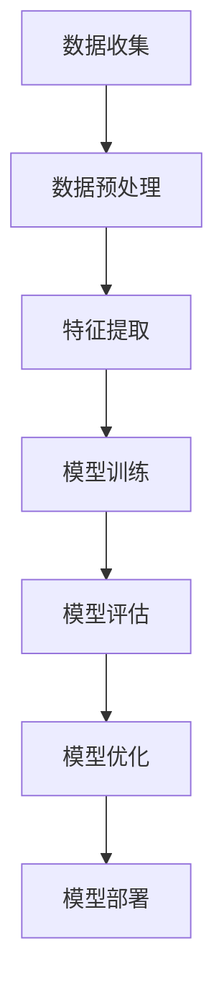

# 虚拟助理：构建AI代理的工作流程

## 1.背景介绍

在当今数字化时代，虚拟助理（Virtual Assistant, VA）已经成为人们日常生活和工作中不可或缺的一部分。从智能家居设备到企业级解决方案，虚拟助理的应用范围广泛且不断扩展。虚拟助理不仅能够执行简单的任务，如设置提醒和播放音乐，还能处理复杂的交互，如客户服务和数据分析。本文将深入探讨构建AI代理的工作流程，帮助读者理解其核心概念、算法原理、数学模型、实际应用以及未来发展趋势。

## 2.核心概念与联系

### 2.1 虚拟助理的定义

虚拟助理是一种基于人工智能技术的计算机程序，能够模拟人类的对话和行为，执行特定任务。它们通常通过自然语言处理（NLP）与用户进行交互，并利用机器学习（ML）和深度学习（DL）技术来不断改进其性能。

### 2.2 关键技术

- **自然语言处理（NLP）**：用于理解和生成人类语言。
- **机器学习（ML）**：用于从数据中学习和预测。
- **深度学习（DL）**：通过神经网络实现复杂模式识别。
- **语音识别和合成**：将语音转换为文本和生成语音输出。

### 2.3 虚拟助理的类型

- **基于规则的虚拟助理**：依赖预定义的规则和逻辑。
- **基于机器学习的虚拟助理**：通过数据训练模型进行预测和决策。
- **混合型虚拟助理**：结合规则和机器学习技术。

## 3.核心算法原理具体操作步骤

### 3.1 数据收集与预处理

数据是训练虚拟助理的基础。数据收集包括获取用户对话、任务执行记录等。预处理步骤包括数据清洗、标注和分词。

### 3.2 特征提取与选择

特征提取是将原始数据转换为模型可理解的形式。常用的特征包括词频、TF-IDF、词向量等。特征选择则是从中挑选最具代表性的特征，以提高模型性能。

### 3.3 模型训练与评估

使用机器学习算法（如SVM、决策树）或深度学习模型（如RNN、Transformer）进行训练。评估指标包括准确率、召回率、F1分数等。

### 3.4 模型优化与部署

通过超参数调优、模型剪枝等方法优化模型性能。部署时需考虑系统架构、响应时间和可扩展性。



## 4.数学模型和公式详细讲解举例说明

### 4.1 词向量模型

词向量模型（Word Embedding）是将词语映射到高维向量空间的技术。常用的模型包括Word2Vec和GloVe。

$$
\text{Word2Vec:} \quad \text{minimize} \quad -\sum_{w \in V} \sum_{c \in C(w)} \log P(c|w)
$$

### 4.2 机器学习模型

以支持向量机（SVM）为例，其目标是找到一个最优超平面将数据分开。

$$
\text{SVM:} \quad \text{minimize} \quad \frac{1}{2} ||w||^2 \quad \text{subject to} \quad y_i (w \cdot x_i + b) \geq 1
$$

### 4.3 深度学习模型

以长短期记忆网络（LSTM）为例，其通过门控机制解决长序列依赖问题。

$$
\text{LSTM:} \quad f_t = \sigma(W_f \cdot [h_{t-1}, x_t] + b_f)
$$

## 5.项目实践：代码实例和详细解释说明

### 5.1 数据预处理

```python
import nltk
from nltk.corpus import stopwords
from sklearn.feature_extraction.text import TfidfVectorizer

# 下载停用词
nltk.download('stopwords')
stop_words = set(stopwords.words('english'))

# 示例数据
documents = ["Hello, how can I help you?", "What is the weather today?"]

# 数据预处理
vectorizer = TfidfVectorizer(stop_words=stop_words)
X = vectorizer.fit_transform(documents)
```

### 5.2 模型训练

```python
from sklearn.svm import SVC
from sklearn.model_selection import train_test_split
from sklearn.metrics import accuracy_score

# 示例标签
labels = [0, 1]

# 划分训练集和测试集
X_train, X_test, y_train, y_test = train_test_split(X, labels, test_size=0.2, random_state=42)

# 训练SVM模型
model = SVC(kernel='linear')
model.fit(X_train, y_train)

# 评估模型
y_pred = model.predict(X_test)
print(f"Accuracy: {accuracy_score(y_test, y_pred)}")
```

### 5.3 模型部署

```python
import joblib

# 保存模型
joblib.dump(model, 'svm_model.pkl')

# 加载模型
loaded_model = joblib.load('svm_model.pkl')
```

## 6.实际应用场景

### 6.1 客户服务

虚拟助理可以用于自动化客户服务，处理常见问题和请求，提高客户满意度和运营效率。

### 6.2 智能家居

通过语音控制虚拟助理，用户可以轻松管理智能家居设备，如灯光、温度和安全系统。

### 6.3 医疗健康

虚拟助理可以提供健康咨询、预约管理和病历记录，辅助医生和患者进行高效沟通。

## 7.工具和资源推荐

### 7.1 开发工具

- **TensorFlow**：用于构建和训练深度学习模型。
- **NLTK**：自然语言处理工具包。
- **Scikit-learn**：机器学习库。

### 7.2 数据集

- **Cornell Movie Dialogues**：对话数据集。
- **SQuAD**：问答数据集。
- **IMDB**：电影评论数据集。

### 7.3 在线资源

- **Kaggle**：数据科学竞赛平台，提供丰富的数据集和代码示例。
- **Coursera**：在线课程平台，提供AI和机器学习相关课程。

## 8.总结：未来发展趋势与挑战

### 8.1 未来发展趋势

- **多模态交互**：结合语音、图像和文本，实现更自然的用户交互。
- **情感计算**：识别和理解用户情感，提供更个性化的服务。
- **自我学习**：虚拟助理能够自主学习和适应新环境，提高智能化水平。

### 8.2 挑战

- **数据隐私**：如何在保护用户隐私的前提下收集和使用数据。
- **模型解释性**：提高模型的透明度和可解释性，增强用户信任。
- **多语言支持**：实现对多种语言的高效支持，扩大应用范围。

## 9.附录：常见问题与解答

### 9.1 如何选择合适的算法？

选择算法时需考虑数据规模、任务复杂度和计算资源。对于简单任务，基于规则的方法可能足够；对于复杂任务，深度学习模型更为适用。

### 9.2 如何提高模型的准确性？

可以通过增加数据量、优化特征选择、调整模型参数和使用更复杂的模型来提高准确性。

### 9.3 如何处理数据不平衡问题？

可以使用过采样、欠采样、数据增强等方法来处理数据不平衡问题。

### 9.4 如何确保数据隐私？

可以采用数据加密、匿名化处理和差分隐私技术来保护用户数据隐私。

### 9.5 如何实现多语言支持？

可以使用多语言数据集训练模型，或采用迁移学习技术，将已有模型应用于新语言。

---

作者：禅与计算机程序设计艺术 / Zen and the Art of Computer Programming