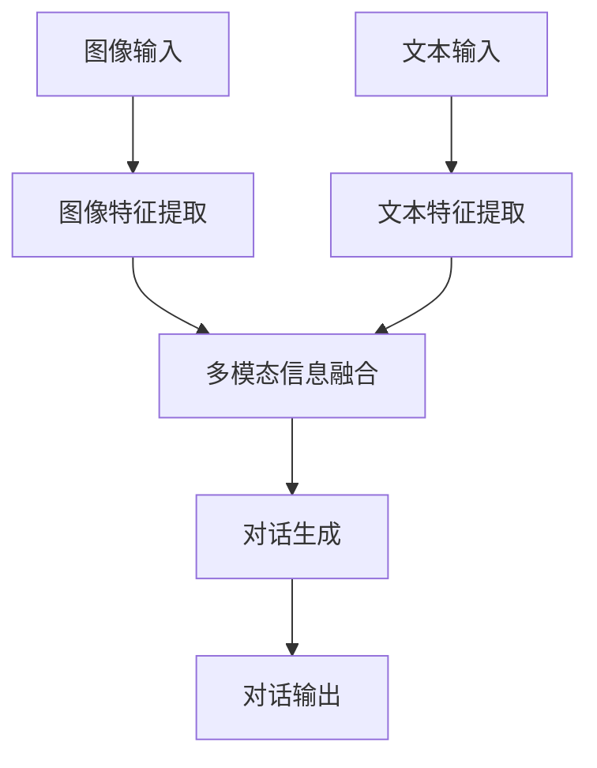

# 视觉对话原理与代码实战案例讲解

## 1.背景介绍

视觉对话（Visual Dialog）是近年来人工智能领域的一个重要研究方向。它结合了计算机视觉和自然语言处理技术，旨在使机器能够通过视觉信息与人类进行自然对话。这种技术在智能助手、自动驾驶、医疗影像分析等领域有着广泛的应用前景。

视觉对话的核心在于机器能够理解图像内容，并基于此与用户进行多轮对话。这不仅要求机器具备图像识别能力，还需要具备语言理解和生成能力。随着深度学习技术的发展，视觉对话系统的性能得到了显著提升，但仍面临许多挑战，如多模态信息融合、上下文理解等。

## 2.核心概念与联系

### 2.1 视觉对话的定义

视觉对话是指机器通过分析图像内容，与用户进行多轮对话的过程。其目标是使机器能够像人类一样，通过视觉信息进行自然的语言交流。

### 2.2 关键技术

视觉对话涉及多个关键技术，包括：

- **图像识别**：通过卷积神经网络（CNN）等技术，提取图像中的关键信息。
- **语言理解与生成**：通过循环神经网络（RNN）、Transformer等技术，理解用户的语言输入，并生成合适的语言输出。
- **多模态信息融合**：将图像信息和语言信息进行有效融合，以实现更准确的对话。

### 2.3 视觉对话与其他技术的联系

视觉对话与图像描述（Image Captioning）、视觉问答（Visual Question Answering, VQA）等技术有着密切的联系。图像描述是指机器生成描述图像内容的自然语言文本，而视觉问答则是机器回答关于图像内容的问题。视觉对话可以看作是图像描述和视觉问答的扩展，要求机器能够进行多轮对话。

## 3.核心算法原理具体操作步骤

### 3.1 数据预处理

在进行视觉对话之前，需要对图像和文本数据进行预处理。图像数据通常需要进行归一化、数据增强等操作，而文本数据则需要进行分词、词向量表示等处理。

### 3.2 特征提取

使用预训练的卷积神经网络（如ResNet、VGG等）提取图像特征。对于文本数据，可以使用预训练的词向量（如Word2Vec、GloVe等）或语言模型（如BERT、GPT等）进行特征提取。

### 3.3 多模态信息融合

将图像特征和文本特征进行融合，常用的方法包括：

- **简单拼接**：将图像特征和文本特征直接拼接在一起。
- **注意力机制**：通过注意力机制，动态地选择图像和文本中的关键信息进行融合。

### 3.4 对话生成

使用循环神经网络（如LSTM、GRU等）或Transformer模型生成对话响应。模型输入为融合后的多模态特征，输出为生成的对话文本。

### 3.5 模型训练

使用大规模的视觉对话数据集（如VisDial）对模型进行训练。常用的损失函数包括交叉熵损失、序列生成损失等。

以下是视觉对话系统的Mermaid流程图：



## 4.数学模型和公式详细讲解举例说明

### 4.1 图像特征提取

假设输入图像为 $I$，使用卷积神经网络提取图像特征 $V$：

$$
V = CNN(I)
$$

其中，$CNN$ 表示卷积神经网络，$V$ 为提取的图像特征向量。

### 4.2 文本特征提取

假设输入文本为 $T$，使用预训练的词向量模型或语言模型提取文本特征 $W$：

$$
W = Embedding(T)
$$

其中，$Embedding$ 表示词向量模型或语言模型，$W$ 为提取的文本特征向量。

### 4.3 多模态信息融合

将图像特征 $V$ 和文本特征 $W$ 进行融合，常用的方法包括简单拼接和注意力机制。以简单拼接为例：

$$
F = [V; W]
$$

其中，$[V; W]$ 表示将 $V$ 和 $W$ 进行拼接，$F$ 为融合后的多模态特征向量。

### 4.4 对话生成

使用循环神经网络或Transformer模型生成对话响应。假设使用LSTM模型，输入为融合后的多模态特征 $F$，输出为生成的对话文本 $R$：

$$
R = LSTM(F)
$$

其中，$LSTM$ 表示长短期记忆网络，$R$ 为生成的对话文本。

### 4.5 损失函数

常用的损失函数包括交叉熵损失。假设生成的对话文本为 $R$，真实的对话文本为 $R_{true}$，则交叉熵损失为：

$$
L = -\sum_{i=1}^{N} R_{true}^i \log(R^i)
$$

其中，$N$ 为对话文本的长度，$R^i$ 和 $R_{true}^i$ 分别表示生成的对话文本和真实对话文本在第 $i$ 个位置的概率。

## 5.项目实践：代码实例和详细解释说明

### 5.1 数据预处理

首先，加载并预处理图像和文本数据。以下是一个简单的示例代码：

```python
import torch
from torchvision import transforms
from PIL import Image

# 图像预处理
transform = transforms.Compose([
    transforms.Resize((224, 224)),
    transforms.ToTensor(),
    transforms.Normalize(mean=[0.485, 0.456, 0.406], std=[0.229, 0.224, 0.225])
])

image = Image.open('path_to_image.jpg')
image = transform(image).unsqueeze(0)

# 文本预处理
from transformers import BertTokenizer

tokenizer = BertTokenizer.from_pretrained('bert-base-uncased')
text = "What is in the image?"
inputs = tokenizer(text, return_tensors='pt')
```

### 5.2 特征提取

使用预训练的ResNet模型提取图像特征，使用BERT模型提取文本特征：

```python
from torchvision.models import resnet50
from transformers import BertModel

# 图像特征提取
resnet = resnet50(pretrained=True)
resnet.eval()
with torch.no_grad():
    image_features = resnet(image)

# 文本特征提取
bert = BertModel.from_pretrained('bert-base-uncased')
bert.eval()
with torch.no_grad():
    text_features = bert(**inputs).last_hidden_state
```

### 5.3 多模态信息融合

将图像特征和文本特征进行拼接：

```python
# 简单拼接
fused_features = torch.cat((image_features, text_features), dim=1)
```

### 5.4 对话生成

使用LSTM模型生成对话响应：

```python
import torch.nn as nn

class DialogLSTM(nn.Module):
    def __init__(self, input_size, hidden_size, output_size):
        super(DialogLSTM, self).__init__()
        self.lstm = nn.LSTM(input_size, hidden_size, batch_first=True)
        self.fc = nn.Linear(hidden_size, output_size)

    def forward(self, x):
        h, _ = self.lstm(x)
        out = self.fc(h[:, -1, :])
        return out

# 定义模型
input_size = fused_features.size(1)
hidden_size = 512
output_size = tokenizer.vocab_size
model = DialogLSTM(input_size, hidden_size, output_size)

# 生成对话响应
output = model(fused_features)
response = tokenizer.decode(torch.argmax(output, dim=1).tolist())
print(response)
```

### 5.5 模型训练

使用交叉熵损失函数和Adam优化器进行模型训练：

```python
criterion = nn.CrossEntropyLoss()
optimizer = torch.optim.Adam(model.parameters(), lr=0.001)

# 假设有训练数据 train_loader
for epoch in range(num_epochs):
    for images, texts, labels in train_loader:
        # 前向传播
        image_features = resnet(images)
        text_features = bert(**texts).last_hidden_state
        fused_features = torch.cat((image_features, text_features), dim=1)
        outputs = model(fused_features)
        
        # 计算损失
        loss = criterion(outputs, labels)
        
        # 反向传播和优化
        optimizer.zero_grad()
        loss.backward()
        optimizer.step()
        
    print(f'Epoch [{epoch+1}/{num_epochs}], Loss: {loss.item():.4f}')
```

## 6.实际应用场景

### 6.1 智能助手

视觉对话技术可以用于智能助手，使其能够通过摄像头获取视觉信息，并与用户进行自然对话。例如，智能家居助手可以通过摄像头识别家中的物品，并回答用户的相关问题。

### 6.2 自动驾驶

在自动驾驶领域，视觉对话技术可以帮助车辆理解周围环境，并与驾驶员进行交流。例如，车辆可以通过摄像头识别道路标志，并向驾驶员提供相关信息。

### 6.3 医疗影像分析

在医疗影像分析中，视觉对话技术可以帮助医生更好地理解和解释影像数据。例如，系统可以通过分析医学影像，回答医生关于病变区域的问题。

### 6.4 教育与培训

视觉对话技术可以用于教育和培训领域，提供交互式的学习体验。例如，系统可以通过图像识别和对话生成，帮助学生理解复杂的概念和问题。

## 7.工具和资源推荐

### 7.1 开源框架

- **PyTorch**：一个流行的深度学习框架，支持动态计算图，适合进行视觉对话模型的开发和训练。
- **TensorFlow**：另一个流行的深度学习框架，提供了丰富的工具和资源，适合进行大规模模型的训练和部署。

### 7.2 数据集

- **VisDial**：一个大规模的视觉对话数据集，包含了大量的图像和对话对，适合用于模型训练和评估。
- **COCO**：一个常用的图像数据集，包含了丰富的图像和标注信息，可以用于图像特征提取和模型训练。

### 7.3 预训练模型

- **ResNet**：一个常用的卷积神经网络模型，适合用于图像特征提取。
- **BERT**：一个强大的语言模型，适合用于文本特征提取和对话生成。

## 8.总结：未来发展趋势与挑战

### 8.1 未来发展趋势

随着深度学习技术的不断发展，视觉对话技术将会在以下几个方面取得重要进展：

- **多模态信息融合**：更高效的多模态信息融合方法将会被提出，使得视觉对话系统能够更好地理解和生成对话。
- **上下文理解**：未来的视觉对话系统将会具备更强的上下文理解能力，能够在多轮对话中保持一致性和连贯性。
- **应用场景扩展**：视觉对话技术将会在更多的应用场景中得到应用，如虚拟现实、增强现实等。

### 8.2 挑战

尽管视觉对话技术取得了显著进展，但仍面临许多挑战：

- **数据稀缺**：高质量的视觉对话数据集仍然稀缺，限制了模型的训练和评估。
- **多模态信息融合**：如何高效地融合图像和文本信息，仍然是一个难题。
- **对话生成质量**：生成的对话文本质量仍有待提高，特别是在复杂场景下。

## 9.附录：常见问题与解答

### 9.1 视觉对话与视觉问答的区别是什么？

视觉对话与视觉问答的主要区别在于对话的多轮性。视觉问答通常是单轮的，即用户提出一个问题，系统给出一个回答。而视觉对话是多轮的，系统需要在多轮对话中保持上下文一致性。

### 9.2 如何提高视觉对话系统的性能？

提高视觉对话系统性能的方法包括：

- 使用更强大的预训练模型，如更深的卷积神经网络和更大的语言模型。
- 采用更高效的多模态信息融合方法，如注意力机制。
- 使用更大规模和更高质量的训练数据。

### 9.3 视觉对话系统的应用前景如何？

视觉对话系统在智能助手、自动驾驶、医疗影像分析、教育与培训等领域有着广泛的应用前景。随着技术的不断发展，视觉对话系统将会在更多的应用场景中发挥重要作用。

---

作者：禅与计算机程序设计艺术 / Zen and the Art of Computer Programming