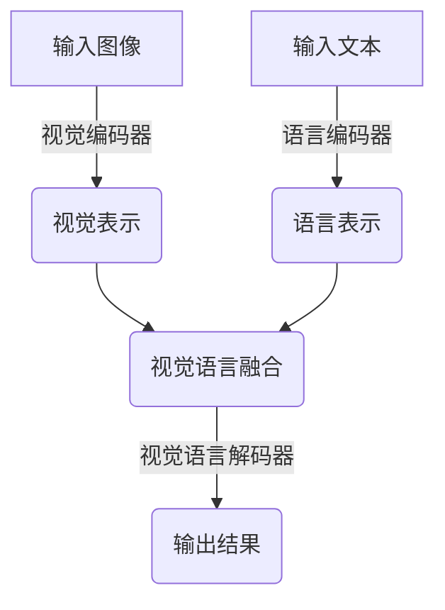

# 视觉语言模型原理与代码实战案例讲解

## 1.背景介绍

在当今的人工智能时代,视觉语言模型(Visual Language Model, VLM)作为一种新兴的人工智能技术,正在引领着计算机视觉和自然语言处理领域的发展。视觉语言模型旨在实现视觉和语言之间的无缝融合,使计算机能够理解图像中的内容并用自然语言进行描述,或者根据自然语言描述生成相应的图像。

这种技术的出现源于人类大脑对视觉和语言信息的统一处理方式。我们在观察图像时,会自然而然地用语言描述其中的内容,而在阅读文字时,也会在脑海中构建出相应的视觉场景。视觉语言模型试图模拟这一过程,将视觉和语言信息统一编码,实现跨模态的理解和生成。

视觉语言模型的应用前景广阔,涉及计算机视觉、自然语言处理、多媒体分析等多个领域。它可用于图像描述、视觉问答、图文生成、视觉导航等任务,在机器人视觉、智能助手、视觉辅助等场景具有重要应用价值。

## 2.核心概念与联系

### 2.1 视觉编码器(Visual Encoder)

视觉编码器的作用是将输入图像转换为一系列向量表示,捕捉图像中的视觉特征。常见的视觉编码器包括卷积神经网络(CNN)和视觉转换器(ViT)等。

### 2.2 语言编码器(Language Encoder)

语言编码器的作用是将输入文本转换为一系列向量表示,捕捉文本中的语义特征。常见的语言编码器包括循环神经网络(RNN)、长短期记忆网络(LSTM)和自注意力机制(Self-Attention)等。

### 2.3 视觉语言融合(Vision-Language Fusion)

视觉语言融合是视觉语言模型的核心,旨在将视觉和语言表示进行融合,实现跨模态的理解和生成。常见的融合方法包括注意力机制、对比学习、多任务学习等。

### 2.4 视觉语言解码器(Vision-Language Decoder)

视觉语言解码器的作用是根据融合后的视觉语言表示,生成目标输出,如图像描述、问答结果或图像生成结果等。



## 3.核心算法原理具体操作步骤

### 3.1 视觉编码器

视觉编码器通常采用卷积神经网络(CNN)或视觉转换器(ViT)等模型对输入图像进行编码。以ResNet为例,其具体操作步骤如下:

1. 将输入图像分割为多个小块,每个小块作为一个局部感受野。
2. 对每个小块进行卷积操作,提取低级视觉特征。
3. 通过残差连接和批量归一化,增强网络的表达能力和收敛性。
4. 在不同层次上逐步提取高级语义特征。
5. 最终输出一个固定长度的向量,表示整个图像的视觉特征。

### 3.2 语言编码器

语言编码器通常采用循环神经网络(RNN)、长短期记忆网络(LSTM)或自注意力机制(Self-Attention)等模型对输入文本进行编码。以Transformer为例,其具体操作步骤如下:

1. 将输入文本按字符或词元进行分词,得到一系列词嵌入向量。
2. 通过位置编码,为每个词嵌入向量添加位置信息。
3. 使用多头自注意力机制,捕捉词与词之间的依赖关系。
4. 通过前馈神经网络,提取高级语义特征。
5. 重复3和4的过程,形成多层编码器。
6. 最终输出一个固定长度的向量序列,表示整个文本的语义特征。

### 3.3 视觉语言融合

视觉语言融合是视觉语言模型的核心,旨在将视觉和语言表示进行融合,实现跨模态的理解和生成。常见的融合方法包括注意力机制、对比学习和多任务学习等。

1. **注意力机制**:通过计算视觉和语言表示之间的相关性分数,动态地分配注意力权重,实现有效的信息融合。
2. **对比学习**:通过最大化视觉和语言表示之间的相似性,最小化不相关表示之间的相似性,实现有效的跨模态对齐。
3. **多任务学习**:在同一个模型中同时优化多个相关任务,如图像描述、视觉问答等,实现不同任务之间的知识迁移和表示共享。

### 3.4 视觉语言解码器

视觉语言解码器的作用是根据融合后的视觉语言表示,生成目标输出。常见的解码器包括循环神经网络(RNN)、长短期记忆网络(LSTM)和自注意力机制(Self-Attention)等。以Transformer为例,其具体操作步骤如下:

1. 将融合后的视觉语言表示作为解码器的初始输入。
2. 通过掩码自注意力机制,预测下一个词元。
3. 将预测的词元作为输入,重复步骤2,直到生成完整的输出序列。
4. 对于生成图像的任务,可以将生成的词元序列解码为像素值,重构出目标图像。

## 4.数学模型和公式详细讲解举例说明

### 4.1 自注意力机制(Self-Attention)

自注意力机制是视觉语言模型中一种常用的注意力机制,它能够捕捉输入序列中任意两个位置之间的依赖关系。给定一个输入序列 $X = (x_1, x_2, \dots, x_n)$,自注意力机制的计算过程如下:

1. 计算查询(Query)、键(Key)和值(Value)向量:

$$
Q = XW^Q, K = XW^K, V = XW^V
$$

其中 $W^Q, W^K, W^V$ 分别表示查询、键和值的线性变换矩阵。

2. 计算注意力分数:

$$
\text{Attention}(Q, K, V) = \text{softmax}\left(\frac{QK^T}{\sqrt{d_k}}\right)V
$$

其中 $d_k$ 表示键向量的维度,用于缩放点积的值,以防止过大或过小的值导致梯度消失或爆炸。

3. 多头注意力机制:为了捕捉不同的子空间特征,可以将注意力机制扩展为多头形式:

$$
\text{MultiHead}(Q, K, V) = \text{Concat}(head_1, \dots, head_h)W^O
$$

$$
\text{where } head_i = \text{Attention}(QW_i^Q, KW_i^K, VW_i^V)
$$

其中 $W_i^Q, W_i^K, W_i^V$ 表示第 $i$ 个注意力头的线性变换矩阵, $W^O$ 表示多头注意力的输出线性变换矩阵。

自注意力机制能够有效地捕捉输入序列中任意两个位置之间的依赖关系,是视觉语言模型中一种关键的建模方式。

### 4.2 对比学习(Contrastive Learning)

对比学习是视觉语言模型中一种常用的融合方法,它通过最大化视觉和语言表示之间的相似性,最小化不相关表示之间的相似性,实现有效的跨模态对齐。

给定一个视觉表示 $v$ 和一个语言表示 $l$,对比学习的目标是最大化它们之间的相似性分数 $s(v, l)$,同时最小化其他不相关表示对之间的相似性分数。具体来说,我们定义一个对比损失函数:

$$
\mathcal{L}_\text{contrast} = -\log\frac{\exp(s(v, l)/\tau)}{\sum_{v', l'}\exp(s(v', l')/\tau)}
$$

其中 $\tau$ 是一个温度超参数,用于控制相似性分数的尺度。分母项表示所有可能的视觉语言表示对之间的相似性分数之和,作为归一化因子。

通过最小化对比损失函数,我们可以使得正例表示对 $(v, l)$ 之间的相似性分数最大化,同时使得负例表示对之间的相似性分数最小化。这种方式能够有效地将视觉和语言表示对齐到同一个潜在空间,实现跨模态的融合。

### 4.3 多任务学习(Multi-Task Learning)

多任务学习是视觉语言模型中另一种常用的融合方法,它通过在同一个模型中同时优化多个相关任务,实现不同任务之间的知识迁移和表示共享。

假设我们有 $N$ 个相关任务 $\{T_1, T_2, \dots, T_N\}$,每个任务都有自己的损失函数 $\{\mathcal{L}_1, \mathcal{L}_2, \dots, \mathcal{L}_N\}$。多任务学习的目标是通过优化一个加权损失函数:

$$
\mathcal{L}_\text{multi-task} = \sum_{i=1}^N \lambda_i \mathcal{L}_i
$$

其中 $\lambda_i$ 是第 $i$ 个任务的权重系数,用于平衡不同任务的重要性。

在训练过程中,模型会同时优化所有任务的损失函数,从而实现不同任务之间的知识迁移和表示共享。这种方式能够提高模型的泛化能力,并且有助于解决数据不足或任务偏移的问题。

在视觉语言模型中,常见的多任务学习任务包括图像描述、视觉问答、图文生成等。通过在同一个模型中同时优化这些任务,可以实现视觉和语言表示的有效融合。

## 5.项目实践:代码实例和详细解释说明

在这一部分,我们将提供一个基于 PyTorch 的视觉语言模型实现示例,并对关键代码进行详细解释。

### 5.1 数据预处理

首先,我们需要对输入的图像和文本进行预处理,将它们转换为模型可以接受的格式。

```python
import torchvision.transforms as transforms

# 图像预处理
image_transform = transforms.Compose([
    transforms.Resize((224, 224)),
    transforms.ToTensor(),
    transforms.Normalize(mean=[0.485, 0.456, 0.406], std=[0.229, 0.224, 0.225])
])

# 文本预处理
tokenizer = BertTokenizer.from_pretrained('bert-base-uncased')

def preprocess_text(text):
    tokens = tokenizer.encode_plus(
        text,
        max_length=512,
        padding='max_length',
        truncation=True,
        return_tensors='pt'
    )
    return tokens
```

在这个示例中,我们使用 `torchvision.transforms` 对图像进行预处理,包括调整大小、转换为张量和归一化操作。对于文本,我们使用 BERT 分词器对输入文本进行分词和编码。

### 5.2 视觉编码器

我们使用预训练的 ResNet-50 作为视觉编码器,对输入图像进行编码。

```python
import torchvision.models as models

class VisualEncoder(nn.Module):
    def __init__(self):
        super(VisualEncoder, self).__init__()
        resnet = models.resnet50(pretrained=True)
        modules = list(resnet.children())[:-2]
        self.resnet = nn.Sequential(*modules)

    def forward(self, images):
        features = self.resnet(images)
        features = features.permute(0, 2, 3, 1)
        return features
```

在 `VisualEncoder` 类中,我们加载预训练的 ResNet-50 模型,并移除最后两层(全连接层和分类层)。在前向传播过程中,我们将输入图像通过 ResNet 编码器,得到一个特征张量,并对其进行维度重排,以适应后续的视觉语言融合操作。

### 5.3 语言编码器

我们使用预训练的 BERT 模型作为语言编码器,对输入文本进行编码。

```python
import transformers

class LanguageEncoder(nn.Module):
    def __init__(self):
        super(LanguageEncoder, self).__init__()
        self.bert = transformers.B