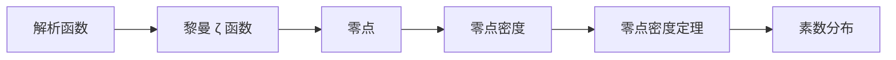

# 解析数论基础：零点密度定理的改进

## 1. 背景介绍
### 1.1 解析数论的起源与发展
#### 1.1.1 解析数论的诞生
#### 1.1.2 解析数论的重要里程碑
#### 1.1.3 解析数论在现代数学中的地位

### 1.2 零点密度定理的提出
#### 1.2.1 黎曼 ζ 函数的引入
#### 1.2.2 黎曼猜想的提出
#### 1.2.3 零点密度定理的早期研究

## 2. 核心概念与联系
### 2.1 解析函数与黎曼 ζ 函数
#### 2.1.1 解析函数的定义与性质
#### 2.1.2 黎曼 ζ 函数的定义与性质
#### 2.1.3 黎曼 ζ 函数与素数的关系

### 2.2 零点与零点密度
#### 2.2.1 零点的定义
#### 2.2.2 零点密度的概念
#### 2.2.3 零点密度与黎曼猜想的关系

### 2.3 零点密度定理的重要性
#### 2.3.1 零点密度定理在解析数论中的地位
#### 2.3.2 零点密度定理与素数分布的关系
#### 2.3.3 零点密度定理在其他数学领域的应用

## 3. 核心算法原理具体操作步骤
### 3.1 经典的零点密度定理证明
#### 3.1.1 Selberg 不等式的引入
#### 3.1.2 对数导数法的应用
#### 3.1.3 经典零点密度定理的证明步骤

### 3.2 现代零点密度定理的改进
#### 3.2.1 Montgomery-Vaughan 方法的引入
#### 3.2.2 指数和技巧的应用
#### 3.2.3 现代零点密度定理的证明步骤

### 3.3 零点密度定理的计算机验证
#### 3.3.1 计算机验证的重要性
#### 3.3.2 计算机验证的具体实现
#### 3.3.3 计算机验证的结果与影响

## 4. 数学模型和公式详细讲解举例说明
### 4.1 黎曼 ζ 函数的解析延拓
#### 4.1.1 黎曼 ζ 函数的积分表示
$$ \zeta(s) = \frac{1}{\Gamma(s)} \int_0^\infty \frac{x^{s-1}}{e^x - 1} dx $$
#### 4.1.2 黎曼 ζ 函数的函数方程
$$ \zeta(s) = 2^s \pi^{s-1} \sin\left(\frac{\pi s}{2}\right) \Gamma(1-s) \zeta(1-s) $$
#### 4.1.3 黎曼 ζ 函数的解析延拓

### 4.2 零点密度定理的数学表述
#### 4.2.1 零点计数函数的定义
$$ N(T) = \#\{\rho = \beta + i\gamma: \zeta(\rho) = 0, 0 < \gamma \leq T\} $$
#### 4.2.2 经典零点密度定理的表述
$$ N(T) = \frac{T}{2\pi} \log\frac{T}{2\pi e} + O(\log T) $$
#### 4.2.3 现代零点密度定理的表述
$$ N(T) = \frac{T}{2\pi} \log\frac{T}{2\pi e} + O\left(\frac{T}{\log T}\right) $$

### 4.3 零点密度定理的应用举例
#### 4.3.1 素数定理的证明
#### 4.3.2 Dirichlet L-函数零点密度的研究
#### 4.3.3 Montgomery-Odlyzko 法则的发现

## 5. 项目实践：代码实例和详细解释说明
### 5.1 计算黎曼 ζ 函数零点的 Python 实现
#### 5.1.1 黎曼 ζ 函数的数值计算
#### 5.1.2 零点计数函数的实现
#### 5.1.3 零点可视化与分析

### 5.2 零点密度定理的数值验证
#### 5.2.1 经典零点密度定理的数值验证
#### 5.2.2 现代零点密度定理的数值验证
#### 5.2.3 数值结果与理论预测的比较

### 5.3 零点密度定理在其他函数中的应用
#### 5.3.1 Dirichlet L-函数零点密度的计算
#### 5.3.2 一般 L-函数零点密度的研究
#### 5.3.3 计算机辅助证明的尝试

## 6. 实际应用场景
### 6.1 密码学中的应用
#### 6.1.1 RSA 加密算法的安全性分析
#### 6.1.2 素性测试与大素数的生成
#### 6.1.3 零点密度定理在密码学中的其他应用

### 6.2 量子计算中的应用
#### 6.2.1 量子算法对素数问题的加速
#### 6.2.2 量子计算机对黎曼猜想的潜在影响
#### 6.2.3 零点密度定理在量子计算中的其他应用

### 6.3 其他领域的应用
#### 6.3.1 物理学中的应用
#### 6.3.2 工程学中的应用
#### 6.3.3 经济学与金融学中的应用

## 7. 工具和资源推荐
### 7.1 数学软件与库
#### 7.1.1 Mathematica 的使用
#### 7.1.2 SageMath 的使用
#### 7.1.3 其他数学软件与库的推荐

### 7.2 在线资源与课程
#### 7.2.1 解析数论的在线课程
#### 7.2.2 黎曼猜想的科普资源
#### 7.2.3 其他相关在线资源的推荐

### 7.3 书籍与文献
#### 7.3.1 解析数论经典教材
#### 7.3.2 零点密度定理的重要文献
#### 7.3.3 其他相关书籍与文献的推荐

## 8. 总结：未来发展趋势与挑战
### 8.1 零点密度定理的改进方向
#### 8.1.1 更精确的误差项估计
#### 8.1.2 更广泛的函数类的研究
#### 8.1.3 与其他数学领域的结合

### 8.2 黎曼猜想的证明前景
#### 8.2.1 当前证明尝试的局限性
#### 8.2.2 新思路与方法的探索
#### 8.2.3 计算机辅助证明的可能性

### 8.3 解析数论的未来发展
#### 8.3.1 与其他数学分支的交叉融合
#### 8.3.2 在应用领域的拓展
#### 8.3.3 新问题与猜想的提出

## 9. 附录：常见问题与解答
### 9.1 零点密度定理的起源与发展
### 9.2 零点密度定理与素数定理的关系
### 9.3 黎曼猜想的重要性与影响
### 9.4 解析数论的学习建议与资源推荐
### 9.5 零点密度定理的应用前景与挑战

作者：禅与计算机程序设计艺术 / Zen and the Art of Computer Programming